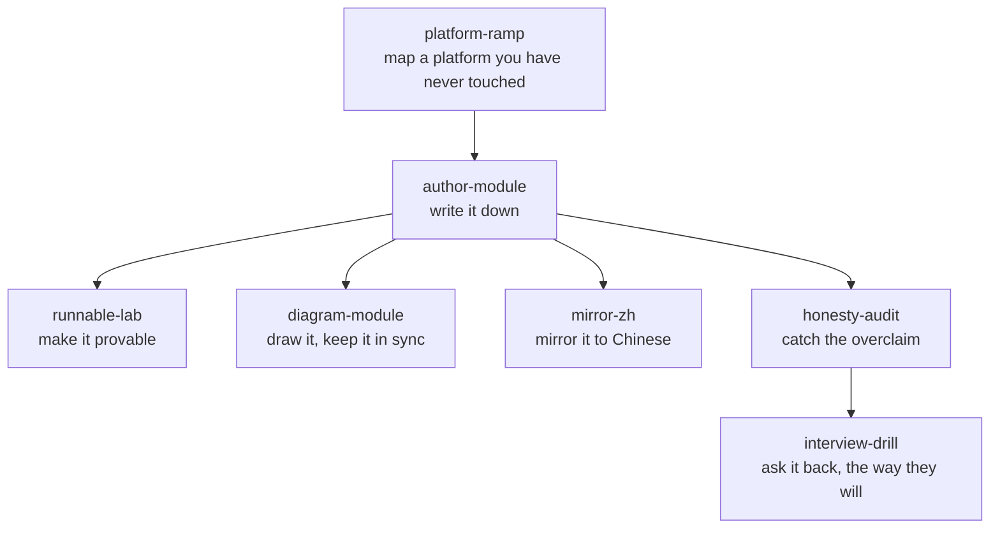

# Agent Skills

This repo ships with ten [Claude Code / Agent Skills](https://docs.claude.com) —
`SKILL.md` workflows that package the repo's methodology so an AI agent can *apply*
it, not just read it. They're the repo's ideas turned into invokable tools.

**Seven package the method**; **three drive the [`toolbox/`](../../toolbox/)** — the
same split the [root README](../../README.md) uses.

| Skill | What it does | Invoke when |
| --- | --- | --- |
| [`platform-ramp`](platform-ramp/SKILL.md) | Ramp onto any platform fast + honestly: seven-surface map → skill map → AI-ramp method → 🔨/🧭 ledger | "help me ramp onto X", "map X onto what I know", "I've never touched X" |
| [`honesty-audit`](honesty-audit/SKILL.md) | Classify every technical claim 🔨 hands-on / 🧭 verified ramp / ❌ overclaim, with honest reframes | "is this honest", "audit my resume for overclaims", "am I bluffing" |
| [`author-module`](author-module/SKILL.md) | Write a new module (platform / cross-cutting / companion / **support note** / lab) matching the repo's voice, structure, 🔨/🧭 markers, research grounding, and validated mermaid | "add a note on X", "write a support note for X", "keep it consistent with the repo" |
| [`runnable-lab`](runnable-lab/SKILL.md) | Turn a concept into a pure-local, self-verifying lab (exit 0 = lessons held), like the repo's drills | "make this a runnable lab", "prove X in code" |
| [`mirror-zh`](mirror-zh/SKILL.md) | Mirror an English doc into a Chinese translation under `docs/zh/` — path-mirrored, terms kept in English, bidirectional 🌐 switcher, links back to canonical | "做个中文镜像", "mirror this to Chinese", "put it in docs/zh" |
| [`diagram-module`](diagram-module/SKILL.md) | Decide whether a doc needs a figure at all, pick mermaid vs a branded hero, author it in the brass skin, validate it, and keep every derived artifact in sync | "add a diagram", "配张图", "the diagrams are out of date" |
| [`interview-drill`](interview-drill/SKILL.md) | Drill an interview question, follow up the way an interviewer does, and judge the answer against the section's marker — never inventing an example to fill a gap | "quiz me", "interview me", "drill me on identity", "面试模拟" |
| [`linux-triage`](linux-triage/SKILL.md) | Triage a host with `toolbox/linux-triage`, read the result honestly, and route each red flag to its fix — patch, hardening, or a pointer | "triage this server", "is this host healthy", "帮我看看这台机器" |
| [`harden-baseline`](harden-baseline/SKILL.md) | Close the audit→remediate loop: `baseline-check` finds the gaps, the `baseline_hardening` role fixes them — check-mode first, lock-out aware | "harden this box", "check the security baseline", "加固这台机器" |
| [`toolbox-picker`](toolbox-picker/SKILL.md) | Given a task in plain language, pick the right tool or Ansible role and hand back the exact command | "what's in the toolbox", "is there a tool for X", "怎么用工具箱做 X" |

## How they fit together

The table lists them one by one; this says which one hands off to which. One skill
opens an unfamiliar platform, four write down what came back, and two try to knock it
over before anyone else does.

The other three are not on that diagram because they are not on that loop:
[`toolbox-picker`](toolbox-picker/SKILL.md) finds the right tool, and
[`linux-triage`](linux-triage/SKILL.md) routes each red flag it finds to
[`harden-baseline`](harden-baseline/SKILL.md), which fixes it. Three boxes in a line is
a sentence, not a figure.

Each skill is grounded in the repo's canonical files — the
[operating model](../../00-the-operating-model.md), [`WHY.md`](../../WHY.md)'s honesty
discipline, and the [AWS worked example](../../platforms/aws/) — so what they produce
lands consistent with everything else here.

> The through-line: the repo teaches a **transferable model + a fast, honest ramp**.
> `platform-ramp` *is* that ramp; `honesty-audit` enforces the honesty; `author-module`,
> `runnable-lab`, and `mirror-zh` keep the repo growing in the same voice — with runnable
> evidence and a Chinese mirror. The last three close the loop the other five only
> describe: `linux-triage` and `harden-baseline` put the toolbox's audit and remediation
> halves in an agent's hands, and `toolbox-picker` is how it finds them.
