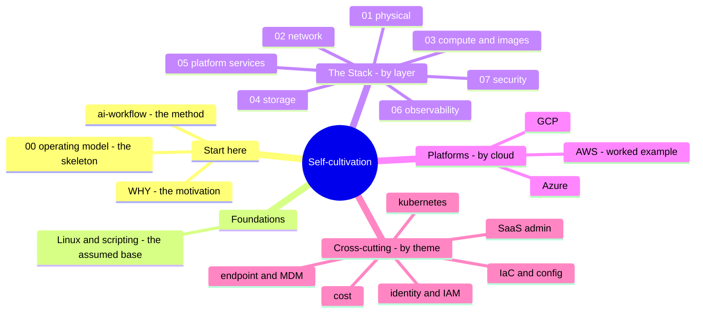

# Contents — the whole map

> The single page that shows every part of this project, how the parts fit, and
> what's written vs. scaffolded. [`ROADMAP.md`](ROADMAP.md) says what to build
> *next and why*; this page says what *exists and where*.

The project is organized along **four axes** that cross the same material from
different angles. You don't read it front to back — you enter from whichever axis
matches the question you have.

---

## I. Start here — the thesis and the method

| Module | What it is | Status |
| --- | --- | --- |
| [`WHY.md`](WHY.md) | Why this exists; where the craft is heading in the AI era | ✅ |
| [`00-the-operating-model.md`](00-the-operating-model.md) | The transferable skeleton — three moves, seven surfaces | ✅ |
| [`ai-workflow/`](ai-workflow/) | How AI is used to learn and operate — and kept honest | ✅ |

## II. Foundations — the base everything assumes

| Module | What it is | Status |
| --- | --- | --- |
| [`foundations/`](foundations/) | Linux + scripting (Python/Bash/PowerShell) — the floor under every role | ✅ |

## III. The Stack — read by layer, bottom-up (✅ complete, 01→07)

Seven platforms compared at every layer, written from the machine room up. This is
the project's most distinctive axis. See [`the-stack/`](the-stack/).

| Chapter | Covers | Status |
| --- | --- | --- |
| [`01-physical`](the-stack/01-physical.md) | data centers, hardware, hypervisors, failure domains | ✅ |
| [`02-network`](the-stack/02-network.md) | underlay/overlay, VPC models, the egress meter, the debug ladder | ✅ |
| [`03-compute-and-images`](the-stack/03-compute-and-images.md) | compute shapes, the image pipeline, bake vs. fry, cloud-init | ✅ |
| [`04-storage`](the-stack/04-storage.md) | block/file/object, the backup fear · **+ runnable [lab](the-stack/labs/04-backup-not-snapshot/)** | ✅ |
| [`05-platform-services`](the-stack/05-platform-services.md) | containers, serverless, managed DBs, build-vs-rent | ✅ |
| [`06-observability`](the-stack/06-observability.md) | metrics/logs/traces, SLI/SLO, OpenTelemetry | ✅ |
| [`07-security`](the-stack/07-security.md) | shared responsibility, defense in depth, CSPM/EDR/SIEM | ✅ |

## IV. Platforms — read by cloud (same four-part template each)

Each is `README` (what-it-is + skill map + AI-ramp summary) · `skills-map` ·
`ai-ramp` · `labs/`. See [`platforms/`](platforms/).

| Platform | Status |
| --- | --- |
| [`aws/`](platforms/aws/) | ✅ worked example + 2 runnable labs (read first) |
| [`azure/`](platforms/azure/) | ✅ module written; Entra/identity is the hands-on strength |
| [`gcp/`](platforms/gcp/) | 🚧 opening written (README + skills-map + ai-ramp scaffolded) |

## V. Cross-cutting — read by theme (the transferable surfaces)

The layers that transfer across every platform. Some are dedicated notes; some are
now best covered *by layer* in The Stack and are cross-linked rather than
duplicated. See [`cross-cutting/`](cross-cutting/).

| Theme | Home | Status |
| --- | --- | --- |
| [`identity-iam`](cross-cutting/identity-iam.md) | dedicated note | ✅ |
| [`iac-and-config`](cross-cutting/iac-and-config.md) | dedicated note (Terraform/Ansible/Puppet) | ✅ |
| [`endpoint/`](endpoint/) | dedicated track (Jamf/Intune/PXE/patching) | ✅ |
| [`saas-admin`](cross-cutting/saas-admin.md) | dedicated note (Google Workspace / M365) | ✅ |
| [`kubernetes`](cross-cutting/kubernetes.md) | dedicated note (deeper than the-stack/05) | ✅ |
| [`cost`](cross-cutting/cost.md) | dedicated note (cost as a control) | ✅ |
| networking | → [`the-stack/02`](the-stack/02-network.md) | ✅ covered in The Stack |
| storage | → [`the-stack/04`](the-stack/04-storage.md) | ✅ covered in The Stack |
| virtualization | → [`the-stack/01`](the-stack/01-physical.md) | ✅ covered in The Stack |
| observability | → [`the-stack/06`](the-stack/06-observability.md) | ✅ covered in The Stack |
| security-compliance | → [`the-stack/07`](the-stack/07-security.md) | ✅ covered in The Stack |

---

## Status legend

- ✅ **written** — full module, ready to read.
- 🚧 **opening written** — title, thesis, and a planned-coverage outline are in
  place; the body is being filled in. Every 🚧 file states what it will cover, so
  the framework is complete even where the prose isn't.

## The honesty layer (applies everywhere)

Every module marks **✋ hands-on depth** vs. **🧗 honest ramp** per
[`WHY.md`](WHY.md). The scaffolded modules already carry that marking in their
openings, so the plan is honest before a line of the body is written — the
strengths (Linux, endpoint, identity, SaaS admin) are labeled ✋; the ramps (a
third cloud, deep Kubernetes) are labeled 🧗.
