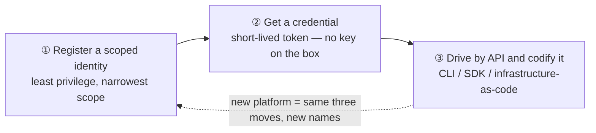
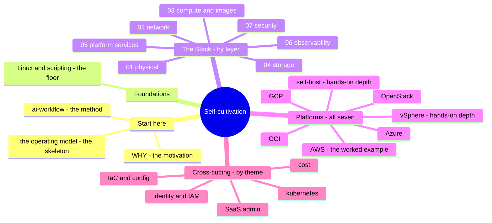

# The Sysadmin's Self-Cultivation

*A field guide to mastering the clouds — with AI riding shotgun.*

> 🌐 **Languages:** English (default) · [Chinese](docs/zh/README.md)

---

## What this is

A sysadmin's real craft was never memorizing every service on every platform — it's a
**transferable mental model** plus the **discipline to get productive on anything,
fast**. AI now compresses that ramp from months to days — *if* you already have the
judgment to steer it and catch it when it's wrong.

This repo writes that judgment down: across **seven platforms**, down **every layer of
the stack**, behind one strict rule — **✋ hands-on depth** is claimed only where it's
real; everything else is a **🧗 verified ramp**, mapped and checked, never bluffed.

## The one idea: three moves

Administer one platform properly and the next is mostly new syntax over the same three
moves:

Jamf, Intune, Entra, AWS, Azure, GCP — all the same skeleton. Master it once (see
[`00-the-operating-model.md`](00-the-operating-model.md)) and every new platform
becomes a mapping exercise you can do with AI in a fraction of the time.

## The shape

Four axes over the same material — enter from whichever matches your question:

The distinctive one is **The Stack**: it reads the stack *bottom-up*, comparing all
seven platforms at **every layer** — written from the machine room up, not the console
down.

## How to read this

| I want to… | Start at |
| --- | --- |
| **See the whole shape** | [`CONTENTS.md`](CONTENTS.md) — every module, all four axes, one page |
| **Understand the philosophy** | [`WHY.md`](WHY.md) → [`00-the-operating-model.md`](00-the-operating-model.md) |
| **Go deep on one platform** | [`platforms/`](platforms/) — **AWS is the worked example**, read it end to end |
| **Read the stack by layer** | [`the-stack/`](the-stack/) — physical → security, seven platforms compared |
| **Learn a transferable skill** | [`cross-cutting/`](cross-cutting/) — identity, IaC, cost, K8s, SaaS admin |
| **See how AI is kept honest** | [`ai-workflow/`](ai-workflow/) — the method and its guardrails |

## What's built

Everything the [roadmap](ROADMAP.md) planned is written; what remains is more runnable
labs, Chinese mirrors, and deepening.

- **Foundations & method** — [WHY](WHY.md) · [operating model](00-the-operating-model.md) · [ai-workflow](ai-workflow/) · [foundations](foundations/) (Linux + scripting) ✅
- **The Stack** — [seven layers, 01→07](the-stack/), all seven platforms compared at each, + a runnable [backup-drill lab](the-stack/labs/04-backup-not-snapshot/) ✅
- **Cross-cutting & endpoint** — [identity](cross-cutting/identity-iam.md) · [iac](cross-cutting/iac-and-config.md) · [ci-cd](cross-cutting/ci-cd.md) · [databases](cross-cutting/databases.md) · [itsm & assets](cross-cutting/itsm-and-assets.md) · [saas-admin](cross-cutting/saas-admin.md) · [kubernetes](cross-cutting/kubernetes.md) · [cost](cross-cutting/cost.md) · [endpoint](endpoint/) ✅

**Platforms** — all seven compared in The Stack now have a dedicated "operate it end to
end" module (what-it-is · skill map · AI-ramp · a **3-lab CLI arc**); the public clouds
also carry the deeper **architecture · operations · automation** trio:

| Platform | Module | Arch · Ops · Auto | Labs | Honesty |
| --- | --- | --- | --- | --- |
| **[AWS](platforms/aws/)** (worked example) | ✅ | ✅ ✅ ✅ | ✅ 3-lab arc — **2 runnable** (boto3 + Terraform) | 🧗 ramp |
| **[Azure](platforms/azure/)** | ✅ | ✅ ✅ ✅ | ✅ 3-lab CLI arc (`az`) | 🧗 + Entra/identity ✋ |
| **[GCP / GKE](platforms/gcp/)** | ✅ | ✅ ✅ ✅ | ✅ 3-lab CLI arc (`gcloud`) | 🧗 ramp |
| **[OCI](platforms/oci/)** | ✅ | — | ✅ 3-lab CLI arc (`oci`) | 🧗 ramp |
| **[vSphere / vCenter](platforms/vsphere/)** | ✅ | — | ✅ 3-lab CLI arc (PowerCLI) | **✋ hands-on depth** (VCP6-DCV/NV) |
| **[OpenStack](platforms/openstack/)** | ✅ | — | ✅ 3-lab CLI arc (`openstack` / DevStack) | 🧗 ramp (KVM-adjacent ✋) |
| **[self-host / bare metal](platforms/self-host/)** | ✅ | — | ✅ 3-lab CLI arc (virsh / ipmitool / ansible) | **✋ hands-on depth** (100k+ fleet) |

Two of the seven are labeled **✋ hands-on depth** (vSphere and self-host — production
ground, not a ramp); the rest are honest 🧗 ramps. The labs are **CLI-first** on
purpose: the command line is faster, exact, repeatable, and reviewable — and it's the
same surface your automation uses.

## Who wrote this

An infrastructure and systems engineer with 15 years across Linux, networking,
virtualization, identity, and automation at scale — writing down the method for ramping
onto any platform fast, in the AI era. A living project, built out in the open, one
layer at a time. Corrections and pull requests welcome.

## License

[MIT](LICENSE).
