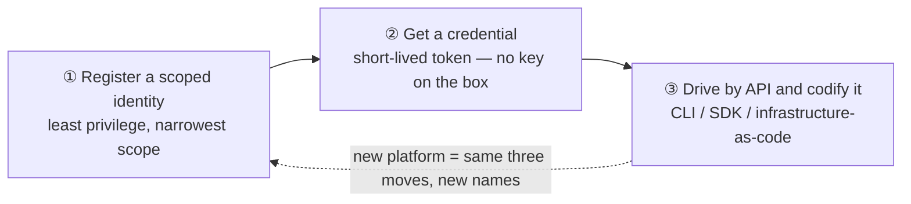
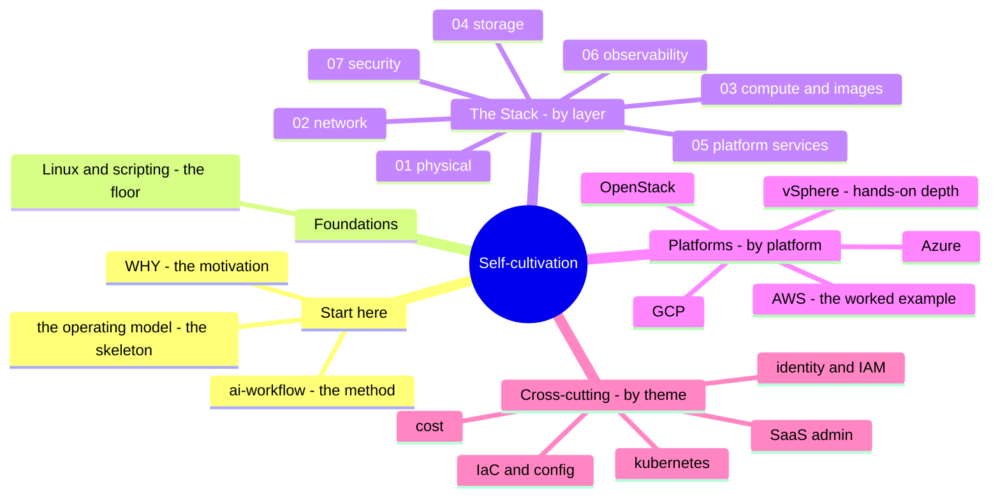

# The Sysadmin's Self-Cultivation

*A field guide to mastering the clouds — with AI riding shotgun.*

> 🌐 **Languages:** English (default) · [Chinese](docs/zh/README.md)

---

## The thesis

A systems administrator's real craft was never memorizing every service on every
platform. It's a **transferable mental model** plus the **discipline to get
productive on anything, fast**. In 2026 that second half got a turbo: AI compresses
the learning curve from months to days — *if* you already have the judgment to
steer it and catch it when it's wrong.

This repo is that idea, proved out across the major clouds and down every layer of
the stack. For each platform it answers three questions, in the same order every
time — **what is it**, **what must an admin be able to *do***, and **how do you get
competent with AI as a co-pilot** — then makes you prove it with hands-on **labs**.

## The one skeleton under every platform

Administer one platform properly and the next is mostly new syntax over the same
three moves:

Jamf, Intune, Entra, and Configuration Manager work this way. So do AWS, Azure, and
GCP. Master the pattern once (see [`00-the-operating-model.md`](00-the-operating-model.md))
and every new platform becomes a mapping exercise you can do with AI in a fraction
of the time.

## The map on one screen

The project crosses the same material from **four angles** — enter from whichever
matches the question you have:

The distinctive axis is **The Stack**: it reads the stack *bottom-up*, comparing
**seven platforms at every layer** (AWS · Azure · GCP · OCI · vSphere · OpenStack ·
self-host) — written from the machine room up, not the console down.

## How to read this

Four entry points, by what you want:

| I want to… | Start at |
| --- | --- |
| **See the whole shape** | [`CONTENTS.md`](CONTENTS.md) — every module, all four axes, one page |
| **Understand the philosophy** | [`WHY.md`](WHY.md) → [`00-the-operating-model.md`](00-the-operating-model.md) |
| **Go deep on one cloud** | [`platforms/`](platforms/) — **AWS is the worked example**, read it end to end |
| **Read the stack by layer** | [`the-stack/`](the-stack/) — physical → security, seven platforms compared |
| **Learn a transferable skill** | [`cross-cutting/`](cross-cutting/) — identity, IaC, cost, K8s, SaaS admin |
| **See how AI is kept honest** | [`ai-workflow/`](ai-workflow/) — the method and its guardrails |

## Status — what's built

Every planned module has written content; the remaining work is more runnable labs,
Chinese mirrors, and deepening. See [`ROADMAP.md`](ROADMAP.md) for priorities.

**By axis:**

| Axis | State |
| --- | --- |
| **Start here** — WHY · operating model · ai-workflow | ✅ |
| **Foundations** — Linux + scripting | ✅ [foundations](foundations/) |
| **The Stack** — 7 layers, 7 platforms each | ✅ [01→07](the-stack/) + 1 runnable [backup-drill lab](the-stack/labs/04-backup-not-snapshot/) |
| **Cross-cutting** — the transferable surfaces | ✅ [identity](cross-cutting/identity-iam.md) · [saas-admin](cross-cutting/saas-admin.md) · [iac](cross-cutting/iac-and-config.md) · [cost](cross-cutting/cost.md) · [kubernetes](cross-cutting/kubernetes.md) |
| **Endpoint** — MDM / imaging / EDR | ✅ [endpoint](endpoint/) |

**Platforms** — each follows the four-part template (what-it-is · skill map ·
AI-ramp · labs); the public clouds also carry the deeper **architecture · operations ·
automation** trio:

| Platform | Module | Arch · Ops · Auto | Labs | Honesty |
| --- | --- | --- | --- | --- |
| **[AWS](platforms/aws/)** (worked example) | ✅ | ✅ ✅ ✅ | ✅ 2 runnable (boto3 + Terraform) | 🧗 ramp |
| **[Azure](platforms/azure/)** | ✅ | ✅ ✅ ✅ | 🚧 specced | 🧗 + Entra/identity ✋ |
| **[GCP / GKE](platforms/gcp/)** | ✅ | ✅ ✅ ✅ | 🚧 specced | 🧗 ramp |
| **[vSphere / vCenter](platforms/vsphere/)** | ✅ | — | 🚧 specced | **✋ hands-on depth** (VCP6-DCV/NV) |
| **[OpenStack](platforms/openstack/)** | ✅ | — | 🚧 specced | 🧗 ramp (KVM-adjacent ✋) |

Every module marks **✋ hands-on depth** vs. **🧗 honest ramp** ([`WHY.md`](WHY.md)) —
the strengths (Linux, endpoint, identity, SaaS admin, automation discipline, and
**vSphere** — a production virtualization estate) are claimed as ✋; a public cloud,
OpenStack's control plane, or deep Kubernetes is labeled 🧗, mapped and verified,
never bluffed.

This is a living project — built out in the open, one layer at a time.

## Who wrote this

An infrastructure and systems engineer with 15 years across Linux, networking,
virtualization, identity, and automation at scale — writing down the method for
ramping onto any platform fast, in the AI era. Corrections and pull requests
welcome.

## License

[MIT](LICENSE).
