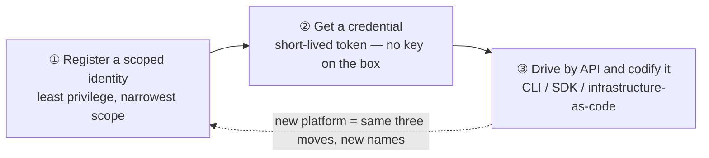

# The Sysadmin's Self-Cultivation

*A field guide to mastering the clouds — with AI riding shotgun.*

> 🌐 **Languages:** English (default) · [中文](docs/zh/README.md)

---

## What this is

A sysadmin's real craft was never memorizing every service on every platform — it's a
**transferable mental model** plus the **discipline to get productive on anything,
fast**. AI now compresses that ramp from months to days — *if* you already have the
judgment to steer it and catch it when it's wrong.

This repo writes that judgment down: across **seven platforms**, down **every layer of
the stack**, behind one strict rule — **🔨 hands-on depth** is claimed only where it's
real; everything else is a **🧭 verified ramp**, mapped and checked, never bluffed.

## The one idea: three moves

Administer one platform properly and the next is mostly new syntax over the same three
moves:

```mermaid
flowchart LR
  id["① Register a scoped identity<br/>least privilege, narrowest scope"] --> cred["② Get a credential<br/>short-lived token — no key on the box"] --> drive["③ Drive by API and codify it<br/>CLI / SDK / infrastructure-as-code"]
  drive -.->|"new platform = same three moves, new names"| id
```

Jamf, Intune, Entra, AWS, Azure, GCP — all the same skeleton. Master it once (see
[`00-the-operating-model.md`](00-the-operating-model.md)) and every new platform
becomes a mapping exercise you can do with AI in a fraction of the time.

## The shape

Six axes over the same material — enter from whichever matches your question — plus one
**route across all of them**, [`build-out/`](build-out/), for the reader who does not yet
know what to ask.

<picture>
  <source media="(prefers-color-scheme: dark)" srcset="site/assets/diagrams/repo-map.dark.svg">
  
</picture>

The route is not a seventh body of material: it teaches no new page, it decides the
**order** ([ADR-0001](docs/adr/0001-the-build-out-is-a-route-not-a-seventh-axis.md)).

A **second route** is now open on the same test: [`walkthrough/`](walkthrough/README.md)
walks the reference office and tells you why, in a script written to be **spoken and
heard** rather than read ([ADR-0009](docs/adr/0009-the-walkthrough-ships-its-script-not-its-audio.md)).
The first walkthrough is written: **[the network](walkthrough/01-the-network.zh.md)**, 106
beats, about twenty minutes spoken, over an interactive 2D floor of the reference office.
The figure above does not show the second route, and will not until there are a few more.

The distinctive axis is **The Stack** — it reads the stack *bottom-up*, comparing all
seven platforms at **every layer**, written from the machine room up rather than the
console down. Cross-cutting carries one extra view rather than an extra axis:
[`skills-maps/`](cross-cutting/skills-maps/README.md) **transposes** the per-platform
skill maps — one theme cut across all seven platforms, as boxes you tick, tiered by how
far each skill travels rather than by which cloud it belongs to.

Every module in every axis, one page: [`CONTENTS.md`](CONTENTS.md).

## How to read this

| I want to… | Start at |
| --- | --- |
| **See the whole shape** | [`CONTENTS.md`](CONTENTS.md) — every module, all six axes plus the route, one page |
| **Understand the philosophy** | [`WHY.md`](WHY.md) → [`00-the-operating-model.md`](00-the-operating-model.md) |
| **Go deep on one platform** | [`platforms/`](platforms/) — **AWS is the worked example**, read it end to end |
| **Read the stack by layer** | [`the-stack/`](the-stack/) — physical → security, seven platforms compared |
| **Learn a transferable skill** | [`cross-cutting/`](cross-cutting/) — identity · IaC · CI/CD · databases · ITSM · web/TLS · incident response · **site network design** · and more |
| **Check what I can actually do** | [`cross-cutting/skills-maps/`](cross-cutting/skills-maps/README.md) — one theme across all seven platforms, tiered by how far the skill travels |
| **Prepare for the interview** | [`cross-cutting/interview/`](cross-cutting/interview/README.md) — the same sections from the other side: what they ask, what it probes, and the answer |
| **Use AI on an ordinary Tuesday** | [`ai-workflow/ai-in-the-day-job.md`](ai-workflow/ai-in-the-day-job.md) — triage → change → incident → write-up → sweep, and where you take it back |
| **Support a platform I inherited** | the break-fix **support notes** (see [What's built](#whats-built)) — recurring tickets, the cross-lane experience gap, a runnable lab each |
| **See how AI is kept honest** | [`ai-workflow/`](ai-workflow/) — the method and its guardrails |
| **Check a word or a past decision** | [`CONTEXT.md`](CONTEXT.md) — what each term means here (and what it doesn't) · [`docs/adr/`](docs/adr/) — fifteen decisions and the options they beat |
| **See what it cannot answer yet** | [`docs/questions.md`](docs/questions.md) — questions asked of this repo: open, answered, or out of scope with the reason |
| **Take runnable tools with me** | [`toolbox/`](toolbox/) — ten find/audit scripts (incl. a VMware→Proxmox virtualization quartet), three Ansible remediation roles, and a [generator](toolbox/generate/) that packs a per-shop subset |
| **Use the method as a tool** | [`.claude/skills/`](.claude/skills/) — ten Agent Skills: seven for the method (ramp · audit · author · lab · diagram · mirror · drill), three that drive the toolbox |
| **Listen to it instead** | [`walkthrough/`](walkthrough/README.md) — the reference office told out loud: a spoken script, an interactive 2D floor, and no audio in the tree |
| **Read it in a browser** | [`site/`](site/README.md) — `python3 site/serve.py`, or `docker compose -f site/docker-compose.yml up`. Full-text search, facets, a 🌐 switcher, rendered diagrams. Nothing to install |
| **Check it still holds together** | [`check.py`](check.py) — one entry point for every check: five builders, every internal link and anchor, the walkthroughs, the viewer's URL contract, and every self-verifying lab. `python3 check.py` |
| **Let an agent search it** | [`docs/index.json`](docs/index.json) — one record per file, generated from front-matter by [`docs/build-index.py`](docs/build-index.py) |

## What's built

Everything the [roadmap](ROADMAP.md) planned is written. What remains is more runnable
labs — the platform lab arcs are specced well ahead of what is built, and the table below
says which — a fuller Chinese mirror ([`docs/zh/`](docs/zh/README.md) covers 27 pages so
far), and demand-first deepening.

| | What | Where to start |
| --- | --- | --- |
| ✅ | **Foundations & method** | [WHY](WHY.md) · [operating model](00-the-operating-model.md) · [ai-workflow](ai-workflow/) · [foundations](foundations/) |
| ✅ | **The stack, 01→07** | [`the-stack/`](the-stack/) — seven platforms compared at every layer, + two runnable labs |
| ✅ | **Cross-cutting & endpoint** | [`cross-cutting/`](cross-cutting/) — 17 notes: identity · IaC · CI/CD · databases · ITSM · web/TLS · mesh · incident response · security · SaaS · K8s · cost · [endpoint](endpoint/) |
| ✅ | **Skill maps** — check yourself | [networking](cross-cutting/skills-maps/networking.md) (11 sections / 63 boxes) · [identity](cross-cutting/skills-maps/identity.md) (10 / 58). An unticked **Core** box is a gap everywhere, not on one cloud |
| ✅ | **Interview maps** — the other side | [networking](cross-cutting/interview/networking.md) (21 questions) · [identity](cross-cutting/interview/identity.md) (19), paired section-for-section with the skill maps ([ADR-0004](docs/adr/0004-interview-answers-are-evidence-for-a-marker.md)) |
| ✅ | **Support notes** — break-fix craft | For surfaces you *inherit*, not just stand up: [M365](cross-cutting/m365-support.md) · [AWS](platforms/aws/support.md) · [Azure](platforms/azure/support.md) · [GCP](platforms/gcp/support.md) · [OCI](platforms/oci/support.md) · [Terraform](cross-cutting/terraform-support.md) · [Kubernetes](cross-cutting/kubernetes-support.md) · [multi-cloud](cross-cutting/multi-cloud-support.md) |
| ✅ | **Toolbox** — run it | [ten scripts + three Ansible roles](toolbox/) pairing audit→fix, and a [pack generator](toolbox/generate/). Safe by default; every tool carries its own `Tested on:` line |
| ✅ | **Agent Skills** — the method, invokable | [ten of them](.claude/skills/) — seven package the method, three drive the toolbox |
| ✅ | **Walkthrough** — heard, not read | [`walkthrough/`](walkthrough/README.md) — walkthrough 01, [中文](walkthrough/01-the-network.zh.md) · [EN](walkthrough/01-the-network.en.md), 106 beats over an interactive **2D floor** you can pan, zoom and click. Scripts ship here; audio never does |
| ✅ | **Browser & retrieval** | [`site/`](site/README.md) — full-text search over the lot, nothing to install · [`docs/index.json`](docs/index.json) — one record per file, for an agent |

**Twenty runnable, self-verifying labs** sit under those axes — exit `0` means the lesson
held, and most carry a `--break-it` flag that swaps in the *standard* procedure and shows
it failing.

**Platforms** — all seven compared in The Stack have a dedicated "operate it end to end"
module (what-it-is · skill map · AI-ramp · a **3-lab CLI arc**), and **all seven now
carry the deeper architecture · operations · automation trio**:

| Platform | Module | Arch · Ops · Auto | Lab arc (specced) | Labs built | Honesty |
| --- | --- | --- | --- | --- | --- |
| **[AWS](platforms/aws/)** (worked example) | ✅ · [support](platforms/aws/support.md) | ✅ | 3 (boto3 / Terraform) | **01–02 built**; 03 is a guided CLI run · + [iam-deny](platforms/aws/labs/iam-deny-by-default/) | 🧭 ramp |
| **[Azure](platforms/azure/)** | ✅ · [support](platforms/azure/support.md) | ✅ | 3 (`az`) | none of the arc · [two-planes](platforms/azure/labs/global-admin-is-not-owner/) stands alone | 🧭 + Entra/identity 🔨 |
| **[GCP / GKE](platforms/gcp/)** | ✅ · [support](platforms/gcp/support.md) | ✅ | 3 (`gcloud`) | none of the arc · [gke-auth](platforms/gcp/labs/gke-iam-vs-rbac/) stands alone | 🧭 ramp |
| **[OCI](platforms/oci/)** | ✅ · [support](platforms/oci/support.md) | ✅ | 3 (`oci`) | none of the arc · [compartment/verb](platforms/oci/labs/a-compartment-is-not-an-account/) stands alone | 🧭 ramp |
| **[vSphere / vCenter](platforms/vsphere/)** | ✅ | ✅ | 3 (PowerCLI) | — | **🔨 hands-on depth** (VCP6-DCV/NV) |
| **[OpenStack](platforms/openstack/)** | ✅ | ✅ | 3 (`openstack` / DevStack) | — | 🧭 ramp (KVM-adjacent 🔨) |
| **[self-host / bare metal](platforms/self-host/)** | ✅ | ✅ | 3 (virsh / ipmitool / ansible) | — | **🔨 hands-on depth** (100k+ fleet) |

Two of the seven are labeled **🔨 hands-on depth** (vSphere and self-host — production
ground, not a ramp); the rest are honest 🧭 ramps. The labs are **CLI-first** on purpose:
the command line is faster, exact, repeatable, and reviewable — and it's the same surface
your automation uses.

**All seven arcs are written; two of the twenty-one are built** (AWS 01–02), alongside
four standalone drills that sit outside the arcs. The gap gets its own column rather than
a shared checkmark, because a specced lab is a plan — and the rule in the second paragraph
of this file applies to the repo's own claims first.

## Who wrote this

An infrastructure and systems engineer with 15 years across Linux, networking,
virtualization, identity, and automation at scale — writing down the method for ramping
onto any platform fast, in the AI era. A living project, built out in the open, one
layer at a time. Corrections and pull requests welcome.

## License

[MIT](LICENSE).
