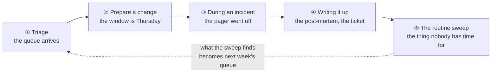

# AI in the Day Job

> The companion to [`how-i-use-ai-to-learn-and-operate.md`](how-i-use-ai-to-learn-and-operate.md),
> which is about the **ramp** — arriving somewhere new. This one is about the
> steady state: a Tuesday, with a queue, a change window and nothing novel in it.

Almost everything written about AI for operators is about learning: how to get up to
speed on a platform, how to translate what you know onto something you don't. That
material is real and it is elsewhere in this repo — every chapter carries its own
*AI-assisted ramp* section, and there are thirty-nine of them.

None of it answers the question you actually have on a Tuesday afternoon, which is:
**of the things in front of me right now, which ones can I hand over?**

The organising idea is that a day has a shape, and AI's usefulness is not evenly
distributed across it. It is excellent where the work is *tedious but not hard*, and
it is dangerous in exactly the same places every time: **wherever being confidently
wrong is indistinguishable from being right.** What follows walks the shape and marks
both.

## The shape of a day

Each stage below answers two questions and no others: **what can be handed over**,
and **where you take it back**.

## ① Triage — the queue arrives

**Hand over: the reading.** A queue is mostly classification, and classification is
the cheapest thing to delegate. Summarise twenty tickets into categories, spot the
four that are the same underlying fault reported by four people, extract the one line
from a 300-line log paste that is actually an error. Draft the clarifying question
back to the reporter — the one asking for the version, the exact time, and what they
were doing — which is the single highest-value message in support and the one most
often skipped because it is boring to write.

**Take it back: priority.** A model ranks by what the text says. Priority is decided
by what the text does not contain — who the reporter is, what happens Thursday, which
of these is the third recurrence this month. Handing over prioritisation produces a
queue sorted by eloquence.

> **The tell:** if the model's ordering surprises you and you cannot say why it is
> wrong, that is not a signal it is right. It is a signal you have not written down
> the context it was missing.

## ② Preparing a change — the window is Thursday

**Hand over: the first draft and the adversary.** The playbook draft, the rollback
steps, the pre-flight checklist. Then use it a second way, which is the more valuable
one: **ask it to attack the plan.** *"What breaks if step 4 half-succeeds? What does
this assume is already true? What is the state after a failure between 6 and 7?"* A
model is very good at generating the failure branch you did not want to think about,
partly because it has no investment in the plan working.

**Take it back: whether the change is correct at all.** It will validate your syntax
and not your intent. It cannot know that the maintenance window collides with a close
period, that the "unused" subnet is where the badge readers live, or that the vendor
said something on a call that contradicts their documentation.

**And take back the blast radius.** Ask for the narrowest version of the command, then
narrow it yourself — a generated command tends to be *general*, and general is how you
touch more than you meant to.

## ③ During an incident — the pager went off

This is the stage with the sharpest split, and the one where the discipline matters
most because judgement is worst under pressure.

**Hand over: recall and translation.** What does this error string usually mean.
What is the syntax for this filter I use twice a year. Which log has this field. Read
this 4,000-line trace and tell me where the retries begin. This is the work that
otherwise burns the first twenty minutes, and it is exactly the work that a stressed
human does worst.

**Hand over: hypothesis generation, never selection.** *"Give me six things that
produce this symptom"* is a good prompt, and it is good because six is more than you
would have listed. Choosing which one to test is yours, and the ordering should follow
the discipline the repo uses everywhere: **pick the check that eliminates the most, not
the one that confirms your favourite.**

**Take it back: anything that writes.** No generated command runs against production
during an incident without a human reading it in full. The pressure that makes AI most
useful for recall is the same pressure that makes it least safe for execution, because
the review you would normally do is the step that gets skipped.

**Take it back: the narrative.** A model asked *"what happened?"* will produce a
fluent, coherent, complete-sounding story from partial evidence. During an incident
that story is actively harmful — it feels like understanding and it is a hypothesis
wearing a conclusion's clothes.

> **The one-line rule:** during an incident AI is a **reference**, not a **colleague**.
> It answers what you ask. It does not decide.

## ④ Writing it up — the post-mortem and the ticket

**Hand over: the draft, from your notes.** This stage is where the ratio is best in
the whole day. You have the timeline in your head and in a scrollback; converting that
into a readable post-mortem is real work with almost no judgement in it. The same
applies to the ticket update, the customer-facing summary, and the change record — all
things that are written badly or late because they are written by someone who has
already solved the problem and has stopped caring.

**Hand over: the structural check.** *"Does this post-mortem name a cause or a
person?"* *"Which of these action items has no owner?"* *"What did this document
assert that the timeline does not support?"* These are mechanical checks that humans
perform inconsistently, especially about their own writing.

**Take it back: the cause, and the honesty.** The model will accept your framing. If
your notes imply the cause was a vendor and it was actually a design decision you made
last year, it will write that up smoothly and persuasively. Every post-mortem this
repo cares about is one where the uncomfortable sentence stayed in, and no model will
insist on it for you.

## ⑤ The routine sweep — the thing nobody has time for

The highest-leverage stage, and the one most often skipped, because it is nobody's
ticket. Access reviews, certificate expiry, unused firewall rules, stale accounts,
snapshot sprawl, backup restore-tests.

**Hand over: the enumeration and the diff.** Pull the list, compare it against last
month's, describe what changed. Two sources of truth reconciled and every difference
explained. This is the shape of most of the [`toolbox/`](../toolbox/) — and the tools
exist because it is the work where a script beats both a human and a model, which is
worth saying plainly rather than pretending everything routes to AI.

**Take it back: the join key, and the residue.** Reconciliation is where the wrong
answer is most confident: joining two inventories on the wrong key produces a clean
report full of records that do not exist, and the advisory layer will produce
plausible causes for every one of them. The
[asset-reconciliation lab](../cross-cutting/labs/asset-reconciliation/) exists to make
that failure visible — the key you pick decides how much of the fleet is fiction.

And **what survives a competent check is the residue whose cause is in none of the
systems.** That is the boundary the whole repo keeps landing on: a model can rank the
candidates, and the decision needs a person who knows something the records do not
contain.

## The pattern underneath

Read the five stages together and the split is the same one every time, stated
differently:

| Hand over | Take back |
| --- | --- |
| Reading, summarising, extracting | Deciding what matters |
| Generating candidates | Choosing among them |
| Drafting prose from your notes | Whether the notes are honest |
| Enumerating and diffing | The key the diff joined on |
| Recalling syntax and semantics | Anything that writes |

Which is [Rule 1](how-i-use-ai-to-learn-and-operate.md) — *AI for speed, judgement for
truth* — with the day's specifics attached. The rule is not new here. What is new is
knowing, before you start each stage, which side of the line you are standing on.

## The honest boundary

🔨 The operational shape above is production work — the queue, the change window, the
incident, the write-up, the sweep are the job, and where the tedious half sits is not
in question.

🧭 The **specific tooling** for agentic operations — models with standing access to
production systems, autonomous remediation, agent-run runbooks — is a ramp, not
practice. This repo's position is deliberately conservative on that: every
[`toolbox/`](../toolbox/) tool is safe-by-default and read-only unless told otherwise,
and the [Agent Skills](../.claude/skills/) drive those tools rather than the systems
directly. That is a stance about blast radius, and it is worth stating as a stance
rather than presenting as the only possible design.
