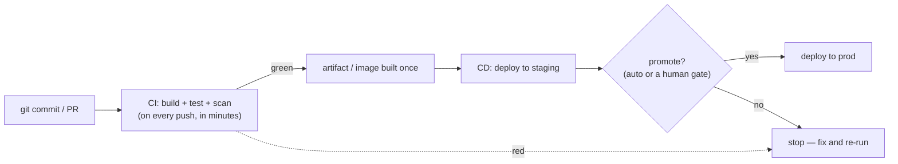
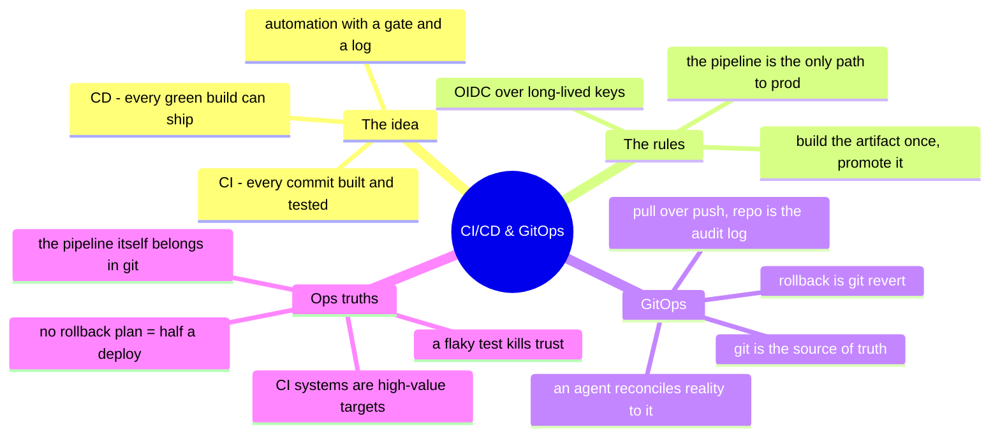

# CI/CD & GitOps — the deployment pipeline

> The one topic the standard roadmaps put at the center that this repo owed a
> dedicated note. Everything else here is about *what* you run; CI/CD is about *how
> changes reach production* — safely, repeatably, and without a human hand-carrying a
> file to a server. Get this right and "deploy" stops being an event you dread.

CI/CD is the assembly line for change. **Continuous Integration** is "every commit is
built and tested automatically, so broken code is caught in minutes, not at release."
**Continuous Delivery/Deployment** is "every passing build can — or does — ship
automatically, from code, with no manual copy step." It's the same
[operating-model](../00-the-operating-model.md) instinct as
[IaC](iac-and-config.md): describe the process once, in version control, and let the
machine execute it identically every time.

## Why a sysadmin owns this now

The line between "sysadmin" and "the pipeline" is gone. You no longer hand-deploy an
app, hand-patch a fleet, or hand-run a backup script — you put the steps in a pipeline
that runs them on a trigger, logs them, and fails loudly. The
[foundations](../foundations/) idea that *automation is how you scale systems instead
of tickets* reaches its conclusion here: a pipeline is automation with a memory, a
gate, and an audit trail. If you can script it (and you can), you can pipeline it.

## The pipeline, as a shape



Two rules the shape encodes: **build the artifact once and promote the *same* one**
through environments (never rebuild per stage — that's how "works in staging, breaks
in prod" happens), and **the pipeline is the only path to prod** (a change that
bypasses it is drift, the [IaC](iac-and-config.md) sin, at deployment scale).

## The tools, renamed per ecosystem

Like every surface in this repo, the concept transfers and the names change:

| Concept | GitHub | GitLab | Jenkins | Cloud-native |
| --- | --- | --- | --- | --- |
| **Pipeline definition** | Actions (YAML workflows) | `.gitlab-ci.yml` | Jenkinsfile (Groovy) | CodePipeline / Cloud Build / Azure Pipelines |
| **Runner / executor** | GitHub-hosted or self-hosted runners | GitLab runners | agents/nodes | managed |
| **Triggers** | push, PR, schedule, manual | same | SCM poll, webhook | same |
| **Secrets** | Actions secrets / OIDC | CI/CD variables | credentials plugin | the cloud's secret manager |

The one that matters most for security: **prefer OIDC / workload identity over
long-lived cloud keys in the CI system.** A pipeline that assumes a role via OIDC has
no secret to leak — the same "no key on the box" rule from
[identity](identity-iam.md), applied to the build server (which is a very attractive
target precisely because it can deploy anything).

## GitOps — the pull model for deployment

GitOps is CI/CD's modern endgame for Kubernetes and cloud infra: **git is the single
source of truth for desired state, and an in-cluster agent continuously reconciles
reality to it** — the same declare-and-converge loop as
[Kubernetes](kubernetes.md) itself, [Ansible](iac-and-config.md), and
[Terraform](iac-and-config.md), applied to deployment.

- **Push CD** (traditional): the pipeline reaches *into* the cluster and applies
  changes — the pipeline needs prod credentials.
- **Pull GitOps** (ArgoCD / Flux): an agent *inside* the cluster watches a git repo
  and pulls changes to itself — no external system holds prod credentials, and the
  repo is a perfect audit log ("who changed prod, and when" = `git log`).

The payoff is the same one this repo keeps returning to: **the desired state is in
version control, drift is a diff, and rollback is `git revert`.**

## Ops notes — what pages you

- **The flaky test that erodes trust** — a test that fails randomly trains the team to
  re-run until green, which defeats the entire point of CI. Fix or quarantine flaky
  tests; a pipeline nobody trusts is worse than none.
- **Rebuilding per stage** — build once, promote the same artifact; rebuilding
  reintroduces the "different in prod" bug CI was supposed to kill.
- **Secrets in the pipeline** — CI systems are high-value targets (they can deploy
  anything); a leaked key or a malicious dependency in the build is a supply-chain
  incident ([security](../the-stack/07-security.md)). OIDC over static keys; pin and
  scan dependencies.
- **No rollback plan** — "deploy" is only half; the other half is "un-deploy fast."
  Blue-green, canary, or a tested `git revert` path — decided before the bad deploy,
  not during.
- **The pipeline that became the snowflake** — a Jenkins server hand-configured over
  years that nobody can rebuild. The pipeline definition belongs in git like
  everything else; the CI system itself should be reproducible.

## The admin discipline (what to be able to do)

- Write a **CI pipeline** that builds, tests, and scans on every push, and reads its
  own failures.
- Promote **one artifact** through staging → prod behind a gate, and explain why
  rebuilding per stage is wrong.
- Wire **OIDC / workload identity** so the pipeline holds no long-lived cloud key.
- Set up a **GitOps** flow (ArgoCD/Flux) and explain pull-vs-push and why the repo is
  the audit log.
- Have a **rollback** you've actually tested — blue-green, canary, or `git revert`.
- Read a pipeline as **automation with a gate and a log** — the natural extension of
  the scripting in [foundations](../foundations/).

## The AI-assisted ramp (CI/CD flavor)

- **Translate from scripting:** *"I automate fleet tasks in Bash/Python/Ansible — turn
  this deploy script into a GitHub Actions workflow, and show me where a pipeline adds
  gates and logging I don't get from cron."*
- **Draft the YAML, verify the security:** AI writes workflow/`.gitlab-ci.yml` YAML
  fast — and defaults to **long-lived secrets and over-broad permissions**. Every
  generated pipeline gets its credentials tightened to OIDC/least-privilege by hand.
- **Where AI burns you (verify hardest):** it **invents Actions/step syntax and
  marketplace action versions** that don't exist or are abandoned (a supply-chain
  risk — pin to a SHA, not a floating tag); it **hardcodes secrets** instead of using
  the secret store or OIDC; and it **skips the rollback** entirely. Anything that can
  deploy to prod gets read as if it's about to — because it is.

## Honest boundaries

🧗 **ramp built on a ✋ foundation.** The *automation discipline* CI/CD rests on is
hands-on — Bash/Python/Ansible fleet automation, Git as everyday version control,
idempotence, and the "put the steps in code, not in a person" instinct
([foundations](../foundations/), [iac](iac-and-config.md)). Building and operating
**production CI/CD pipelines and GitOps** (Jenkins/Actions/GitLab CI at scale, ArgoCD
in production) is a **🧗 ramp** — the concepts are solid and mapped, verified against
current docs, not claimed as years running a delivery platform. The transferable
claim: a deep automation foundation plus a fast, honest ramp onto the specific CI/CD
tool in front of you — exactly the shape [`WHY.md`](../WHY.md) argues for.

## Lab (✅ runnable — [`labs/ci-cd-pipeline/`](labs/ci-cd-pipeline/))

**A real pipeline for one small service** — a valid GitHub Actions workflow over a
tested app. Run the test job locally right now (pure stdlib, no install):

```bash
cd cross-cutting/labs/ci-cd-pipeline/app && python3 -m unittest -v
```

The [lab](labs/ci-cd-pipeline/) ships the `hostcheck` app + tests and a real `ci.yml`
that encodes the chapter's rules: **test on every push**, **build the artifact once**
(gated on green tests), and a **deploy gated on a manual approval using OIDC** (no
long-lived key in the repo). The workflow lives under `.github-workflows-example/` so
it doesn't run against this teaching repo — copy it to `.github/workflows/` to make it
live. Extend it with the rollback drill: ship a bad change, then `git revert` + re-run,
and prove the desired state lives entirely in git.

## The chapter on one screen


