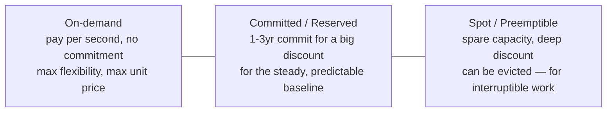
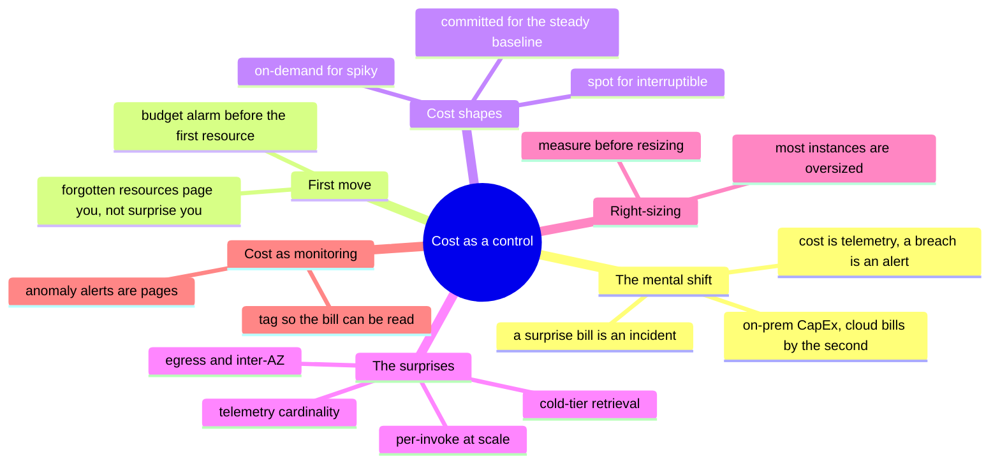

# Cost as an Operational Control

> On the clouds, cost is not the finance team's problem — it's a signal on your
> dashboard, an alarm that should page you, and a design constraint that shapes
> architecture. A runaway loop pages you as a *bill*. This note treats money as
> what it is at this layer: an operational metric.

Every earlier chapter ended up here — the egress meter in [`the-stack/02`](../the-stack/02-network.md),
the retrieval-cost trap in [`the-stack/04`](../the-stack/04-storage.md), the
price-at-scale question in [`the-stack/05`](../the-stack/05-platform-services.md).
This note pulls those threads into one discipline: seeing the cost before the
invoice does, and treating a surprising bill as an incident with a root cause.

## Why cost is an engineering signal, not a spreadsheet

On-prem, cost was CapEx: you bought the box once, and running it another hour was
free. The cloud inverts that — **every running thing bills by the second**, so cost
becomes a live property of your architecture, changing as load changes, exactly like
CPU or latency. That's the mental shift the whole chapter rests on: a cost graph is a
telemetry stream ([`the-stack/06`](../the-stack/06-observability.md)), a budget
breach is an alert, and a bill that surprised you is an incident that had a root
cause you failed to observe. Treating money as an ops metric — not a monthly
finance-team artifact — is what separates an engineer who *operates* the cloud from
one who just *uses* it.

## The forgotten-resource problem (and the first thing you do)

The most common cloud waste isn't a bad architecture — it's something nobody
remembers is running: the idle GPU instance from a finished experiment, the orphaned
volume detached months ago, the NAT gateway in a dev account, the load balancer with
no targets. They bill quietly, forever, until someone reads the invoice.

The defense is boring and non-negotiable: **a budget alarm is the first thing you
set in a new account, before the first real resource** — so a forgotten resource
*pages you* instead of *surprising you*. Every platform lab in this repo says the
same thing ([`platforms/aws/labs`](../platforms/aws/labs/)); it's the cheapest
insurance in the cloud.

## The cost shapes — matching commitment to predictability

Compute pricing is a spectrum, and picking a point is the [chapter-01](../the-stack/01-physical.md)
utilization-shape question asked again in dollars:

- **On-demand** — the default; right for spiky, unpredictable, or short-lived work.
- **Committed/Reserved** — a 1–3 year commitment for a large discount; right for the
  steady baseline you know you'll run anyway. Leaving a predictable production
  workload on on-demand is one of the biggest quiet overspends there is.
- **Spot/preemptible** — deep discounts on spare capacity that can be reclaimed with
  little notice; right for fault-tolerant, interruptible work (batch, CI, stateless
  scale-out) — the eviction-as-a-designed-event pattern from
  [`the-stack/03`](../the-stack/03-compute-and-images.md).

The move: **cover the predictable baseline with commitments, burst on-demand, and
push interruptible work to spot.** Most overspend is a predictable workload paying
on-demand prices.

## The surprises — where the bill comes from

The line items that blindside people are rarely the compute they provisioned on
purpose. They're the second-order costs:

- **Egress** — data *out* is billed, and on AWS **inter-AZ** traffic is billed too;
  NAT gateways add a per-GB processing tax. The [chapter-02](../the-stack/02-network.md)
  lock-in argument is also the #1 surprise line item.
- **Retrieval from cold tiers** — archival storage is cheap to hold and expensive to
  read back *in a hurry*; the [chapter-04](../the-stack/04-storage.md) lesson that
  you price the *restore*, not just the storage.
- **Per-invoke / per-GB at scale** — serverless and managed-service pricing that's
  free at demo and dominant at production volume; the [chapter-05](../the-stack/05-platform-services.md)
  crossover point nobody re-checks.
- **Cardinality and telemetry** — the observability bill that quietly overtakes the
  thing it watches ([chapter-06](../the-stack/06-observability.md)).

The pattern: **the sticker price is the compute; the surprise is everything that
moves, is read back, or is billed by the event.** Model those before committing, not
after the invoice.

## Right-sizing — the fleet truth

The single highest-ROI cost habit, and the most neglected: **most instances are
oversized because nobody looked after launch day.** Someone picked a generous size
to be safe, it worked, and it was never revisited. Right-sizing is unglamorous and
compounding:

- **Measure before resizing** — pull actual CPU/memory/IO utilization
  ([the observability discipline](../the-stack/06-observability.md)); a box at 5%
  CPU for a month is a resize, not a guess.
- **Match the shape** — the menu-vs-dial difference (GCP/OCI dial exact sizes,
  AWS/Azure pick from a menu) matters far less than the discipline of actually
  matching size to measured need.
- **Automate the finding** — the clouds' cost tools and rightsizing recommendations
  surface candidates; acting on them is the job.

## Cost as monitoring — anomaly alerts and allocation

Money becomes real observability when you wire it like any other signal:

- **Anomaly alerts** — a cost spike is a page, the same way a latency spike is; a
  runaway Lambda loop or a hot partition shows up as *dollars* before it shows up
  anywhere else ([chapter-05](../the-stack/05-platform-services.md)).
- **Tagging and allocation** — tag resources by team/service/environment so the bill
  can be *read* — "which service cost that, and why" — instead of arriving as one
  undifferentiated number. Showback (here's what your team spent) changes behavior
  without a mandate.

## The AI-assisted ramp (cost flavor)

- **Model the crossover, don't quote the price:** AI is genuinely useful for *"at
  what request volume does Lambda stop being cheaper than an always-on instance?"* —
  the reasoning is sound. It is **not** a source of the actual per-unit numbers.
- **Where AI burns you (verify hardest):** it **quotes prices, free-tier limits, and
  discount percentages from its training years** — cloud pricing changes constantly,
  and a cost model built on stale numbers is confidently wrong. Use AI for the
  *shape* of the decision (which pricing model, where the crossover is, what to
  measure); pull every actual number from the current pricing page. The math is
  AI's; the numbers are the vendor's.

## Honest boundaries

Operational, not FinOps-specialist — and marked that way. The ✋ is real
cost-and-capacity instinct: hardware/software **audit and asset reconciliation**
(reconciling what's deployed against what's paid for is cost hygiene), capacity
planning, and the operational habit of treating waste as a fixable defect rather
than a line someone else owns. Deep multi-account **FinOps tooling, showback/chargeback
programs, and committed-use portfolio optimization** are a 🧗 ramp, not a claimed
specialty. The transferable claim: cost read as an engineering signal — budgets,
right-sizing, anomaly alerts, the surprise line items — not a spreadsheet discipline
owned by finance.

## Lab (🚧 planned — spec)

**See the money before the invoice does.** On any one cloud sandbox (and free-tier
safe):

1. **Set a budget alarm first** — before anything else exists — and confirm it can
   page you. This is the habit, made muscle.
2. **Tag** a couple of resources by "team"/"service" and find them in the cost
   explorer, proving a bill can be read by owner, not just as a total.
3. **The drill:** model one real decision — *serverless vs. always-on for a given
   request rate*, or *on-demand vs. reserved for a steady workload* — with current
   pricing, find the crossover, and write the one-line recommendation. The
   deliverable of this chapter is a defensible number, not a vibe.

## The chapter on one screen

