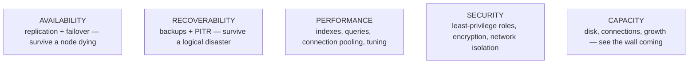
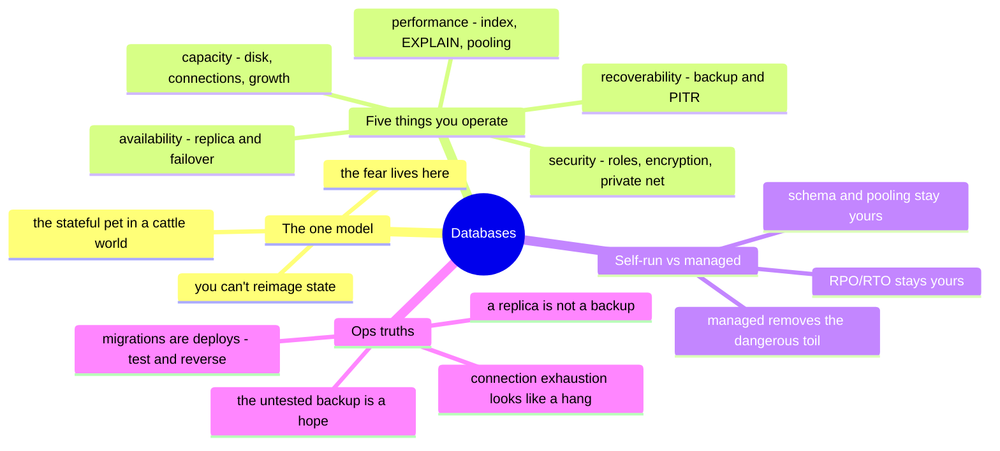

# Databases — operating the stateful hard part

> [`the-stack/04`](../the-stack/04-storage.md) taught that state is the thing no
> pipeline recreates; [`the-stack/05`](../the-stack/05-platform-services.md) said the
> managed database is usually the highest-value rent. This note is the layer between:
> what it takes to *operate* a database well — self-run or managed — because "it's
> managed" never moved the RPO/RTO off your desk. This is **✋ hands-on ground** — a
> production PostgreSQL system operated for real.

Every application ends at a database, and the database is where the fear lives
(chapter 04, again). Operating one is a distinct sysadmin discipline the standard
roadmaps assume and rarely teach: not "write SQL," but "keep this thing available,
recoverable, and fast, and know what to do when it isn't."

## The one model: databases are stateful pets in a cattle world

Everything above the database is [cattle](../the-stack/03-compute-and-images.md) —
disposable, reimaged, replaced. The database is the **pet** that survives them all,
and that asymmetry drives every operational decision:

- You can't just "reimage" a database — its whole value is the state it accumulated.
- Losing it, or losing minutes of it, is the incident chapter 04 is entirely about.
- So the database gets what cattle don't: backups you test, replication you monitor,
  failover you rehearse, and capacity you plan ahead of.

## The five things you actually operate

Strip the engine (Postgres, MySQL, whatever) and operating a database is five jobs:

- **Availability** — a **replica** (streaming/synchronous) so a dead primary isn't a
  dead service; **failover** (manual or automatic) you have actually rehearsed. Note
  the chapter-04 trap: **a replica is not a backup** — it faithfully copies a
  `DROP TABLE` to the standby in milliseconds.
- **Recoverability** — **backups** (logical dumps *and* physical/base backups) plus
  **point-in-time recovery** (replay the write-ahead log to a moment before the
  disaster). The only proof is a **tested restore** with a measured **RPO** (data you
  could lose) and **RTO** (time to be back) — the exact discipline the runnable
  [backup drill](../the-stack/labs/04-backup-not-snapshot/) makes concrete.
- **Performance** — the **index** that turns a table scan into a lookup, reading a
  **query plan** (`EXPLAIN`) to find the slow one, and **connection pooling**
  (PgBouncer and friends) because every connection costs memory and databases fall
  over on connection storms long before CPU.
- **Security** — least-privilege roles (the app user is not the superuser), encryption
  at rest and in transit, and a database that lives in a **private subnet** never
  reachable from the internet ([the-stack/02](../the-stack/02-network.md),
  [the-stack/07](../the-stack/07-security.md)).
- **Capacity** — disk (a full data volume is a hard outage), the **connection ceiling**
  (lower and more dangerous than people expect), transaction-ID wraparound on
  Postgres, and growth planned with lead time ([cost](cost.md)).

## Self-run vs. managed — the build-vs-rent line, database edition

The [chapter-05](../the-stack/05-platform-services.md) calculus, applied to the
hardest stateful thing to run:

| | Self-run (DB on a VM/host) | Managed (RDS / Cloud SQL / Azure DB) |
| --- | --- | --- |
| **Backups & PITR** | you configure, script, and test | provider runs them — **you still verify the schedule and test a restore** |
| **Replication & failover** | you build and rehearse | provider offers Multi-AZ/HA — you enable and test it |
| **Patching & upgrades** | you own the maintenance window | provider's schedule — a deadline you don't set |
| **Tuning** | full control of every knob | a parameter group; fewer knobs, sane defaults |
| **The catch** | maximum control, maximum toil | the toil is gone; **RPO/RTO, schema, and pooling are still yours** |

Managed databases are usually worth renting (chapter 05 said so) — the removed toil is
the *dangerous* toil. But the responsibility that does **not** transfer with the word
"managed": knowing your RPO/RTO, testing that the provider's backup actually restores,
designing the schema, and taming the connection count. "It's managed" has ended more
data stories than it has saved.

## Ops notes — what pages you (and what ends careers)

- **The untested backup** — chapter 04's law, sharpest here: a backup you have never
  restored is a hope. Schedule restore drills; measure RPO/RTO from the drill.
- **Replica-as-backup** — a `DROP TABLE` or a bad migration replicates to the standby
  instantly. Replication survives *hardware* failure, not *logical* destruction. PITR
  and independent backups are what save you.
- **Connection exhaustion** — the outage that looks like the app "hanging": every
  connection is memory, the ceiling is low, and a connection storm takes the DB down
  with plenty of CPU to spare. Pool connections before you need to.
- **The missing index** — one query doing a full table scan under load, dragging the
  whole database. `EXPLAIN` is the [debugging reflex](../foundations/) applied to SQL.
- **The migration with no rollback** — a schema change that locks a table or can't be
  reversed, run against prod at peak. Migrations are deploys; they need the CI/CD
  discipline ([ci-cd](ci-cd.md)) — tested, reversible, off-peak.
- **Disk full / TXID wraparound** — the boring killers; monitor free space and (on
  Postgres) autovacuum health as first-class alerts.

## The admin discipline (what to be able to do)

- **Restore a backup** — actually do it, timed — and state the **RPO and RTO** from
  the drill, not from a policy doc.
- Explain why a **replica is not a backup**, with the exact failure each does and
  doesn't cover.
- Read an **`EXPLAIN` plan**, find the missing index, and prove the query got faster.
- Set up **connection pooling** and explain why the connection ceiling bites before
  CPU does.
- Design **least-privilege roles** (app user ≠ superuser) and put the DB in a private
  network.
- Run a **schema migration** that is tested, reversible, and off-peak — a deploy, not
  a hotfix.

## The AI-assisted ramp (database flavor)

- **Translate the engine:** *"I run production PostgreSQL — map my backup/PITR,
  replication, and role model onto MySQL (or RDS), and flag what genuinely differs."*
- **Draft the query, verify the plan:** AI writes SQL and tuning suggestions fast —
  and confidently recommends indexes that don't help or a config that trades one
  bottleneck for another. Check every suggestion with `EXPLAIN` against real data.
- **Where AI burns you (verify hardest):** it **conflates a snapshot/replica with a
  backup** (the most dangerous DB hallucination — it will call an in-account snapshot
  a backup); it **invents config parameters and their safe ranges**; it **suggests a
  destructive migration with no lock analysis or rollback**; and it quotes
  **version-specific behavior** wrong. Anything touching data or a migration gets
  tested on a copy first — production is never the place you find out.

## Honest boundaries

✋ **hands-on depth.** A production relational database operated for real —
**PostgreSQL** backing an internal IT inventory/warehouse system he proposed and
co-developed (schema, queries, DB-backed services, the backup-and-restore discipline),
plus **MySQL** across years of lab and small-service work and **SQLite** for local
services. So the block-storage-under-a-database story from
[`the-stack/04`](../the-stack/04-storage.md) and this note's operational core are
lived, not read. Where it's a **🧗 ramp** and labeled so: **Oracle Database** (a
different RDBMS — fundamentals transfer, the specifics are a fast ramp, not a claim),
deep query-optimizer internals at large scale, and specialized/distributed engines
(Spanner, Cassandra). The transferable claim: real relational-database operations —
backup/restore, replication, roles, capacity — plus a verified ramp onto any specific
engine.

## Lab (uses the runnable [backup drill](../the-stack/labs/04-backup-not-snapshot/))

The [chapter-04 backup drill](../the-stack/labs/04-backup-not-snapshot/) *is* this
note's lab in runnable form — it seeds a database, "replicates" it, takes one
independent backup, then `DROP`s the table and proves (1) the replica died too, (2)
only the independent backup recovered, and (3) the RPO cost exactly the post-backup
rows. Run it, then extend it: add a second table, take a backup, run a bad migration,
and recover to the point *before* it — point-in-time recovery, in your hands.

## The chapter on one screen

