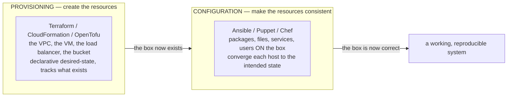
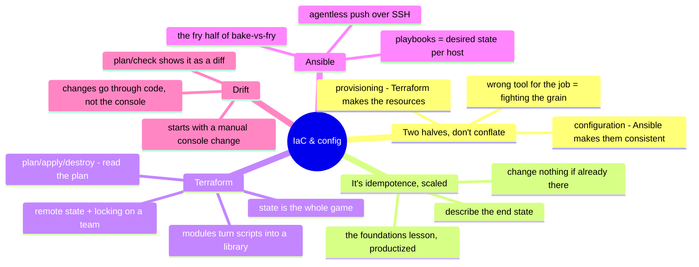

# Infrastructure-as-Code & Configuration Management

> The universal control plane. Move #3 of the [operating model](../00-the-operating-model.md)
> — *drive the platform through its API and codify it* — made into its own
> discipline. Master this once and every platform becomes a thing you describe in a
> file and version in git, instead of a console you click and forget.

Infrastructure-as-code is what separates "I set it up" from "it's defined, reviewed,
reproducible, and disposable." This note covers the two halves that get conflated —
**provisioning** (Terraform: create the resources) and **configuration management**
(Ansible/Puppet: make the resources consistent) — and the discipline that makes
either one trustworthy: state, idempotence, review, and drift.

## The distinction that matters: provisioning vs. configuration

The single most useful thing to get straight, because using one for the other's job
is a common and expensive mistake:

Terraform *creates* the VM; Ansible *configures* what's on it. Terraform makes the
bucket; it doesn't install your app. The tools blur at the edges (Terraform can run
a provisioner; Ansible can create cloud resources), but reaching for the wrong one
as the primary tool — Terraform managing package versions, Ansible as your cloud
provisioner — is fighting the grain. Know which half you're in.

## The bridge from foundations: this is idempotence, scaled

[`foundations/`](../foundations/) argued that an **idempotent** script — one you can
run twice safely — is the difference between infrastructure and a liability. IaC is
that idea turned into a whole discipline. Every tool here is built on the same
promise: *describe the end state; the tool figures out what to change to get there,
and changes nothing if you're already there.* An Ansible playbook that says "the
nginx package is present" doesn't reinstall it on the second run — it checks and
moves on. If you internalized idempotence from a shell script, you already
understand the core of every tool below; the rest is syntax and state management.

## Terraform — the universal provisioning plane

The reason this repo can compare seven platforms: Terraform (and its fork OpenTofu)
speaks to all of them with one workflow.

- **State is the whole game.** Terraform keeps a **state file** mapping your code to
  the real resources it created. That file is how it knows what to change, and it's
  the thing that goes wrong: on a team, state must live in **remote storage with
  locking** (S3 + DynamoDB, a Terraform Cloud workspace, etc.) or two engineers
  running `apply` at once will corrupt it. Local state on a laptop is fine for a
  lab and a disaster for a team.
- **The workflow:** `plan` (show me what would change), read the plan *before
  trusting it*, `apply` (make it so), `destroy` (tear it down cleanly — the property
  that makes a lab safe and a review environment cheap). Reading the plan is the
  skill; `apply` without reading it is how surprises reach production.
- **Modules** — reusable, parameterized building blocks, so "a standard VPC" is
  written once and called everywhere. This is where IaC stops being scripts and
  becomes a library.
- The runnable proof of this is already in the repo:
  [`platforms/aws/labs/02-minimal-vpc-ec2-terraform/`](../platforms/aws/labs/02-minimal-vpc-ec2-terraform/)
  — a VPC + instance stood up and destroyed from code.

## Ansible — configuration management, the push model

Where Terraform stops (the box exists) Ansible begins (the box is correct):

- **Agentless** — Ansible reaches hosts over plain SSH; there's no agent to install
  and keep alive, which is a large part of why it's one of the single most-requested
  tools in the demand signal.
- **Playbooks** — YAML describing desired state per host: packages present, files
  templated, services running, users created. Idempotent by design — the
  foundations lesson, productized.
- **Where it's the right tool over Terraform** — mutating *existing* hosts,
  orchestrating a rolling change across a fleet, and the *fry* half of
  [`the-stack/03`](../the-stack/03-compute-and-images.md)'s bake-vs-fry (what you
  configure at boot instead of baking into the image). Ansible is also a fine
  fleet-orchestration tool, not just config.

## Puppet — the pull model, for contrast

Puppet (and Chef) represent the older, agent-based, **pull** model: each host runs
an agent that periodically pulls its desired state from a server and converges to
it. The trade vs. Ansible's agentless push: continuous enforcement and scale
(agents pull on their own schedule) at the cost of an agent and a server to operate.
Worth understanding as the contrast that explains *why* agentless push won so much
mindshare — not because pull is wrong, but because "no agent" removed a whole
operational burden.

## Drift — the reason any of this matters

**Drift** is the gap between what the code says and what reality actually is, and
it's what IaC exists to kill:

- It starts with a **manual console change** — the "quick fix" someone made at 2
  a.m. that the code doesn't know about. Now the code lies, and the next `apply`
  will either revert the fix (surprise outage) or the two will silently diverge.
- **Detection:** `terraform plan` against reality shows drift as a diff; Ansible
  re-run shows changed-vs-ok per task; config-management tools can report
  compliance continuously.
- **The discipline:** changes go through code, not the console. The console is for
  *looking* (the operating model's line); the moment it becomes for *doing*, drift
  begins. This is the same rule the [security chapter](../the-stack/07-security.md)
  enforces with policy-as-code — make the console-change the exception, not the
  habit.

## The AI-assisted ramp (IaC flavor)

- **Draft the resource, then read every line:** AI writes HCL and playbooks fast and
  gets the shape mostly right — and invents resource arguments, uses deprecated
  syntax, and defaults to permissive settings. Generated IaC is a first draft to
  audit, never an `apply`-it-and-see.
- **Always dry-run first:** `terraform plan` and Ansible's `--check` mode exist
  exactly so AI's (and your own) mistakes surface as a diff before they touch
  reality. Make the dry-run non-negotiable for anything generated.
- **Where AI burns you (verify hardest):** it **invents Terraform resource arguments
  and Ansible module options** that don't exist; it hands you **deprecated syntax**
  from its training years (providers move fast); it **hardcodes permissive defaults**
  (a security group open to the world, a state file with no locking); and it **blurs
  provisioning and config**, offering Terraform for a job that's Ansible's or vice
  versa. Read the plan; run the check; the diff doesn't hallucinate.

## Honest boundaries

Mixed, and marked precisely. **Ansible and the automation discipline are ✋** —
Python/Bash/Ansible operated for real fleet automation, and the idempotence instinct
that underlies all of IaC is hands-on (see [`foundations/`](../foundations/)).
**Terraform is a 🧗 ramp** — the concepts (state, plan/apply/destroy, modules) are
solid, mapped, and proven in the [AWS lab](../platforms/aws/labs/02-minimal-vpc-ec2-terraform/),
not claimed as years of production module authoring at scale. **Puppet is
conceptual** — understood as the pull-model contrast, not operated. The transferable
claim: a deep automation-and-idempotence foundation plus a fast, verified ramp onto
any specific IaC tool — exactly the shape [`WHY.md`](../WHY.md) argues for.

## Lab (🚧 planned — spec)

**Provision then configure — the two halves, wired together.** Pure-local where
possible (a container or local VM as the target):

1. **Provision** with Terraform (the [AWS lab](../platforms/aws/labs/02-minimal-vpc-ec2-terraform/)
   is the cloud version; locally, use a VM/container) and confirm `plan` → `apply` →
   `destroy` round-trips cleanly.
2. **Configure** the resulting host with an **Ansible playbook** (a package, a
   templated config file, a running service) — then run it **twice** and prove the
   second run reports zero changes: idempotence, demonstrated.
3. **The drift drill:** change something on the host by hand (edit the config the
   playbook manages), re-run the playbook, and watch it *detect and correct* the
   drift — the whole reason the discipline exists, made visible.

## The chapter on one screen

