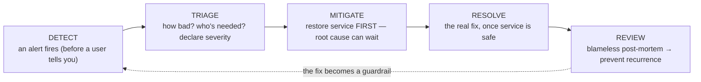
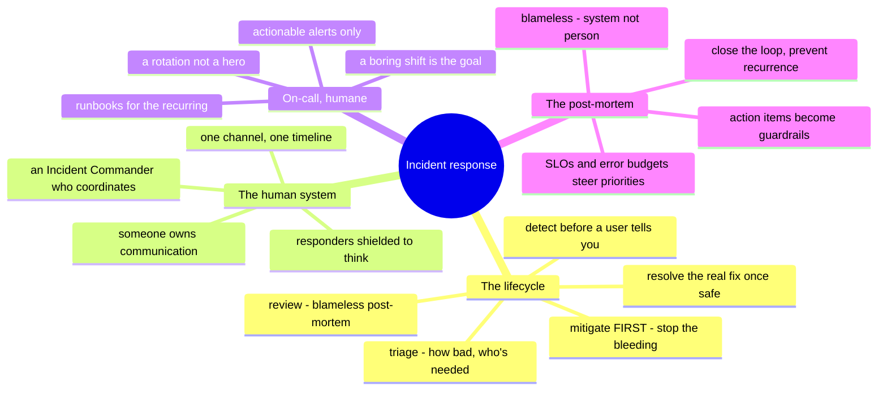

# Incident Response & On-Call — staying calm when it breaks

> [`foundations/`](../foundations/) built the *technical* half of debugging — the
> reflex that finds what's wrong. This note is the *other* half the SRE roadmaps put
> at the center: the **process and the human system** around a live outage — roles,
> communication, on-call, and the post-mortem that stops it recurring. It's the part
> [`WHY.md`](../WHY.md) says compounds slowly and matters more in the AI era, because
> no model owns the incident.

Everything else in this repo helps you *prevent* incidents. This is what you do when
prevention fails — which it will. The difference between a ten-minute blip and a
two-hour disaster is rarely the technical fix; it's whether the *response* was
structured or a scramble. Incident response is a skill, and it's practiced, not
improvised at 3 a.m.

## The incident lifecycle

An incident is a flow with named stages, and knowing the stages is what keeps a
high-pressure situation from becoming thrashing:

The one instinct that separates seniors: **mitigate before you diagnose.** Stop the
bleeding — roll back, failover, scale up, disable the feature — *then* find the root
cause. A user-facing outage is not the time for a satisfying investigation; restore
service, then investigate from calm. (This is why [CI/CD](ci-cd.md)'s tested rollback
and [databases'](databases.md) rehearsed failover matter — they're mitigations you
prepared in advance.)

## The human system — roles and communication

At any real severity, an incident needs structure, not a huddle of people all typing:

- **Incident Commander (IC)** — *coordinates*, doesn't fix. Owns the decision-making,
  keeps the timeline, decides when to escalate. On a big incident the best engineer is
  often the IC precisely because coordination is the bottleneck, not typing.
- **Communications** — someone owns updates to stakeholders and (if needed) a status
  page, so the responders aren't interrupted every five minutes with "any update?"
- **Responders** — the ones actually mitigating, shielded from the coordination and
  comms load so they can think.
- **The channel and the timeline** — one place (a war-room channel) where everything is
  logged as it happens, because the post-mortem is only as good as the record — the
  same [audit-trail](itsm-and-assets.md) discipline, live.

Small incident? One person wears all the hats. The point isn't ceremony — it's that
someone is *deciding* and someone is *recording*, so the response is structured even
when it's one tired human.

## On-call — sustainable, not heroic

On-call is how "someone will notice" becomes a guarantee — and it's a system to design
humanely, or it burns people out and the good ones leave:

- **A rotation, not a hero** — the pager rotates on a schedule so no one person is
  permanently tethered; a clear **escalation path** when the primary can't resolve it.
- **Actionable alerts only** — every page must be *urgent and actionable*. Alert
  fatigue ([the-stack/06](../the-stack/06-observability.md)) is the on-call killer: too
  many pages train responders to ignore them, and the real one scrolls past. If it's
  not worth waking someone, it's a dashboard, not a page.
- **Runbooks** — the recurring incident should have a documented response, so 3 a.m.
  is following a tested procedure, not inventing one. AI drafts the first version
  ([itsm](itsm-and-assets.md)); reality hardens it.
- **Toil budget** — if on-call is constant firefighting, that's a signal to fix the
  underlying problems (the [problem-management](itsm-and-assets.md) loop), not to
  demand more stamina. The best on-call shift is a boring one.

## The blameless post-mortem — the point of the whole thing

The incident's real deliverable isn't the fix — it's making the *next* one less
likely:

- **Blameless** — focus on the *system and process* that allowed the failure, not the
  person who pushed the button. Blame makes people hide information, which makes the
  next incident worse. Psychological safety is an operational requirement, not a nicety.
- **A real timeline and root cause** — what happened, when, why, and what the
  contributing factors were (usually several, not one).
- **Action items that become guardrails** — every post-mortem should produce concrete
  changes: a new alert, a [policy-as-code](../the-stack/07-security.md) guardrail, a
  fixed runbook, a closed [observability gap](../the-stack/06-observability.md). The
  loop closes when the fix makes recurrence *impossible*, not just *noticed*.

This ties to the reliability math from [observability](../the-stack/06-observability.md):
**SLOs and error budgets** turn "how reliable?" into a number, and a blown error budget
is the signal to stop shipping features and spend on reliability — incident response
feeding back into engineering priorities.

## Ops notes — what goes wrong in the response itself

- **Diagnosing before mitigating** — the satisfying-investigation trap while users are
  down. Restore first.
- **No incident commander** — five smart people all fixing, none coordinating, stepping
  on each other. Someone must *decide*.
- **The silent responder** — heads-down fixing with no updates, so leadership panics and
  piles on. Communicate even "still working, next update in 15."
- **Alert fatigue** — the real page lost in noise; the incident nobody responded to
  because the last fifty alerts were nothing.
- **The post-mortem that blames and files** — names a culprit, produces no guardrail,
  and the same incident recurs next quarter. Blameless, with action items that ship.
- **Hero on-call** — one person carrying it all, until they leave and take the
  undocumented knowledge with them.

## The admin discipline (what to be able to do)

- Run an incident through **detect → triage → mitigate → resolve → review**, and
  **mitigate before diagnosing**.
- Act as **Incident Commander** — coordinate and decide, separate from the hands-on fix.
- Keep a **timeline** and communicate on a cadence, even mid-fire.
- Design a **humane on-call** rotation with actionable alerts, an escalation path, and
  runbooks.
- Write a **blameless post-mortem** whose action items become guardrails that prevent
  recurrence.
- Tie it back to **SLOs / error budgets** — reliability as a number that steers
  priorities.

## The AI-assisted ramp (incident flavor)

- **AI as incident co-pilot** (from [aws/operations](../platforms/aws/operations.md)):
  paste the error, the log, the metric — *"what does this point at, what would you
  check next?"* — a fast hypothesis you test. And draft the **post-mortem timeline**
  from the channel log, then correct the causality yourself.
- **Where AI helps and where it can't:** AI accelerates the *lookup* and the *first
  draft*; it **cannot own the incident** — the severity call, the mitigate-vs-diagnose
  decision, the blast-radius judgment, and the accountability stay human. It will also
  **write confident, blameful, or wrong root causes** — you own the conclusion, and
  you keep it blameless.

## Honest boundaries

Mixed, and honest about which half. The **technical incident reflex** — decomposition,
one-variable-at-a-time, reading what the system says under pressure — is ✋
([foundations](../foundations/), and real infrastructure work where the pager was
real), as is the **composure**: staying methodical when it breaks. Formal **SRE
incident-command practice at scale** (dedicated IC rotations, error-budget-driven
engineering, large-org post-mortem programs) is a **🧗 ramp** — the framework mapped and
verified, not claimed as running a production SRE org. The most transferable ✋ thing
here is exactly what [`WHY.md`](../WHY.md) says survives the AI era: the judgment and
calm to structure a messy, high-stakes situation — which no model provides.

## Lab (🚧 planned — spec)

**Rehearse the response, not just the fix.** A tabletop or a live game-day:

1. **Tabletop:** take one plausible outage (a full disk, an expired cert, a bad
   deploy) and walk the lifecycle out loud — who's IC, what's the mitigation *before*
   diagnosis, who communicates, what's the timeline. No system needed; the muscle is
   the process.
2. **Game-day (live):** break something on purpose in a lab (kill a service, expire a
   cert from the [web/TLS lab](web-and-tls.md), drop a table in the
   [backup drill](../the-stack/labs/04-backup-not-snapshot/)) and run the real
   response — mitigate, then resolve, on the clock.
3. **The deliverable:** write the **blameless post-mortem** — timeline, root cause,
   and at least one **action item that becomes a guardrail** so this exact incident
   can't recur.

## The chapter on one screen

