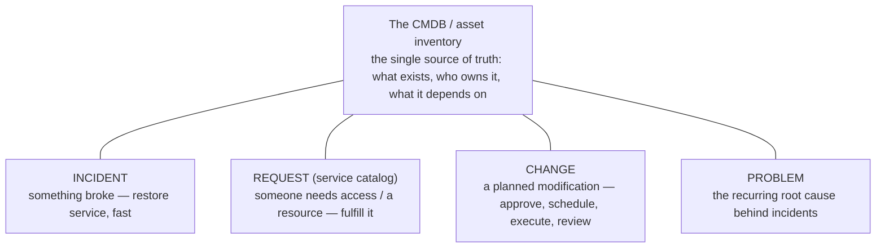
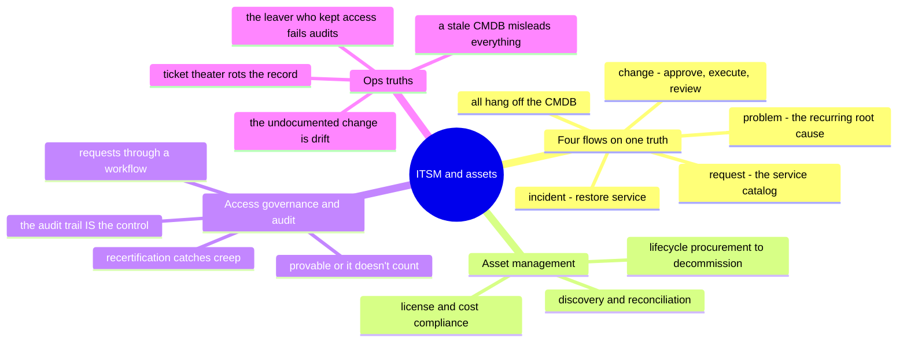

# ITSM, Asset Management & Governance — the operational spine

> The part of the job the cloud-native roadmaps skip and every real IT org runs on:
> the ticket queue, the asset inventory, the access requests, and the audit that
> proves it all. It's unglamorous, it's where compliance actually lives, and it's
> **✋ hands-on ground** — years in ServiceNow, plus audit-reconciliation automation
> written for real.

Every platform in this repo answers "how does the machine work." This note answers
"how does the *work* work" — how requests, changes, incidents, assets, and access are
tracked so an organization can operate at scale and *prove* it did. It's the layer
auditors, security reviews, and the next engineer all depend on, and it's a genuine
sysadmin discipline, not overhead.

## The four things ITSM actually tracks

Strip the tooling (ServiceNow, Jira Service Management, an in-house system) and IT
service management is four flows over one source of truth:

- **Incident** — restore service quickly; the technical side is the
  [debugging reflex](../foundations/), the process side is triage, priority, comms,
  and a record.
- **Request** — the service catalog: access, hardware, software. This is where
  [identity](identity-iam.md)'s joiner/mover/leaver lifecycle becomes tickets — and
  where automating it ([SCIM/directory-driven](saas-admin.md)) turns *scaling
  tickets* into *scaling systems*.
- **Change** — a planned modification with approval, a window, execution, and a
  post-review. This is the human-process wrapper around a [CI/CD](ci-cd.md) deploy or
  an [IaC](iac-and-config.md) apply — the "who approved this and can we back it out"
  layer.
- **Problem** — the recurring root cause behind repeated incidents; fixing it is how
  the queue stops refilling.

All four hang off the **CMDB** — the inventory of what exists, who owns it, and what
depends on what. A CMDB that's wrong is worse than none, because people trust it.

## Asset management — the inventory that keeps you honest

Hardware and software assets are the CMDB's backbone, and keeping them accurate is
real, ongoing work:

- **Discovery and reconciliation** — what you *think* you have (the spreadsheet)
  versus what's *actually* deployed (the network scan) never match, and closing that
  gap is the job. This is exactly the [scripting](../foundations/) win: reconciling
  audit data with code instead of by hand in Excel.
- **Lifecycle** — procurement → deployment → refresh → decommission, tied to the
  [endpoint](../endpoint/) and [self-host](../platforms/self-host/) provisioning
  pipelines that create and retire the assets.
- **Software/license compliance** — knowing what's installed and licensed is both a
  cost control ([cost](cost.md)) and an audit requirement; the "forgotten resource"
  problem, on the asset side.
- **The cost angle** — reconciling *what's deployed* against *what's paid for* is cost
  hygiene ([cost](cost.md)); the audit and the invoice are two views of the same
  inventory.

## Access governance & audit — proving least privilege

This is where ITSM meets [security](../the-stack/07-security.md) and
[identity](identity-iam.md): least privilege is a *claim* until you can prove it.

- **Access requests through a workflow** — multi-approver routing, so a grant has a
  record of who asked, who approved, and why (not a Slack message someone half-remembers).
- **Access reviews / recertification** — periodically re-proving that every grant is
  still needed; the discipline that keeps [identity](identity-iam.md)'s permission
  creep in check, and the thing audits demand evidence of.
- **The audit trail** — every change, access grant, and incident leaves a record, so
  "who did what, when" is answerable. This is the human-process twin of
  [CloudTrail / the audit log](../platforms/aws/operations.md): governance is only
  real if it's *provable*.
- **Controlled environments** — the strictest version: segmented, access-gated,
  audited operation where every action is logged and reviewable. The judgment for
  running one transfers directly from operating a disciplined access model at scale.

## Ops notes — what pages you (and what fails audits)

- **The stale CMDB** — an inventory people trust but that's wrong sends every
  dependent decision (change impact, incident scope, capacity) sideways. Reconcile it
  or stop relying on it.
- **The undocumented change** — the "quick fix" nobody ticketed is
  [drift](iac-and-config.md) at the process layer: now the record lies, and the next
  incident's root-cause hunt starts from a false map.
- **The leaver who kept access** — the offboarding request that didn't fully
  execute; access dangling after departure is the classic audit finding and security
  hole ([identity](identity-iam.md)'s leaver problem, un-closed).
- **Ticket theater** — process for its own sake, where filling the form matters more
  than fixing the thing. ITSM should reduce toil and add traceability, not become the
  toil; when it's the latter, engineers route around it and the record rots.
- **No evidence at audit time** — controls that exist but were never logged are
  controls a regulator won't credit. The audit trail *is* the control, operationally.

## The admin discipline (what to be able to do)

- Run an **incident** through triage → restore → record, and a **change** through
  approve → execute → review.
- Keep a **CMDB / asset inventory** accurate — and **reconcile** it with a script,
  not by hand.
- Route **access requests** through a multi-approver workflow and run an **access
  recertification**.
- Produce the **audit trail** for "who changed this, who has access to that, and when"
  — and know why provability is the point.
- Automate the boring reconciliation (audit data, license counts, stale accounts) —
  turning a manual monthly slog into a scheduled job.

## The AI-assisted ramp (ITSM flavor)

- **Translate the process:** *"I ran ServiceNow incident/request/change and asset
  reconciliation — map that onto Jira Service Management (or an in-house tool), and
  onto the cloud audit-log world."*
- **Draft the automation:** AI is strong at the *scripting* — reconciliation scripts,
  API calls to pull asset data, stale-account reports. Verify the API calls and the
  logic against real data (a wrong reconciliation quietly corrupts the source of
  truth everyone trusts).
- **Where AI burns you (verify hardest):** it **invents platform API fields and
  workflow semantics** (ServiceNow/Jira data models are large and it guesses); it
  **oversimplifies approval/compliance requirements** (real frameworks have specific
  evidence rules — verify against the actual control set); and it will **treat a
  report as a control** when the control is the *acted-on* finding, not the CSV.

## Honest boundaries

✋ **hands-on depth — a genuinely under-showcased strength.** Years of **ServiceNow**
(incident/request/change) at Mphasis/Varian; ITSM at ByteDance through **Jira** and
then an in-house ticketing system; **hardware and software audits** with the data
migrated from spreadsheets into a database and **reconciliation scripts** written to
compare it (contrast: doing it by hand in Excel); operation inside a strict
**multi-approver, least-privilege access model** with real access-review discipline;
and device security-configuration / network-admission **compliance checks** as daily
work. Where it's a **🧗 ramp**: deep GRC-framework auditing (SOC 2 / ISO 27001 /
FedRAMP as a specialist practice) and enterprise CMDB architecture at scale — the
operational discipline is ✋, the formal-auditor role is the ramp. The transferable
claim: real ITSM, asset-reconciliation, and access-governance operations — the spine a
compliant IT org runs on — plus a fast ramp onto any specific platform or framework.

## Lab (🚧 planned — spec)

**Reconcile the truth, prove the access.** Pure-local, no special tooling:

1. **Reconcile:** two lists — an "asset spreadsheet" and a "network scan" (both CSV) —
   and a script that finds what's in one but not the other (the gap the CMDB is
   always chasing). This is the audit-reconciliation win in miniature.
2. **Lifecycle:** model a joiner and a leaver as records; write the script that flags
   a "leaver" who still has an active access grant — the audit finding, caught before
   the auditor.
3. **The drill:** produce the **audit trail** — a log of who changed what and who has
   access to which resource — and explain, for one grant, *why it exists* (or should
   be revoked). Governance is only real when it's answerable.

## The chapter on one screen

