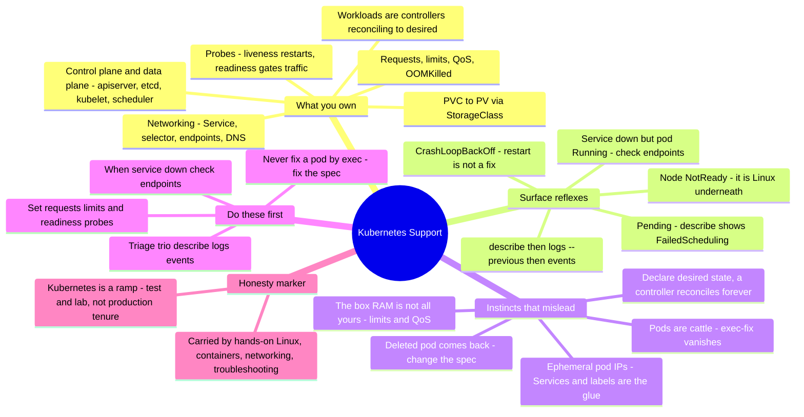

# Kubernetes Support — the Linux sysadmin's transition guide

> 🌐 **Languages:** English (default) · [中文](../docs/zh/cross-cutting/kubernetes-support.md)

---

> [`kubernetes.md`](kubernetes.md) covers the **object model** and the one idea — *declare
> desired state, let controllers converge*. This is the other half: **Kubernetes support as
> a break-fix craft** — the tickets that actually recur, exactly where you look, and **where
> a strong Linux / Docker / systemd sysadmin's instincts get burned inheriting a cluster.**
> Honesty marker up front: this note is **🧗 ramp** — my Kubernetes hands-on is **test/lab**
> (kind/minikube/k3s), carried by a ✋ **Linux + containers + networking + troubleshooting**
> foundation. Its authority is **research** (kubernetes.io + practitioner failure modes + a
> runnable [lab](#lab--pods-are-cattle--runnable)), not production cluster tenure. The whole
> point is *the gap I'm crossing.*

A Linux sysadmin ramps onto Kubernetes fast — it's containers, it's Linux underneath
(namespaces + cgroups), it's YAML in git. Then it bites in the place a fleet of servers
doesn't: **you don't manage processes, you declare desired state, and controllers reconcile
actual → desired, forever.** Delete a pod and it comes back. SSH in to fix a pod and your fix
dies with it. The box has 16 GB but your container gets `OOMKilled` at its limit. The pod is
`Running` but the service is "down." Each of these is a config-management-brain reflex — *treat
the running thing as a pet* — misfiring against a system built on cattle and control loops.
This note names the responsibilities, the recurring tickets and their diagnostic surface, and
the sysadmin instincts that misfire — contrasting with Linux/Docker/systemd throughout, because
that's where the reader is coming from.

## What supporting Kubernetes makes you responsible for

The break-fix surface, roughly in the order tickets arrive:

| Surface | What you're on the hook for |
| --- | --- |
| **Control plane vs data plane** | **kube-apiserver** (the one front door), **etcd** (source of truth — back it up), **kube-scheduler** (places Pods), **kube-controller-manager** (runs the control loops); per node: **kubelet** (keeps Pods running), **kube-proxy** (Service network rules — now *optional* with some eBPF CNIs), the **container runtime** (containerd/CRI-O; `crictl`, not `docker`), and the **CNI** plugin (the flat pod network). |
| **Workloads & controllers** | Pod / ReplicaSet / **Deployment** (rolling updates + `rollout undo`) / StatefulSet / DaemonSet / Job / CronJob — every one a controller reconciling **actual → desired**, forever. |
| **Networking** | **Service** (ClusterIP/NodePort/LoadBalancer) → **selector → EndpointSlices**; **CoreDNS** (`<svc>.<ns>.svc.cluster.local`); **Ingress + an ingress controller** (`ingressClassName`); **NetworkPolicy** (default-open until applied); ephemeral pod IPs. |
| **Scheduling & resources** | **requests** (drive scheduling) vs **limits** (enforced ceiling); **QoS** (Guaranteed/Burstable/BestEffort → eviction order); **OOMKilled** (memory limit → SIGKILL, exit 137) vs **CPU throttling**; taints/tolerations, affinity, node-pressure eviction. |
| **Health** | **liveness** (fail → restart), **readiness** (fail → pulled from endpoints, *no* restart), **startup** (gates the other two for slow boots). |
| **Config & storage** | ConfigMap / Secret (base64, not encrypted by default); **PVC → PV via StorageClass**, dynamic provisioning/CSI, `WaitForFirstConsumer`, access modes (RWO/ROX/RWX/RWOP). |
| **Access & multitenancy** | **RBAC** (Role/ClusterRole + bindings), ServiceAccounts, **namespaces** (most Forbidden errors are namespace-scoped), ResourceQuota / LimitRange. |
| **Triage & observability** | the **`describe` → `logs` → `events`** trio, `kubectl get events --sort-by`, `kubectl debug` (ephemeral containers), metrics-server (`kubectl top`), kube-state-metrics. |

## The common tickets — and where you look

Kubernetes break-fix is the **describe → logs → events** reflex — your `systemctl status` /
`journalctl` / `dmesg` renamed. `kubectl describe pod` and its **Events** block solves most of
these on its own.

**`CrashLoopBackOff` — the app starts then crashes, repeatedly.** The kubelet restarts it with
exponential back-off. *Where you look:* **`kubectl logs <pod> --previous`** (the crashed
instance's logs — the `--previous` is the key), then `describe` for the exit code / events. Root
cause is almost always in the app or its config, not the cluster — **restarting won't fix a bad
spec.**

**`ImagePullBackOff` / `ErrImagePull` — the image can't be pulled at all.** *Where you look:*
`kubectl describe pod` Events — look for `manifest not found` (wrong tag), `unauthorized`
(missing registry pull-secret), `toomanyrequests` (registry rate-limit), or `i/o timeout`.

**`Pending` / Unschedulable — no node will take it.** *Where you look:* `describe pod` Events
show reason **`FailedScheduling`** — `Insufficient cpu`/`memory` (requests too high or cluster
full), an **untolerated taint**, a nodeSelector/affinity mismatch, or an **unbound PVC**.

**`OOMKilled` — the container exceeded its memory limit.** *Where you look:* `describe pod` →
container `Last State: Terminated, Reason: OOMKilled, Exit Code: 137`. The kernel OOM-killer you
already know — but now triggered *by design* at the container's cgroup limit. Raise the limit or
fix the leak; note **CPU limits throttle, memory limits kill.**

**"The service is down" but the pod is `Running` — the readiness ticket.** A pod failing its
**readiness** probe is pulled from the Service's endpoints (traffic-gated, *not* restarted). *The
single highest-yield check:* **`kubectl get endpoints <svc>`** (or `get endpointslices`) — empty
endpoints means a **selector/label mismatch**, wrong namespace, or pods not Ready. This one check
resolves a large fraction of "it's broken" reports.

**Service unreachable.** Beyond empty endpoints: **CoreDNS** failing (test `nslookup <svc>` from a
pod; check `kube-dns` pods in `kube-system`), or kube-proxy. Labels are the glue — a Service
selector that doesn't *exactly* match pod labels silently selects nothing.

**Ingress 502 / 503 / 404.** Usually the backend, not the Ingress: 503 = no ready backend, 502 =
backend returned garbage, often a wrong `service`/`port`, a `targetPort` ≠ container port, or the
wrong `ingressClassName`. *Where you look:* the ingress controller's pod logs + does the Service
have endpoints.

**`PVC Pending`.** No StorageClass/provisioner, an unsatisfiable access mode, or —
expected-not-a-bug — `WaitForFirstConsumer` waiting for a consuming pod to be scheduled. *Where
you look:* `describe pvc`, `get storageclass`, events.

**RBAC `Forbidden`.** `User "x" cannot list pods in the namespace "y"`. *The fix-finder:*
**`kubectl auth can-i <verb> <resource> --as <user> -n <ns>`** — then add the Role/RoleBinding.

**Node `NotReady`.** kubelet down, container-runtime failure, **CNI not ready**
(`NetworkUnavailable`), or resource pressure. *Where you look:* `kubectl describe node` (the
condition — MemoryPressure/DiskPressure/PIDPressure/NetworkUnavailable), then on the node
`journalctl -u kubelet`. This is where "it's Linux underneath" saves you.

## The experience gap — what a strong sysadmin's instincts get wrong

The gap between a sysadmin who's supported a cluster and one who hasn't isn't the YAML — it's a
set of Linux/systemd/Docker reflexes that are **wrong here**, each with a failure mode.

- **You declare desired state; controllers reconcile it — forever.** A controller is a control
  loop (the docs use a *thermostat* analogy) that continuously drives actual → desired. This is
  **not** a run-once Ansible playbook and **not** imperative `systemctl start`. The whole system
  is objects in etcd being reconciled. Until that's reflexive, every behavior surprises you.
- **Pods are cattle, not pets — you can't SSH in and fix them.** A fix made by `kubectl exec` into
  a running pod **vanishes** when the pod is replaced (it's rebuilt from its template, not its
  live memory). The unit of management is the **Deployment/spec**, not the pod. Treat `exec` as
  read-only diagnosis. The [lab](#lab--pods-are-cattle--runnable) makes this concrete.
- **"Why did my deleted pod come back?"** Because its controller maintains `replicas: N` and
  immediately recreates it. To actually remove it, change desired state (scale to 0 / delete the
  Deployment) — not `kubectl delete pod`. `describe pod` → **"Controlled By"** shows the owner.
- **Networking is a flat pod network + Services + DNS — not host IPs.** Pod IPs are **ephemeral**;
  the stable abstraction is a **Service** (virtual IP + **label selector → endpoints**) resolved
  by CoreDNS. A selector/label typo = no endpoints = "service down," with *no error* — the object
  is valid, it just selects the empty set. No `/etc/hosts`, no static IPs.
- **Requests/limits/QoS + OOMKilled — "the box has 16 GB, use it" is a trap.** **Requests** drive
  scheduling; **memory limits** get you **OOMKilled** (137); **CPU limits** silently **throttle**;
  and **QoS class** (forget to set requests → BestEffort → first evicted) decides who dies under
  node pressure. The node kills your container by design.
- **Health is probe-driven, not "is the process up."** **liveness** fail → restart; **readiness**
  fail → removed from endpoints (traffic gated, no restart). "Running but no traffic" is a
  readiness failure. `systemctl is-active` was binary; here "up" and "receiving traffic" are two
  independent states.
- **Change the spec, don't edit the running thing.** `kubectl edit`/`set image` on a live object
  mutates it but not your YAML (lost on next replacement); hand-editing a pod is futile. Change the
  **template**; the Deployment does a rolling replace.
- **Labels & selectors are the glue.** Services, Deployments, NetworkPolicies all wire by
  **matching labels** — a typo breaks the wiring silently. There's no `ProxyPass backend:8080`
  line to grep.
- **Control plane vs data plane; the kubelet is the per-node agent.** Useful (imperfect) mapping:
  the **kubelet ≈ the node's systemd for pods** — the local agent that keeps declared containers
  running. But the reconciliation is cluster-wide, driven from etcd through the API server.
- **Storage isn't `mount /dev/sdb`.** A **PVC** (a *request*) binds to a **PV**, dynamically
  provisioned by a **StorageClass**; `WaitForFirstConsumer` delays binding until the pod is
  scheduled so the volume lands in the right zone. You declare a claim; the system decides where
  and when the disk appears.

## What transfers, what doesn't

| Transfers strongly | Transfers with caveats | Don't bring it |
| --- | --- | --- |
| **Linux itself** — it's namespaces/cgroups; OOMKilled/137 is the same kernel OOM-killer | Networking fundamentals — same IPs/DNS/routing, **re-mapped** onto a flat overlay + Services | "SSH in and fix it" — the pod is cattle; your fix dies with it |
| Docker/container fundamentals (images, layers, registries, entrypoints) | Capacity/resource reasoning — now expressed as **requests/limits/QoS** | "The process is the unit" — the **Deployment/spec** is; the pod is disposable |
| Troubleshooting method — **describe→logs→events** = `systemctl status`/`journalctl`/`dmesg` | The **systemd→kubelet** analogy — real but imperfect (reconcile is cluster-wide) | Static IPs / hostnames / `/etc/hosts` — pod IPs are ephemeral; use Services + DNS |
| YAML + declarative thinking (from Ansible/Terraform) — desired-state manifests, `kubectl apply` | Health checks — but liveness (restart) ≠ readiness (gate traffic), two separate states | "Edit the running thing" — edit the **spec**; live edits are lost on replace |
| Observability/log habits (restart counts, events over time) | Storage sizing — but it's PVC→PV→StorageClass, not `mkfs`/`mount` | "The box's whole RAM is mine" — limits + QoS mean the node evicts/kills by design |
| Change discipline (GitOps, review) — *more* important here | | Imperative ordering ("start A then B") — you declare end-state, not steps |

## First week / first 90 days

**First week.**
1. **Internalize desired-state + reconciliation before touching anything** — "I declare, a
   controller reconciles, forever." Read the [`kubernetes.md`](kubernetes.md) control-loop idea and
   run the [lab](#lab--pods-are-cattle--runnable).
2. **Burn in the triage trio** — `kubectl describe pod` (Events + "Controlled By"), `kubectl logs
   --previous` (the crashed instance), `kubectl get events --sort-by=.lastTimestamp`.
3. **Never "fix a pod" by exec** — treat `exec`/`debug` as read-only diagnosis; fix the
   spec/Deployment.
4. **When "the service is down," check ENDPOINTS first** — `kubectl get endpoints <svc>`; empty ⇒
   selector/label mismatch, wrong namespace, or pods failing readiness.

**First 30 days.**
5. **Understand requests/limits/QoS + OOMKilled before you deploy** — always set requests (or risk
   BestEffort/unschedulable); memory limit = hard kill (137), CPU limit = throttle.
6. **Add readiness probes deliberately** — a missing/bad readiness probe is the top cause of
   "Running but no traffic." Reserve liveness for truly-stuck states.
7. **Know it's Linux underneath** — once you've localized to a node/container, drop to cgroups /
   kernel OOM / DNS / routing with your existing skills; `crictl` on the node, not `docker`.
8. **Read the plan of a rollout** — `kubectl rollout status` / `history` / `undo`; you change the
   template, the controller rolls, and you can roll back.

**First 90 days.**
9. **Design for replacement** — externalize state (PVC/DB), keep containers stateless, expect churn;
   stop treating pods as pets.
10. **Right-size with data** — metrics-server (`kubectl top`) + goldilocks/kube-capacity to fix the
    OOMKill/throttle tickets at the source (requests/limits).
11. **Lint before prod** — kube-score / polaris / kube-linter in CI to catch missing probes,
    requests/limits, and anti-patterns before they page you.
12. **Know the version deltas** — dockershim is gone (containerd/CRI), Endpoints → **EndpointSlices**,
    PodSecurityPolicy → **Pod Security Admission**; don't teach the old way.

## The AI-assisted ramp (Kubernetes flavor)

- **Translate from what you know — and demand the deltas:** *"I know Linux, Docker, and systemd —
  map Pods/Deployments/Services and the reconciliation loop onto processes/units/host-networking,
  and flag only the real differences."* K8s rewards translate-then-verify — but **reconciliation,
  cattle-not-pets, readiness-gates-endpoints, and QoS/OOMKill have no single-host analog**, so
  verify those to death (that's what the lab is for). Tools like **k8sgpt** can explain a failing
  resource in plain English — a fast first-pass, not a substitute for the describe→logs→events
  reflex.
- **Let it draft manifests; you own the reconcile behavior.** AI is strong at YAML — and it will
  also **omit requests/limits** (BestEffort/OOMKill surprises), **skip readiness probes** (silent
  "service down"), **mismatch a selector and its pod labels** (zero endpoints), and **`kubectl
  edit` a live object** instead of changing the source. Never `apply` AI-drafted manifests without
  reading them, and run them in a **kind/minikube** throwaway cluster first. Same verify-to-death
  discipline — see [`ai-workflow/`](../ai-workflow/) and [`kubernetes.md`](kubernetes.md).

## Honest boundaries

This note is **🧗 ramp, and it says so clearly.** My Kubernetes hands-on is **test/lab** —
kind/minikube/k3s and the object model, not years running production clusters and their control
plane. What carries it is real: **✋ Linux + container + networking + troubleshooting depth** —
namespaces/cgroups, the kernel OOM-killer, Docker/containers, DNS/routing, and the
describe→logs→events methodology that *is* `systemctl`/`journalctl`/`dmesg` renamed (the same line
[`kubernetes.md`](kubernetes.md) and [`iac-and-config.md`](iac-and-config.md) draw). The
Kubernetes-specific mechanics above — the controller/reconcile model, Services/EndpointSlices,
requests/limits/QoS/OOMKill, probes, PVC/StorageClass binding, RBAC — are **mapped and
doc-verified, not tenure.** Deeper production Kubernetes (etcd operations, CNI/networking at scale,
multi-tenant platform engineering, operators/CRDs, cluster upgrades under load) is still ahead; the
annotation says so plainly and never bluffs. This is the honest artifact of a strong sysadmin
**crossing the exact gap** the job market keeps asking about — documented in public, ✋/🧗 marked.

## Field kit — real tools & references

Pointers below were each verified to exist on GitHub, grouped by use. Archived / renamed / moved
status is flagged, because this ecosystem changes fast.

**Local clusters (where a lab-level ramp lives):**
- [`kubernetes-sigs/kind`](https://github.com/kubernetes-sigs/kind) — Kubernetes-IN-Docker; the de-facto ephemeral test cluster (and CI).
- [`kubernetes/minikube`](https://github.com/kubernetes/minikube) — single-node local cluster with batteries (dashboard, metrics-server).
- [`k3s-io/k3s`](https://github.com/k3s-io/k3s) — lightweight single-binary distro *(renamed from rancher/k3s)*.

**The daily-driver triage cockpit:**
- [`derailed/k9s`](https://github.com/derailed/k9s) — the terminal UI for navigating pods/logs/events/usage fast; the single most useful interactive triage tool.
- [`ahmetb/kubectx`](https://github.com/ahmetb/kubectx) — `kubectx`+`kubens`; prevents the classic "ran it against the wrong cluster/namespace."
- [`stern/stern`](https://github.com/stern/stern) — multi-pod log tailing across all replicas *(the maintained fork; the old wercker/stern is gone)*. Lightweight alt: [`johanhaleby/kubetail`](https://github.com/johanhaleby/kubetail).
- [`kubernetes-sigs/krew`](https://github.com/kubernetes-sigs/krew) — the `kubectl` plugin manager; how you install most debugging plugins.

**Diagnostics, linting & right-sizing (fix the tickets at the source):**
- [`derailed/popeye`](https://github.com/derailed/popeye) — read-only cluster sanitizer (dangling configs, bad probes, resource issues).
- [`zegl/kube-score`](https://github.com/zegl/kube-score) · [`stackrox/kube-linter`](https://github.com/stackrox/kube-linter) — static manifest analysis: catch missing probes / requests-limits before prod.
- [`FairwindsOps/polaris`](https://github.com/FairwindsOps/polaris) · [`FairwindsOps/goldilocks`](https://github.com/FairwindsOps/goldilocks) — best-practice audit + **right-size requests/limits** (directly kills the OOMKill/throttle tickets). Pair with [`robscott/kube-capacity`](https://github.com/robscott/kube-capacity).
- [`doitintl/kube-no-trouble`](https://github.com/doitintl/kube-no-trouble) — `kubent`: finds deprecated/removed APIs before an upgrade breaks you.
- [`k8sgpt-ai/k8sgpt`](https://github.com/k8sgpt-ai/k8sgpt) — AI-driven plain-English triage of failing resources (CNCF sandbox).

**Observability & DR:**
- [`kubernetes-sigs/metrics-server`](https://github.com/kubernetes-sigs/metrics-server) — required for `kubectl top` + HPA. [`kubernetes/kube-state-metrics`](https://github.com/kubernetes/kube-state-metrics) — object-state metrics (pods-not-ready, failed jobs). [`prometheus-operator/kube-prometheus`](https://github.com/prometheus-operator/kube-prometheus) — turnkey Prometheus+Grafana+Alertmanager.
- [`velero-io/velero`](https://github.com/velero-io/velero) — backup/restore/migrate cluster resources + PVs *(moved from vmware-tanzu/velero)*.

**Security posture:**
- [`kubescape/kubescape`](https://github.com/kubescape/kubescape) *(renamed from armosec)* · [`aquasecurity/trivy`](https://github.com/aquasecurity/trivy) (`trivy k8s`) · [`aquasecurity/kube-bench`](https://github.com/aquasecurity/kube-bench) (CIS) · [`falcosecurity/falco`](https://github.com/falcosecurity/falco) (runtime).

**Curated list + the docs to bookmark:** best-maintained
[`ramitsurana/awesome-kubernetes`](https://github.com/ramitsurana/awesome-kubernetes); and
kubernetes.io's own
[Controllers](https://kubernetes.io/docs/concepts/architecture/controller/) ·
[Debug Services (endpoints/selectors)](https://kubernetes.io/docs/tasks/debug/debug-application/debug-service/) ·
[Probes](https://kubernetes.io/docs/concepts/workloads/pods/probes/) ·
[QoS classes](https://kubernetes.io/docs/concepts/workloads/pods/pod-qos/) over any blog.
*(Currency: **dockershim removed** (v1.24 — containerd/CRI, `crictl` not `docker`); **Endpoints →
EndpointSlices** (Endpoints deprecated v1.33); **PodSecurityPolicy → Pod Security Admission**
(stable v1.25); **kube-proxy is now optional** with some eBPF CNIs. Verify against current docs.)*

## Lab — pods are cattle ✅ runnable

**Prove Kubernetes' signature lesson by hand.** A pure-local, stdlib-only drill that models a
Deployment controller's **reconcile loop** (desired replicas + template → actual pods): a
**deleted pod is recreated** (self-healing); a **hand-fix vanishes** on replacement (cattle, not
pets); **scaling desired** converges the count; a **broken image loops** in CrashLoopBackOff until
you fix the *template* (restart ≠ fix); a **template change rolls** every pod; and a
**Running-but-not-Ready pod is pulled from the Service endpoints** ("service down but pod
Running").

```bash
python3 cross-cutting/labs/k8s-reconcile-loop/reconcile_drill.py
```

Exit `0` means every lesson held (it doubles as a CI check); `--sabotage no-reconcile` or
`--sabotage ready-ignores-probe` breaks the model and the assertions fail. See
[`labs/k8s-reconcile-loop/`](labs/k8s-reconcile-loop/).

## The chapter on one screen


