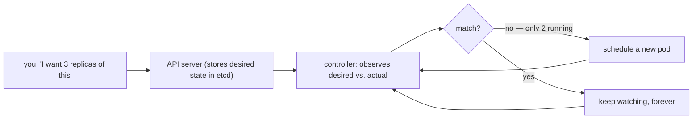
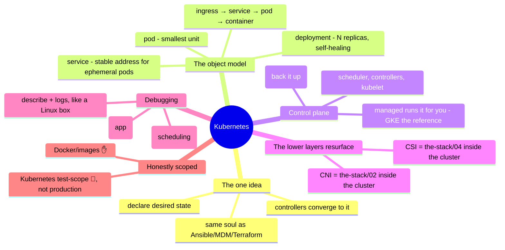

# Kubernetes & Containers

> [`the-stack/05`](../the-stack/05-platform-services.md) placed Kubernetes on the
> build-vs-rent spectrum; this note goes a layer deeper into the thing itself —
> because "managed Kubernetes" still requires you to understand Kubernetes the
> moment it misbehaves. The abstraction leaks, and this is what's underneath.

Kubernetes is the most portable platform in the whole repo — an EKS cluster, an AKS
cluster, and a self-run cluster are the same API with different control-plane
owners — which is exactly why it's worth learning once, properly. This note covers
the object model and the operator's-eye view: not "how to write a microservice,"
but "how to run the thing, and debug it when a pod won't start."

## The one idea: declare desired state, let controllers converge

Everything in Kubernetes is one pattern, and it's a pattern this repo has already
taught three times — [Ansible playbooks](iac-and-config.md), [MDM profiles](../endpoint/),
[Terraform state](iac-and-config.md). You **declare desired state**; a control loop
continuously **compares it to reality and acts to close the gap**:

If you internalized idempotence and desired-state from
[`foundations/`](../foundations/) and [`iac-and-config.md`](iac-and-config.md), you
already understand the *soul* of Kubernetes. The rest is learning its nouns and where
its control loops leak.

## The object model — the nouns, and how a request reaches a container

- **Pod** — the smallest unit: one or more containers that share a network and
  lifecycle. Usually you don't create these directly.
- **Deployment** — declares "N replicas of this pod, this version"; handles rollout
  and self-healing. The thing you actually write.
- **Service** — a stable virtual address in front of a set of pods (which come and
  go). The answer to "pods are ephemeral, so how does anything reach them reliably?"
- **Ingress** — routes external HTTP into services (the north-south door).
- **ConfigMap / Secret** — configuration and credentials injected into pods (the
  no-secret-baked-into-the-image rule from [identity](identity-iam.md), Kubernetes
  edition).
- **Namespace** — a scope for isolation and access control within a cluster.

The path a request takes ties them together: **Ingress → Service → Pod → container**,
with the Deployment keeping the right pods alive underneath. Learn that chain and
"where did my request die?" has a place to start.

## The control plane — what managed offerings run for you

Under the object model sits the machinery:

- **API server** — the front door; everything (you, controllers, kubelets) talks to
  it. State lives in **etcd**, the cluster's database — lose etcd, lose the cluster,
  which is why its backup is not optional ([`the-stack/04`](../the-stack/04-storage.md)'s
  fear, cluster edition).
- **Scheduler** — decides which node a new pod lands on.
- **controller-manager** — runs the control loops that make desired-state real.
- **kubelet** — the agent on each worker node that actually starts containers.

**Managed Kubernetes (EKS/AKS/GKE/OKE) runs the control plane and etcd for you**;
you run the workloads and (depending on the offering) the worker nodes. That's the
real value of managed: the etcd-and-upgrades toil is genuinely dangerous toil, and
handing it over is usually the right call — the [build-vs-rent](../the-stack/05-platform-services.md)
calculus, applied. **GKE is widely treated as the reference** (Kubernetes is
Google's heritage). Self-running the control plane is a platform-team commitment —
the same control-plane-as-product warning as OpenStack in
[`the-stack/01`](../the-stack/01-physical.md) and Ceph in
[`the-stack/04`](../the-stack/04-storage.md).

## Networking & storage — where the lower layers resurface

Kubernetes doesn't escape the stack below it; it re-imports it through plugins:

- **CNI (networking)** — the pluggable layer that gives pods IPs and connectivity;
  it's [`the-stack/02`](../the-stack/02-network.md)'s overlay/underlay problem
  *inside* the cluster, and a frequent leak point (pod-to-pod reachability, network
  policy, MTU — the same debug ladder applies).
- **CSI (storage)** — how pods get persistent volumes from the block/file storage of
  [`the-stack/04`](../the-stack/04-storage.md); "my stateful pod won't schedule" is
  usually a volume that can't attach (and AZ-locking, again).

The lesson: Kubernetes is a scheduler *on top of* the layers this repo already
covered, not a replacement for understanding them. When it breaks, you fall back
onto network and storage fundamentals.

## The debugging reflex — read the cluster like a Linux box

The [`foundations/`](../foundations/) debugging ladder, ported to Kubernetes:

- **`kubectl get` / `describe`** — what exists, and *why is it in this state?*
  `describe` on a stuck pod shows the events that explain it.
- **`kubectl logs`** — what the container itself said (the app log).
- **The two failure modes to read on sight:**
  - **`Pending`** — the scheduler *can't place it*: no node has the resources, or a
    volume/affinity constraint can't be met. A scheduling problem.
  - **`CrashLoopBackOff`** — it places and *starts, then dies, repeatedly*: the app
    is failing on boot (bad config, missing dependency, failed health check). An
    application problem.

Telling those two apart on sight is the Kubernetes equivalent of "is the process
even running?" — it routes you to the right half of the problem immediately.

## The AI-assisted ramp (Kubernetes flavor)

- **Translate the desired-state instinct:** *"I know Ansible desired-state and MDM
  profiles — map that onto Deployments, Services, and controllers, and show me where
  Kubernetes' model actually differs."*
- **Generate YAML, validate against the cluster:** AI writes manifests fluently and
  hallucinates fields and **apiVersions** just as fluently (the API moves fast and
  deprecates). Every manifest gets `kubectl apply --dry-run=server` or a schema
  validation before it's trusted — the cluster is the source of truth, not the chat.
- **Where AI burns you (verify hardest):** it **invents fields, apiVersions, and
  kubectl flags** that don't exist or are deprecated; it **defaults to insecure
  manifests** (no resource limits, privileged containers, secrets in plain
  ConfigMaps); and it **over-reaches for Kubernetes** when a workload didn't need an
  orchestrator at all (the [build-vs-rent](../the-stack/05-platform-services.md)
  judgment AI can't make for you). Validate the manifest; question whether you
  needed it.

## Honest boundaries

🧗 **honest ramp — clearly labeled, and this is where the label matters most.**
Docker and image building are ✋ ([`the-stack/03`](../the-stack/03-compute-and-images.md)),
but Kubernetes here is **test-environment scope, not production platform
ownership** — the object model, control-plane machinery, and operator mechanics are
understood and mapped via the method above, not claimed as years running production
clusters or carrying an on-call pager for a fleet. Where this repo (or a résumé)
needs a production-K8s claim, it does not make one — the honest position is a strong
conceptual and test-level grasp plus a fast, verified ramp onto operating a real
cluster, which is exactly what [`WHY.md`](../WHY.md) says is the durable skill. This
note is that ramp, written down.

## Lab (🚧 planned — spec)

**Run it, break it, read it.** Pure-local with `kind` or `minikube` (a full cluster
on a laptop, zero cloud):

1. **Deploy** a small app: a Deployment (3 replicas) + a Service, and reach it —
   watch the controller keep 3 pods alive when you delete one (desired-state
   convergence, made tangible).
2. **Break it two ways:** give it a bad image tag (→ read `Pending`/`ImagePullBackOff`)
   and a failing health check (→ read `CrashLoopBackOff`) — and diagnose each from
   `kubectl describe`/`logs` alone, routing to scheduling vs. application.
3. **The drill:** add a ConfigMap and a resource limit, redeploy, and — the
   [build-vs-rent](../the-stack/05-platform-services.md) reflex — write one sentence
   on whether this workload actually needed Kubernetes or a serverless container
   would have done.

## The chapter on one screen

