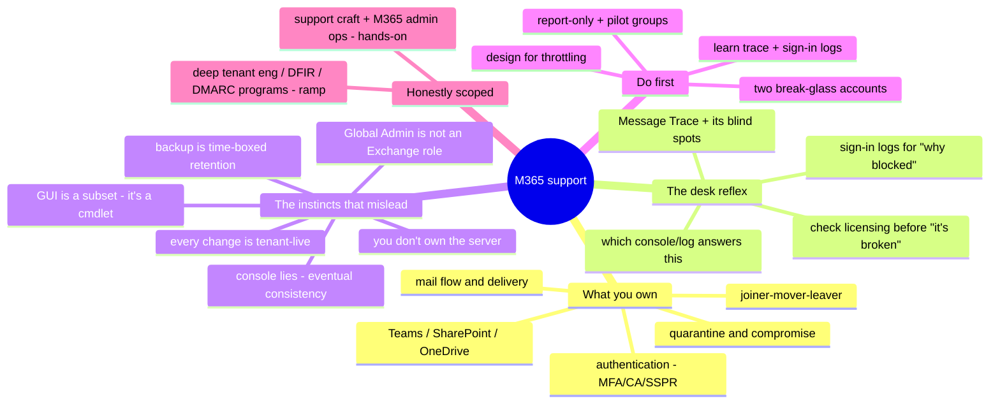

# Microsoft 365 Support — the operator's transition guide

> 🌐 **Languages:** English (default) · [中文](../docs/zh/cross-cutting/m365-support.md)

---

> [`saas-admin.md`](saas-admin.md) covers M365 as a **managed estate** — the
> lifecycle and admin-center engineering. This note covers the other half: **M365
> support**, the break-fix craft of keeping mail, identity, and collaboration
> working for real people — and, specifically, **what a strong sysadmin from another
> lane gets wrong when they inherit it.** The support skill is ✋ hands-on; the deep
> tenant-engineering tail is a 🧗 ramp, marked as such.

A competent Linux / networking / on-prem-AD / cloud admin can pick up M365 support
faster than a fresh helpdesk hire — *if* they notice which of their instincts no
longer apply. Most of the pain in that transition isn't ignorance; it's **confident
muscle memory pointed at a system that breaks its own rules**. This note names the
responsibilities, the tickets that actually recur, and the exact places an
experienced admin's reflexes mislead them — so the transfer is a checklist, not a
series of self-inflicted outages.

## What M365 support actually owns

The role is the operate-and-troubleshoot lane pointed at the productivity suite. The
scope, in the order tickets arrive:

| Domain | What you're on the hook for |
| --- | --- |
| **Mail flow & delivery** | "Did it send? Where did it go?" — message trace, transport rules, connectors, NDR interpretation, SPF/DKIM/DMARC, compromised-sender throttling. |
| **Mailbox & licensing** | Provisioning, shared mailboxes (delegation/automapping), user→shared conversion, license assignment (direct and group-based) and its errors. |
| **Authentication** | MFA registration/reset, Conditional Access design and *un*-blocking legitimate users, SSPR, password resets, guest/B2B. |
| **Teams** | Sign-in/cache failures, meeting/audio, membership, guest access. |
| **SharePoint / OneDrive** | Sync failures, external-sharing policy, permission inheritance, storage/quota. |
| **Outlook client** | Profile/OST corruption, "Trying to connect," add-ins, autodiscover. |
| **Service health & comms** | Telling a Microsoft-side incident from a local one, and saying so clearly to the business. |
| **Joiner / mover / leaver** | Block sign-in, revoke sessions, preserve the mailbox and its data, reclaim the license. |
| **Security & quarantine** | Releasing false positives, responding to compromised accounts, allow/block lists. |
| **Reporting & compliance** | Sign-in/audit logs, mail-flow reports, license usage. |

Two of these — **mail flow** and **authentication** — generate the majority of the
volume, and both are where an outsider's instincts fail hardest (see below).

## The common tickets — and where you look

Break-fix in M365 is pattern recognition over a small set of surfaces. The reflex
you're building is *"which console/log answers this, and what are its limits?"*

**Exchange Online / Outlook — the biggest bucket.**
- *"My mail didn't arrive."* → **Message Trace** (Exchange admin center → Mail flow),
  the single most-used tool on the desk. Learn its limits cold: a message takes
  **~5–10 minutes to even appear**; results are interactive only for messages
  **< 10 days old** (older ones return as an async CSV); trace retention is
  **90 days and not configurable**; and mail dropped by **IP-reputation / connection
  filtering is not traceable at all** — the cloud version of "the packet was dropped
  before it hit anything you can see."
- *NDR / bounce codes* are a cheat-sheet worth memorizing, because the code localizes
  the fault: **5.1.1** bad recipient (often a stale Outlook auto-complete cache after
  a mailbox move); **5.7.1 / 5.7.133 / 5.7.124** distribution-group send restrictions;
  **5.7.23** SPF failure; **5.7.509** the sender fails DMARC and the policy is
  `reject`; **5.7.57** an app/printer relaying anonymously through
  `smtp.office365.com`; **5.1.8 / 5.1.90 / submission-quota-exceeded** almost always
  mean the account is **compromised** — pivot to incident response, not mail-flow
  tuning.
- *Outlook "Trying to connect" / OST issues* → confirm in **Outlook on the web** first
  (isolates client vs. service), then **new profile**, rebuild **OST**, disable
  add-ins, clear cached creds. The **Support and Recovery Assistant (SaRA)** automates
  most of this.
- *Shared mailbox not appearing* → automapping runs off **autodiscover** and can take
  ~30 min; note the trap: `Add-MailboxPermission` **doesn't enable automapping by
  default** (the admin center does), and **access granted via a group never
  automaps**.

**Teams.** Sign-in loops are almost always **stale cached credentials** → clear the
Teams cache and the Windows Credential Manager entry, test the **web app** to isolate
desktop-vs-account. Guest-can't-be-added is usually **external-collaboration settings**
(blocked domain, or the inviter is a Member not an Owner), and new guest settings can
take **up to 24 hours** to activate.

**SharePoint / OneDrive.** Sync stuck on "Processing changes" is usually an **open
Office file, unsupported characters in a path** (`" * : < > ? / \ |`), or a very large
file in the synced tree. "*Your organization's policies don't allow you to share*" is
the **two-tier sharing model**: the SharePoint-admin org ceiling and the per-site
setting, where a **site can only be equal-or-more-restrictive** than the org. "Access
Denied" → **Site permissions → Check Permissions**; and know the hard walls —
inheritance can't be changed past **100,000 items**, supported cap **50,000 unique
permissions** per library.

**Identity / Entra.** *"I'm blocked and I don't know why"* → **Entra sign-in logs**,
open the failed sign-in, read the **Conditional Access** tab (which policy) and the
**Troubleshooting** tab (why). `AADSTS53000–53004` localize CA blocks
(device-not-compliant, blocked-by-CA, etc.). Legacy-auth failures show up as
**Client app = "Other clients."** MFA loops are fixed by forcing re-registration; SSPR
with a **non-MFA recovery method** lets users self-unstick.

**Licensing.** Before you troubleshoot *any* "missing feature," confirm it's
**licensed** — a huge share of "it's broken" is "it was never entitled." **Group-based
licensing** fails quietly: usage-location is required, **no nested groups**, and when
moving a user between licensed groups you **add to the destination first** to avoid a
temporary unlicensed gap that strips their mailbox.

## The experience gap — what a strong sysadmin's instincts get wrong

This is the part the job title hides. The gap between an admin who's *done* M365
support and one who hasn't is **not** about menus — a sharp admin learns menus in a
week. It's a set of load-bearing assumptions from the on-prem/cloud-IaaS world that
are **false here**, and each one has a failure mode attached.

- **You don't own the server.** There's no shell on Exchange Online, no `tcpdump`, no
  "check the logs on the box." Your entire diagnostic surface is **Message Trace +
  Service Health + sign-in logs**, and the honest terminal step is sometimes *"open a
  Microsoft ticket."* The reflex to *reproduce-and-instrument* only half-works; you
  mostly observe **after the fact, at Microsoft's granularity**.
- **The console lies for a few minutes.** M365 is **eventually consistent** — a
  successful write isn't guaranteed to read back immediately. License changes take
  minutes to (occasionally) **24 hours**; Microsoft says **wait ≥30 minutes before
  testing a new transport rule**. The on-prem reflex — *change, refresh, didn't work,
  change again* — here manufactures conflicting state. **Make the change once, then
  wait.**
- **The GUI is a subset.** A large fraction of real support is **PowerShell-only**
  (Exchange Online module) or **Microsoft Graph** — bulk ops, fine-grained mailbox and
  audit settings, detailed reporting. If you can't find a setting in the portal, the
  right assumption is usually *"it's a cmdlet,"* not *"it doesn't exist."* Connecting
  `Connect-ExchangeOnline` is a **week-one** skill, not an advanced one.
- **"Global Admin" is not "an Exchange role."** There are **separate, non-overlapping
  permission planes**: Entra directory roles, **Exchange Online RBAC**, SharePoint,
  Purview/compliance, Defender, Teams. Microsoft is explicit that Exchange role groups
  **don't share membership** with Defender or Purview. The Domain-Admin-is-god-of-
  everything model maps badly; least-privilege here is real, granular, and its own
  source of "why can't I do this" tickets. **There is no `root`.**
- **Licensing gates functionality.** Covered above, but it's worth stating as a mental
  correction: a missing feature is a **billing** question before it's a **support**
  one.
- **Every change is tenant-live the instant you save it.** One transport rule, one
  sharing policy, one Conditional Access policy hits **everyone at once**. The
  "just try it on the box and roll back" reflex is the single most dangerous import
  from on-prem. The replacements are **pilot groups**, transport-rule **test mode**,
  and Conditional Access **report-only** mode — use them every time.
- **You can lock yourself out — so build the fire exit first.** CA policies scoped to
  "All users" routinely catch the admin. **Break-glass / emergency-access accounts are
  mandatory, not hygiene:** create **two**, **cloud-only** (never synced), Global
  Admin, **excluded from every CA policy**, password stored **offline**, **FIDO2** MFA,
  sign-in **alerting** on, tested quarterly. Ship every new CA policy in
  **report-only** for ~a week before enabling it.
- **`foreach` over 10,000 mailboxes isn't free.** Graph and Exchange Online
  **throttle** — HTTP **429** with a **`Retry-After`** header, plus a per-tenant EXO
  PowerShell throttling policy. Design for it (batch reads, honor 429, request
  temporary relaxation for big migrations) instead of fighting it.
- **"Restore from last night's backup" is a false comfort.** Microsoft doesn't back
  you up the way you assume. Recovery is a set of **time-boxed windows that Microsoft
  can shrink**: soft-deleted mailbox **30 days**, deleted items **14 (max 30)**,
  and the inactive-mailbox window was cut **183 → 30 days** in 2022. Only **retention
  policies / litigation hold configured in advance** preserve data long-term — set
  them (or a real third-party backup) **before** the incident, not during it.
- **Hybrid identity has sharp edges.** With Entra Connect, the **`sourceAnchor` /
  immutableID is immutable** and set at install; **source of authority** means a
  hard-match lets on-prem overwrite the cloud object; duplicate `proxyAddresses`/UPN
  throw sync errors. And structurally, **Entra ID is a flat directory** — no OUs, no
  GPO, no forests; device policy that GPO did is now **Intune**. Your ADUC/GPMC muscle
  memory does **not** transfer; recognize Entra as a *different* system, not "AD in the
  cloud." *(Whether a hybrid Exchange deployment still needs a last on-prem Exchange
  server has been evolving — verify the current state for the specific tenant rather
  than assuming.)*
- **Email authentication is now your job.** M365 validates **inbound** DMARC, but
  **outbound SPF/DKIM/DMARC for your domains is yours to configure** — DKIM signing
  for custom domains isn't on by default. And **basic auth is ending**: SMTP AUTH basic
  authentication is set to be **off by default at the end of 2026** — inventory the
  scanners and line-of-business senders that will break.
- **Microsoft owns the change calendar.** Behavior changes roll out **by default** via
  the **Message center**, often with *"no admin action required."* On-prem you set the
  patch calendar; here you **monitor one you don't own** — *"it worked yesterday and I
  changed nothing"* is a legitimate root cause. Put the Message center on a pilot ring
  (**Targeted release**) and read it weekly.

## What transfers, what doesn't

| Transfers cleanly | Transfers with a caveat | Don't bring it |
| --- | --- | --- |
| DNS & email plumbing (SPF/DKIM/DMARC, MX, TTL) — *more* central here | "I have admin, so I can see everything" — partly false (opacity, throttling, "open a ticket") | Packet/OS-level debugging — no `tcpdump`, no shell on the box |
| TLS / cert reasoning (connector TLS, "force TLS failed" NDRs) | Read-after-write consistency — recalibrate for eventual consistency | "Restore last night's backup" — it's time-boxed retention you pre-configure |
| Identity & least-privilege *thinking* (the principle) | AD administration — Kerberos/OU/GPO don't map to Entra's OAuth/RBAC/Intune | "Test it on the box, roll back" — every change is tenant-live |
| Structured troubleshooting (reproduce → isolate → verify) | | Owning the patch/change calendar — you monitor Microsoft's |
| Scripting & automation (PowerShell/Graph *reward* you) | | "`root` fixes everything" — no root; even Global Admin self-locks-out |
| Log literacy (sign-in / audit / trace are structured logs) | | |
| Change discipline (pilot/stage/rollback) — matters *more* here | | |

## First week / first 90 days

**Week one — before you touch anything tenant-wide.**
1. **Create two break-glass Global Admin accounts** (cloud-only, excluded from all CA,
   FIDO2, password offline, alerting on) — *before* you author your first CA policy.
2. **Connect Exchange Online PowerShell and Microsoft Graph PowerShell.** Accept that
   ~half the job lives here.
3. **Learn Message Trace + Entra sign-in logs + Service Health first** — your primary
   diagnostic surface — including Message Trace's limits (5–10 min to appear,
   90-day non-configurable retention, IP-blocked mail untraceable).
4. **Set up Targeted release** on a pilot ring and start reading the **Message center**.

**First 30 days — habits that prevent self-inflicted outages.**
5. **Never edit a tenant-wide policy without a pilot group.** New CA policy →
   report-only ~a week. New mail-flow rule → test mode, wait ≥30 min before testing.
6. **Check licensing (and propagation) before troubleshooting a "missing feature."**
   Don't thrash — one change, then wait.
7. **Map the permission planes for your tenant** — who has Global Admin (keep it
   small), and which siloed roles exist.
8. **Memorize the recovery windows** — 30-day mailbox, 14/30-day items — and set a
   real retention policy for anything that must survive longer.

**First 90 days — get ahead of the roadmap.**
9. **Inventory legacy/basic-auth senders** ahead of the end-of-2026 cutoff.
10. **Verify SPF/DKIM/DMARC** on every sending domain.
11. **Audit hybrid identity** (Entra Connect source-of-authority, immutableID, sync
    errors) if it's in play.
12. **Design scripts for throttling** (batch, `Start-Sleep`, honor `Retry-After`).

## The AI-assisted ramp (M365-support flavor)

- **Translate your instinct into the M365 idiom:** *"I'd `tcpdump` and grep the mail
  log — what's the Exchange Online equivalent for a message that didn't deliver, and
  what can't I see?"* The honest answer (Message Trace + its blind spots) is exactly
  the kind of thing AI compresses well.
- **Draft the cmdlet, least-privilege it by hand.** AI is genuinely strong at
  **PowerShell / Graph** — and it **invents cmdlets and Graph endpoints that don't
  exist**, **conflates Entra roles with Exchange RBAC**, and cheerfully proposes a
  **transport rule or sharing change whose blast radius is the whole tenant**. Every
  generated script gets verified against the [official cmdlet reference](#field-kit--real-tools--references)
  and piloted before it touches production. This is the same verify-hard discipline as
  everywhere else in this repo — see [`ai-workflow/`](../ai-workflow/).

## Honest boundaries

✋ **The support craft is hands-on**, and it leans on real adjacent depth: **M365
admin operations** (Exchange mailboxes/shared mailboxes/transport rules, SharePoint
permissions, Teams — see [`saas-admin.md`](saas-admin.md)), **Entra ID initial setup**
(tenant-wide MFA, a Conditional Access policy, PIM — see
[`identity-iam.md`](identity-iam.md)), and the **endpoint** adjacency
([`endpoint/`](../endpoint/)) where Intune compliance gates access. DNS/TLS/identity
fundamentals transfer directly.

🧗 **The tail is a ramp, and it's labeled one** — deep **Exchange Online tenant
engineering at 150k-user scale**, dedicated **Defender for Office 365 / Proofpoint**
operations, **DMARC/DKIM enforcement** programs, and the **DFIR / compromise-
investigation** tooling below are specialist tracks, not a claim. The line is the
same one drawn in [`saas-admin.md`](saas-admin.md) and
[`working-with-security.md`](working-with-security.md): operate-and-troubleshoot is
the strength; run-the-whole-security-program is the ramp.

## Field kit — real tools & references

Pointers verified live on GitHub, grouped by use. The security/IR tools are powerful
and **advanced** — for incident work, not routine tickets.

**Reference & scripts (the daily desk):**
- [`MicrosoftDocs/office-docs-powershell`](https://github.com/MicrosoftDocs/office-docs-powershell)
  — the official cmdlet reference (Exchange Online, Teams, SharePoint). The thing you
  check a generated `Get-MessageTrace` against.
- [`12Knocksinna/Office365itpros`](https://github.com/12Knocksinna/Office365itpros)
  — Tony Redmond's large, actively-maintained library of real admin/report/remediate
  scripts.
- [`microsoftgraph/msgraph-sdk-powershell`](https://github.com/microsoftgraph/msgraph-sdk-powershell)
  · [`merill/awesome-entra`](https://github.com/merill/awesome-entra) — the modern
  Graph SDK, and the best jump-off for identity/auth troubleshooting.
- [`microsoft/CSS-Exchange`](https://github.com/microsoft/CSS-Exchange) — Microsoft's
  *own* CSS diagnostic tools/scripts for Exchange (HealthChecker, hybrid/EXO).

**Config-as-code & drift ("what changed?"):**
- [`Microsoft365DSC/Microsoft365DSC`](https://github.com/Microsoft365DSC/Microsoft365DSC)
  — extract/monitor/detect drift on a whole tenant's config; a root-cause tool for
  "someone changed something."
- [`maester365/maester`](https://github.com/maester365/maester) — Pester-based
  continuous validation of M365/Entra security config.
- [`pnp/powershell`](https://github.com/pnp/powershell) — the go-to module for
  SharePoint Online / OneDrive permission and sharing troubleshooting.
- [`KelvinTegelaar/CIPP`](https://github.com/KelvinTegelaar/CIPP) — the MSP multitenant
  management portal (run the same fix across many tenants).
- [`merill/idPowerToys`](https://github.com/merill/idPowerToys) — documents Conditional
  Access policy sets into something readable when diagnosing "why am I blocked?"

**Posture & assessment:**
- [`cisagov/ScubaGear`](https://github.com/cisagov/ScubaGear) — CISA's tenant
  assessment against the SCuBA baselines (Entra/Exchange/Teams/SharePoint/Defender).
- [`cammurray/orca`](https://github.com/cammurray/orca) — the Defender for Office 365
  Recommended Configuration Analyzer; pinpoints mail-protection config behind
  delivery/quarantine tickets.

**Incident response (advanced — account compromise / BEC):**
- [`T0pCyber/hawk`](https://github.com/T0pCyber/hawk) ·
  [`invictus-ir/Microsoft-Extractor-Suite`](https://github.com/invictus-ir/Microsoft-Extractor-Suite)
  — gather and analyze M365 logs (unified audit, sign-in, message trace) for the
  "user got phished, mailbox rules changed" investigation.

**Authoritative docs** worth bookmarking over any blog: **Microsoft Learn** for
[NDR codes](https://learn.microsoft.com/en-us/troubleshoot/exchange/email-delivery/ndr/non-delivery-reports-in-exchange-online),
[Message Trace limits](https://learn.microsoft.com/en-us/exchange/monitoring/trace-an-email-message/message-trace-faq),
[Conditional Access troubleshooting](https://learn.microsoft.com/en-us/entra/identity/conditional-access/troubleshoot-conditional-access),
and [group-license problems](https://learn.microsoft.com/en-us/entra/fundamentals/licensing-groups-resolve-problems).

## The chapter on one screen

