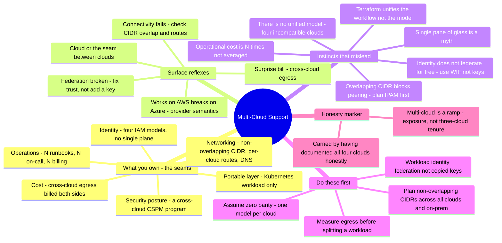

# Multi-Cloud Support — the single-cloud sysadmin's transition guide

> 🌐 **Languages:** English (default) · [中文](../docs/zh/cross-cutting/multi-cloud-support.md)

---

> The [platform notes](../platforms/) read the clouds one at a time; [`the-stack/`](../the-stack/)
> reads one layer across them. This is the capstone: **multi-cloud support as a break-fix craft** —
> the tickets that recur *between* clouds, exactly where you look, and **where a strong single-cloud
> sysadmin's instincts get burned when the clouds have to work together.** Honesty marker up front:
> this note is **🧗 ramp** — my multi-cloud hands-on is **exposure** (AWS/Azure/GCP/OCI mapped and
> lab-checked; real ✋ only on Azure/Entra identity), carried by a genuine asset — I've **written the
> honest per-cloud support note for all four clouds** ([AWS](../platforms/aws/support.md) ·
> [Azure](../platforms/azure/support.md) · [GCP](../platforms/gcp/support.md) ·
> [OCI](../platforms/oci/support.md)), and *that synthesis is the multi-cloud skill.* Its authority is
> research (vendor docs + practitioner failure modes + a runnable
> [lab](#lab--overlapping-cidrs-break-the-interconnect--runnable)), not production tenure across three
> providers.

**Multi-cloud is a posture, not a product.** There is no unifying control plane you install — each
cloud keeps its own IAM, network, quota, billing, and telemetry model, and the job is to own the
**seams between them.** A single-cloud admin ramps in with a false comfort: "I know cloud." But the
expensive mistakes don't live inside any one cloud (you've learned those); they live in the four
seams — **CIDR/routing, cross-cloud identity, egress/data-gravity, and consistent security posture** —
where single-cloud intuition assumes a parity that isn't there. This note names the seam
responsibilities, the recurring cross-cloud tickets, and the instincts that misfire — leaning on the
four platform notes throughout, because *multi-cloud is those four models running at once.*

## What supporting multi-cloud makes you responsible for

The break-fix surface is the set of seams, roughly by how often they page you:

| Seam | What you're on the hook for |
| --- | --- |
| **Identity across clouds** | **No single identity plane** — four structurally different IAM models ([AWS](../platforms/aws/support.md) explicit-deny-wins JSON, [Azure](../platforms/azure/support.md) Entra-vs-RBAC two planes, [GCP](../platforms/gcp/support.md) additive/inherited bindings, [OCI](../platforms/oci/support.md) verb+compartment). **Workload identity federation** (OIDC/STS token exchange for short-lived creds) *instead of* copied long-lived keys; credential/secret sprawl. |
| **Networking between clouds** | Interconnect (site-to-site VPN / Direct Connect / ExpressRoute / Cloud Interconnect); per-cloud transit hubs (Transit Gateway / Virtual WAN / Network Connectivity Center) that **don't federate across clouds**; the #1 blocker — **non-overlapping CIDR planning across all clouds + on-prem** (no central IPAM); cross-cloud **DNS** (conditional forwarding); asymmetric routing. |
| **Cost & egress** | **Cross-cloud data-transfer (egress) — billed on both sides**, the silent killer; **data gravity**; N different billing models + eroded committed-use discounts; FinOps visibility across clouds. |
| **Security posture** | Different secure-by-default per cloud → the same intent yields different exposure; a **cross-cloud CSPM program** (not a setting); blast radius spanning clouds; the weakest/least-known cloud is your exposure. |
| **Provisioning & the portable layer** | Terraform/OpenTofu multi-provider (**uniform HCL, non-uniform semantics** — resources aren't 1:1); Crossplane; **Kubernetes as the one portable *workload* layer** while identity/networking/storage stay cloud-specific. |
| **Observability** | Logs/metrics in each cloud's own stack (CloudWatch / Azure Monitor / Cloud Logging / OCI Logging) — no single pane by default; aggregation costs (and egress) twice. |
| **Operational multiplication** | N clouds ≈ **N IAM models, N networking models, N quota systems, N naming conventions, N on-call runbooks** — toil is multiplied, not averaged. |

## The common tickets — and where you look

Multi-cloud break-fix is knowing **which of the N clouds is lying, and whether the problem is in a
cloud or in the seam between them.**

**"Works on AWS, breaks on Azure/GCP."** The same Terraform, a different provider's semantics — or a
resource with no 1:1 equivalent (an AWS load balancer is one resource; a GCP HTTP LB is
`backend_service` + `forwarding_rule` + `url_map` + a proxy). *Where you look:* the per-provider plan
and state, and the provider docs for that specific resource. HCL is uniform; the model underneath
isn't.

**Cross-cloud connectivity fails — the networking ticket.** In order of likelihood: **overlapping
CIDRs** (peering/VPN is *refused* — a hard vendor-doc fact), a **missing route** on one side (no
central router — each cloud routes itself), **asymmetric routing** (a reply with no return route), or
**DNS not resolving across clouds** (private zones don't cross by default; you wire conditional
forwarding between resolvers). *Where you look:* route tables **per cloud**, the VPN/peering status,
the CIDR/IPAM plan, and the DNS forwarding config. The [lab](#lab--overlapping-cidrs-break-the-interconnect--runnable)
drills the overlap and routing failures.

**The surprise egress bill.** A chatty service split across clouds, or telemetry shipped across a
boundary — cross-cloud data transfer is billed as internet egress on *both* sides. *Where you look:*
the per-cloud cost/billing tools, the data-transfer line items, and network flow logs. *(Note: the
2024 "exit-fee waivers" from AWS/GCP/Azure cover a **one-time full exit**, not routine day-to-day
transfer — routine egress is still billed.)*

**Federation broken.** A workload can't assume a role in the other cloud: OIDC/SAML trust or issuer
misconfig, wrong token/subject mapping, or token expiry. *Where you look:* the trust config on both
sides (IdP + target cloud), the token claims vs the trust conditions, and JWKS reachability. The fix
is almost never "add a key" — it's fixing the federation.

**Inconsistent security posture.** A resource is public on one cloud because its default differs, or
config drifted across clouds. *Where you look:* a multi-cloud CSPM tool's findings **across all
clouds** at once, and IaC-vs-live drift per cloud.

**Secret / credential sprawl.** Long-lived keys copied between clouds (an AWS key on a GCP box). *The
fix-finder:* audit for stored cross-cloud static keys → target **zero**, replace with workload
identity federation.

## The experience gap — what a strong sysadmin's instincts get wrong

The gap between a single-cloud admin who's run multi-cloud and one who hasn't is a set of **parity
assumptions** that are wrong. Everything single-cloud transfers as *method*; it fails wherever you
assume the clouds are the same.

- **There is no unified model — four clouds, four incompatible authorization models.** "Learn cloud
  once" badly undersells the per-cloud delta: **AWS** explicit-deny-wins JSON union; **Azure** two
  identity planes (a Global Admin is *not* an Owner); **GCP** additive/inherited bindings (a separate
  Deny-policy mechanism exists, but standard bindings can't revoke an inherited grant); **OCI** verb +
  compartment, allow-only. Apply the AWS "explicit deny wins" intuition to GCP, or assume Azure's
  Global Admin reaches your VMs, and you make real access mistakes. (This is exactly why the four
  platform support notes exist — and reading them *is* the ramp.)
- **"Terraform makes it uniform" is false.** It gives you one *workflow* (plan/apply/state/HCL), not
  one *model*. Resources aren't 1:1, `forces replacement` differs per provider, and a module for AWS
  **does not port** to Azure/GCP — you rewrite per provider, reusing the practice, not the code.
- **"Single pane of glass" is mostly a myth; Kubernetes is portable only at the workload layer.**
  Standard manifests run anywhere, but **IAM, storage classes, load balancers, ingress, and workload
  identity are not portable** across EKS/AKS/GKE. The portable seam is the app; the substrate stays
  cloud-specific.
- **Identity does not federate for free.** No cross-cloud SSO/trust by default. The tempting shortcut
  — copy a long-lived key to the other cloud — is a skeleton key (valid until revoked, often
  over-privileged). Build **workload identity federation**: exchange native identity for a short-lived
  token, store nothing.
- **Egress is the silent killer; data gravity pins workloads.** A chatty architecture that's ~free to
  split across AZs in one cloud generates a surprise network bill across clouds (billed both sides).
  Compute pulls toward its data — measure the byte flows *before* you split a workload.
- **Overlapping CIDR is the #1 connectivity blocker — no central IPAM, no central router.** Every
  console defaults toward `10.0.0.0/16`; two clouds (or a cloud and on-prem) that both took the default
  **cannot be peered/VPN'd**. You inherit the on-prem discipline of enterprise IPAM — plan
  non-overlapping ranges across *all* clouds + on-prem, up front, and add per-cloud routes both ways.
- **Operational cost is N×, not amortized.** N IAM models to reason about, N networking models, N
  runbooks, N quota/billing systems. Multi-cloud multiplies toil; resilience, if you get it, is bought
  with N× effort — and you lose single-provider committed-use discounts. It does not *average* risk.
- **Lowest-common-denominator vs cloud-native is a real tension.** True portability means giving up
  managed services (or re-implementing per cloud). "Avoid lock-in" has an ongoing price; build
  abstraction only at the actual boundaries where systems talk.
- **Blast radius and posture span clouds — consistency is a program.** Your exposure is a misconfig on
  the weakest, least-known cloud, and the gaps *between* providers (inconsistent IAM, fragmented audit
  logs, drift).
- **Most teams are multi-cloud by accident.** M&A, data-residency regulation, best-of-breed, or shadow
  IT — you inherit divergent conventions and impose consistency retroactively, not a clean greenfield.

## What transfers, what doesn't

| Transfers strongly | Transfers with caveats | Don't bring it |
| --- | --- | --- |
| **The per-cloud operating model** (the [seven surfaces](../00-the-operating-model.md)) — run once per cloud, expecting different answers | Least-privilege *thinking* — the intent transfers; the encoding (4 IAM models) does not | "One IAM" — four incompatible authorization models |
| **Networking fundamentals** — CIDR, routing, DNS, BGP, non-overlap discipline; on-prem IPAM is a real asset | Cloud/API familiarity — but each provider's primitives differ | "One network / a central router" — per-cloud routes, no central IPAM |
| **IaC discipline** — plan-before-apply, state, review (the *workflow* ports via Terraform) | Managed-service reflexes — portability costs them (LCD tension) | "Terraform unifies the model" — it unifies the *workflow*, not semantics/modules |
| **Cost awareness** — sizing, quotas, committed-use reasoning | Observability habits — but metrics/logs live in N separate stacks | "Single pane of glass" — doesn't exist; K8s covers the workload only |
| **Troubleshooting methodology** — bisect, read logs, check quotas | Identity federation *concept* — but you build it (WIF), it isn't free | "Egress within a cloud is ~free, so it's fine across clouds" — billed both sides |
| **Having documented each cloud honestly** — the synthesis *is* the multi-cloud skill | | "Copy the AWS policy/module to Azure" · "the admin role is the admin role" |

## First week / first 90 days

**First week.**
1. **Plan non-overlapping CIDRs across ALL clouds + on-prem — before any peering/VPN.** It's the one
   decision painful to reverse (re-IP-ing live subnets). Adopt a single master address plan and a
   centralized IPAM; verify no overlap in the *entire* topology.
2. **Use workload identity federation, never copied long-lived keys.** Stand up OIDC/STS trust; audit
   the estate for stored cross-cloud static keys → target zero.
3. **Keep one authoritative per-cloud model in your head — assume zero parity.** A short "how auth /
   routing / secure-by-default works *here*" page per cloud. The four
   [platform](../platforms/aws/support.md) [support](../platforms/azure/support.md)
   [notes](../platforms/gcp/support.md) [are](../platforms/oci/support.md) that, written down.
4. **Reframe every cross-cloud ticket as "cloud, or the seam between clouds?"** — most expensive ones
   are the seam.

**First 30 days.**
5. **Measure cross-cloud egress before splitting any workload** — model the byte flows, keep chatty
   components and their data co-located (data gravity), check against live pricing.
6. **Use Kubernetes + Terraform as a common *workflow*, respecting per-cloud *semantics*** — standardize
   the app layer and the IaC loop; expect provider-specific modules and explicit per-cloud
   storage/networking/identity.
7. **Wire cross-cloud DNS deliberately** — conditional forwarding between resolvers; private zones don't
   cross for free.
8. **Add per-cloud routes both ways** — asymmetric routing half-opens connections even after the tunnel
   is up.

**First 90 days.**
9. **Make security posture a cross-cloud CSPM program** — one tool/policy set spanning all clouds with
   consistent severity, because the exposure is the weakest cloud and the gaps between them.
10. **Centralize secrets** (Vault / external-secrets) with dynamic, short-lived credentials — kill the
    sprawl at the source.
11. **Budget N× operational effort explicitly** — N runbooks, N on-call, N billing; plan the headcount
    and accept the lost volume discounts. Don't sell multi-cloud internally as toil-averaging.
12. **Decide the portability line on purpose** — which parts are LCD-portable and which are
    cloud-native; don't accidentally lowest-common-denominator everything.

## The AI-assisted ramp (multi-cloud flavor)

- **Translate between clouds — and demand the non-parity:** *"I know AWS IAM and VPCs — map the Azure
  two-plane RBAC, GCP additive bindings, and OCI verb/compartment model onto them, and flag every place
  they are NOT equivalent."* AI is genuinely useful for the per-cloud translation (it's the same
  translate-then-verify the platform notes use) — but the **four-way IAM divergence, overlapping-CIDR
  blocking, and egress economics have no single-cloud analog**, so verify those to death.
- **Let it draft per-cloud IaC; you own the seams.** AI will happily **copy an AWS module to Azure**
  (won't port), **suggest copying a key across clouds** (use WIF), **default two networks to 10.0.0.0/16**
  (overlap), and **assume a single-pane control plane** that doesn't exist. Never apply cross-cloud
  changes you haven't reasoned about per provider, and validate CIDR non-overlap + federation before
  anything talks across a boundary. Same verify-to-death discipline — see [`ai-workflow/`](../ai-workflow/),
  [`terraform-support.md`](terraform-support.md), and [`kubernetes-support.md`](kubernetes-support.md).

## Honest boundaries

This note is **🧗 ramp, and it says so clearly.** My multi-cloud hands-on is **exposure** — each
cloud's operating model mapped and lab-checked, with real ✋ depth only on **Azure/Entra identity** (and
✋ on-prem networking/IPAM, which transfers hard here). What carries it is the genuine asset: I've
**written the honest, research-grounded support note for all four clouds**
([AWS](../platforms/aws/support.md) · [Azure](../platforms/azure/support.md) ·
[GCP](../platforms/gcp/support.md) · [OCI](../platforms/oci/support.md)) plus
[`identity-iam.md`](identity-iam.md) and [`cost.md`](cost.md) — and **multi-cloud support *is* that
synthesis** applied to the seams, backed by ✋ networking fundamentals and a runnable
[lab](#lab--overlapping-cidrs-break-the-interconnect--runnable). The seam mechanics above — federation,
CIDR/IPAM, egress economics, cross-cloud posture — are **mapped and doc-verified, not tenure.** Deeper
production multi-cloud (running real workloads across three providers, a live cross-cloud network
fabric, a multi-cloud FinOps + CSPM program at scale) is still ahead; the annotation says so plainly and
never bluffs. This is the honest capstone of a sysadmin who documented each cloud first, then the seams
between them — in public, ✋/🧗 marked.

## Field kit — real tools & references

Pointers below were each verified to exist on GitHub, grouped by use. Archived / renamed / moved status
is flagged.

**Provisioning & the portable layer:**
- [`hashicorp/terraform`](https://github.com/hashicorp/terraform) · [`opentofu/opentofu`](https://github.com/opentofu/opentofu) — one *workflow* across every cloud (semantics still per-provider); OpenTofu is the MPL fork.
- [`crossplane/crossplane`](https://github.com/crossplane/crossplane) — a Kubernetes control plane that provisions cloud infra via CRDs — the closest thing to one API across clouds.
- [`pulumi/pulumi`](https://github.com/pulumi/pulumi) · [`gruntwork-io/terragrunt`](https://github.com/gruntwork-io/terragrunt) — IaC in real languages; DRY orchestration for large multi-account/multi-cloud estates.
- [`kubernetes-sigs/cluster-api`](https://github.com/kubernetes-sigs/cluster-api) (+ CAPA/CAPZ/CAPG providers) · [`kubernetes-sigs/kubespray`](https://github.com/kubernetes-sigs/kubespray) — one declarative cluster lifecycle across clouds.

**Cross-cloud security posture (CSPM/CNAPP — note the coverage):**
- [`prowler-cloud/prowler`](https://github.com/prowler-cloud/prowler) — the strongest genuinely multi-cloud CSPM (**AWS/Azure/GCP/K8s/M365**).
- [`nccgroup/ScoutSuite`](https://github.com/nccgroup/ScoutSuite) — read-only posture audit, broadest native coverage (**AWS/Azure/GCP/OCI/Alibaba**).
- [`bridgecrewio/checkov`](https://github.com/bridgecrewio/checkov) (**AWS/Azure/GCP/OCI/K8s** IaC) · [`aquasecurity/trivy`](https://github.com/aquasecurity/trivy) (IaC misconfig multi-cloud; live scan mostly AWS) · [`cloud-custodian/cloud-custodian`](https://github.com/cloud-custodian/cloud-custodian) (**AWS/Azure/GCP** — rules *and* remediation) · [`deepfence/ThreatMapper`](https://github.com/deepfence/ThreatMapper) (runtime CNAPP).

**Asset inventory / graph / query (the "what do we even have across clouds"):**
- [`turbot/steampipe`](https://github.com/turbot/steampipe) — SQL over cloud APIs live (AWS/Azure/GCP/OCI plugins) · [`cloudquery/cloudquery`](https://github.com/cloudquery/cloudquery) — same idea, synced into your own DB.
- [`cartography-cncf/cartography`](https://github.com/cartography-cncf/cartography) — assets **+ relationships** into a Neo4j graph (attack-path queries across clouds) *(CNCF; moved from lyft/cartography)* · [`someengineering/fixinventory`](https://github.com/someengineering/fixinventory).

**FinOps / cost across clouds:**
- [`infracost/infracost`](https://github.com/infracost/infracost) — cost diff on every IaC PR · [`opencost/opencost`](https://github.com/opencost/opencost) — K8s cost attribution (CNCF) · [`mlabouardy/komiser`](https://github.com/mlabouardy/komiser) — multi-cloud inventory + spend dashboard.

**Secrets across clouds:**
- [`hashicorp/vault`](https://github.com/hashicorp/vault) — cloud-agnostic secrets broker with dynamic, short-lived creds · [`external-secrets/external-secrets`](https://github.com/external-secrets/external-secrets) — one operator syncs AWS Secrets Manager / Azure Key Vault / GCP Secret Manager / Vault into K8s.

**⚠️ The honest gap — multi-cloud NETWORKING is proprietary.** There is *no* strong OSS story for the
cross-cloud network fabric (transit, unified routing/segmentation). That layer is dominated by
**commercial** platforms — **Aviatrix, Alkira, Prosimo**. The only OSS with traction is
[`squat/kilo`](https://github.com/squat/kilo) (a WireGuard *pod-network* overlay, not enterprise
cloud-transit). For provisioning, posture, inventory, FinOps, workloads, and secrets, OSS is excellent;
for the fabric that stitches clouds together, **expect to buy, not build.**

*(Currency: **workload identity federation** is replacing long-lived cross-cloud keys — treat static keys
as legacy. The 2024 **egress exit-fee waivers** (AWS/GCP/Azure) cover a one-time *full exit* under the EU
Data Act, **not** routine cross-cloud transfer. Egress $/GB and the exact GCP Deny-policy behavior shift
over time — verify on live docs. No curated `awesome-multicloud` list is maintained; this note is the
list.)*

## Lab — overlapping CIDRs break the interconnect ✅ runnable

**Prove multi-cloud's signature networking blocker by hand.** A pure-local, stdlib-only drill that
models cross-cloud routing: a **non-overlapping** interconnect flows both ways; an **overlapping CIDR**
makes the destination **ambiguous** so peering/VPN is refused; a **missing route** on one side drops
traffic (no central router — each cloud routes itself); **asymmetric routing** half-opens a connection;
and an **on-prem `10.0.0.0/8`** swallows the clouds (the hybrid overlap trap).

```bash
python3 cross-cutting/labs/multi-cloud-cidr-overlap/cidr_overlap_drill.py
```

Exit `0` means every lesson held (it doubles as a CI check); `--sabotage ignore-overlap` or
`--sabotage central-router` breaks the model and the assertions fail. See
[`labs/multi-cloud-cidr-overlap/`](labs/multi-cloud-cidr-overlap/).

## The chapter on one screen


