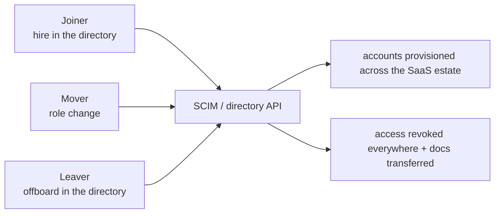
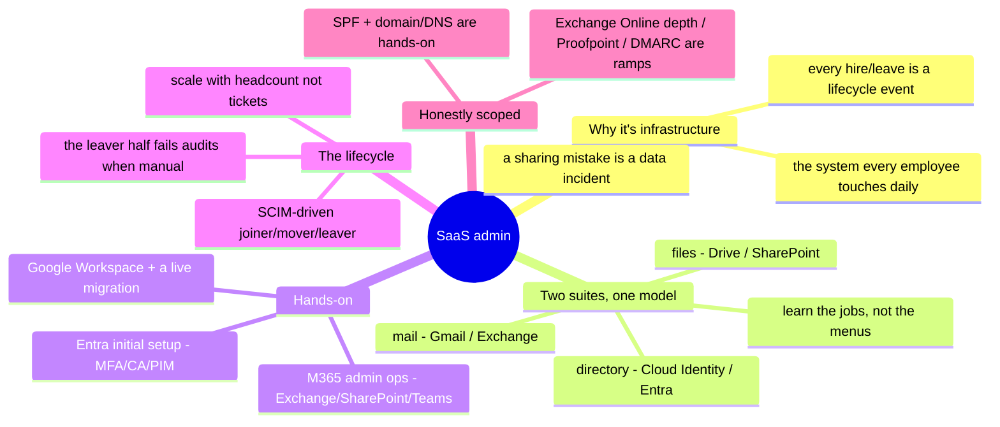

# SaaS & Collaboration Administration

> The clouds run your infrastructure; SaaS runs your company. Google Workspace,
> Microsoft 365, and the identity fabric under them are where most employees
> actually live — and administering them well is a distinct, high-demand craft the
> platform folders don't touch. This one is **✋ hands-on depth**.

Every layer below this one asked how machines run; this asks how *people* work —
mail, docs, collaboration, and the account lifecycle that grants and revokes it all.
It's the operate-and-automate lane pointed at the productivity suite, and it leans
directly on the identity discipline of [`identity-iam.md`](identity-iam.md): a
user's SaaS access *is* their joiner/mover/leaver lifecycle, made concrete.

## Why SaaS admin is real infrastructure work

It's easy to dismiss "email admin" as clicking around a console. At one user it is;
at ten thousand it's an infrastructure problem wearing a productivity-suite costume.
The whole company's ability to communicate depends on mail flow you configure;
every hire and departure is an identity-lifecycle event with security and
compliance stakes; a permission mistake on a shared drive is a data-exposure
incident. The suite is the single system *every* employee touches every day, which
makes its reliability and its access model higher-stakes, not lower, than a
back-office server nobody sees. Administering it at scale is the same
describe-desired-state, automate-the-lifecycle, guard-the-access discipline as the
rest of this repo — just with humans as the workload.

## The two suites, one model

Google Workspace and Microsoft 365 look different and do the same jobs. The
transferable model is the mapping, not either product's menus:

| Job | Google Workspace | Microsoft 365 |
| --- | --- | --- |
| **Directory / identity** | Cloud Identity / Google directory | **Entra ID (Azure AD)** |
| **Mail** | Gmail (Workspace) | **Exchange Online** |
| **Files & docs** | Drive / Docs | OneDrive / SharePoint |
| **Collaboration** | Chat / Meet | **Teams** |
| **Admin surface** | Admin Console | Microsoft 365 admin center + Exchange/Teams/SharePoint admin |
| **Org structure** | Organizational Units | administrative units / groups |
| **Provisioning** | directory API / SCIM | Entra provisioning / SCIM |

Learn the *jobs* — directory, mail, files, collaboration, provisioning — and each
suite is a dialect. That's the same move the [operating model](../00-the-operating-model.md)
makes for clouds, applied to the productivity layer.

## Google Workspace administration

Hands-on scope: the **Admin Console** and the operations that keep a global
workforce running.

- **Directory and org units** — structuring users into OUs so policy applies by
  organizational shape, not per-user.
- **Account lifecycle** — provisioning, suspension, deletion, and the piece people
  forget: **document ownership and permission transfers** when someone leaves (a
  departing employee's Drive is company data that must not leave with them).
- **Mail administration** — Gmail routing, delegation, and the domain-level
  plumbing under it.
- **Running a migration** — administering the suite *through* an email-platform
  change (Google Workspace → a self-hosted platform) without breaking anyone's mail
  mid-flight. Migrations are where SaaS admin stops being console-clicking and
  becomes real operations.

## Microsoft 365 administration

Hands-on scope: admin-center operations distinct from end-user support.

- **Exchange** — mailbox configuration, **shared mailboxes**, **distribution
  groups**, and **transport rules** (mail-flow policy as code you configure, not
  clicks you repeat).
- **SharePoint** — site and permission management: the file-and-collaboration
  access model, where a wrong grant is a data-exposure event.
- **Teams** — collaboration administration alongside the Exchange/SharePoint spine
  it sits on.
- **The honest edge** — this is admin-operations depth (configure, operate,
  administer), distinct from deep **Exchange Online tenant engineering** at
  150k-user scale, which is a ramp, not a claim (the exact line drawn for the Oracle
  M365 role).

## The identity spine

SaaS admin without identity is just clicking; identity is the control plane over the
whole estate:

- **Entra ID / Azure AD** as the directory under M365, with initial-setup depth:
  tenant-wide **MFA**, a **Conditional Access** policy, and **PIM** for privileged
  roles (ties to [`the-stack/07`](../the-stack/07-security.md) and
  [`identity-iam.md`](identity-iam.md)).
- **SSO** so one login reaches the whole suite and the SaaS around it.
- **Access reviews** — the recertification discipline that keeps grants from
  accreting, done inside a real multi-approver, least-privilege model.

## Provisioning at scale — the lifecycle, automated

The point where SaaS admin becomes engineering instead of ticket-work:

This is [`identity-iam.md`](identity-iam.md)'s joiner/mover/leaver made concrete on
the productivity suite: **SCIM** and directory-driven automation so onboarding and
offboarding scale with *headcount* instead of *ticket volume*. The leaver half is
the one that fails audits when it's manual — and the one that leaves a departed
employee's access (and documents) dangling.

## Email as infrastructure

The plumbing under the mail everyone takes for granted:

- **Domains and DNS** — the domain and subdomain management and the DNS records
  (**SPF** and its relatives) that decide whether your mail is trusted and delivered.
- **Mail flow** — routing, transport rules, and delegation as configured policy.
- **The honest scope** — SPF and domain/DNS administration are ✋; deep email-security
  operations (**Proofpoint, Defender for Office 365, DMARC/DKIM** enforcement) are
  🧗 ramps, labeled as such — the same line drawn everywhere in this repo.

## The AI-assisted ramp (SaaS-admin flavor)

- **Translate between the suites:** *"I administer Google Workspace — OUs, lifecycle,
  Drive permission transfers. Map that onto M365: what's the Entra/Exchange/SharePoint
  equivalent of each, and where does the model actually differ?"*
- **Draft the admin automation, least-privilege it by hand:** AI is genuinely strong
  at **PowerShell / Microsoft Graph** and Google Admin SDK scripts — and it invents
  cmdlets and over-scopes permissions. Every generated lifecycle script gets checked
  and tightened before it touches real accounts.
- **Where AI burns you (verify hardest):** it **invents cmdlets, Graph endpoints, and
  admin-console settings** that don't exist; it **conflates Entra roles with Exchange
  roles** (the two-permission-planes trap from [`identity-iam.md`](identity-iam.md),
  M365 edition); and it will **suggest a transport rule or sharing change whose blast
  radius is the whole tenant** — test on a pilot group, because a mail-flow or
  sharing mistake hits everyone at once.

## Honest boundaries

✋ **hands-on depth.** Google Workspace administered for a global workforce
(document ownership/permission transfers, account and mail operations) through a live
email-platform migration; **Microsoft 365 admin operations** — Exchange (mailboxes,
shared mailboxes, distribution groups, transport rules), SharePoint site/permission
management, Teams — done for real; **Entra ID initial setup** (tenant-wide MFA, a
Conditional Access policy, PIM); **SPF** and domain/subdomain administration. Scoped
honestly, and the same way the résumé for these roles is: deep **Exchange Online
tenant engineering** at scale, **Proofpoint / Defender for Office 365**, and
**DMARC/DKIM** enforcement are 🧗 ramps, not claims. Note the difference from
[`endpoint/`](../endpoint/): that track manages the *device*; this one manages the
*productivity estate and its identities* — adjacent lanes, both hands-on.

## Lab (🚧 planned — spec)

**Automate a joiner/leaver, prove the leaver half.** Using a free Microsoft 365
developer tenant (or a Google Workspace trial):

1. Script a **joiner** with Graph/PowerShell (or Admin SDK): create the user, add to
   the right groups, assign a license — from code, not the console.
2. Script the **leaver**: revoke access, convert the mailbox to shared, and
   **transfer document ownership** — the half manual processes forget.
3. **The drill:** run an **access review** — list who has access to a shared resource,
   find one stale/over-broad grant, and remediate it; then write down the blast
   radius of the offboarding script before you'd point it at a real directory.

## The chapter on one screen

