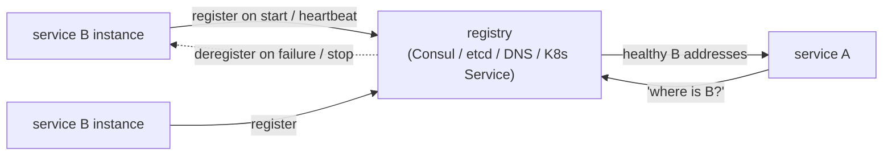
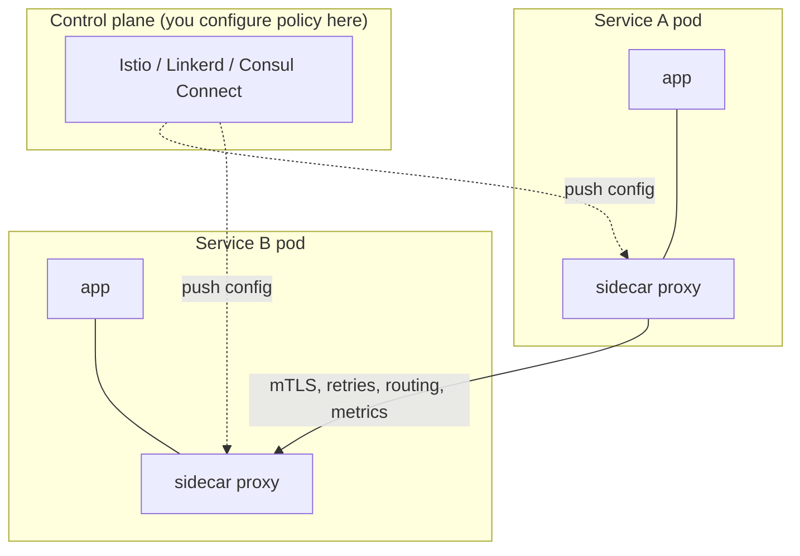
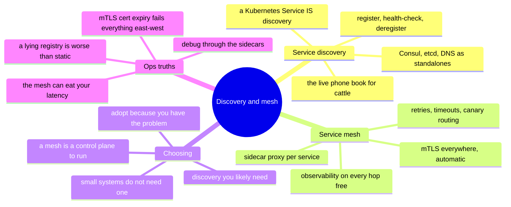

# Service Discovery & Service Mesh — how services find and trust each other

> Once you have many small services instead of a few big ones
> ([`the-stack/05`](../the-stack/05-platform-services.md)), two new questions appear
> that a monolith never had: *how does service A find service B when B's addresses
> change constantly?* and *how do A and B trust and observe each other?* Service
> discovery answers the first; a service mesh answers the second. This is a **🧗
> ramp** — the concepts mapped and verified, not run in production.

A monolith calls a function; a distributed system makes a network call — and every
call now has to *find* its target, *survive* its target being unhealthy, *encrypt*
the hop, and *show up* in a trace. Doing that in every service's code doesn't scale;
pushing it *down* into the platform is what discovery and mesh are for. It's the same
instinct as every layer in this repo: solve the cross-cutting problem once,
underneath, so the thing above doesn't reimplement it.

## Service discovery — the dynamic phone book

Cattle ([`the-stack/03`](../the-stack/03-compute-and-images.md)) come and go —
autoscaling, replacement, redeploys — so their IPs are never stable. A hardcoded IP
or a static host file is drift waiting to happen. **Service discovery is the live
registry that answers "where is service B *right now*?"**

- **The pattern:** instances **register** when healthy and **deregister** (or fail a
  health check) when not; callers **look up** the current healthy set. The registry is
  the source of truth, the way the CMDB is for assets ([itsm](itsm-and-assets.md)) —
  but live, and machine-driven.
- **The renames:** **Consul** (dedicated), **etcd** (the key-value store also under
  Kubernetes), plain **DNS-based** discovery, and — most commonly today — a
  **Kubernetes Service**, which *is* service discovery built into the platform (a
  stable virtual name in front of ephemeral pods, exactly the
  [kubernetes](kubernetes.md) chapter's "how does anything reach ephemeral pods?").
- If you understood the [Kubernetes Service](kubernetes.md), you already understand
  service discovery — it's that idea, sometimes as a standalone system.

## Service mesh — the platform layer under service-to-service calls

Once services find each other, a **service mesh** takes over the *quality* of the
call — pushing concerns out of application code and into a **sidecar proxy** next to
each service, controlled centrally:

What the mesh handles so your code doesn't:

- **mTLS everywhere** — automatic mutual TLS between services, so east-west traffic is
  encrypted and identity-verified without the app doing crypto. This is
  [zero-trust](../the-stack/07-security.md) for service-to-service, made automatic.
- **Traffic management** — retries, timeouts, circuit breaking, and **canary /
  weighted routing** (send 5% of traffic to the new version) — the deploy-safety half
  of [CI/CD](ci-cd.md), enforced at the network.
- **Observability, for free** — because every call goes through a proxy, you get
  golden-signal metrics and distributed-trace spans on *every* hop without
  instrumenting the app ([the-stack/06](../the-stack/06-observability.md)).

The renames: **Istio** (powerful, heavy), **Linkerd** (lighter, simpler), **Consul
Connect**, and increasingly the **sidecar-less / ambient** and **eBPF** approaches
(Cilium) that do it in the kernel without a proxy per pod.

## Choosing — and the honest "do you even need one?"

- **Discovery you almost certainly need** at any real scale — but on Kubernetes it's
  already there (Services), so "adopting service discovery" is often "use the platform
  you already run."
- **A mesh is a serious commitment.** It's another control plane to operate (the
  [control-plane-as-product](../the-stack/01-physical.md) warning yet again), it adds
  latency and moving parts, and a small system does *not* need one. The honest
  question: are mTLS-everywhere, fine-grained traffic control, and per-hop observability
  problems you actually have? If not, the mesh is complexity you'll pay for and not use.
- **Right-size the answer:** a few services → discovery + good libraries. Many
  services, real security/traffic/observability needs → a mesh, adopted deliberately.
  Reach for it because you have the problem, not because it's fashionable — the same
  [build-vs-rent judgment](../the-stack/05-platform-services.md) that AI can't make
  for you.

## Ops notes — what pages you

- **The stale registry entry** — a dead instance still listed, so callers route to a
  black hole. Health checks and deregistration must actually work; a registry that
  lies is worse than a static list.
- **The mesh that ate your latency** — every hop now traverses two proxies; misconfig
  or an overloaded sidecar shows up as mysterious tail latency. The mesh is
  infrastructure you now debug too.
- **mTLS cert expiry** — automatic until the rotation breaks, then *everything*
  east-west fails at once. Certificate lifecycle is a system to monitor
  ([the-stack/07](../the-stack/07-security.md)).
- **Complexity you didn't need** — the most common mesh incident is having adopted one
  a system that small never required; the fix is architectural humility, not more mesh.
- **Debugging across proxies** — "why can't A reach B" now has proxy config, mTLS
  policy, and routing rules layered on top of the plain [network debug
  ladder](../the-stack/02-network.md). Same ladder, more rungs.

## The admin discipline (what to be able to do)

- Explain **service discovery** and why hardcoded IPs are drift; use a Kubernetes
  Service *as* discovery and know when a standalone registry (Consul/etcd) earns its
  place.
- Say what a **service mesh** does (mTLS, traffic management, observability) and,
  more importantly, **when a system doesn't need one**.
- Configure a **canary / weighted rollout** through the mesh and tie it to the
  [CI/CD](ci-cd.md) deploy-safety story.
- Debug a service-to-service failure **through the sidecars** — the network debug
  ladder with proxy and mTLS rungs added.
- Monitor **mesh cert rotation** and registry health as first-class signals.

## The AI-assisted ramp (mesh flavor)

- **Translate from what you know:** *"I understand Kubernetes Services, DNS, and TLS —
  map service discovery and a service mesh onto that, and tell me what a mesh adds that
  Services alone don't."*
- **Draft the config, question the need:** AI writes Istio/Linkerd YAML fluently — and
  will happily hand you a mesh for a three-service app that never needed one. Make it
  argue *whether* before *how*.
- **Where AI burns you (verify hardest):** it **invents CRD fields and mesh API
  versions** (Istio's API surface is large and fast-moving); it **understates the
  operational cost** of running the control plane; and it **defaults to "add a mesh"**
  for problems a library or a Kubernetes Service solves. The build-vs-rent judgment
  stays yours.

## Honest boundaries

🧗 **ramp — clearly labeled.** Service discovery's *concept* sits on ✋ ground — DNS,
health checks, and the [Kubernetes Service](kubernetes.md) model (test-scope
Kubernetes, itself 🧗) — and the underlying network/TLS/least-privilege instincts are
✋ ([the-stack/02](../the-stack/02-network.md), [07](../the-stack/07-security.md)). But
running a **production service mesh** (Istio/Linkerd/Consul Connect operations, mTLS
lifecycle, mesh debugging at scale) is a **🧗 ramp** — mapped and verified, not claimed
as production ops. The most valuable ✋ thing this note carries is *judgment*: knowing
when a mesh is the answer and, more often, when it's expensive complexity a smaller
architecture doesn't need.

## Lab (🚧 planned — spec)

**Discovery first, mesh only if you feel the need.** On local Kubernetes
(`kind`/`minikube`, from the [kubernetes lab](kubernetes.md)):

1. **Discovery:** deploy two services; have one reach the other **by Service name**
   (not IP) and watch it keep working as you delete and recreate the target's pods —
   discovery, built into the platform.
2. **Mesh:** install **Linkerd** (the light one), inject the sidecars, and observe
   **mTLS + per-hop metrics** appear with no app changes — the mesh's payoff, made
   visible.
3. **The drill:** do a **weighted canary** (90/10) between two versions through the
   mesh — then write one sentence on whether this three-service demo actually needed a
   mesh, or whether Services + a good client library would have done.

## The chapter on one screen

