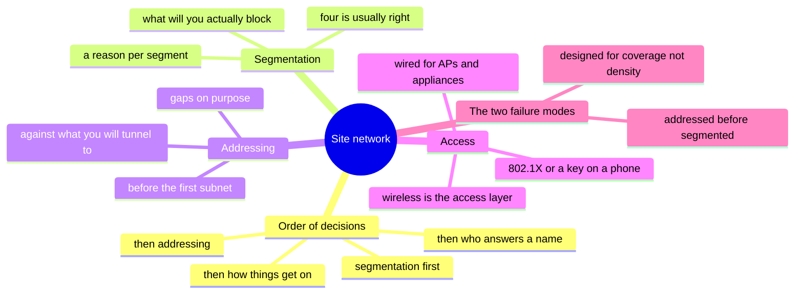

# Designing a Site Network

> [`the-stack/02-network.md`](../the-stack/02-network.md) reads the network layer
> across seven platforms. This reads **one physical place**: an office, a floor, a
> site. The decisions are the same every time you do it, which is what makes them
> worth writing down once.

[`the-reference-office.md`](../the-reference-office.md) gives you the parameters — a
hundred people, sixty-five on a Tuesday, seven rooms, one floor. This turns them into a
design. **It deliberately does not turn them into quantities**: how many access points
and how many switch ports are derived in that file's
[Selection rules](../the-reference-office.md#selection-rules), because they are
parameters and this is not.

**Where this note stops.** Same altitude as the layer chapter: decisions somebody has
to make and then own. Not how a frame finds a switch port, not RF propagation
modelling. *Being able to design an office network and being able to model its radio
environment are different abilities, and only the first one is here.*

## What a site network has to do

Strip the vendors away and a site network answers four questions, in this order,
because each one constrains the next:

1. **Who is allowed to talk to whom** — segmentation
2. **What are the addresses, and what do they collide with** — the address plan
3. **How do things get on** — wired ports, wireless, and what authenticates them
4. **Who answers a name, and who hands out a lease** — DNS and DHCP ownership

Get them out of order and you get the classic failure: a floor addressed and cabled
before anyone decided what needed separating, so segmentation becomes a retrofit that
never happens.

## Segmentation — a reason per segment 🔨

**A segment per trust level, never a segment per device type.** The honest list for a
hundred-person office is short:

| Segment | Why it exists |
| --- | --- |
| **Staff** | The default. Authenticated humans and their managed devices. |
| **Guest** | Untrusted people, internet only, provably isolated. |
| **Unpatchable** | Door controllers, printers, room appliances, lab gear — things with vendor firmware on a vendor's schedule, sitting where anyone can walk up to them. |
| **Management** | Switch and AP management interfaces, reachable from one place. |

Four is usually right and five is usually a mistake. **Every additional segment is a
rule set somebody has to explain in a year**, and the tidiness argument — one per
department, one per floor — produces exactly the rules nobody can defend when they
break something.

The test for a proposed segment is not *"are these things different?"* but **"what am
I willing to block between them, and will I actually block it?"** A segment with an
any-any rule to the staff network is a VLAN, not a security boundary, and calling it
one is how an estate acquires a control that exists only on the diagram.

## Addressing — the plan that survives a merge 🔨

Write the address plan **before** the first subnet exists, and write it against the
thing that will break it: **something you will one day tunnel to.**

- **Non-overlapping RFC1918 across every site, branch, VPN pool and cloud VPC.** Not
  "probably fine" — checked. [`toolbox/cidr-check`](../toolbox/cidr-check/) is the
  cheapest tool in this repo relative to what it prevents.
- **Do not pick `192.168.0.0/24` or `192.168.1.0/24`.** They work perfectly until the
  day they have to be reached from somewhere that also chose them, and every home
  router and half the vendor appliances default into that space.
- **Size for the growth in the lease, not for move-in day.** The reference office
  grows to about 130 without moving; an address plan that fits 100 exactly is a
  renumbering scheduled for a date nobody has picked yet.
- **Leave gaps on purpose.** Contiguous allocation looks tidy and makes the next
  segment impossible to summarise. Allocate as though a summary route will one day
  matter, because on the day you add a second site it does.

**The failure this prevents is not subtle and it is not cheap.** Two estates that both
chose `10.0.0.0/16` have three options — renumber one side, NAT the overlap, or proxy
at the application layer — and all three are projects with names. The
[CIDR-overlap lab](labs/multi-cloud-cidr-overlap/) makes the shape of it tangible at
cloud scale; it is the same shape at office scale with fewer people to help.

## Wired — what still needs a cable 🔨

Wireless is the access layer now, which changes what wired is *for* rather than
removing it. The things that still want copper:

- **Access points** — and this is the wired requirement that actually drives switch
  choice, because modern APs want PoE+ or PoE++ and a 2.5GbE uplink.
- **Room systems and displays** — appliances that should not be competing for airtime
  in the room whose meeting they are carrying.
- **Printers, door controllers, anything on the unpatchable segment** — a cable is
  also a placement decision, and a wired port is easier to pin to a VLAN than a
  wireless client is.
- **Desks, still** — not because people use them, but because pulling cable during a
  fit-out costs a fraction of pulling it afterwards. Generous drops are cheap now and
  expensive later, which is the same argument the building step makes about
  [conduit and spare capacity](../build-out/02-the-building.md).

**Uplink and stacking are where the sizing mistake lives.** Port count is easy to
count and easy to get right; what gets under-specified is the path from the access
switch to everything else, because it does not show up in a port count.

### Speed is a per-tier decision, and the tiers move at different times

"Is it still gigabit?" has three answers, because three tiers upgrade on three
different schedules and for different reasons:

| Tier | What drives it |
| --- | --- |
| **Desk ports** | Almost nothing. A hybrid floor moved its load to wireless and its storage to SaaS; the desk is the *least* starved link in the building. Upgrading here first is the classic misread. |
| **AP uplinks** | **The tier that actually moves.** A modern access point can exceed a gigabit on its radios, so a 1GbE uplink turns the AP into the bottleneck it was bought to remove. This is where multi-gig earns its money. |
| **Aggregation and core** | Oversubscription. Every access switch's uplink lands here, and this is the tier a design quietly caps by counting ports and not paths. |

**The order matters more than the numbers.** The instinct is to upgrade what people
touch, and what people touch is the desk. The link under pressure is the one nobody
looks at, because it is in a ceiling. Specify the AP uplink first, the aggregation
path second, and the desk when something actually needs it — which for most offices
is not yet.

*A number in this section would date; the ordering will not.* Current-generation
figures live with the other things that date, in the reference office's
[Selection rules](../the-reference-office.md#selection-rules).

## Wireless — density, not coverage 🧭

**🧭 This section is a verified ramp, not hands-on depth.** The segmentation and
addressing above are years of production; **wireless design is not** — see
[Honest boundaries](#honest-boundaries). What follows is the method as published
practice describes it, with the reasoning checked rather than the outcome experienced.

The design question is not *"does the signal reach?"* — it does, that problem was
solved a decade ago. It is **"what happens when the largest room puts everyone on
video at once?"** A coverage survey answers a question nobody has.

Three things decide the design, and only the third is about radios:

**Capacity is counted twice and you take the larger.** Once by client count, once by
throughput — the arithmetic is in the reference office's
[Selection rules](../the-reference-office.md#selection-rules), because a count is a
parameter and this file is not.

**Placement follows the rooms, not the grid.** A hundred-person floor with seven
meeting rooms is not a uniform load. The large room on a busy Tuesday is the densest
square metres in the building, and an AP averaged across the floorplate serves it
worse than one placed for it. **Design for the peak square metre, not the mean.**

**Channel width is a capacity decision disguised as a performance setting.** Wide
channels give one client a bigger number and give a crowded floor fewer non-
overlapping channels to work with. In density, narrower and more channels beats wider
and fewer — which is counter-intuitive precisely because the per-client benchmark
improves as the floor gets worse.

**The thing to be suspicious of** is vendor "AI-driven" RF optimisation. Some of it is
real; much of it is the same channel and power heuristics with a new label. Ask what
it is actually adjusting before crediting it with anything.

## DNS & DHCP — who answers a name 🔨

Small, boring, and the source of a disproportionate share of "the network is down"
tickets that are not about the network.

- **Name one owner for each, and write down what resolves what.** Split-horizon is
  fine deliberately and a permanent intermittent fault accidentally — a conditional
  forwarder added for one migration and never removed means a name resolves
  differently depending on which resolver a client happened to get.
- **DHCP scope sizing is an address-plan question**, not a DHCP question. Scope
  exhaustion on a hybrid floor is common precisely because sizing was done against
  headcount rather than against devices per person on the peak day.
- **Reservations, not static addresses, for infrastructure.** A statically configured
  printer is invisible to the thing that is supposed to know what is on the network.
- **TTL is your rollback window.** Lower it before a change, not during the outage
  that follows one.

## Network authentication — identity wearing a networking hat 🔨

**If network access does not consult the directory, you have a shared key that will
live on someone's phone forever.** This is a genuine dependency on
[step 03](../build-out/03-identity.md), not a preference: 802.1X against the directory
means joiner/mover/leaver reaches the network, and a pre-shared key means it does not.

The design consequence people miss is the **failure mode**. When the directory is
unreachable, what happens to the floor? Design the answer deliberately — a cached
credential window, a fallback VLAN with reduced access, something — because the
alternative is discovering it during the incident that made the directory
unreachable. The same circular dependency bites
[remote access](../build-out/10-remote-access.md), and it is worth solving once with
both in view.

## The guest network — provable isolation 🔨

Not *configured* isolation. **Demonstrable** isolation, because a mid-size customer's
security questionnaire asks this specific question and a screenshot of a checkbox is
not an answer.

- Internet only, with no route to any internal segment — and a test that shows it.
- Its own DHCP scope and DNS, so a guest device cannot resolve internal names.
- Client isolation on, so guests cannot see each other either.
- A bandwidth ceiling, because the guest network is also the network the all-hands
  streams over when someone joins it by accident.

The evidence matters as much as the control: this is one of the cheapest genuine
artefacts to have ready before
[compliance evidence](../build-out/14-compliance-evidence.md) becomes urgent.

## When the size changes the design

The reference office is a hundred people on one floor. Most of what is above holds
from fifteen people to five hundred — but **eight decisions flip**, and knowing
*what drives each flip* is more useful than knowing where it lands, because the
driver transfers and the threshold does not.

| Decision | Small (<25) | Reference (~100) | Large (500+) | What actually drives the flip |
| --- | --- | --- | --- | --- |
| **Wireless management** | Standalone APs | Cloud-managed or controller | Controller cluster | AP count — around five, when configuring each by hand stops being tolerable |
| **Switching** | One switch | Stacked, uplinks planned | Access / aggregation tiers | Port count and floor count |
| **Routing boundary** | Flat L2 | Inter-segment routing at the edge | L3 to the access layer | Broadcast domain size, and the day there is a second floor |
| **Firewall** | One | One, or an HA pair | HA pair, plus zoning | **Cost of downtime exceeding the cost of a second box** — not headcount |
| **DHCP / DNS** | On the firewall | A service with an owner | Redundant, with IPAM | **Rate of change, not size.** A stable fifty-person office needs less than a churning twenty-person one. |
| **Access speed** | 1GbE throughout | Multi-gig to the APs | Multi-gig access, 10G+ aggregation | The AP uplink first, always; the desk last |
| **Network authentication** | Pre-shared key | 802.1X to the directory | 802.1X with dynamic VLAN assignment | Staff turnover — the point where "change the key and tell everyone" stops working |
| **Sites** | One | One, plus VPN | Routed WAN or SD-WAN | The second site existing at all |

**Read the last column, not the first three.** Two of the eight flips are not driven
by size at all — the firewall pair is a downtime-cost decision and the DHCP/DNS split
is a rate-of-change decision — which is why a design copied from an office of the same
headcount can still be wrong. *Headcount is a proxy for the drivers, and like every
proxy it is right until it is not.*

**Going the other way is the harder direction.** Most of these flips are additive and
can be done when the driver arrives. Two cannot: **the address plan** and **the
segmentation** are laid down at the smallest size and are the expensive things to
change later. A fifteen-person office that picks `192.168.1.0/24` and one flat segment
has not saved anything; it has borrowed against the day it is a hundred people.

## Applying it to the reference office

The [parameters](../the-reference-office.md) — 100 people, ~65 on a Tuesday, 70 desks,
7 rooms (1 large / 2 medium / 4 small), 6 phone booths, one floor, growth to ~130 —
produce this shape:

<picture>
  <source media="(prefers-color-scheme: dark)" srcset="../site/assets/diagrams/site-network.dark.svg">
  
</picture>

*One instance of everything above, drawn. The addresses are a **dated** example and are
meant to be replaced whole — they are not parameters and they do not belong in
[the reference office](../the-reference-office.md), whose `Reference build` section
admits only things somebody could buy from. What the figure carries that the table below
does not is the **boundary** (which segment the firewall is the gateway for) and the
**tier** (which link actually moves), and it was checked with
[`toolbox/cidr-check`](../toolbox/cidr-check/) rather than by eye — including against the
three ranges it says not to use.*

| Decision | For this office |
| --- | --- |
| Segments | Four: staff, guest, unpatchable, management |
| Address plan | One `/22` out of a documented site range, subnetted per segment with room to double; checked against the VPN pool and every cloud VPC |
| Wired | Every desk, every room, every AP, every unpatchable device — port count in [Selection rules](../the-reference-office.md#selection-rules) |
| Wireless | Placed for the rooms, sized by the two-calculation method; the large room is the design case |
| DNS/DHCP | One owner, scopes sized against devices-per-person at peak, not headcount |
| Network auth | 802.1X to the directory, with a deliberate answer for directory-unreachable |
| Guest | Isolated and demonstrable, ready for the questionnaire before it arrives |

The quantities behind these live in the reference office because they are parameters
and they date; the decisions live here because they do not.

## Honest boundaries

**🔨 hands-on depth** — segmentation, addressing, wired design, DNS/DHCP ownership,
802.1X-to-directory, and guest isolation. This is the classic enterprise stack:
CCNP-level routing and switching, years of BIND/DHCP, VLANs, firewalls and VPNs across
offices and data centres.

**🧭 verified ramp** — **wireless design.** Density planning, channel and power
strategy, RF survey practice, and access-point selection are mapped and verified
against published engineering guidance, not carried out on a floor and lived with
afterwards. The method above is reproducible and the reasoning is checkable; **what is
missing is the part you only get from having been wrong about a real room.** Stated
plainly because the rest of this note is deep enough that a reader would otherwise
reasonably assume the wireless section is too.

**Also 🧭** — procurement and vendor negotiation, the same boundary
[step 01](../build-out/01-uplink.md) draws for the uplink.

## The chapter on one screen

