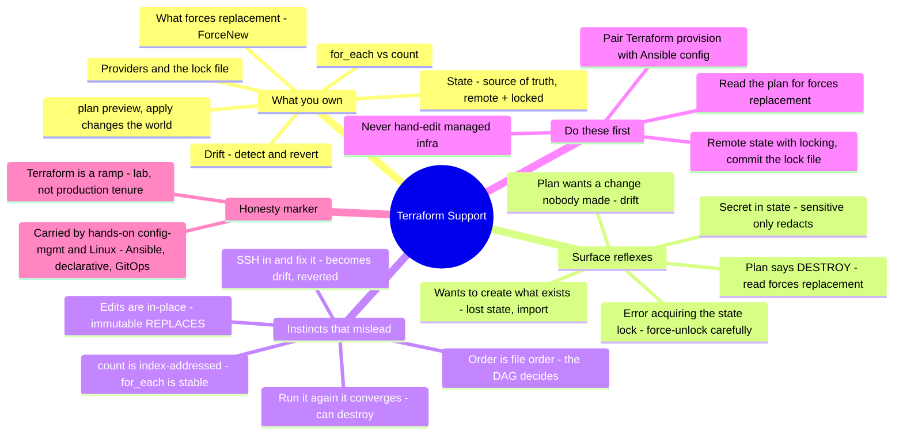

# Terraform Support — the config-management sysadmin's transition guide

> 🌐 **Languages:** English (default) · [中文](../docs/zh/cross-cutting/terraform-support.md)

---

> [`iac-and-config.md`](iac-and-config.md) draws the line between **provisioning**
> (Terraform makes the resources) and **configuration** (Ansible makes them consistent).
> This is the other half for the provisioning side: **Terraform support as a break-fix
> craft** — the tickets that actually recur, exactly where you look, and **where a strong
> Ansible / Puppet / Chef sysadmin's instincts get burned inheriting Terraform.** Honesty
> marker up front: this note is **🧗 ramp** — my Terraform hands-on is **lab/exposure**,
> mapped from and carried by a ✋ **config-management + Linux foundation** (Ansible, declarative
> thinking, GitOps, idempotency). Its authority is **research** (HashiCorp docs + practitioner
> failure modes + a runnable [lab](#lab--state-is-the-source-of-truth--runnable)), not
> production tenure. The whole point of this note is *the gap I'm crossing.*

An Ansible sysadmin ramps onto Terraform fast — it's declarative, it's config-in-git, it's
the same "describe the end state" instinct. Then it bites, in exactly the place config
management doesn't have: **Terraform keeps a state file, and it is the source of truth.**
Ansible/Puppet/Chef are *convergent* — you push desired state to the targets every run and
never keep an authoritative record of what you made. Terraform plans against **state**
(refreshed from reality), not against reality directly — so a lost state file, a hand-edit
that drifts, a locked state, an immutable attribute that forces a destroy, or a `count` list
you reordered can each **delete production**. This note names the responsibilities, the
recurring tickets and their diagnostic surface, and the handful of config-management reflexes
that misfire — contrasting with Ansible throughout, because that's where the reader is coming
from.

## What supporting Terraform makes you responsible for

The break-fix surface, roughly in the order tickets arrive:

| Surface | What you're on the hook for |
| --- | --- |
| **State** | `terraform.tfstate` as the **source of truth** — a **remote backend with locking** (S3 native lockfile / GCS / HCP Terraform Cloud), never local state for a team; `terraform state list/show/mv/rm/pull/push`; `terraform import` to reconcile; **state contains secrets in plaintext**. |
| **The plan/apply lifecycle** | `plan` (a preview that **refreshes** state from real), `apply` (the only thing that mutates the world), `destroy`; `-target`, `-refresh-only` (read-only drift check), `-replace` (the successor to `taint`); never applying a **stale** saved plan. |
| **Drift** | Out-of-band/manual changes to managed infra → the next `apply` **reverts them**; detecting drift deliberately with `plan -refresh-only` before it surfaces mid-apply. |
| **What forces replacement** | Which attribute changes trigger **destroy+recreate** (`ForceNew`) vs in-place update — reading the plan for `# forces replacement` before every prod apply. |
| **Providers & the lock file** | `required_providers` version pins + **committing `.terraform.lock.hcl`** (providers only; pin modules separately); provider auth, rate limits, provider bugs. |
| **HCL & modules** | variables/outputs/locals, **`for_each` vs `count`** (index-shift churn), `depends_on` for hidden deps, `data` sources, `moved` blocks, module sources + version pinning, the dependency **DAG**. |
| **CI/CD & governance** | plan-in-PR (**Atlantis** / Terraform Cloud), policy-as-code (Sentinel / **OPA-conftest**), `validate` / `fmt` / **tflint** / **checkov** / `trivy config`, drift detection in CI, cost preview (**infracost**). |
| **Escalate / reconcile** | state surgery via reviewable migrations (**tfmigrate**) rather than hand-run mutating commands; provider issue trackers for resource-level bugs. |

## The common tickets — and where you look

Terraform break-fix is reading the **plan** like a hawk and knowing which of the three
worlds — config, state, real — is lying. The reflex to build: *"what does state believe,
and does it match reality?"*

**`Error acquiring the state lock` — the number-one ticket.** A previous `apply` crashed or
someone's running concurrently, and the lock is stuck. *Where you look:* the backend's lock
(the lock ID + who/when is in the error). `terraform force-unlock <ID>` clears it — but it's a
**loaded gun**: unlocking mid-apply corrupts state. Confirm nothing is actually running, then
`terraform state pull` to validate afterward. (This ticket doesn't exist in Ansible — there's
no shared mutable state to lock.)

**"The plan wants to change something nobody changed" — drift.** Someone SSH'd in or clicked
the console and hand-edited a Terraform-managed resource. `plan` refreshed state from real,
saw the difference, and will **revert your hotfix** back to code. *Where you look:*
`terraform plan` (the drift shows as an `~ update`), `terraform plan -refresh-only` to inspect
drift without acting. *The fix is a discipline, not a command:* **never hand-edit managed
infra — change the code and apply.**

**"The plan says it will DESTROY my database" — forced replacement.** You changed an
attribute you thought was editable, but it's `ForceNew`, so Terraform plans **destroy +
recreate**. *Where you look:* scan the plan for **`-/+`** and the literal **`# forces
replacement`** on the offending attribute. Treat any unexpected replacement on a stateful/prod
resource as a stop-and-review — the data may not survive. (To force a replacement deliberately:
`terraform apply -replace=ADDRESS`; the old `terraform taint` is deprecated.)

**"Terraform wants to create things that already exist" — lost/mismatched state.** The state
file was deleted, or you're pointed at the wrong backend. With no state, Terraform re-plans
everything as **create**, which duplicates or clobbers live infra. *The fix:* `terraform
import <address> <real-id>` (or `import` blocks) to teach state what already exists, then plan
should return to a clean no-op.

**"It worked yesterday" — provider version drift.** An unpinned provider upgraded and changed
behavior. *Where you look:* `.terraform.lock.hcl` (is it committed? which version resolved?),
`required_providers` constraints, `terraform init -upgrade` output. **Commit the lock file** —
that's how teammates and CI get identical providers.

**`count` churn on reorder.** You removed or reordered an item in a `count`-indexed list and
the plan wants to replace a pile of resources that only *moved index*. *The fix:* use
**`for_each`** (keyed by a stable string), and for an existing `count` resource, `moved` blocks
or `terraform state mv` to re-key without destroying.

**A secret showed up in state / a diff.** `sensitive` only **redacts CLI/UI output** — it does
**not** encrypt state. DB passwords, tokens, and generated keys land in `terraform.tfstate` in
plaintext. *The fix:* treat the state file itself as a secret (backend encryption-at-rest,
locked-down access), and prefer ephemeral / write-only values where the provider supports them.

**"Saved plan is stale."** State moved between your `plan -out` and the later `apply`.
Re-plan; never apply an old saved plan that no longer describes the change you reviewed.

## The experience gap — what a strong sysadmin's instincts get wrong

The gap between an Ansible/Puppet sysadmin who's run Terraform and one who hasn't isn't the
HCL syntax — it's a set of config-management reflexes that are **wrong here**, each with a
failure mode.

- **State is the source of truth — "run it again, it converges" is a trap.** Config management
  is convergent: it pushes desired state to targets every run and keeps no authoritative record
  of what it made. Terraform plans against a **state file** (refreshed from real), and *"if your
  state and configuration do not match your infrastructure, Terraform will attempt to reconcile
  … which may unintentionally destroy or recreate resources."* Blindly re-running can **delete
  prod**. The [lab](#lab--state-is-the-source-of-truth--runnable) makes this concrete.
- **Drift gets reverted — "SSH in and fix it" backfires.** A manual hotfix to managed infra
  becomes **drift**, and the next `apply` **undoes it** to match code. Your console fix survives
  until the next run, then vanishes. The discipline: change the code, never the resource.
- **Edits aren't always in-place.** Changing an immutable (`ForceNew`) attribute forces a
  **destroy + recreate**, not an edit — potentially wiping a database. Config management edits
  in place; Terraform is immutable-by-default for these attributes. **Read the plan** for
  `forces replacement` — every time.
- **`count` is index-addressed; `for_each` is key-addressed.** Reorder or remove a middle item
  of a `count` list and *every later index shifts*, so Terraform replaces resources that only
  moved. `for_each` keys are stable. Default to `for_each` for anything with identity.
- **State must be remote + locked for a team — and it's sensitive.** Local `terraform.tfstate`
  doesn't survive two people; you need a **remote backend with locking** or concurrent applies
  corrupt it. And **secrets sit in state in plaintext** — `sensitive` only redacts output.
  (Ansible has no shared mutable state to corrupt; this is a new hazard class.)
- **Providers are the real workers — pin them.** Terraform core is a thin engine; **providers**
  (aws/azurerm/google) do the API calls. Pin versions and **commit `.terraform.lock.hcl`**, or a
  silent provider upgrade breaks you.
- **Plan is a preview; apply changes the world — and a stale plan is dangerous.** A green plan is
  not "done," and an old saved plan applied later can do the wrong thing.
- **The dependency graph decides order, not the file.** Terraform builds a **DAG** from resource
  references and runs independent resources in parallel — the opposite of an Ansible playbook's
  top-to-bottom tasks. Use `depends_on` only for hidden dependencies it can't infer.
- **Terraform and Ansible are complementary, not either/or.** Terraform **provisions** (the VM,
  the network, the bucket — Day 0); Ansible **configures inside** (packages, files, services —
  Day 1+). Your Ansible skill is the *config half of the same pipeline*, wired via Terraform
  outputs → dynamic inventory — not a thing being replaced.

## What transfers, what doesn't

| Transfers strongly | Transfers with caveats | Don't bring it |
| --- | --- | --- |
| Declarative / desired-state thinking (Puppet manifests especially) | Idempotency mindset — same word, different guarantee (Terraform's is *state-mediated*; Ansible's you design per task) | "Just run it again, it converges" — Terraform re-runs against **state** and can destroy |
| Version-control / GitOps / PR-review discipline — *more* important here (state + plan review) | Least-privilege & secrets hygiene — extend "what is a secret" to include the **state file** | "SSH in and hot-fix it" — becomes drift, gets reverted |
| Structured declarative authoring (YAML → HCL; Jinja ≈ HCL interpolation) | Dependency reasoning — maps onto the DAG + `depends_on` | "Edits are in-place" — immutable attrs **destroy+recreate** |
| CI/CD & pipeline discipline (plan-in-PR, gates) | Cloud/API familiarity — but the **provider** is the thing, pin it | "Order = the order I wrote it" — the **DAG** decides |
| Debugging methodology (read output, minimal repro, bisect) | On-prem → cloud provisioning — new blast radius (a typo can delete prod) | "I don't need to read the plan" — an unread plan hides `forces replacement` |
| **Ansible itself** — it's the config layer downstream of Terraform | | "One tool for everything" — provision with Terraform, configure with Ansible |

## First week / first 90 days

**First week.**
1. **Remote backend with locking from day one** — never ship a team on local state (S3 native
   lockfile / GCS / HCP). And **commit `.terraform.lock.hcl`; never commit `terraform.tfstate`.**
2. **Read the plan before every apply** — specifically scan for **`-/+`** and **`forces
   replacement`**; any unexpected replacement on a stateful/prod resource is a stop-and-review.
3. **Never hand-edit managed infra** — console/CLI hotfixes become drift and get reverted. Change
   the code, `apply`.
4. **Internalize the three worlds** — config vs state vs real; on any surprising plan, ask *which
   one is lying?* (Run the [lab](#lab--state-is-the-source-of-truth--runnable).)

**First 30 days.**
5. **Pin providers; re-plan after any provider bump** before committing the new lock.
6. **Prefer `for_each` over `count`** for anything list-like with identity; reserve `count` for
   simple N-identical scaling.
7. **Detect drift deliberately** with `terraform plan -refresh-only` rather than discovering it
   during an apply.
8. **Treat state as a secret** — `sensitive` only redacts output; encrypt state at rest and
   restrict access.

**First 90 days.**
9. **Do state surgery through reviewable migrations** (tfmigrate / `import` blocks / `moved`),
   not hand-run mutating commands.
10. **Wire Terraform to Ansible** — provision with Terraform, feed its outputs into a dynamic
    inventory, configure with Ansible; stop trying to make one tool do both jobs.
11. **Put plan-in-PR + policy/lint gates in CI** (Atlantis / Terraform Cloud + tflint / checkov /
    conftest / infracost) so state changes are reviewed, not YOLO'd from a laptop.
12. **Know what forces replacement** for the resources you touch before editing immutable fields
    on databases, disks, and instances.

## The AI-assisted ramp (Terraform flavor)

- **Translate from what you know — and demand the deltas:** *"I know Ansible and Linux — map
  Terraform's state model, plan/apply lifecycle, and drift onto what I already do with playbooks,
  and flag only the real differences."* Terraform rewards translate-then-verify — but **state,
  drift-revert, forced replacement, and `count` index-shift have no config-management analog**,
  so verify those to death (that's what the lab is for).
- **Let it draft HCL; you own the plan and the state.** AI is strong at generating Terraform — and
  it will also **write `count` where `for_each` belongs**, **forget the lock file**, **suggest
  local state**, **put a secret in a plain variable**, and produce a plan that quietly **destroys
  a database** on an immutable-attribute change. Never `apply` AI-drafted HCL you haven't read the
  plan for, and run it in a throwaway workspace first. Same verify-to-death discipline — see
  [`ai-workflow/`](../ai-workflow/) and [`iac-and-config.md`](iac-and-config.md).

## Honest boundaries

This note is **🧗 ramp, and it says so clearly.** My Terraform hands-on is **lab/exposure** —
built from an Ansible/Puppet config-management and Linux foundation, not from years of running
Terraform state in production. What carries it is real: **✋ config-management + Linux depth**
(Ansible/IaC, declarative thinking, idempotency, GitOps/PR discipline, dependency reasoning,
debugging methodology — the same line [`iac-and-config.md`](iac-and-config.md) draws), plus a
research-grounded model of Terraform's mechanics and a runnable
[lab](#lab--state-is-the-source-of-truth--runnable). The Terraform-specific mechanics above —
state/locking, the plan/apply/refresh lifecycle, forced replacement, `count`-vs-`for_each`,
providers/lock, drift — are **mapped and doc-verified, not tenure.** Deeper production Terraform
(large multi-team state, module authorship at scale, Sentinel/OPA policy programs, Terragrunt
mono-repos, state migrations under load) is still ahead; the annotation says so plainly and
never bluffs. This is the honest artifact of a strong sysadmin **crossing the exact gap** the
job market keeps asking about — documented in public, ✋/🧗 marked.

## Field kit — real tools & references

Pointers below were each verified to exist on GitHub, grouped by use. Archived / sunset / renamed
status is flagged, because in this ecosystem it changes fast.

**Core & the license fork (know both):**
- [`hashicorp/terraform`](https://github.com/hashicorp/terraform) — the engine; its issue tracker is the ground truth for CLI/state behavior you'll debug against.
- [`opentofu/opentofu`](https://github.com/opentofu/opentofu) — the **MPL-2.0 community fork** (`tofu` CLI, Linux Foundation) after HashiCorp's 2023 BSL relicense; state/HCL-compatible, adds state encryption. Increasingly the license-safe target.
- [`hashicorp/terraform-provider-aws`](https://github.com/hashicorp/terraform-provider-aws) (· `-azurerm` · `-google`) — provider repos are where resource-level bugs are filed and triaged.

**State, import & drift (the hard part):**
- [`snyk/driftctl`](https://github.com/snyk/driftctl) — purpose-built drift detection. *(⚠️ Snyk sunset active development — effectively maintenance/EOL, but still the reference.)*
- [`cycloidio/terracognita`](https://github.com/cycloidio/terracognita) — reverse-Terraform from existing cloud infra → HCL + import (actively maintained; the archived [`GoogleCloudPlatform/terraformer`](https://github.com/GoogleCloudPlatform/terraformer) was the classic).
- [`minamijoyo/tfmigrate`](https://github.com/minamijoyo/tfmigrate) — **state migration as reviewable plans** (`state mv`/`import`/`rm` in a GitOps flow) — the safe way to do state surgery. Pairs with [`minamijoyo/hcledit`](https://github.com/minamijoyo/hcledit).
- [`im2nguyen/rover`](https://github.com/im2nguyen/rover) — interactive state/graph visualization for understanding what state actually contains.

**Workflow, DRY & PR automation:**
- [`runatlantis/atlantis`](https://github.com/runatlantis/atlantis) — the OSS backbone of **plan/apply-from-PR** GitOps + audit trails.
- [`gruntwork-io/terragrunt`](https://github.com/gruntwork-io/terragrunt) — DRY/orchestration wrapper for multi-env/multi-account backends at scale.
- [`hashicorp/setup-terraform`](https://github.com/hashicorp/setup-terraform) · [`tfutils/tfenv`](https://github.com/tfutils/tfenv) — pin the CLI version in CI and locally (the first thing you pin when debugging version-specific behavior).

**Test, lint, policy & cost (the CI gates):**
- [`terraform-linters/tflint`](https://github.com/terraform-linters/tflint) — provider-aware linting that catches what `validate` misses.
- [`aquasecurity/trivy`](https://github.com/aquasecurity/trivy) (`trivy config`) — IaC misconfig scanning; **tfsec is now consolidated into Trivy** (the standalone [`aquasecurity/tfsec`](https://github.com/aquasecurity/tfsec) is deprecated).
- [`bridgecrewio/checkov`](https://github.com/bridgecrewio/checkov) · [`open-policy-agent/conftest`](https://github.com/open-policy-agent/conftest) — policy-as-code on config and on **plan JSON** (the OSS alternative to Sentinel).
- [`gruntwork-io/terratest`](https://github.com/gruntwork-io/terratest) — Go-based end-to-end module testing.
- [`antonbabenko/pre-commit-terraform`](https://github.com/antonbabenko/pre-commit-terraform) — wires fmt/validate/tflint/docs/checkov into one pre-commit config.
- [`infracost/infracost`](https://github.com/infracost/infracost) — the `$` delta of a plan, in the PR.

**Curated list, reference modules & docs:** best-maintained
[`shuaibiyy/awesome-tf`](https://github.com/shuaibiyy/awesome-tf) *(renamed from awesome-terraform)*;
[`terraform-aws-modules/*`](https://github.com/terraform-aws-modules) (e.g. `terraform-aws-vpc`, `terraform-aws-eks`) — reference-quality modules to copy and debug against;
[`terraform-docs/terraform-docs`](https://github.com/terraform-docs/terraform-docs) — keep module READMEs truthful. Bookmark HashiCorp's own
[State](https://developer.hashicorp.com/terraform/language/state) ·
[Resource drift + `-refresh-only`](https://developer.hashicorp.com/terraform/tutorials/state/resource-drift) ·
[Manage sensitive data](https://developer.hashicorp.com/terraform/language/manage-sensitive-data) ·
[Dependency lock file](https://developer.hashicorp.com/terraform/language/files/dependency-lock) over any blog.
*(Currency: **OpenTofu** is the live MPL fork; **tfsec→Trivy**; **DynamoDB state-locking is deprecated** in favor of S3 native lockfile (`use_lockfile`, TF 1.10+); `taint`→`-replace`, `refresh`→`plan -refresh-only`. Verify against current docs.)*

## Lab — state is the source of truth ✅ runnable

**Prove Terraform's signature lesson by hand.** A pure-local, stdlib-only drill that models
the **config / state / real** triangle: an empty state plans a **create**; `apply` converges
all three; a **hand-edit to real is detected and reverted** (drift — "Terraform fights you"); an
**immutable attribute forces REPLACE**, not in-place; **lost state** wants to re-create a
resource that already exists (and `import` reconciles); and **`count` reordering churns**
resources while **`for_each` keys stay stable**.

```bash
python3 cross-cutting/labs/terraform-state-and-drift/state_drift_drill.py
```

Exit `0` means every lesson held (it doubles as a CI check); `--sabotage no-refresh` or
`--sabotage mutable-all` breaks the model and the assertions fail. See
[`labs/terraform-state-and-drift/`](labs/terraform-state-and-drift/).

## The chapter on one screen


