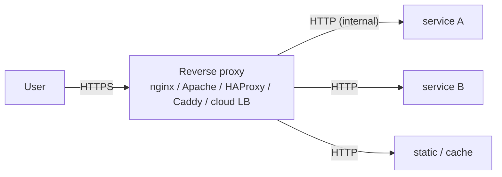
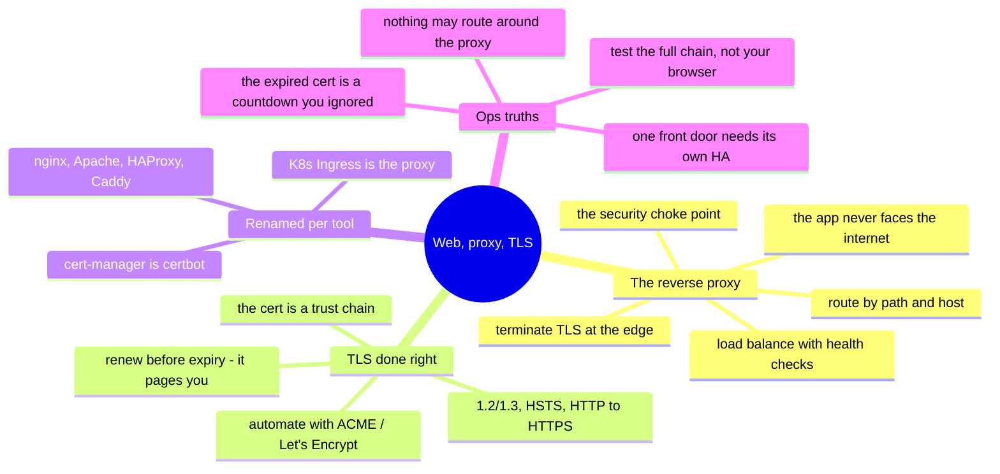

# Web Servers, Reverse Proxies & TLS — the front door to everything

> Almost every service a user touches sits behind a web server or a reverse proxy,
> and almost every connection to it is TLS. This is the oldest, most universal
> cross-cutting surface there is — and one the cloud-native roadmaps assume you
> already know. This note is **✋ ground on the fundamentals** (running Apache, DNS,
> and core services for real), with modern proxies and automated certs as the ramp.

The reverse proxy is where the internet meets your services: it terminates TLS,
routes requests, balances load, and shields what's behind it. Get it right and it's
invisible; get it wrong and it's the outage every user sees at once. Whether it's
nginx, Apache, HAProxy, Caddy, or a cloud load balancer, they all do the same handful
of jobs — the [operating model](../00-the-operating-model.md)'s "learn the concept,
rename per tool" applied to the front door.

## What a reverse proxy actually does

One box (or fleet) sits in front of your services and does five jobs:

- **TLS termination** — decrypt HTTPS at the edge so services behind it speak plain
  HTTP on a trusted network ([the-stack/02](../the-stack/02-network.md)); the cert
  lives in one place, not in every app.
- **Routing** — send `/api` to one service, `/` to another, `app.example.com` vs.
  `api.example.com` to different backends (name-based virtual hosts / host routing).
- **Load balancing** — spread requests across healthy backends, with health checks so
  a dead instance stops receiving traffic (the [failure-domain](../the-stack/01-physical.md)
  instinct at the request layer).
- **Offload** — caching, compression, rate limiting, and serving static content, so
  the app servers do less.
- **A security choke point** — one place to enforce TLS policy, headers, WAF rules,
  and blocklists ([the-stack/07](../the-stack/07-security.md)).

The one rule: **the app server should never face the internet directly.** The proxy
is the hardened front door; the app is in a private network behind it.

## TLS / HTTPS — the part everyone must get right

TLS is non-negotiable, and it's where careful admins are made:

- **The handshake, in one breath:** the client and server agree on a cipher, the
  server proves its identity with a **certificate** signed by a **Certificate
  Authority** the client trusts, and they derive a session key. The trust chain
  (leaf → intermediate → root) is the part that breaks in practice — a **missing
  intermediate** is the classic "works in my browser, fails in `curl`" bug.
- **Certificates are a lifecycle, not a file.** Issue, install, and — the one that
  pages you — **renew before expiry**. An expired cert takes the whole site down at a
  timestamp you could have seen coming; cert-expiry monitoring is a first-class alert
  ([the-stack/06](../the-stack/06-observability.md)).
- **Automate it: Let's Encrypt + ACME.** `certbot` or Caddy's built-in ACME issue and
  **auto-renew** certs for free — turning the old manual-renewal outage into a solved
  problem. Modern default: never hand-manage a public cert again.
- **Modern hygiene:** TLS 1.2/1.3 only, strong ciphers, HSTS, redirect HTTP→HTTPS,
  and OCSP stapling. The same "secure by default" posture as
  [the-stack/07](../the-stack/07-security.md).

Note how this ties the repo together: TLS termination here, **mTLS between services**
in the [mesh](service-mesh.md), **SPF/DNS** for mail in [saas-admin](saas-admin.md) —
same PKI and DNS fundamentals, different surface.

## The tools, renamed

| Job | nginx | Apache (httpd) | Modern / cloud |
| --- | --- | --- | --- |
| **Reverse proxy** | `proxy_pass` | `mod_proxy` | Caddy, Traefik, cloud LB |
| **TLS** | `ssl_certificate` | `mod_ssl` | Caddy (auto-ACME), ACM/managed certs |
| **Virtual hosts** | `server {}` blocks | `<VirtualHost>` | host rules / ingress |
| **Load balancing** | `upstream {}` | `mod_proxy_balancer` | HAProxy, cloud LB, K8s Ingress |
| **Cert automation** | + certbot | + certbot | Caddy built-in, cert-manager (K8s) |

On Kubernetes the same jobs wear new names — an **Ingress** (or Gateway API) is the
reverse proxy, and **cert-manager** is certbot — but it's the identical concept, which
is exactly why the fundamentals transfer.

## Ops notes — what pages you

- **The expired certificate** — the outage with a countdown you ignored. Automate
  renewal (ACME) and alert on expiry well ahead; this is the most preventable web
  outage there is.
- **The missing intermediate cert** — browsers paper over it, `curl` and mobile apps
  don't. Test the *full chain* (SSL Labs, `openssl s_client`), not just "it loads for
  me."
- **The app server facing the internet** — a backend reachable directly, bypassing the
  proxy's TLS and WAF. The proxy is only a front door if nothing routes around it.
- **Redirect loops and wrong headers** — `X-Forwarded-For`/`Proto` misconfigured, so
  the app thinks it's on HTTP behind an HTTPS proxy and redirect-loops. A classic
  reverse-proxy bug; know the forwarded-header contract.
- **One proxy, no redundancy** — the single front door is a single point of failure;
  it needs its own HA (a pair + a virtual IP, or a managed LB) or it's the
  [failure domain](../the-stack/01-physical.md) that takes everything with it.

## The admin discipline (what to be able to do)

- Stand up a **reverse proxy** that terminates TLS and routes to two backends, with
  the app servers **not** internet-facing.
- **Automate certs** with ACME/Let's Encrypt and prove auto-renewal works.
- Debug a **broken TLS chain** — missing intermediate, expired cert, wrong SNI —
  with `openssl s_client` and a chain checker.
- Configure **name-based virtual hosts** and **health-checked load balancing**.
- Set the **security headers and TLS policy** (1.2/1.3, HSTS, HTTP→HTTPS) that make
  it secure by default.
- Read the **forwarded-header** contract and fix a redirect loop.

## The AI-assisted ramp (web/TLS flavor)

- **Translate from what you ran:** *"I've run Apache with mod_ssl and DNS — give me
  the nginx equivalent of this vhost + TLS config, and the Caddy version that
  auto-manages the cert."*
- **Draft the config, verify the security:** AI writes nginx/Apache configs fast — and
  ships **weak TLS defaults, missing security headers, and the app exposed**. Every
  generated config gets its ciphers, headers, and redirects checked, and the chain
  tested end to end.
- **Where AI burns you (verify hardest):** it **invents directives and mixes
  nginx/Apache syntax**; it **omits the intermediate cert or the HTTP→HTTPS redirect**;
  and it quotes **outdated cipher suites**. Test the real handshake (`openssl
  s_client`, SSL Labs) — the config that "looks right" and serves a broken chain is
  the classic trap.

## Honest boundaries

✋ **on the fundamentals, 🧗 on the modern edge.** Running **Apache**, **DNS/BIND**,
and web/core services is ✋ ground — real operation of the front-door stack (Sunteck-
era and beyond), and the TLS/PKI and DNS fundamentals underneath are the same ones the
[identity](identity-iam.md), [mesh](service-mesh.md), and [saas-admin](saas-admin.md)
notes lean on. Where it's a **🧗 ramp**: modern proxies at scale (Traefik/Caddy/Envoy
in production), Kubernetes Ingress + cert-manager operations, and WAF/edge-CDN
tuning — mapped and verified, not claimed as production scale. The transferable claim:
solid web-server, reverse-proxy, and TLS-lifecycle fundamentals, plus a fast ramp onto
whichever proxy is in front of you.

## Lab (🚧 planned — spec)

**A hardened front door, from zero.** Pure-local (a VM/container, or two):

1. **Proxy + TLS:** put **nginx** (or Caddy) in front of a tiny backend, terminate
   TLS, and route `/api` and `/` to different services — with the backend **not**
   listening on a public interface.
2. **Automate the cert:** issue a real cert via **Let's Encrypt/ACME** (or a local CA
   for the lab) and prove **auto-renewal**; then break it (expire/remove the
   intermediate) and diagnose with `openssl s_client`.
3. **The drill:** run SSL Labs (or a local equivalent) against it, fix everything
   below an A — TLS version, ciphers, HSTS, redirect — and confirm the app can't be
   reached bypassing the proxy.

## The chapter on one screen

