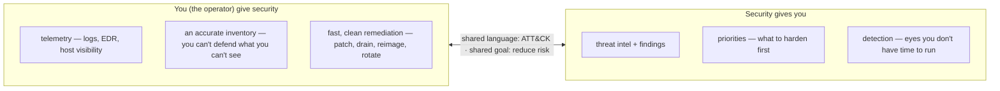
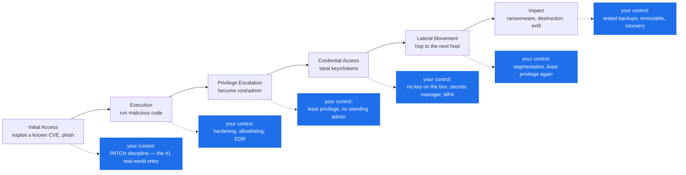
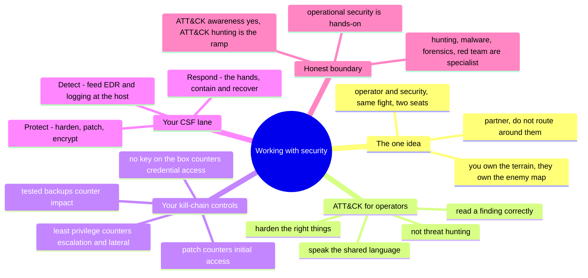

# Working with Security — ATT&CK awareness for operators

> You are not the security team. You are the surface they defend — and their biggest
> force multiplier. Most of what an attacker touches on the way in is *yours*:
> identities, hosts, patches, ports, logs. This note is the operator's half of
> security — how to make the environment defensible, speak the security team's
> language, and know where your job ends and a specialist's begins.

[`the-stack/07`](../the-stack/07-security.md) covered security as a *layer* you build
(defense in depth, CSPM/EDR/SIEM, secrets). This note is the *relationship* and the
*literacy*: how a sysadmin works **with** InfoSec/the SOC, and enough **MITRE ATT&CK**
awareness to harden the right things and read a finding correctly — without pretending
to be a threat hunter.

## The one idea: operator and security are the same fight from two seats

There's a natural tension — security wants to lock it down, you want it to work — and
the teams that resolve it do so with a shared goal and a shared language, not a
standoff:

The reframe that ends the standoff: **security finds and hunts; you harden, patch,
detect-at-the-host, and remediate.** You own the terrain; they own the map of the
enemy. Neither wins alone — and the operator who treats security as a partner, not a
gate to route around, is worth more than one more tool.

## MITRE ATT&CK, for an operator (not a threat hunter)

**ATT&CK** is a catalog of how real adversaries operate — **tactics** (the *why*: their
goals, as columns) and **techniques** (the *how*: specific moves). For a security
analyst it's a hunting and detection framework. For *you*, ATT&CK awareness is three
concrete things, and none of them is "become a threat hunter":

1. **Harden the right things.** Knowing the attacker's path tells you which of *your*
   controls actually matter — you're not checking a generic hardening list, you're
   countering specific moves.
2. **Read a finding correctly.** When security says "we see credential access and
   lateral movement," you know exactly which of your surfaces to check and lock down,
   fast.
3. **Speak the language.** ATT&CK is the shared vocabulary in the incident channel and
   the design review. Using it makes you a partner, not a ticket.

The kill chain, with the control **you** own at each stage — this is the operator's
view of ATT&CK:

Read that bottom row and it's every discipline this repo already teaches — patch
compliance, least privilege ([identity](identity-iam.md)), no-key-on-the-box
([ci-cd](ci-cd.md)), segmentation ([the-stack/02](../the-stack/02-network.md)),
tested backups ([the-stack/04](../the-stack/04-storage.md)). **ATT&CK doesn't add new
work; it tells you *why* the work you already do is the work that matters.**

## The frameworks, operator-honest

Three you'll hear named — know what each is *for*, at an operator's depth:

| Framework | What it is | Your relationship to it |
| --- | --- | --- |
| **ATT&CK** | catalog of adversary tactics & techniques | the shared *language* — recognize the techniques that hit your surface |
| **D3FEND** | the defensive counterpart — maps controls to the techniques they counter | your *map* — turns "harden the box" into "counter these specific moves" |
| **NIST CSF** | the program frame: Identify · **Protect** · **Detect** · **Respond** · Recover | you live mostly in **Protect** + host-level **Detect** + the hands of **Respond** |

The honest operator's lane on that CSF wheel: **Protect** (harden, patch, least
privilege, encrypt), **Detect** at the host (deploy and feed EDR/logging), and the
**hands of Respond** (contain, eradicate, recover — [incident-response](incident-response.md)).
*Identify* (risk/asset — but see [itsm-and-assets](itsm-and-assets.md): your CMDB *is*
the Identify function) and deep *Detect*/hunt are shared-to-specialist.

## The operator's security cadence

Working with security is a rhythm, not an event:

| Cadence | What you do | Why it matters |
| --- | --- | --- |
| **Continuous** | feed the SOC telemetry (host logs, EDR); keep the inventory accurate | they can't defend what you don't show them |
| **Daily** | triage the findings that land on you; patch what's actively exploited | the unpatched known CVE is the classic breach |
| **Weekly** | least-privilege review; close the access and surface that crept | privilege creep is what escalation and lateral movement ride |
| **Monthly** | roll hardened golden images ([the-stack/03](../the-stack/03-compute-and-images.md)); baseline drift check | reimage-over-patch keeps the fleet defensible |
| **Quarterly** | tabletop an incident with security; test a restore | rehearse the response before you need it |
| **On-finding** | contain → remediate fast (drain/reimage/rotate), report back | your cattle discipline is a security superpower |

The theme: **your ordinary operational excellence — patching, least privilege,
inventory, fast reimage — is most of Protect and Respond.** Security's job gets easier
in exact proportion to how well you do yours.

## Ops notes — what goes wrong at the operator/security seam

- **The adversarial relationship.** Treating security as the team that says no — so
  you route around them — is how shadow infrastructure and unpatched exceptions
  accumulate. Partner, or the gaps become breaches.
- **The blind SOC.** Detection is only as good as the telemetry you feed it; a host
  without logging or EDR is a blind spot the attacker loves. Coverage is *your* output.
- **The stale inventory, again.** You can't protect an asset nobody knows exists
  ([itsm-and-assets](itsm-and-assets.md)); shadow and forgotten systems are where
  initial access lands.
- **Slow remediation.** A finding that sits for weeks is a window held open. The
  operator's edge is *speed* — drain, reimage, rotate — not perfect analysis.
- **ATT&CK theater.** Name-dropping techniques you can't act on helps no one. The
  point is mapping a technique to the *control you own*, then closing it.
- **Overreach.** Claiming threat-hunting or forensics depth you don't have is the
  security version of the whole repo's honesty failure — and it fails the moment a
  real specialist asks a follow-up.

## The admin discipline (what to be able to do)

- Read a security finding in **ATT&CK terms** and name which of *your* controls
  counters it.
- Point to the **control you own** for each kill-chain stage (patch → initial access,
  least privilege → escalation/lateral, backups → impact).
- **Feed detection**: deploy EDR and centralized logging so the SOC has host visibility.
- **Remediate fast and cleanly** on a finding — drain, reimage, rotate — not a slow
  hand-patch.
- **Partner in an incident** as the hands ([incident-response](incident-response.md)):
  contain, eradicate, recover.
- Keep a **defensible inventory** ([itsm-and-assets](itsm-and-assets.md)) — the
  Identify function, done as an operator.
- Know the **boundary**: where operational security ends and a security specialist's
  craft (hunting, malware analysis, detection engineering, forensics, red team) begins.

## The AI-assisted ramp (security-collaboration flavor)

- **Translate a finding:** *"A finding says T1078 (valid accounts) and T1021 (remote
  services). I run the hosts and identity — which of my controls counter these, and
  what do I check first?"* AI maps ATT&CK technique IDs to concrete operator actions
  fast.
- **Map your controls to D3FEND:** *"Here's my hardening baseline — which ATT&CK
  techniques does each item actually counter, and where are the gaps?"* Turns a
  checklist into a coverage map.
- **Where AI burns you (verify hardest):** it **invents technique IDs and mitigations**
  (ATT&CK is large and it guesses — check the real technique before you act); it
  **overstates what a control covers** (a single control rarely counters a whole
  tactic); and it will happily let you **speak above your lane** — it doesn't know that
  reading ATT&CK is honest for you while claiming to *hunt* with it isn't. That
  boundary is yours to hold.

## Honest boundaries

✋ **operational security is hands-on ground.** The Protect / host-Detect / Respond-hands
lane is real experience: **patch compliance** as daily ops, **full-disk encryption** at
fleet scale, **EDR** deployed and migrated across a fleet (Defender for Endpoint →
SentinelOne, both consoles), **device security-configuration and network-admission
compliance checks**, **least-privilege access governance** in a multi-approver model,
operating inside **segmented, access-gated, audited environments**, and serving as a
**systems liaison across Infrastructure, Network, and Security** — partnering on
endpoint security models (exactly the "partner with InfoSec" many infra roles ask for).
That's the operator's security, and it's ✋.

🧗 **and stop there, honestly.** **Threat hunting, malware analysis, detection
engineering, digital forensics, and red teaming** are specialist crafts this note does
*not* claim. **ATT&CK *awareness*** — reading it, mapping your controls to it, speaking
it in the incident channel — is honest operator literacy; **ATT&CK-based hunting or
detection *engineering*** is the specialist ramp. If you want that path, the specialist
library is linked from [`the-stack/07`](../the-stack/07-security.md#going-deeper--beyond-the-sysadmins-defensive-baseline)
— and if you cite it, own the boundary. The claim here is the honest one: a strong
operational-security foundation plus the framework literacy to be the security team's
best partner — not a security analyst's badge.

## Lab (🚧 planned — spec)

**Map your own environment to the kill chain.** No tools, just judgment:

1. Take one real service you run. For each kill-chain stage above (initial access →
   impact), write the **one control you own** that counters it — and whether it's
   actually in place.
2. Find your **weakest stage** (usually: an unpatched surface, standing admin, or a
   host with no EDR/logging) and write the concrete fix.
3. **The drill:** write the two-sentence handoff you'd give a SOC analyst about this
   service — in ATT&CK terms — so they know what you've covered and where the gaps are.
   That handoff *is* working with security.

## The chapter on one screen

