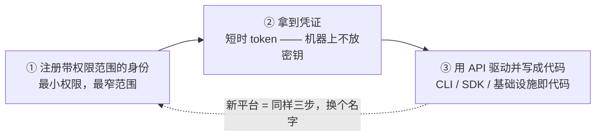
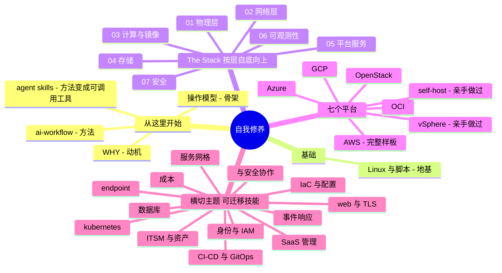

# 系统管理员的自我修养

### The Sysadmin's Self-Cultivation

*一本"驯服云平台"的实战手册 —— 让 AI 给你当副驾。*

> 🌐 **语言：** [English（默认）](../../README.md) · **中文**
>
> ⚠️ 本项目**默认语言为英文**，根目录及 `platforms/`、`the-stack/`、`cross-cutting/` 下的英文文档是"事实来源"。`docs/zh/` 下的中文是多语言支持的一部分，可能略滞后于英文版；两者不一致时以英文为准。

---

## 这是什么

系统管理员真正的功夫，从来不是把每个平台的每个服务都背下来 —— 它是一套**可迁移的心智模型**，加上**在任何平台上快速上手的纪律**。到 2026 年，后半句被 AI 极大加速了：学习曲线从几个月压到几天 —— **前提是**你已经有了驾驭它、并在它出错时抓住它的判断力。

这个仓库把那份判断力写下来：横跨**七个平台**、纵贯**整个技术栈的每一层**，背后守一条硬规矩 —— **✋ 亲手做过的深度**只在真实处声明；其余一律标为**🧗 验证过的 ramp（快速上手）**，映射并核对过，绝不吹。

## 一个核心思想：三个动作

正经管过一个平台，下一个大多只是**在同一副骨架上换语法**：

Jamf、Intune、Entra、AWS、Azure、GCP —— 都是同一副骨架。**把模式学透一次**（见 [`00-the-operating-model.md`](../../00-the-operating-model.md)），之后每个新平台都变成一道"用 AI 就能秒答的映射题"。

## 整体形状

四条轴切同一批材料 —— 从哪条最贴你的问题就从哪进：

最有特色的一条是 **The Stack**：它**自底向上**读技术栈，在**每一层**都把七个平台放一起对比 —— 从机房往上写，不是从控制台往下写。

## 怎么读

| 我想…… | 从这里开始 |
| --- | --- |
| **看整体形状** | [`CONTENTS.md`](../../CONTENTS.md) —— 每个模块、四条轴，一页看全 |
| **懂背后的哲学** | [`WHY.md`](../../WHY.md) → [`00-the-operating-model.md`](../../00-the-operating-model.md) |
| **深入一个平台** | [`platforms/`](../../platforms/) —— **AWS 是完整样板**，从头读到尾 |
| **按层读技术栈** | [`the-stack/`](../../the-stack/) —— 物理层 → 安全，七平台逐层对比 |
| **学一项可迁移技能** | [`cross-cutting/`](../../cross-cutting/) —— 身份 · IaC · CI/CD · 数据库 · ITSM · web/TLS · 事件响应 · 等等 |
| **支持一个我接手的平台** | break-fix **support 笔记**（见 [已建成](#已建成)）—— 反复出现的工单、跨方向经验差、每篇一个可跑 lab |
| **看 AI 怎么被约束诚实** | [`ai-workflow/`](../../ai-workflow/) —— 方法及其护栏 |
| **把方法当工具用** | [`.claude/skills/`](../../.claude/skills/) —— 五个可调用的 Agent Skill（ramp · audit · author · lab · mirror） |

## 已建成

roadmap 计划的都写完了，含**十个可跑、自验证的 lab**（退出码 `0` = 教训成立）、**六篇 break-fix support 笔记**、和**五个 Agent Skill**；剩下的是更多可跑 lab、完整中文镜像（本页已起步），以及深化。

- **基础与方法** —— [WHY](../../WHY.md) · [操作模型](../../00-the-operating-model.md) · [ai-workflow](../../ai-workflow/) · [foundations](../../foundations/)（Linux + 脚本）✅
- **The Stack** —— [七层，01→07](../../the-stack/)，每层对比七个平台，+ 可跑的 [失败域](../../the-stack/labs/01-failure-domains/) 和 [备份演练](../../the-stack/labs/04-backup-not-snapshot/) lab ✅
- **横切与端点** —— [身份](../../cross-cutting/identity-iam.md) · [iac](../../cross-cutting/iac-and-config.md) · [ci-cd](../../cross-cutting/ci-cd.md) · [数据库](../../cross-cutting/databases.md) · [itsm 与资产](../../cross-cutting/itsm-and-assets.md) · [web 与 TLS](../../cross-cutting/web-and-tls.md) · [服务网格](../../cross-cutting/service-mesh.md) · [事件响应](../../cross-cutting/incident-response.md) · [与安全协作](../../cross-cutting/working-with-security.md) · [saas-admin](../../cross-cutting/saas-admin.md) · [kubernetes](../../cross-cutting/kubernetes.md) · [成本](../../cross-cutting/cost.md) · [endpoint](../../endpoint/) ✅
- **Support 笔记（break-fix 手艺）** —— 面向你*接手并支持*、而非只是搭起来的平台：[M365](cross-cutting/m365-support.md) · [AWS](platforms/aws/support.md) · [Azure](platforms/azure/support.md) · [GCP](platforms/gcp/support.md) · [OCI](platforms/oci/support.md) · [Terraform](cross-cutting/terraform-support.md) —— 每篇含反复出现的工单、一个强 sysadmin 会栽的跨方向经验差、一个可跑 lab、和中文镜像 ✅

**平台** —— The Stack 里对比的七个平台各有一个"端到端运维它"的专门模块（是什么 · 技能图 · AI-ramp · 一套 **3-lab CLI arc**），而且**七个现在都带更深的 架构 · 运营 · 自动化 三件套**：

| 平台 | 模块 | 架构·运营·自动化 | Labs | 诚实度 |
| --- | --- | --- | --- | --- |
| **[AWS](../../platforms/aws/)**（完整样板） | ✅ · [support 中文镜像](platforms/aws/support.md) | ✅ ✅ ✅ | ✅ 3-lab arc —— **2 个可跑**（boto3 + Terraform） | 🧗 ramp |
| **[Azure](../../platforms/azure/)** | ✅ · [support 中文镜像](platforms/azure/support.md) | ✅ ✅ ✅ | ✅ 3-lab CLI arc（`az`） | 🧗 + Entra/身份 ✋ |
| **[GCP / GKE](../../platforms/gcp/)** | ✅ · [support 中文镜像](platforms/gcp/support.md) | ✅ ✅ ✅ | ✅ 3-lab CLI arc（`gcloud`） | 🧗 ramp |
| **[OCI](../../platforms/oci/)** | ✅ · [support 中文镜像](platforms/oci/support.md) | ✅ ✅ ✅ | ✅ 3-lab CLI arc（`oci`）+ compartment/verb lab | 🧗 ramp |
| **[vSphere / vCenter](../../platforms/vsphere/)** | ✅ | ✅ ✅ ✅ | ✅ 3-lab CLI arc（PowerCLI） | **✋ 亲手做过**（VCP6-DCV/NV） |
| **[OpenStack](../../platforms/openstack/)** | ✅ | ✅ ✅ ✅ | ✅ 3-lab CLI arc（`openstack` / DevStack） | 🧗 ramp（KVM 相邻 ✋） |
| **[self-host / 裸机](../../platforms/self-host/)** | ✅ | ✅ ✅ ✅ | ✅ 3-lab CLI arc（virsh / ipmitool / ansible） | **✋ 亲手做过**（10万+ 机群） |

七个里两个标 **✋ 亲手做过**（vSphere 和 self-host —— 生产实战，不是 ramp）；其余是诚实的 🧗 ramp。lab 刻意**命令行优先**：命令行更快、更精确、可复现、可审查 —— 而且是你自动化用的同一个界面。

**Agent Skills** —— 仓库自带五个 [`.claude/skills/`](../../.claude/skills/)，把方法论变成可调用的 AI 工作流：**platform-ramp**（诚实地上手任何平台）、**honesty-audit**（把声明分类 ✋/🧗/过度声明）、**author-module**（用仓库的声音写新章，含 **support note**、有据可查）、**runnable-lab**（把概念做成自验证 drill）、**mirror-zh**（把文档镜像成 `docs/zh/` 中文）。

## 关于作者

一名做了 15 年的基础设施与系统工程师（Linux、网络、虚拟化、身份、自动化，规模化），把"在 AI 时代快速上手任何平台"的方法写下来。一个开放建设、一层一层长起来的活项目。欢迎指正与 PR。

## 许可

[MIT](../../LICENSE)。
