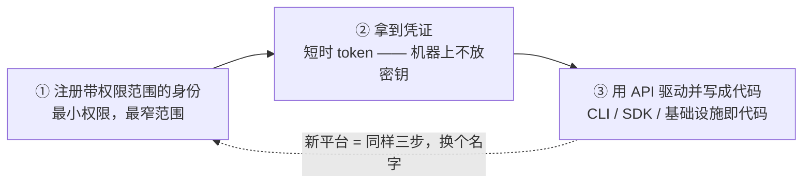
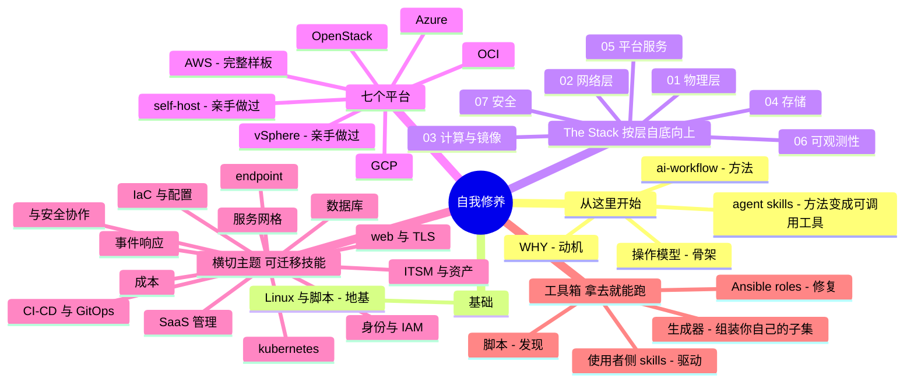

# 系统管理员的自我修养

### The Sysadmin's Self-Cultivation

*一本"驯服云平台"的实战手册 —— 让 AI 给你当副驾。*

> 🌐 **语言：** [English（默认）](../../README.md) · **中文**
>
> ⚠️ 本项目**默认语言为英文**，根目录及 `platforms/`、`the-stack/`、`cross-cutting/` 下的英文文档是"事实来源"。`docs/zh/` 下的中文是多语言支持的一部分，可能略滞后于英文版；两者不一致时以英文为准。

---

## 这是什么

系统管理员真正的功夫，从来不是把每个平台的每个服务都背下来 —— 它是一套**可迁移的心智模型**，加上**在任何平台上快速上手的纪律**。到 2026 年，后半句被 AI 极大加速了：学习曲线从几个月压到几天 —— **前提是**你已经有了驾驭它、并在它出错时抓住它的判断力。

这个仓库把那份判断力写下来：横跨**七个平台**、纵贯**整个技术栈的每一层**，背后守一条硬规矩 —— **🔨 亲手做过的深度**只在真实处声明；其余一律标为**🧭 验证过的 ramp（快速上手）**，映射并核对过，绝不吹。

## 一个核心思想：三个动作

正经管过一个平台，下一个大多只是**在同一副骨架上换语法**：


```mermaid
flowchart LR
  id["① 注册带权限范围的身份<br/>最小权限，最窄范围"] --> cred["② 拿到凭证<br/>短时 token —— 机器上不放密钥"] --> drive["③ 用 API 驱动并写成代码<br/>CLI / SDK / 基础设施即代码"]
  drive -.->|"新平台 = 同样三步，换个名字"| id
```

Jamf、Intune、Entra、AWS、Azure、GCP —— 都是同一副骨架。**把模式学透一次**（见 [`00-the-operating-model.md`](../../00-the-operating-model.md)），之后每个新平台都变成一道"用 AI 就能秒答的映射题"。

## 整体形状

六条轴切同一批材料 —— 从哪条最贴你的问题就从哪进：


```mermaid
mindmap
  root((自我修养))
    从这里开始
      WHY - 动机
      操作模型 - 骨架
      ai-workflow - 方法
      agent skills - 方法变成可调用工具
    基础
      Linux 与脚本 - 地基
    The Stack 按层自底向上
      01 物理层
      02 网络层
      03 计算与镜像
      04 存储
      05 平台服务
      06 可观测性
      07 安全
    七个平台
      AWS - 完整样板
      Azure
      GCP
      OCI
      vSphere - 亲手做过
      OpenStack
      self-host - 亲手做过
    横切主题 可迁移技能
      身份与 IAM
      IaC 与配置
      CI-CD 与 GitOps
      数据库
      ITSM 与资产
      web 与 TLS
      服务网格
      事件响应
      与安全协作
      SaaS 管理
      kubernetes
      成本
      endpoint
    工具箱 拿去就能跑
      脚本 - 发现
      Ansible roles - 修复
      使用者侧 skills - 驱动
      生成器 - 组装你自己的子集
```

最有特色的一条是 **The Stack**：它**自底向上**读技术栈，在**每一层**都把七个平台放一起对比 —— 从机房往上写，不是从控制台往下写。

## 怎么读

| 我想…… | 从这里开始 |
| --- | --- |
| **看整体形状** | [`CONTENTS.md`](../../CONTENTS.md) —— 每个模块、六条轴，一页看全 |
| **懂背后的哲学** | [`WHY.md`](../../WHY.md) → [`00-the-operating-model.md`](../../00-the-operating-model.md) |
| **深入一个平台** | [`platforms/`](../../platforms/) —— **AWS 是完整样板**，从头读到尾 |
| **按层读技术栈** | [`the-stack/`](../../the-stack/) —— 物理层 → 安全，七平台逐层对比 |
| **学一项可迁移技能** | [`cross-cutting/`](../../cross-cutting/) —— 身份 · IaC · CI/CD · 数据库 · ITSM · web/TLS · 事件响应 · 等等 |
| **支持一个我接手的平台** | break-fix **support 笔记**（见 [已建成](#已建成)）—— 反复出现的工单、跨方向经验差、每篇一个可跑 lab |
| **看 AI 怎么被约束诚实** | [`ai-workflow/`](../../ai-workflow/) —— 方法及其护栏 |
| **带上能直接跑的工具** | [`toolbox/`](toolbox/) —— 十个发现/审计脚本（含 VMware→Proxmox 虚拟化四件套）、三个 Ansible 修复 roles、加一个按环境打包子集的[生成器](toolbox/generate/) |
| **把方法当工具用** | [`.claude/skills/`](../../.claude/skills/) —— 十个 Agent Skill：七个包装方法（ramp · audit · author · lab · diagram · mirror · drill），三个驱动工具箱 |

## 已建成

roadmap 计划的都写完了，含**二十个可跑、自验证的 lab**（退出码 `0` = 教训成立）、**八篇 break-fix support 笔记**、**两份[主题技能图](../../cross-cutting/skills-maps/README.md)**、**十个 Agent Skill**、和一个**能直接跑的工具箱**（十个脚本、三个 Ansible 修复 roles、一个按环境打包的[生成器](toolbox/generate/)）；剩下的是更多可跑 lab —— 平台的 lab arc 写得远比建成的多，下表逐个说明 —— 更完整的中文镜像（本页目前覆盖 26 篇），以及按需求深化。

- **基础与方法** —— [WHY](../../WHY.md) · [操作模型](../../00-the-operating-model.md) · [ai-workflow](../../ai-workflow/) · [foundations](../../foundations/)（Linux + 脚本）✅
- **The Stack** —— [七层，01→07](../../the-stack/)，每层对比七个平台，+ 可跑的 [失败域](../../the-stack/labs/01-failure-domains/) 和 [备份演练](../../the-stack/labs/04-backup-not-snapshot/) lab ✅
- **横切与端点** —— [身份](../../cross-cutting/identity-iam.md) · [iac](../../cross-cutting/iac-and-config.md) · [ci-cd](../../cross-cutting/ci-cd.md) · [数据库](../../cross-cutting/databases.md) · [itsm 与资产](../../cross-cutting/itsm-and-assets.md) · [web 与 TLS](../../cross-cutting/web-and-tls.md) · [服务网格](../../cross-cutting/service-mesh.md) · [事件响应](../../cross-cutting/incident-response.md) · [与安全协作](../../cross-cutting/working-with-security.md) · [saas-admin](../../cross-cutting/saas-admin.md) · [kubernetes](../../cross-cutting/kubernetes.md) · [成本](../../cross-cutting/cost.md) · [endpoint](../../endpoint/) ✅
- **Support 笔记（break-fix 手艺）** —— 面向你*接手并支持*、而非只是搭起来的平台：[M365](cross-cutting/m365-support.md) · [AWS](platforms/aws/support.md) · [Azure](platforms/azure/support.md) · [GCP](platforms/gcp/support.md) · [OCI](platforms/oci/support.md) · [Terraform](cross-cutting/terraform-support.md) · [Kubernetes](cross-cutting/kubernetes-support.md) · [Multi-cloud](cross-cutting/multi-cloud-support.md) —— 每篇含反复出现的工单、一个强 sysadmin 会栽的跨方向经验差、一个可跑 lab、和中文镜像 ✅
- **工具箱（拿去就能跑）** —— [charter + 约定](toolbox/README.md) · 十个脚本（分诊 · 用户 · 补丁 · 基线 · 备份演练 · cidr · VMware→Proxmox 虚拟化四件套）· [Ansible 修复 roles](toolbox/ansible/) 与审计脚本配对（audit→fix）· 一个[按环境打包的生成器](toolbox/generate/) —— 安全默认，每个工具带自己的 `Tested on:` 行 ✅

**平台** —— The Stack 里对比的七个平台各有一个"端到端运维它"的专门模块（是什么 · 技能图 · AI-ramp · 一套 **3-lab CLI arc**），而且**七个现在都带更深的 架构 · 运营 · 自动化 三件套**：

| 平台 | 模块 | 架构·运营·自动化 | Lab arc（已规范） | 已建成的 lab | 诚实度 |
| --- | --- | --- | --- | --- | --- |
| **[AWS](../../platforms/aws/)**（完整样板） | ✅ · [support 中文镜像](platforms/aws/support.md) | ✅ | 3 节（boto3 / Terraform） | **01–02 已建**；03 是命令行走查 · 另加 [iam-deny](../../platforms/aws/labs/iam-deny-by-default/) | 🧭 ramp |
| **[Azure](../../platforms/azure/)** | ✅ · [support 中文镜像](platforms/azure/support.md) | ✅ | 3 节（`az`） | arc 一节未建 · [two-planes](../../platforms/azure/labs/global-admin-is-not-owner/) 是独立 drill | 🧭 + Entra/身份 🔨 |
| **[GCP / GKE](../../platforms/gcp/)** | ✅ · [support 中文镜像](platforms/gcp/support.md) | ✅ | 3 节（`gcloud`） | arc 一节未建 · [gke-auth](../../platforms/gcp/labs/gke-iam-vs-rbac/) 是独立 drill | 🧭 ramp |
| **[OCI](../../platforms/oci/)** | ✅ · [support 中文镜像](platforms/oci/support.md) | ✅ | 3 节（`oci`） | arc 一节未建 · [compartment/verb](../../platforms/oci/labs/a-compartment-is-not-an-account/) 是独立 drill | 🧭 ramp |
| **[vSphere / vCenter](../../platforms/vsphere/)** | ✅ | ✅ | 3 节（PowerCLI） | —— | **🔨 亲手做过**（VCP6-DCV/NV） |
| **[OpenStack](../../platforms/openstack/)** | ✅ | ✅ | 3 节（`openstack` / DevStack） | —— | 🧭 ramp（KVM 相邻 🔨） |
| **[self-host / 裸机](../../platforms/self-host/)** | ✅ | ✅ | 3 节（virsh / ipmitool / ansible） | —— | **🔨 亲手做过**（10万+ 机群） |

七个里两个标 **🔨 亲手做过**（vSphere 和 self-host —— 生产实战，不是 ramp）；其余是诚实的 🧭 ramp。lab 刻意**命令行优先**：命令行更快、更精确、可复现、可审查 —— 而且是你自动化用的同一个界面。

**七条 arc 全部写完；二十一节里建成两节**（AWS 01–02），另有四个不属于任何 arc 的独立 drill。这个缺口单独占一列、而不是和已写共用一个 ✅ —— 因为写好的 spec 只是一个计划，而本页第二段立的那条规矩，首先适用于仓库对自己的声明。

**Agent Skills** —— 仓库自带十个 [`.claude/skills/`](../../.claude/skills/)。七个把方法论变成可调用的 AI 工作流：**platform-ramp**（诚实地上手任何平台）、**honesty-audit**（把声明分类 🔨/🧭/过度声明）、**author-module**（用仓库的声音写新章，含 **support note**、有据可查）、**runnable-lab**（把概念做成自验证 drill）、**diagram-module**（判断一篇文档该不该配图、配什么图，并让派生产物保持同步）、**mirror-zh**（把文档镜像成 `docs/zh/` 中文）、**interview-drill**（按面试官的方式把它问回来）。另外三个是**使用者侧**的 —— **linux-triage**、**harden-baseline**、**toolbox-picker** 把[工具箱](toolbox/)包装成 AI agent 能替你驱动的形态：新机器上装一个，一句话跑完一次分诊、或整个 audit→remediate 闭环。

## 在浏览器里读

二十万词已经超过了"翻目录"能应付的规模。[`site/`](site/README.md) 是同一批材料，外加
导航、全文搜索、语言切换和图形渲染 —— 仅此而已。两种启动方式，都不需要安装任何东西：

```bash
python3 site/serve.py                           # http://127.0.0.1:8000
docker compose -f site/docker-compose.yml up    # http://127.0.0.1:8099
```

它是一个**视图**，不是第七条轴：它显示的每个字都是 GitHub 同样会渲染的文件，删掉
`site/` 不会让这个仓库少掉任何一个事实（见
[ADR-0005](../adr/0005-the-site-is-a-view-not-a-seventh-axis.md)）。

## 关于作者

一名做了 15 年的基础设施与系统工程师（Linux、网络、虚拟化、身份、自动化，规模化），把"在 AI 时代快速上手任何平台"的方法写下来。一个开放建设、一层一层长起来的活项目。欢迎指正与 PR。

## 许可

[MIT](../../LICENSE)。
