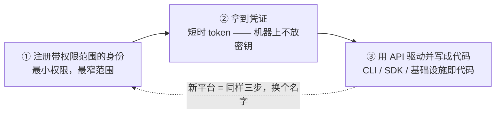
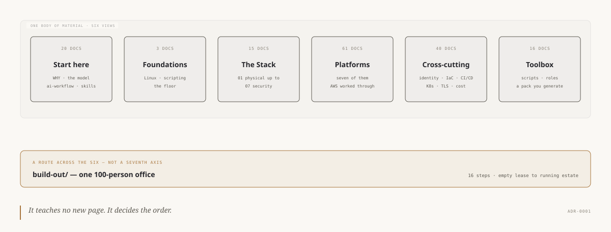

# 系统管理员的自我修养

### The Sysadmin's Self-Cultivation

*一本"驯服云平台"的实战手册 —— 让 AI 给你当副驾。*

> 🌐 **语言：** [English（默认）](../../README.md) · **中文**
>
> ⚠️ 本项目**默认语言为英文**，根目录及 `platforms/`、`the-stack/`、`cross-cutting/` 下的英文文档是"事实来源"。`docs/zh/` 下的中文是多语言支持的一部分，可能略滞后于英文版；两者不一致时以英文为准。

---

## 这是什么

系统管理员真正的功夫，从来不是把每个平台的每个服务都背下来 —— 它是一套**可迁移的心智模型**，加上**在任何平台上快速上手的纪律**。到 2026 年，后半句被 AI 极大加速了：学习曲线从几个月压到几天 —— **前提是**你已经有了驾驭它、并在它出错时抓住它的判断力。

这个仓库把那份判断力写下来：横跨**七个平台**、纵贯**整个技术栈的每一层**，背后守一条硬规矩 —— **🔨 亲手做过的深度**只在真实处声明；其余一律标为**🧭 验证过的 ramp（快速上手）**，映射并核对过，绝不吹。

## 一个核心思想：三个动作

正经管过一个平台，下一个大多只是**在同一副骨架上换语法**：

```mermaid
flowchart LR
  id["① 注册带权限范围的身份<br/>最小权限，最窄范围"] --> cred["② 拿到凭证<br/>短时 token —— 机器上不放密钥"] --> drive["③ 用 API 驱动并写成代码<br/>CLI / SDK / 基础设施即代码"]
  drive -.->|"新平台 = 同样三步，换个名字"| id
```

Jamf、Intune、Entra、AWS、Azure、GCP —— 都是同一副骨架。**把模式学透一次**（见 [`00-the-operating-model.md`](00-the-operating-model.md)），之后每个新平台都变成一道"用 AI 就能秒答的映射题"。

## 整体形状

六条轴切同一批材料 —— 从哪条最贴你的问题就从哪进 —— 外加一条**横穿全部六条的路线**
[`build-out/`](build-out/README.md)，给还不知道该问什么的读者。

<picture>
  <source media="(prefers-color-scheme: dark)" srcset="../../site/assets/diagrams/repo-map.dark.svg">
  
</picture>

这条路线不是第七批材料：它不教任何新页面，它决定的是**顺序**
（[ADR-0001](docs/adr/0001-the-build-out-is-a-route-not-a-seventh-axis.md)）。

现在还有第二条同样的路线：[`walkthrough/`](walkthrough/README.md)
带你走过参考办公室，并用一份写来**被念、被听**而不是被阅读的稿子，讲清每样东西为什么在那里
（[ADR-0009](docs/adr/0009-the-walkthrough-ships-its-script-not-its-audio.md)）。目前共三篇走读，
播放在同一张可平移、缩放、点击的二维楼面上：**[网络](../../walkthrough/01-the-network.zh.md)**，
106 拍；**[第一个星期一](../../walkthrough/02-the-first-monday.zh.md)**，93 拍；以及
**[它坏掉的那一天](../../walkthrough/03-the-day-it-breaks.zh.md)**，102 拍 —— 同一层楼看三遍：
一次当图纸，一次当估算面，一次当一只钟。

最有特色的一条轴是 **The Stack**：它**自底向上**读技术栈，在**每一层**都把七个平台放
一起对比 —— 从机房往上写，不是从控制台往下写。横切（cross-cutting）多的是一个视图而
不是一条轴：[`skills-maps/`](cross-cutting/skills-maps/README.md) 把各平台的技能图
**转置** —— 一个主题横切全部七个平台，做成可勾选的框，按这项技能能走多远来分层，而不是
按它属于哪朵云。

每条轴里的每个模块，一页看全：[`CONTENTS.md`](CONTENTS.md)。

## 怎么读

| 我想…… | 从这里开始 |
| --- | --- |
| **看整体形状** | [`CONTENTS.md`](CONTENTS.md) —— 每个模块、六条轴，一页看全 |
| **懂背后的哲学** | [`WHY.md`](WHY.md) → [`00-the-operating-model.md`](00-the-operating-model.md) |
| **深入一个平台** | [`platforms/`](platforms/) —— **AWS 是完整样板**，从头读到尾 |
| **按层读技术栈** | [`the-stack/`](the-stack/README.md) —— 物理层 → 安全，七平台逐层对比（01–07 全部已镜像） |
| **学一项可迁移技能** | [`cross-cutting/`](cross-cutting/) —— 身份 · IaC · CI/CD · 数据库 · ITSM · web/TLS · 事件响应 · 等等 |
| **核对我究竟会什么** | [`cross-cutting/skills-maps/`](cross-cutting/skills-maps/README.md) —— 一个主题横切全部七个平台，按技能能走多远分层 |
| **准备面试** | [`cross-cutting/interview/`](cross-cutting/interview/README.md) —— 同样的章节从桌子另一侧看：他们问什么、在探什么、答案什么形状 |
| **在平常的周二用 AI** | [`ai-workflow/ai-in-the-day-job.md`](ai-workflow/ai-in-the-day-job.md) —— 分诊 → 变更 → 事件 → 复盘 → 扫尾，以及在哪里把它收回来 |
| **支持一个我接手的平台** | break-fix **support 笔记**（见 [已建成](#已建成)）—— 反复出现的工单、跨方向经验差、每篇一个可跑 lab |
| **看 AI 怎么被约束诚实** | [`ai-workflow/`](ai-workflow/) —— 方法及其护栏 |
| **查一个词或一条旧决策** | [`CONTEXT.md`](CONTEXT.md) —— 每个词在这里是什么意思（以及不是什么）· [`docs/adr/`](docs/adr/) —— 十五条决策及它们击败的选项 |
| **看它还答不上什么** | [`docs/questions.md`](docs/questions.md) —— 有人问过这个仓库、而它还答不上的问题：开放的、已答的、或明确划在边界外并说明原因的 |
| **带上能直接跑的工具** | [`toolbox/`](toolbox/) —— 十个发现/审计脚本（含 VMware→Proxmox 虚拟化四件套）、三个 Ansible 修复 roles、加一个按环境打包子集的[生成器](toolbox/generate/) |
| **把方法当工具用** | [`.claude/skills/`](../../.claude/skills/) —— 十个 Agent Skill：七个包装方法（ramp · audit · author · lab · diagram · mirror · drill），三个驱动工具箱 |
| **改用听的** | [`walkthrough/`](walkthrough/README.md) —— 把参考办公室讲出来：口播稿、可交互二维楼面，仓库内不存音频 |
| **在浏览器里读** | [`site/`](site/README.md) —— `python3 site/serve.py`，或 `docker compose -f site/docker-compose.yml up`。全文搜索、分面、🌐 切换、图形渲染。零安装 |
| **检查它还立得住** | [`check.py`](../../check.py) —— 每一项检查的唯一入口：五个 builder、树里每一条内部链接与锚点、**这个仓库对自己陈述的每一个计数**、走读、viewer 的 URL 契约，以及每一个自验证 lab。`python3 check.py` |
| **让 agent 检索它** | [`docs/index.json`](../index.json) —— 每个文件一条记录，由 [`docs/build-index.py`](../build-index.py) 从 front-matter 生成 |

## 已建成

roadmap 计划的都写完了。剩下的是更多可跑 lab —— 平台的 lab arc 写得远比建成的多，下表
逐个说明 —— 更完整的中文镜像（`docs/zh/` 目前 193 篇；**英文树的每一篇文档现在都有中文镜像** —— 根目录、`build-out/`、`the-stack/`、`cross-cutting/`、`docs/adr/`、`docs/questions/`、`endpoint/`、`foundations/`、`toolbox/`、`platforms/` 全部七个平台目录，以及各处的 lab README），以及按需求深化。

| | 是什么 | 从哪进 |
| --- | --- | --- |
| ✅ | **基础与方法** | [WHY](WHY.md) · [操作模型](00-the-operating-model.md) · [ai-workflow](ai-workflow/) · [foundations](foundations/) |
| ✅ | **技术栈 01→07** | [`the-stack/`](the-stack/README.md) —— 每层对比七个平台，另加两个可跑 lab。中文镜像已补齐：[01 物理](the-stack/01-physical.md) · [02 网络](the-stack/02-network.md) · [03 计算与镜像](the-stack/03-compute-and-images.md) · [04 存储](the-stack/04-storage.md) · [05 平台服务](the-stack/05-platform-services.md) · [06 可观测性](the-stack/06-observability.md) · [07 安全](the-stack/07-security.md) |
| ✅ | **横切与端点** | [`cross-cutting/`](cross-cutting/) —— 17 篇：身份 · IaC · CI/CD · 数据库 · ITSM · web/TLS · 服务网格 · 事件响应 · 与安全协作 · SaaS · K8s · 成本 · [endpoint](endpoint/) |
| ✅ | **技能图** —— 自查用 | [网络](cross-cutting/skills-maps/networking.md)（11 节 / 63 个框）· [身份](cross-cutting/skills-maps/identity.md)（10 / 58）。一个没勾上的 **Core** 框是处处都缺，不是只缺在某一朵云 |
| ✅ | **面试图** —— 桌子的另一侧 | [网络](cross-cutting/interview/networking.md)（21 题）· [身份](cross-cutting/interview/identity.md)（19 题），与技能图逐节对应（[ADR-0004](docs/adr/0004-interview-answers-are-evidence-for-a-marker.md)） |
| ✅ | **Support 笔记** —— break-fix 手艺 | 面向你*接手*而非只是搭起来的平台：[M365](cross-cutting/m365-support.md) · [AWS](platforms/aws/support.md) · [Azure](platforms/azure/support.md) · [GCP](platforms/gcp/support.md) · [OCI](platforms/oci/support.md) · [Terraform](cross-cutting/terraform-support.md) · [Kubernetes](cross-cutting/kubernetes-support.md) · [multi-cloud](cross-cutting/multi-cloud-support.md) |
| ✅ | **工具箱** —— 拿去就能跑 | [十个脚本 + 三个 Ansible roles](toolbox/) 配对成 audit→fix，加一个[打包生成器](toolbox/generate/)。安全默认，每个工具带自己的 `Tested on:` 行 |
| ✅ | **Agent Skills** —— 方法，可调用 | [十个](../../.claude/skills/) —— 七个包装方法，三个驱动工具箱 |
| ✅ | **走读** —— 用听的，不是用读的 | [`walkthrough/`](walkthrough/README.md) —— 目前共三篇走读，播放在同一张可平移、缩放、点击的二维楼面上：**01 · 网络**（[中文](../../walkthrough/01-the-network.zh.md) · [EN](../../walkthrough/01-the-network.en.md)，106 拍）、**02 · 第一个星期一**（[中文](../../walkthrough/02-the-first-monday.zh.md) · [EN](../../walkthrough/02-the-first-monday.en.md)，93 拍）与 **03 · 它坏掉的那一天**（[中文](../../walkthrough/03-the-day-it-breaks.zh.md) · [EN](../../walkthrough/03-the-day-it-breaks.en.md)，102 拍）；稿子放在仓库里，音频不放 |
| ✅ | **浏览器与检索** | [`site/`](site/README.md) —— 全文搜索，零安装：`python3 site/serve.py` 或 `docker compose -f site/docker-compose.yml up` · [`docs/index.json`](../index.json) —— 每个文件一条记录，给 agent 用 |

**二十三个可跑、自验证的 lab** 分布在这些轴下面 —— 退出码 `0` 表示教训成立，多数还带一个
`--break-it` 开关，换上*标准*做法，让你看着它失败。`labs/` 下另有两个目录需要一个真实的云账号，
所以按 [`CONTEXT.md`](CONTEXT.md) 的定义它们是可跑的练习而不是 lab：`check.py` 每次运行都点名它
看得见的那一个，而不是把它算进来；另一个是 Terraform，它没有脚本可以让 `check.py` 注意到。

**平台** —— The Stack 里对比的七个平台各有一个"端到端运维它"的专门模块（是什么 · 技能图 ·
AI-ramp · 一套 **3-lab CLI arc**），而且**七个现在都带更深的 架构 · 运营 · 自动化 三件套**：

| 平台 | 模块 | 架构·运营·自动化 | Lab arc（已规范） | 已建成的 lab | 诚实度 |
| --- | --- | --- | --- | --- | --- |
| **[AWS](platforms/aws/)**（完整样板） | ✅ · [support 中文镜像](platforms/aws/support.md) | ✅ | 3 节（boto3 / Terraform） | **01–02 已建**；03 是命令行走查 · 另加 [iam-deny](platforms/aws/labs/iam-deny-by-default) | 🧭 ramp |
| **[Azure](platforms/azure/)** | ✅ · [support 中文镜像](platforms/azure/support.md) | ✅ | 3 节（`az`） | arc 一节未建 · [two-planes](platforms/azure/labs/global-admin-is-not-owner) 是独立 drill | 🧭 + Entra/身份 🔨 |
| **[GCP / GKE](platforms/gcp/)** | ✅ · [support 中文镜像](platforms/gcp/support.md) | ✅ | 3 节（`gcloud`） | arc 一节未建 · [gke-auth](platforms/gcp/labs/gke-iam-vs-rbac) 是独立 drill | 🧭 ramp |
| **[OCI](platforms/oci/)** | ✅ · [support 中文镜像](platforms/oci/support.md) | ✅ | 3 节（`oci`） | arc 一节未建 · [compartment/verb](platforms/oci/labs/a-compartment-is-not-an-account) 是独立 drill | 🧭 ramp |
| **[vSphere / vCenter](platforms/vsphere/)** | ✅ · 另有 [vCenter 与 Proxmox 中文镜像](platforms/vsphere/vcenter-and-proxmox.md) | ✅ | 3 节（PowerCLI） | —— | **🔨 亲手做过**（VCP6-DCV/NV） |
| **[OpenStack](platforms/openstack/)** | ✅ | ✅ | 3 节（`openstack` / DevStack） | —— | 🧭 ramp（KVM 相邻 🔨） |
| **[self-host / 裸机](platforms/self-host/)** | ✅ | ✅ | 3 节（virsh / ipmitool / ansible） | —— | **🔨 亲手做过**（10万+ 机群） |

七个里两个标 **🔨 亲手做过**（vSphere 和 self-host —— 生产实战，不是 ramp）；其余是诚实的 🧭 ramp。lab 刻意**命令行优先**：命令行更快、更精确、可复现、可审查 —— 而且是你自动化用的同一个界面。

**七条 arc 全部写完；二十一节里建成两节**（AWS 01–02），另有四个不属于任何 arc 的独立 drill。这个缺口单独占一列、而不是和已写共用一个 ✅ —— 因为写好的 spec 只是一个计划，而本页第二段立的那条规矩，首先适用于仓库对自己的声明。

**Agent Skills** —— 仓库自带十个 [`.claude/skills/`](../../.claude/skills/)。七个把方法论变成可调用的 AI 工作流：**platform-ramp**（诚实地上手任何平台）、**honesty-audit**（把声明分类 🔨/🧭/过度声明）、**author-module**（用仓库的声音写新章，含 **support note**、有据可查）、**runnable-lab**（把概念做成自验证 drill）、**diagram-module**（判断一篇文档该不该配图、配什么图，并让派生产物保持同步）、**mirror-zh**（把文档镜像成 `docs/zh/` 中文）、**interview-drill**（按面试官的方式把它问回来）。另外三个是**使用者侧**的 —— **linux-triage**、**harden-baseline**、**toolbox-picker** 把[工具箱](toolbox/)包装成 AI agent 能替你驱动的形态：新机器上装一个，一句话跑完一次分诊、或整个 audit→remediate 闭环。

## 关于作者

一名做了 15 年的基础设施与系统工程师（Linux、网络、虚拟化、身份、自动化，规模化），把"在 AI 时代快速上手任何平台"的方法写下来。一个开放建设、一层一层长起来的活项目。欢迎指正与 PR。

## 许可

[MIT](../../LICENSE)。
