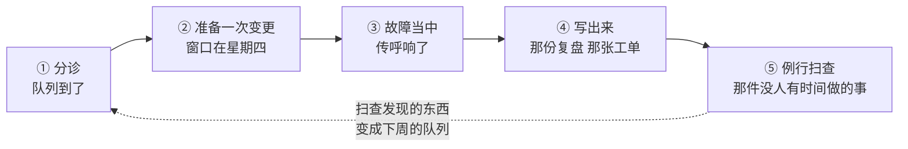

# 日常工作里的 AI

> 🌐 **语言：** [English（默认）](../../../ai-workflow/ai-in-the-day-job.md) · **中文**
>
> ⚠️ 本项目**默认语言为英文**，`ai-workflow/ai-in-the-day-job.md` 是"事实来源"。本页中文是多语言支持的一部分，可能略滞后于英文版；两者不一致时以英文为准。

---

> [`how-i-use-ai-to-learn-and-operate.md`](how-i-use-ai-to-learn-and-operate.md) 的姊妹篇 ——
> 那一篇讲的是 **ramp**，讲抵达一个新地方。这一篇讲的是稳态：一个星期二，有一个队列、一个变更
> 窗口，而里面没有任何新鲜事。

关于"给操作者用的 AI"，几乎所有写出来的东西讲的都是学习：怎么在一个平台上快速上手、怎么把你已经
会的东西翻译到你不会的东西上。那些材料是真实的，而且它们在这个仓库的别处 —— 每一章都带着自己的
*AI 辅助 ramp* 一节，一共三十九节。

它们没有一个回答你在一个星期二下午真正有的那个问题，而那个问题是：
**摆在我面前的这些东西里，哪些我可以交出去？**

那个组织性的想法是：一天有一个形状，而 AI 的用处在这个形状上分布得不均匀。它在工作**枯燥但不难**
的地方非常出色，而它每一次都在完全相同的地方危险：**凡是"自信地错着"和"对着"分不出来的地方。**
接下来这一篇走一遍那个形状，并把两者都标出来。

## 一天的形状

下面每一个阶段只回答两个问题，不回答别的：**什么可以交出去**，以及**你在哪里把它收回来**。

## ① 分诊 —— 队列到了

**交出去：那些阅读。** 一个队列大部分是分类，而分类是最便宜的可委托之物。把二十张工单归纳成几类、
认出那四张其实是同一个底层故障被四个人报了、从三百行的日志粘贴里抽出那真正是错误的那一行。起草回给
报障人的那个澄清问题 —— 那个问版本、问准确时间、问他当时在做什么的问题 —— 那是支持里价值最高的
那条消息，也是最常被跳过的一条，因为写它很无聊。

**收回来：优先级。** 一个模型按文本说了什么来排序。优先级是由文本里**没有**的东西决定的 ——
报障人是谁、星期四会发生什么、这几个里哪一个是这个月第三次复发。把定优先级交出去，产出的是一个
按辞藻排序的队列。

> **那个破绽：** 如果模型的排序让你意外、而你说不出它为什么错，那不是一个"它是对的"的信号。
> 那是一个"你还没有把它所缺的那份上下文写下来"的信号。

## ② 准备一次变更 —— 窗口在星期四

**交出去：第一稿，以及那个对手。** playbook 初稿、回滚步骤、起飞前检查单。然后用第二种方式再用
它一次，而那是更有价值的那一种：**让它去攻击这个计划。** *"如果第 4 步半成功了会坏什么？这个计划
假定了什么已经为真？在 6 和 7 之间失败之后的状态是什么？"* 一个模型非常擅长生成那条你不想去想的
失败分支，一部分原因是它对这个计划能不能成功毫无投入。

**收回来：这次变更到底对不对。** 它会校验你的语法，而不会校验你的意图。它没法知道那个维护窗口和
一个结账期撞了、那个"没用的"子网正是门禁读卡器住的地方，或者厂商在一次电话里说了和他们文档相反的
话。

**并且把爆炸半径收回来。** 让它给出那条命令最窄的版本，然后你自己再收窄一次 —— 一条生成出来的
命令倾向于是**通用的**，而通用正是你碰到比你打算碰的更多东西的方式。

## ③ 故障当中 —— 传呼响了

这是分野最锋利的那个阶段，也是那门纪律最要紧的那个 —— 因为判断在压力之下最糟。

**交出去：回忆和翻译。** 这个错误串通常意味着什么。我一年用两次的这个过滤器语法是什么。哪份日志
有这个字段。读这四千行 trace，告诉我重试是从哪儿开始的。这就是那些否则会烧掉头二十分钟的工作，
而且它恰恰是一个紧张的人做得最差的工作。

**交出去：假设的生成，绝不是假设的选择。** *"给我六个会产出这个症状的原因"*是一个好提示词，而它
好在六个比你自己会列的更多。选哪一个去测是你的事，而那个顺序应该遵循这个仓库到处在用的那门纪律：
**挑那个排除得最多的检查，不是挑那个能确认你最偏爱的那个假设的检查。**

**收回来：任何会写的东西。** 故障当中，没有一条生成出来的命令能在一个人完整读过它之前对生产执行。
那份让 AI 在回忆上最有用的压力，正是那份让它在执行上最不安全的压力，因为你平时会做的那次复查
正是被跳掉的那一步。

**收回来：那段叙事。** 一个被问*"发生了什么？"*的模型，会从局部证据里产出一个流畅、连贯、听起来
完整的故事。在故障当中那个故事是主动有害的 —— 它感觉像理解，而它是一个穿着结论衣服的假设。

> **那条一句话规则：** 故障当中，AI 是一份**参考**，不是一位**同事**。它回答你问的东西。
> 它不做决定。

## ④ 写出来 —— 那份复盘和那张工单

**交出去：从你的笔记生成的初稿。** 这个阶段是一整天里投入产出比最好的那个。时间线在你脑子里、
在一段滚动记录里；把它转成一份读得下去的复盘是真实的工作，而里面几乎没有判断。同样适用于工单更新、
面向客户的摘要，以及变更记录 —— 这些东西之所以写得糟或者写得晚，是因为写它们的人已经把问题解决了、
已经不在乎了。

**交出去：那次结构检查。** *"这份复盘点的是一个成因还是一个人？"* *"这些行动项里哪一个没有归属
人？"* *"这份文档断言了什么是那条时间线支撑不了的？"* 这些是人做得很不一致的机械检查 ——
尤其是对自己写的东西。

**收回来：那个成因，以及那份诚实。** 模型会接受你的框架。如果你的笔记暗示成因是一个厂商，而它
实际上是你去年做的一个设计决定，它会把那个版本流畅而有说服力地写出来。这个仓库在乎的每一份复盘，
都是那份"让人不舒服的那句话留下来了"的复盘，而没有哪个模型会替你坚持要它。

## ⑤ 例行扫查 —— 那件没人有时间做的事

杠杆最高的阶段，也是最常被跳过的那个，因为它不是任何人的工单。访问复审、证书过期、没用的防火墙
规则、陈旧账号、快照蔓延、备份恢复测试。

**交出去：那次列举和那次比对。** 拉出清单、对着上个月的比，描述变了什么。两个事实来源被对上，
每一处差异都被解释。这就是大部分 [`toolbox/`](../toolbox/) 的形状 —— 而那些工具之所以存在，
是因为这正是脚本同时胜过一个人和一个模型的那类工作，而这件事值得平白说出来，而不是假装一切都路由
给 AI。

**收回来：那个连接键，以及那份残差。** 对账是错误答案最自信的地方：拿错误的键去连接两份清册，
会产出一份干净的、装满了并不存在的记录的报表，而那个顾问层会为其中每一条产出说得通的成因。
[asset-reconciliation lab](../cross-cutting/labs/asset-reconciliation) 存在的意义就是把那个
失败变得可见 —— 你挑的那个键决定了这片机队有多少是虚构的。

而**在一次称职的检查之后仍然存活的，是那份成因不在任何一个系统里的残差。** 那就是这整个仓库反复
落到的那条边界：一个模型可以给候选项排序，而那个决定需要一个知道某些记录里不包含的东西的人。

## 底下那个规律

把这五个阶段连起来读，那个分野每一次都是同一个，只是说法不同：

| 交出去 | 收回来 |
| --- | --- |
| 阅读、归纳、抽取 | 决定什么要紧 |
| 生成候选项 | 在它们之间做选择 |
| 从你的笔记起草散文 | 那些笔记诚不诚实 |
| 列举与比对 | 那次比对所连接的那个键 |
| 回忆语法与语义 | 任何会写的东西 |

也就是[规则 1](how-i-use-ai-to-learn-and-operate.md) —— *AI 提供速度，判断提供真相* —— 附上这一天
的具体细节。那条规则在这里不是新的。新的是：在你开始每一个阶段之前，就知道自己站在那条线的哪一侧。

## 诚实边界

🔨 上面那个运维形状是生产工作 —— 那个队列、那个变更窗口、那次故障、那次写出来、那次扫查，就是
这份工作，而枯燥的那一半坐在哪里没有疑问。

🧭 面向 agent 化运维的**具体工具** —— 对生产系统有常驻访问权的模型、自主修复、由 agent 跑的
runbook —— 是一条 ramp，不是实践。这个仓库在那件事上的立场是刻意保守的：每一个
[`toolbox/`](../toolbox/) 工具都是默认安全、除非被告知否则只读，而那些
[Agent Skills](../../../.claude/skills/) 驱动的是那些工具，而不是直接驱动那些系统。那是一个关于
爆炸半径的立场，而它值得作为一个立场被说出来，而不是被呈现成唯一可能的设计。
