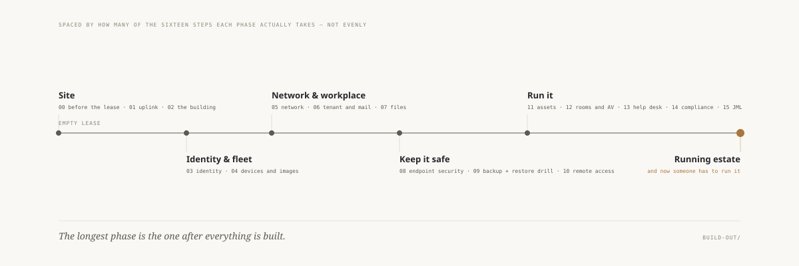

# The Build-Out —— 一间办公室，从第一天到开门营业

> 🌐 **语言：** [English（默认）](../../../build-out/README.md) · **中文**
>
> ⚠️ 本项目**默认语言为英文**，`build-out/README.md` 是"事实来源"。本页中文是多语言支持的一部分，可能略滞后于英文版；两者不一致时以英文为准。

---

> 一条**横穿**其他各轴的路线，不是又一条轴。每一步说明它产出什么、什么必须先成立、什么
> 依赖它 —— 然后把实质内容指向 `platforms/`、`the-stack/`、`cross-cutting/`、
> `foundations/`、`endpoint/` 和 `toolbox/`。**没有任何一步教一个新页面。**
> 决定：[`docs/adr/0001`](../docs/adr/0001-the-build-out-is-a-route-not-a-seventh-axis.md)

<picture>
  <source media="(prefers-color-scheme: dark)" srcset="../../../site/assets/diagrams/build-out-route.dark.svg">
  
</picture>

*间距与步骤数成比例，而这正是要点：所有东西都建完之后的那个阶段是最长的一个。*

## 为什么"顺序"是一个有用的切法

*（写在十六步存在**之后**，不是之前 —— 这个主张必须经得起被试一遍。）*

六条轴很好地回答了*这是什么？* 而它们没有一条能回答**在这之前什么必须成立？**，因为依赖
不是一个主题的属性。它是主题**之间**的一种关系，而一套分类法没有地方放它。

这话听起来很抽象，直到你给它标价。写这十六步的过程中掉出三件事，而无论把那些轴读多少遍都
不会浮现出来：

- **[身份](03-identity.md)的 `Before` 列表是空的。** 它是一次 build-out
  里唯一一个没有物理前置条件的步骤 —— 它可以在还没有楼的时候就开始，而后面有八步挂在它
  上面。把它放在硬件之后，你不是排序排差了，你是承诺了要把每一张桌子上的机器重装一遍。
- **[资产](11-assets-and-tickets.md)编号第十一，却必须从第 1 台设备就
  开始。** 这个编号对依赖是诚实的，对时间是撒谎的。一个把编号当日程表来跟的读者会把这件事
  彻底搞反，所以这一步在它的第一行就说了。
- **[人手](13-the-help-desk.md)在第十二步之前无法回答。** "一百个人需要
  几个 IT" 在估算面被枚举清楚、并且你知道步骤 04、08、15 移除了哪几类工作之前，没有诚实的
  答案。

十六步之间的依赖图无环且完全对称 —— 每一个 `Before` 都有它匹配的 `After`。那是可核对的，
而且被核对了。一个经得起这个检查的排序，是一副真实的结构，而不是叙事上的便利。

**这个系列不是什么：** 新材料。它不教任何一个那些轴还没有持有的页面。如果某一步开始解释
SCIM 怎么工作，它就失败了，而那段解释属于上游。

## 场景，钉死

每一步都假设同一家公司，好让没有哪一步需要回答"看情况"：

| | |
|---|---|
| **规模** | 100 人 |
| **站点** | 一个主办公室，一个小分支 |
| **托管** | 被迫混合 —— 少数东西必须留在本地（门禁、工牌打印、lab 器材） |
| **合规** | 一个客户要求 SOC 2，而正是它让身份、日志和资产记录变成承重的而不是锦上添花的 |
| **时间** | 今天，并在旁边带着*"同一步在 2015 年是怎么走的"* |

## 各步

按**依赖**排序 —— 什么必须在什么之前成立 —— 而不是按技术领域。

| # | 步骤 | 🔨/🧭 |
|---:|---|:--:|
| 00 | [签租约之前要问的问题](00-before-the-lease.md) | 🧭 |
| 01 | [上联 —— 运营商、带宽、冗余](01-uplink.md) | 🧭 / 🔨 |
| 02 | [这栋楼 —— 竖井、IDF、供电、制冷、走线路径](02-the-building.md) | 🧭 / 🔨 |
| 03 | [**身份** —— 目录、组、SSO](03-identity.md) | 🔨 |
| 04 | [设备与镜像 —— 采购、构建、纳管](04-devices-and-images.md) | 🔨 |
| 05 | [网络 —— VLAN、无线、访客、打印、门禁](05-network.md) | 🔨 |
| 06 | [租户与邮件 —— 域名、路由、SPF/DKIM/DMARC](06-tenant-and-mail.md) | 🔨 |
| 07 | [文件与协作 —— 状态住在哪、谁能看见它](07-files-and-collaboration.md) | 🔨 |
| 08 | [终端安全与打补丁](08-endpoint-security-and-patching.md) | 🔨 |
| 09 | [备份 —— 以及还原演练](09-backup-and-the-restore-drill.md) | 🔨 |
| 10 | [远程访问 —— VPN，或者取代了它的那个东西](10-remote-access.md) | 🔨 |
| 11 | [**资产与工单** —— 那本从第 1 台设备就开始的记录](11-assets-and-tickets.md) | 🔨 |
| 12 | [会议室、AV 与 UC —— 没人认领的那个孤儿](12-meeting-rooms-av-and-uc.md) | 🧭 |
| 13 | [服务台本身 —— 以及这需要几个人](13-the-help-desk.md) | 🔨 |
| 14 | [合规证据 —— 一次审计实际要什么](14-compliance-evidence.md) | 🔨 |
| 15 | [入转离，自动化](15-joiner-mover-leaver.md) | 🔨 |

**预算与采购是每一步里的一个小节，而不是它们自己的一步** —— 钱在这里的每一步上都要决定，
而把它们收进一个文件会产出一章没人读的财务内容。

这个场景浮出来的缺口：[`GAPS.md`](GAPS.md)。

## 一步的形状

```
# NN · <这一步是什么>
> 🔨/🧭 · Before: <必须先做完的步骤> · After: <依赖它的步骤>

## What this step produces        某个可核对的东西，不是一张主题清单
## Questions to ask first          这个系列的家法
## 2015 → today                    多出或去掉的组件与动作
##   how much of that is AI, and how much is SaaS-ification
## Read deeper                     指进那些轴 —— 绝不在这里复述
## Do it                           一个 lab 或一个 toolbox 工具；没有就写 "gap"
## Getting it backwards            把这件事按错误顺序做，实际代价是什么
```

最后那一节才是要紧的。一本手册之所以干，是因为它永远只描述正确的路径；而这个系列被允许说出
错误的那条路花了多少钱。

## 关于 AI 那一栏

多数步骤对*"这里面有多少是 AI？"*的回答是**几乎没有**，并且直白地这么说 —— 身份、邮件、
文件和发放这几处从 2015 到今天的变化是 SaaS 化，而把它记在一个模型头上，是在邀请第一个正确
的反驳。

[步骤 12](12-meeting-rooms-av-and-uc.md) 是那个例外，而它存在的部分理由
正是要证明这一栏是在**测量**而不是在**断言**：实时转写、说话人归属和摘要是真正由模型驱动
的，也是真正新的。**一个永远给同一个答案的系列，什么都没有在测量。**

在 AI 确实出现的地方，它站在一条每一步都用同样方式划出的线的一侧：**让它去找到那样东西；
不要让它去改动那样东西。** 这条线在这里不是一种意见 —— 它是从业者实际授权的边界，而
[步骤 08](08-endpoint-security-and-patching.md) 带着那些数字。
