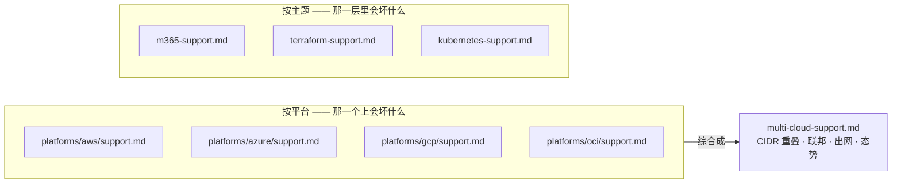

# cross-cutting/

> 🌐 **语言：** [English（默认）](../../../cross-cutting/README.md) · **中文**
>
> ⚠️ 本项目**默认语言为英文**，`cross-cutting/README.md` 是"事实来源"。本页中文是多语言支持的一部分，可能略滞后于英文版；两者不一致时以英文为准。

---

跨**每一朵**云都能迁移的那几层。把它们当概念学透一次，之后在每个平台上你基本只是在翻译
词汇。这里正是一个系统管理员已有的深度（Linux、网络、身份、自动化）回报最大的地方。

**专门笔记** —— 那些最适合当作"横跨所有平台的一个概念"来学的主题：

| 笔记 | 覆盖什么 | 状态 |
| --- | --- | --- |
| [`identity-iam.md`](identity-iam.md) | 最小权限、role 与 policy 之别、短期凭据、生命周期（JML）、SSO/SAML/OIDC、SCIM —— 在 AD、Entra、AWS IAM、Azure RBAC、GCP IAM、Okta 上是同一门纪律。 | ✅ |
| [`iac-and-config.md`](../../../cross-cutting/iac-and-config.md) | 供给（Terraform）与配置管理（Ansible/Puppet）之别：state、module、plan/apply/destroy、幂等、漂移。 | ✅ |
| [`terraform-support.md`](terraform-support.md) | 把 Terraform support 当作修/救手艺：state/漂移/强制替换/count vs for_each、反复出现的工单与你该去哪儿看，以及要卸掉的那些 Ansible sysadmin 直觉。**🧭** | ✅ |
| [`ci-cd.md`](../../../cross-cutting/ci-cd.md) | 发布流水线：CI/CD、构建一次逐级晋升、用 OIDC 取代密钥、GitOps（拉 vs 推）、回滚。 | ✅ |
| [`databases.md`](../../../cross-cutting/databases.md) | 运维有状态的那个难点：可用性、可恢复性（备份/PITR）、性能、自建 vs 托管。**🔨** | ✅ |
| [`itsm-and-assets.md`](itsm-and-assets.md) | ITSM（事件/请求/变更）、CMDB、资产对账、访问治理与审计。**🔨** | ✅ |
| [`saas-admin.md`](saas-admin.md) | Google Workspace 与 M365 管理、身份主干、SCIM 生命周期 —— 把生产力套件当作一份受管估算面。 | ✅ |
| [`m365-support.md`](m365-support.md) | 把 M365 support 当作修/救手艺：你负责什么、反复出现的工单与你该去哪儿看，以及一个强 sysadmin 要接手它必须卸掉的那些本地/云直觉。**🔨** | ✅ |
| [`kubernetes.md`](../../../cross-cutting/kubernetes.md) | 对象模型与运维者视角，比 the-stack/05 深一层；托管 vs 自建，那份调试反射。 | ✅ |
| [`kubernetes-support.md`](kubernetes-support.md) | 把 Kubernetes support 当作修/救手艺：调谐环、CrashLoopBackOff / OOMKilled /"服务挂了但 Pod 是 Running"、反复出现的工单与你该去哪儿看，以及要卸掉的那些 Linux/systemd/Docker 直觉。**🧭** | ✅ |
| [`multi-cloud-support.md`](multi-cloud-support.md) | 把多云 support 当作修/救手艺：云与云之间的那些接缝 —— CIDR/路由、跨云身份/联邦、出网/数据引力、一致的态势 —— 以及为什么单云的对等直觉会咬人。它综合了四篇平台 support 笔记。**🧭** | ✅ |
| [`service-mesh.md`](../../../cross-cutting/service-mesh.md) | 服务发现 + service mesh：活的注册表、sidecar 的 mTLS/流量/可观测，以及"你到底需不需要一个？" | ✅ |
| [`web-and-tls.md`](../../../cross-cutting/web-and-tls.md) | Web 服务器、反向代理与 TLS：终结、路由、证书生命周期 + ACME、那扇加固过的前门。**🔨** 基本功 | ✅ |
| [`incident-response.md`](../../../cross-cutting/incident-response.md) | 事件响应与 on-call：生命周期（先缓解）、IC 角色、人道的 on-call、无指责复盘。 | ✅ |
| [`working-with-security.md`](../../../cross-cutting/working-with-security.md) | 安全的运维者那一半：与 InfoSec/SOC 协作 + MITRE ATT&CK 意识（加固对的东西），诚实的 🔨 运维安全 vs 🧭 专家。 | ✅ |
| [`debug-ladder.md`](../../../cross-cutting/debug-ladder.md) | 网络调试阶梯每一级一条命令，按它**排除了什么**而不是按它报告了什么来挑选 —— 以及为什么 *refused* 与 *timed out* 之别，比这一页其余部分承载的信息都多 —— **🔨** |
| [`vpn-and-remote-access.md`](../../../cross-cutting/vpn-and-remote-access.md) | 从点下连接到够到那样东西之间到底发生了什么 —— 五个由某个人负责的决策、为什么你发给远程用户的那个地址此后会出现在每一条日志里，以及为什么分流隧道坏在 DNS 上而不是坏在路由上 —— **🔨** |
| [`network-evolution.md`](../../../cross-cutting/network-evolution.md) | 办公网络十五年的变化，以及解释了其中大部分的那一次移动：网络不再是通往你工作的路径，而变成了通往互联网的路径。那件事对防火墙的轴、负载均衡器、工位端口和射频做了什么 —— 有线侧 **🔨**，无线侧 **🧭** |
| [`site-network-design.md`](../../../cross-cutting/site-network-design.md) | 为一个物理场地设计网络：每个网段都有理由的分段、一份挺得过合并的地址规划、有线 vs 无线、DNS/DHCP 归属、802.1X、可证明的访客隔离。除无线为 **🧭** 外均为 **🔨**。 | ✅ |
| [`cost.md`](cost.md) | 把成本当作一等的运维控制：预算、告警、right-sizing、"被遗忘的 GPU 实例"问题。 | ✅ |

**support 笔记在哪里汇合。** 上面以及 `platforms/` 里有八篇是 **support 笔记** —— 讲的是
接手一样东西的修/救手艺，而不是它的概念。它们分两种，而只有其中一种会被综合：

主题那几篇没有对应的综合，而这是一句陈述而不是一个缺口：云**之间**会坏什么是一个主题；
Terraform 和 Kubernetes 之间会坏什么不是。

**技能图** —— [平台技能图](../../../platforms/aws/skills-map.md)的转置：一个主题横切每一个
平台，按每项技能能走多远而不是按它属于哪朵云来分层。见
[`skills-maps/`](../../../cross-cutting/skills-maps/README.md)。

| 图 | 覆盖 | Marker |
| --- | --- | --- |
| [`skills-maps/networking.md`](../../../cross-cutting/skills-maps/networking.md) | 编址、路由、L2/overlay、DNS、DHCP、过滤规则、负载均衡、TLS、远程访问、流分析、跨云 —— 63 格 | 🔨 ×9 · 🧭 ×2 |
| [`skills-maps/identity.md`](../../../cross-cutting/skills-maps/identity.md) | 目录、认证/授权、联邦与 SSO、运营一个 IdP、SCIM/JML、RBAC、条件访问、特权访问、访问复审、工作负载身份 —— 58 格 | 🔨 ×8 · 🧭 ×2 |

**面试图** —— [技能图](../../../cross-cutting/skills-maps/README.md)再转置一次，从桌子的另
一侧看：会被问什么、每个问题探什么，以及那个形状随小节 marker 而定的答案。见
[`interview/`](../../../cross-cutting/interview/README.md)。

| 图 | 配对 | 问题数 |
| --- | --- | --- |
| [`interview/networking.md`](../../../cross-cutting/interview/networking.md) | [`skills-maps/networking.md`](../../../cross-cutting/skills-maps/networking.md) | 11 节共 21 问 |
| [`interview/identity.md`](../../../cross-cutting/interview/identity.md) | [`skills-maps/identity.md`](../../../cross-cutting/skills-maps/identity.md) | 10 节共 19 问 |

**在 [`the-stack/`](../the-stack/) 里按层覆盖** —— 交叉链接，不重复（这些按层读比
当作独立主题读更自然）：

| 主题 | 在哪 |
| --- | --- |
| 网络 | [`the-stack/02-network.md`](../the-stack/02-network.md) |
| 存储 | [`the-stack/04-storage.md`](../the-stack/04-storage.md) |
| 虚拟化 | [`the-stack/01-physical.md`](../the-stack/01-physical.md) |
| 可观测 | [`the-stack/06-observability.md`](../the-stack/06-observability.md) |
| 安全与合规 | [`the-stack/07-security.md`](../the-stack/07-security.md) |

> 这个目录的意义：学完 AWS 之后，Azure 和 GCP 的大部分变成*"这些概念里哪一个被改叫成了
> 什么，坑在哪？"* —— 一旦概念本身扎实，这个问题回答起来很快。这个目录如何嵌进整张地图，
> 见 [`../CONTENTS.md`](../CONTENTS.md)。
