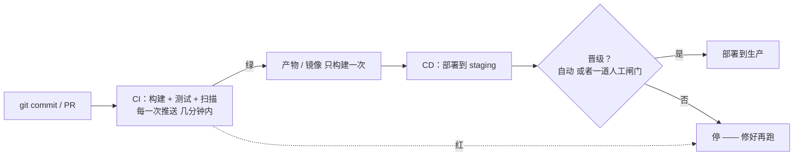
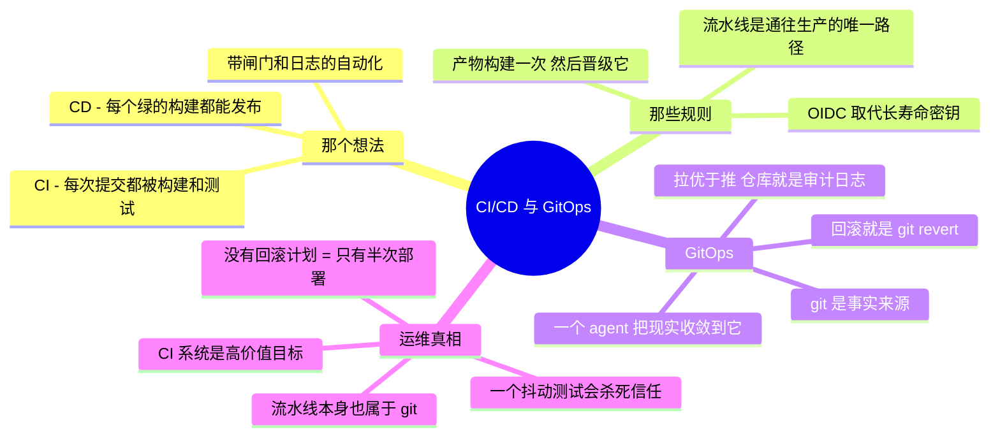

# CI/CD 与 GitOps —— 那条部署流水线

> 🌐 **语言：** [English（默认）](../../../cross-cutting/ci-cd.md) · **中文**
>
> ⚠️ 本项目**默认语言为英文**，`cross-cutting/ci-cd.md` 是"事实来源"。本页中文是多语言支持的一部分，可能略滞后于英文版；两者不一致时以英文为准。

---

> 标准路线图放在正中央、而这个仓库欠了它一篇专门笔记的那一个话题。这里别的一切讲的都是你**跑
> 什么**；CI/CD 讲的是**变更怎么抵达生产** —— 安全地、可重复地，而且没有一个人手捧着一个文件
> 走到一台服务器跟前。把这件事做对，"部署"就不再是一件你害怕的事。

CI/CD 是变更的那条流水线。**持续集成**是"每一次提交都被自动构建和测试，所以坏掉的代码在几分钟内
就被抓住，而不是在发布时"。**持续交付/部署**是"每一个通过的构建都**能**——或者**就是**——自动
发布出去，从代码来，没有手动拷贝那一步"。它和 [IaC](iac-and-config.md) 是同一份
[运营模型](../00-the-operating-model.md)直觉：把流程描述一次，放进版本控制，然后让机器每一次都
一模一样地执行它。

## 为什么现在这归系统管理员管

"系统管理员"和"那条流水线"之间的那条线没有了。你不再手动部署一个应用、手动给一片机队打补丁、
手动跑一个备份脚本 —— 你把那些步骤放进一条流水线，让它按触发器去跑、把它们记下来、并且大声地
失败。[foundations](../foundations/README.md) 那个"**自动化是你扩张系统而不是扩张工单的方式**"
的想法，在这里抵达它的结论：一条流水线就是带记忆、带闸门、带审计轨迹的自动化。如果你能把它写成
脚本（你能），你就能把它做成流水线。

## 流水线，作为一个形状



这个形状编码了两条规则：**产物只构建一次，并且把*同一个*晋级**穿过各个环境（绝不逐阶段重建
—— "在 staging 好用、到生产就坏"就是这么来的），以及**流水线是通往生产的唯一路径**（一次绕过它
的变更就是漂移，也就是 [IaC](iac-and-config.md) 那宗罪，在部署这个尺度上）。

## 工具，按生态改名

和这个仓库里每一片面一样，概念可迁移，名字会变：

| 概念 | GitHub | GitLab | Jenkins | 云原生 |
| --- | --- | --- | --- | --- |
| **流水线定义** | Actions（YAML workflow） | `.gitlab-ci.yml` | Jenkinsfile（Groovy） | CodePipeline / Cloud Build / Azure Pipelines |
| **Runner / 执行器** | GitHub 托管或自托管 runner | GitLab runner | agent/node | 托管 |
| **触发器** | push、PR、定时、手动 | 同上 | SCM 轮询、webhook | 同上 |
| **密钥** | Actions secret / OIDC | CI/CD 变量 | credentials 插件 | 那朵云的密钥管理器 |

在安全上最要紧的那一条：**在 CI 系统里，优先用 OIDC / 工作负载身份，而不是长寿命的云密钥。**
一条通过 OIDC 扮演角色的流水线没有可泄露的密钥 —— 就是[身份](identity-iam.md)那条"机器上不放
密钥"的规则，套到构建服务器上（而构建服务器是一个极具吸引力的目标，恰恰因为它能部署任何东西）。

## GitOps —— 部署的拉模型

GitOps 是 CI/CD 面向 Kubernetes 和云基础设施的现代终局：**git 是期望态的唯一事实来源，而一个
集群内的 agent 持续把现实收敛到它** —— 和 [Kubernetes](kubernetes.md) 自己、和
[Ansible](iac-and-config.md)、和 [Terraform](iac-and-config.md) 是同一条声明并收敛的循环，套到
部署上。

- **推式 CD**（传统）：流水线伸**进**集群里去施加变更 —— 流水线需要生产凭据。
- **拉式 GitOps**（ArgoCD / Flux）：一个集群**内部**的 agent 盯着一个 git 仓库，把变更拉给自己
  —— 没有任何外部系统持有生产凭据，而那个仓库是一份完美的审计日志（"谁改了生产、什么时候"＝
  `git log`）。

回报还是这个仓库反复回到的那一个：**期望态在版本控制里，漂移是一份 diff，回滚是 `git revert`。**

## 运维笔记 —— 什么会把你叫醒

- **那个侵蚀信任的抖动测试** —— 一个随机失败的测试，会训练团队一直重跑到变绿，而那把 CI 的全部
  意义都打败了。把抖动测试修好或者隔离掉；一条没人信的流水线比没有更糟。
- **逐阶段重建** —— 构建一次，晋级同一个产物；重建会把 CI 本该杀掉的那个"在生产上不一样"的 bug
  重新引入。
- **流水线里的密钥** —— CI 系统是高价值目标（它们能部署任何东西）；一把泄露的密钥或者构建里一个
  恶意依赖，就是一次供应链故障（[安全](../the-stack/07-security.md)）。用 OIDC 取代静态密钥；
  把依赖钉死并扫描。
- **没有回滚计划** —— "部署"只是一半；另一半是"快速反部署"。蓝绿、金丝雀，或者一条测过的
  `git revert` 路径 —— 在那次坏部署**之前**决定，不是在它当中。
- **变成雪花机的那条流水线** —— 一台多年手工配置、没人重建得出来的 Jenkins。流水线定义和别的
  一切一样属于 git；CI 系统本身也应该是可复现的。

## 管理纪律（你应该做得到什么）

- 写一条在每次推送时构建、测试、扫描的 **CI 流水线**，并读懂它自己的失败。
- 让**同一个产物**在一道闸门之后从 staging 晋级到生产，并解释为什么逐阶段重建是错的。
- 接上 **OIDC / 工作负载身份**，让流水线不持有任何长寿命云密钥。
- 搭起一条 **GitOps** 流程（ArgoCD/Flux），并解释拉与推的差别，以及为什么那个仓库就是审计日志。
- 有一个你**真的测过**的回滚 —— 蓝绿、金丝雀，或者 `git revert`。
- 把一条流水线读成**带闸门和日志的自动化** ——
  [foundations](../foundations/README.md) 里那份脚本能力的自然延伸。

## AI 辅助的 ramp（CI/CD 口味）

- **从脚本翻译过来：** *"我用 Bash/Python/Ansible 自动化机队任务 —— 把这个部署脚本变成一个
  GitHub Actions workflow，并让我看看流水线在哪些地方加上了我从 cron 拿不到的闸门和日志。"*
- **让它起草 YAML，安全部分你来核：** AI 写 workflow / `.gitlab-ci.yml` 很快 —— 而且它默认给
  **长寿命密钥和过宽的权限**。每一条生成出来的流水线，凭据都要手动收紧到 OIDC/最小权限。
- **AI 会烧到你的地方（验得最狠的地方）：** 它会**发明不存在或者已被弃养的 Actions/step 语法和
  marketplace action 版本**（这是一项供应链风险 —— 钉到一个 SHA，不要钉一个浮动 tag）；它会
  **硬编码密钥**而不是用密钥存储或 OIDC；而且它会**完全跳过回滚**。任何能部署到生产的东西，都要
  当成它马上就要部署那样去读 —— 因为它就是。

## 诚实边界

🧭 **一条建在 🔨 地基上的 ramp。** CI/CD 所倚靠的那门**自动化纪律**是亲手做过的 ——
Bash/Python/Ansible 的机队自动化、把 Git 当作日常版本控制、幂等，以及"把步骤放进代码里，而不是
放进一个人身上"那份直觉（[foundations](../foundations/README.md)、[iac](iac-and-config.md)）。
建造并运维**生产 CI/CD 流水线与 GitOps**（规模上的 Jenkins/Actions/GitLab CI、生产里的 ArgoCD）
是一条 **🧭 ramp** —— 那些概念是扎实的、测绘过的、对着当前文档验证过的，但没有被声称成多年运行
一个交付平台。那句可迁移的声称是：一份很深的自动化地基，加上一条通向你面前那个具体 CI/CD 工具的、
快速而诚实的 ramp —— 正是 [`WHY.md`](../WHY.md) 所论证的那个形状。

## Lab（✅ 可跑 —— [`labs/ci-cd-pipeline/`](labs/ci-cd-pipeline)）

**给一个小服务的一条真实流水线** —— 一个压在一个有测试的应用之上的、有效的 GitHub Actions
workflow。现在就能在本地跑那个测试作业（纯标准库，不用装东西）：

```bash
cd cross-cutting/labs/ci-cd-pipeline/app && python3 -m unittest -v
```

这个 [lab](labs/ci-cd-pipeline) 带上了 `hostcheck` 应用加测试，以及一个
真实的 `ci.yml`，把这一章的规则编码了进去：**每次推送都测试**、**产物只构建一次**（以测试变绿
为闸），以及**一次用 OIDC、以人工审批为闸的部署**（仓库里没有长寿命密钥）。这个 workflow 住在
`.github-workflows-example/` 下面，好让它不对着这个教学仓库跑 —— 把它拷进 `.github/workflows/`
就能让它活过来。用那次回滚演练去扩展它：发一个坏变更，然后 `git revert` 加重跑，并证明期望态
完全住在 git 里。

## 这一章一屏看完


