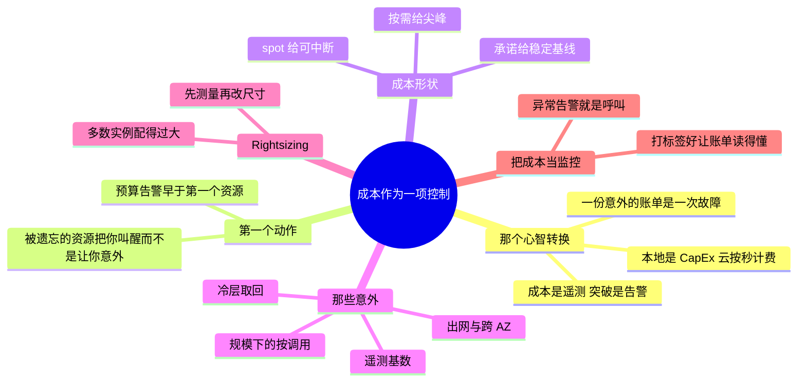

# 把成本当成一项运维控制

> 🌐 **语言：** [English（默认）](../../../cross-cutting/cost.md) · **中文**
>
> ⚠️ 本项目**默认语言为英文**，`cross-cutting/cost.md` 是"事实来源"。本页中文是多语言支持的一部分，可能略滞后于英文版；两者不一致时以英文为准。

---

> 在各朵云上，成本不是财务团队的问题 —— 它是你仪表盘上的一个信号、一条本该把你叫醒的告警，
> 以及一条塑造架构的设计约束。一个失控的循环是以一份**账单**的形式把你叫醒的。这篇笔记把钱当成
> 它在这一层真正是的东西：一项运维指标。

前面每一章最后都落到了这里 —— [`the-stack/02`](../the-stack/02-network.md) 里的出网计费表、
[`the-stack/04`](../the-stack/04-storage.md) 里的取回成本陷阱、
[`the-stack/05`](../the-stack/05-platform-services.md) 里那个"按规模定价"的问题。
这篇笔记把那几根线收进一门纪律：在发票看见之前先看见成本，并且把一份让人意外的账单当成一次
有成因的故障来对待。

## 为什么成本是一个工程信号，不是一张表格

在本地，成本是 CapEx：你把那台机器买一次，多跑一小时是免费的。云把这件事反了过来 ——
**每一个在跑的东西都按秒计费**，所以成本变成你架构的一个活的属性，随负载变化而变化，和 CPU 或者
延迟一模一样。那就是这一整章赖以立足的心智转换：一张成本曲线是一条遥测流
（[`the-stack/06`](../the-stack/06-observability.md)），一次预算突破是一条告警，而一份
让你意外的账单是一次故障，它有一个你没能观测到的成因。把钱当成一项运维指标 —— 而不是一件月度的
财务团队产物 —— 就是"**运维**云的工程师"和"只是**用**云的人"之间的分界。

## 被遗忘的资源问题（以及你要做的第一件事）

最常见的云上浪费不是一套糟糕的架构 —— 而是某样没人记得还在跑的东西：一个做完的实验留下的闲置
GPU 实例、几个月前就卸下来的孤儿卷、一个 dev 账号里的 NAT 网关、一个没有任何后端的负载均衡器。
它们安静地、永远地计着费，直到有人去读那张发票。

防御手段既枯燥又不容商量：**在一个新账号里，预算告警是你设的第一样东西，早于第一个真实资源**
—— 这样一个被遗忘的资源就会**把你叫醒**，而不是**让你意外**。这个仓库里每一个平台 lab 都在说
同一句话（[`platforms/aws/labs`](../../../platforms/aws/labs/)）；它是云上最便宜的保险。

## 成本形状 —— 让承诺匹配可预测性

计算的定价是一根光谱，而挑一个点，就是[第 01 章](../the-stack/01-physical.md)那个利用率
形状的问题，用美元再问一遍：

- **按需** —— 默认项；对尖峰的、不可预测的或短寿命的活是对的。
- **承诺/预留** —— 一到三年的承诺换一大笔折扣；对那条你知道反正会一直跑的稳定基线是对的。把一个
  可预测的生产工作负载留在按需上，是存在的最大的那类无声超支之一。
- **Spot/preemptible** —— 闲置容量上的深度折扣，可以在很短通知后被收回；对容错的、可中断的活是
  对的（批处理、CI、无状态横向扩展）—— 也就是
  [`the-stack/03`](../the-stack/03-compute-and-images.md) 里那个"把驱逐设计成一个事件"的
  模式。

那个动作是：**用承诺盖住可预测的基线，用按需扛尖峰，把可中断的活推到 spot 上。** 多数超支都是
一个可预测的工作负载在付按需价。

## 那些意外 —— 账单是从哪来的

把人打蒙的那些条目，很少是他们有意开出来的计算。是那些二阶成本：

- **出网** —— 数据**出去**要计费，而在 AWS 上**跨 AZ** 流量也要计费；NAT 网关还加一笔按 GB 的
  处理税。[第 02 章](../the-stack/02-network.md)那个锁定论证，同时也是第一大意外条目。
- **从冷层取回** —— 归档存储存着便宜，而**急着**读回来很贵；就是
  [第 04 章](../the-stack/04-storage.md)那条教训：给那次**恢复**定价，不只是给存储定价。
- **规模之下的按调用/按 GB** —— serverless 和托管服务的定价在演示时免费，在生产量级下占主导；
  就是[第 05 章](../the-stack/05-platform-services.md)那个没人回头核对的交叉点。
- **基数与遥测** —— 那份悄悄超过它所盯之物的可观测性账单
  （[第 06 章](../the-stack/06-observability.md)）。

那个规律：**标价是那些计算；意外是所有会移动的、会被读回来的、按事件计费的东西。** 在承诺之前
给它们建模，而不是在发票之后。

## Rightsizing —— 机队真相

单项投入产出比最高、也最被忽视的成本习惯：**多数实例配得过大，因为上线日之后没人再看过。**
有人为了保险挑了一个宽裕的规格，它能用，然后就再也没被回顾过。Rightsizing 不光鲜，而且会复利：

- **先测量再改尺寸** —— 拉出真实的 CPU/内存/IO 利用率
  （[那门可观测性纪律](../the-stack/06-observability.md)）；一台 CPU 一个月都在 5% 的机器
  是一次改尺寸，不是一次猜测。
- **匹配那个形状** —— 菜单与旋钮的差别（GCP/OCI 能拨出准确规格，AWS/Azure 从菜单里挑）远远
  比不上"真的把规格匹配到被测量出的需要"这份纪律要紧。
- **把发现自动化** —— 各朵云的成本工具和 rightsizing 建议会把候选项浮出来；照着它去动手才是
  这份工作。

## 把成本当监控 —— 异常告警与归属

当你像接别的信号那样把钱接起来，它就变成真正的可观测性：

- **异常告警** —— 一次成本尖峰就是一次呼叫，和一次延迟尖峰一样；一个失控的 Lambda 循环或者一个
  热分区，是先以**美元**的形式出现的，早于它出现在别的任何地方
  （[第 05 章](../the-stack/05-platform-services.md)）。
- **打标签与归属** —— 按团队/服务/环境给资源打标签，好让这张账单能被**读懂** —— "是哪个服务花了
  那笔钱，为什么" —— 而不是作为一个不加区分的数字到达。Showback（这是你们团队花的钱）不需要一纸
  命令就能改变行为。

## AI 辅助的 ramp（成本口味）

- **给交叉点建模，不要引用价格：** AI 在 *"在多大的请求量上，Lambda 不再比一台常驻实例便宜？"*
  这类问题上确实有用 —— 那套推理是站得住的。它**不是**实际单价数字的来源。
- **AI 会烧到你的地方（验得最狠的地方）：** 它会**引用训练年份的价格、免费额度和折扣百分比**
  —— 云定价一直在变，而一个建在陈旧数字上的成本模型是自信地错着。用 AI 去拿那个决定的**形状**
  （用哪种定价模型、交叉点在哪、该测什么）；每一个实际数字都从当前的定价页拉。数学是 AI 的；
  数字是厂商的。

## 诚实边界

运维取向，不是 FinOps 专家 —— 而且就那样标着。🔨 是真实的成本与容量直觉：硬件/软件的
**审计与资产对账**（把部署了什么对上付了什么钱，就是成本卫生）、容量规划，以及那份把浪费当成
一个可修缺陷而不是别人负责的一行账目的运维习惯。深度的多账号 **FinOps 工具、showback/chargeback
项目，以及承诺用量组合优化**是一条 🧭 ramp，不是被声称的专长。那句可迁移的声称是：把成本读成一个
工程信号 —— 预算、rightsizing、异常告警、那些意外条目 —— 而不是一门归财务所有的表格纪律。

## Guided run（规格）

**这是一次 [guided run](../CONTEXT.md)，不是一个 lab。** 它需要一个真实环境，所以这里没有任何
东西能断言你做过它，而 CI 也跑不了它。那就是全部的区分，而且它不是降级 —— 一次 guided run 够
得到真实的延迟、真实的报错和真实的账单，而那是没有模型做得到的。

**在发票看见之前先看见那笔钱。** 在任何一朵云的沙箱上（并且在免费额度内安全）：

1. **先设一个预算告警** —— 早于任何别的东西存在 —— 并确认它真的能把你叫醒。这是那个习惯，被练成
   肌肉。
2. 按"团队"/"服务"给几个资源**打标签**，并在成本浏览器里把它们找出来，证明一张账单能按归属来读，
   而不只是一个总数。
3. **那次演练：** 用当前的定价给一个真实决定建模 —— *在某个给定请求速率下，serverless 对上
   常驻*，或者*对一个稳定工作负载，按需对上预留* —— 找出那个交叉点，并写下那一行建议。这一章的
   交付物是一个站得住的数字，不是一种感觉。

## 这一章一屏看完

