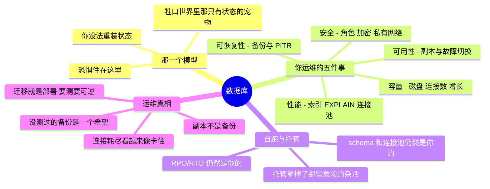

# 数据库 —— 运维那个有状态的难点

> 🌐 **语言：** [English（默认）](../../../cross-cutting/databases.md) · **中文**
>
> ⚠️ 本项目**默认语言为英文**，`cross-cutting/databases.md` 是"事实来源"。本页中文是多语言支持的一部分，可能略滞后于英文版；两者不一致时以英文为准。

---

> [`the-stack/04`](../the-stack/04-storage.md) 教过：状态是那样没有任何流水线重造得出来的东西；
> [`the-stack/05`](../the-stack/05-platform-services.md) 说过：托管数据库通常是价值最高的那笔租。
> 这篇笔记是它们之间那一层：把一个数据库**运维**好需要什么 —— 自跑的也好、托管的也好 ——
> 因为"它是托管的"从来没有把 RPO/RTO 从你的桌子上挪走。这是 **🔨 亲手做过的地面** ——
> 一套真的运维过的生产 PostgreSQL 系统。

每一个应用最后都终止在一个数据库上，而数据库就是恐惧住的地方（又一次是第 04 章）。运维一个数据库
是一门标准路线图假定你会、却很少教的独立系统管理纪律：不是"写 SQL"，而是"让这个东西保持可用、
可恢复、够快，并且在它不是的时候知道该做什么"。

## 那一个模型：数据库是牲口世界里的有状态宠物

数据库之上的一切都是[牲口](../the-stack/03-compute-and-images.md) —— 可丢弃、可重装、可替换。
数据库是那个熬过它们全部的**宠物**，而这个不对称驱动着每一个运维决定：

- 你没法"重装"一个数据库 —— 它的全部价值就是它累积下来的那份状态。
- 丢掉它，或者丢掉它其中几分钟，就是第 04 章整章在讲的那次故障。
- 所以数据库拿到牲口拿不到的东西：你会去测的备份、你会去监控的复制、你会去演练的故障切换，
  以及你会提前规划的容量。

## 你实际运维的那五件事

把引擎剥掉（Postgres、MySQL，随便什么），运维一个数据库就是五件活：

- **可用性** —— 一个**副本**（流式/同步），好让一个死掉的主库不等于一个死掉的服务；一次你**真的
  演练过**的**故障切换**（手动或自动）。注意第 04 章那个陷阱：**一个副本不是一份备份** ——
  它会在几毫秒内把一条 `DROP TABLE` 忠实地拷到备库上。
- **可恢复性** —— **备份**（逻辑导出**以及**物理/基础备份）加上**时间点恢复**（重放预写日志到
  灾难之前的某一刻）。唯一的证明是一次**测过的恢复**，带着量出来的 **RPO**（你可能丢的数据）和
  **RTO**（回到线上要多久）—— 就是那个可跑的
  [备份演练](../../../the-stack/labs/04-backup-not-snapshot/)所落到实处的那门纪律。
- **性能** —— 那条把一次全表扫描变成一次查找的**索引**、读一份**查询计划**（`EXPLAIN`）去找出
  慢的那条，以及**连接池**（PgBouncer 之流），因为每一条连接都要花内存，而数据库在 CPU 出问题
  很久之前就会被连接风暴放倒。
- **安全** —— 最小权限角色（应用用户不是超级用户）、静态与传输中的加密，以及一个住在**私有子网**
  里、永远不从互联网够得到的数据库（[the-stack/02](../the-stack/02-network.md)、
  [the-stack/07](../the-stack/07-security.md)）。
- **容量** —— 磁盘（一个满掉的数据卷是一次硬故障）、那个**连接上限**（比人们以为的更低、也更
  危险）、Postgres 上的事务 ID 回卷，以及带提前量规划的增长（[成本](cost.md)）。

## 自跑与托管 —— 自建与租那条线，数据库版

[第 05 章](../the-stack/05-platform-services.md)那套算式，套到最难跑的那个有状态东西上：

| | 自跑（跑在 VM/主机上的数据库） | 托管（RDS / Cloud SQL / Azure DB） |
| --- | --- | --- |
| **备份与 PITR** | 你去配置、写脚本、测试 | 厂商替你跑 —— **你仍然要核那份日程，并测一次恢复** |
| **复制与故障切换** | 你去建、去演练 | 厂商提供 Multi-AZ/HA —— 你去打开它并测它 |
| **打补丁与升级** | 那个维护窗口归你 | 厂商的日程 —— 一个你定不了的截止时间 |
| **调优** | 每一个旋钮都完全归你 | 一个参数组；旋钮更少，默认值合理 |
| **那个坑** | 控制最大，杂活最多 | 杂活没了；**RPO/RTO、schema 和连接池仍然是你的** |

托管数据库通常值得租（第 05 章这么说过）—— 被拿掉的那些杂活是**危险的**那类杂活。但那份**不会**
跟着"托管"这个词一起转移的责任是：知道你的 RPO/RTO、测试厂商那份备份是不是真的恢复得出来、
设计那份 schema，以及驯服那个连接数。"它是托管的"终结掉的数据故事比它拯救的更多。

## 当一半的数据属于别人的时候

上面那张自建与租的表假定这个数据库是你的。在一片内部工具的估算面里，常见的情况更乱，而且被问得
很频繁：**你正在为你要建的东西立一个数据库，而它所装的相当一部分，是一份住在别人服务里的状态的
拷贝。** 一个盘点系统在读一个设备管理控制台。一块仪表盘在从一个工单平台拉数据。一个仓库在联接
三份 SaaS 导出。

那个形状里有三个决定，而它们通常是被意外做出的。

**1. 哪一边是权威的，要逐字段说，不是逐系统说。** 这就是全部的游戏，而它几乎从来没被写下来过。
你的数据库对你在它里面创建的东西是权威的：一个归属人、一个成本中心、某个人敲进去的一条备注。
那个远端服务对它所观测到的东西是权威的：一台设备的最后签到、一张工单的状态。**那个失败不是
"不一致"，而是一个字段有两个权威**，而它看起来就跟一套能用的系统一模一样，直到两个答案要紧的
那一天。这就是把[`asset-reconciliation`](../../../cross-cutting/labs/asset-reconciliation/)
说成一个 schema 问题：两套系统都报九十七、三条记录是错的，而那个连接键决定了这片估算面有多少是
虚构的。

**2. 一份拷贝有一个年龄，而这个年龄属于那一行。** 一张没有 `fetched_at` 的同步表，是一张自信地
撒谎的表。每一行从别处来的数据都应该带着它是什么时候来的，而每一条读取路径都应该能回答*这有多
陈旧*。这门纪律最便宜的那个版本，在第一次有人问"为什么这份报表和控制台不一致"的时候就回本了。

**3. 同步方向是一个你应该刻意做出的单向决定。** 只拉不推是无聊、安全的，而且对一个内部工具几乎
总是对的：你读，你从不写回去，最坏的情况是陈旧。你一旦写回去，你就为那个字段建了第二个权威，
而现在冲突解决归你了 —— 那是一个真正困难的问题，而它伪装成一个小功能到来。

### 还有备份，它是一个比看起来不一样的问题

那份本能是去备份整个数据库。**那是对的，而它也是最没意思的那一半**，因为你必须能重建出来的东西
干净地一分为三：

| 数据库里装的是什么 | 如果你丢了它 | 那么备份的要求就是 |
|---|---|---|
| **你创建的行** —— 归属人、备注、决定，任何由一个人敲进去的东西 | 它没了。世界上没有别的东西有它 | **这是唯一不可替代的数据**，而它通常只占容量的一小部分 |
| **你同步来的行** | 重新拉一遍 | 一个能用的同步作业，以及它需要的凭据 —— 那是一项 *runbook* 要求，不是一项备份要求 |
| **派生表和缓存** | 重新算 | 什么都不需要。把它们排除掉是免费的，而且会缩短那次恢复 |

**所以一个混合数据库的恢复目标不是一个数字。** 那些敲进去的行可能需要一小时；那份同步拷贝可能
诚实地**什么都不需要**，前提是有人核过那个同步是不是真的能从冷启动重跑一遍 —— 而那正是没人去测
的部分，因为它在稳态下每天都在跑，而且从来没被要求过从空白开始。

**参考办公室从另一端得出同一个结论**，并且干脆拒绝自建任何数据库：
[它不跑任何一个状态会住在数据库里的服务](../the-reference-office.md#本地--什么不能离开)。
上面那些材料是给往上一个尺寸带的估算面用的 —— 一个有真实用户的内部工具 —— 在那里问题不是
*这东西该不该存在*，而是*它有哪一半真的是我的*。

这里其余的一切仍然适用，而有一句比其余的适用得更狠：副本不是那份备份，而一个同步作业比副本还
更不是。

## 运维笔记 —— 什么会把你叫醒（以及什么会终结职业生涯）

- **那份没测过的备份** —— 第 04 章那条法则，在这里最锋利：一份你从没恢复过的备份是一个希望。
  把恢复演练排进日程；RPO/RTO 从那次演练里量出来。
- **把副本当备份** —— 一条 `DROP TABLE` 或者一次糟糕的迁移，会立刻复制到备库上。复制熬得过
  **硬件**故障，熬不过**逻辑**破坏。救你的是 PITR 和独立备份。
- **连接耗尽** —— 那次看起来像应用"卡住"的故障：每一条连接都是内存，那个上限很低，而一次连接
  风暴会在 CPU 还很宽裕的时候把数据库带下去。在你需要连接池之前就把它建好。
- **那条缺失的索引** —— 一条查询在负载之下做全表扫描，把整个数据库拖垮。`EXPLAIN` 就是那份
  [调试反射](../foundations/README.md)套到 SQL 上。
- **那次没有回滚的迁移** —— 一次会锁表、或者没法逆转的 schema 变更，在峰值时对着生产跑。迁移就是
  部署；它们需要 CI/CD 那门纪律（[ci-cd](ci-cd.md)）—— 测过的、可逆的、避峰的。
- **磁盘满 / TXID 回卷** —— 那些无聊的杀手；把剩余空间和（在 Postgres 上）autovacuum 的健康
  当成一等告警来监控。

## 管理纪律（你应该做得到什么）

- **恢复一份备份** —— 真的做一遍，掐表 —— 并且从那次演练、而不是从一份策略文档里，说出
  **RPO 和 RTO**。
- 解释为什么**一个副本不是一份备份**，并说出每一样确实覆盖和确实不覆盖的那种故障。
- 读懂一份 **`EXPLAIN` 计划**，找出那条缺失的索引，并证明那条查询变快了。
- 搭起**连接池**，并解释为什么那个连接上限会在 CPU 之前先咬你。
- 设计**最小权限角色**（应用用户 ≠ 超级用户），并把数据库放进一个私有网络。
- 跑一次**测过的、可逆的、避峰的 schema 迁移** —— 一次部署，不是一次热修。

## AI 辅助的 ramp（数据库口味）

- **翻译那个引擎：** *"我跑生产 PostgreSQL —— 把我的备份/PITR、复制和角色模型映射到 MySQL
  （或 RDS）上，并标出真正不同的地方。"*
- **让它起草查询，你去核那份计划：** AI 写 SQL 和调优建议很快 —— 而且它会自信地推荐那些没用的
  索引，或者一份用一个瓶颈换另一个瓶颈的配置。每一条建议都拿真实数据用 `EXPLAIN` 核过。
- **AI 会烧到你的地方（验得最狠的地方）：** 它会**把快照/副本和备份混为一谈**（最危险的数据库
  幻觉 —— 它会把一个同账号快照叫成一份备份）；它会**发明配置参数和它们的安全取值范围**；它会
  **建议一次没有锁分析、没有回滚的破坏性迁移**；而且它会把**版本特定的行为**说错。任何碰数据或
  碰迁移的东西，都先在一份拷贝上测过 —— 生产永远不是你去发现这件事的地方。

## 诚实边界

🔨 **亲手做过的深度。** 一套真的运维过的生产关系数据库 —— 撑起一套他提议并共同开发的内部 IT
盘点/仓库系统的 **PostgreSQL**（schema、查询、数据库支撑的服务，以及那门备份与恢复的纪律），
外加多年 lab 与小服务工作里的 **MySQL**，以及给本地服务用的 **SQLite**。所以
[`the-stack/04`](../the-stack/04-storage.md) 里那个"数据库底下那块 block 存储"的故事，以及这篇
笔记的运维内核，都是活过的，不是读来的。属于 **🧭 ramp** 并被那样标着的地方：**Oracle Database**
（另一个 RDBMS —— 基本功可迁移，具体细节是一条快速 ramp，不是一句声称）、大规模下深度的查询
优化器内部机制，以及专用/分布式引擎（Spanner、Cassandra）。那句可迁移的声称是：真实的关系数据库
运维 —— 备份/恢复、复制、角色、容量 —— 加上一条通向任何具体引擎的、经过验证的 ramp。

## Lab（用那个可跑的[备份演练](../../../the-stack/labs/04-backup-not-snapshot/)）

[第 04 章那个备份演练](../../../the-stack/labs/04-backup-not-snapshot/)**就是**这篇笔记的 lab 的
可跑形态 —— 它播一个数据库的种、"复制"它、取一份独立备份，然后 `DROP` 掉那张表，并证明
（1）那个副本也死了，（2）只有那份独立备份救了回来，以及（3）RPO 恰好花掉了备份之后那些行。
跑一遍，然后扩展它：加第二张表、取一份备份、跑一次糟糕的迁移，然后恢复到它**之前**的那一刻 ——
时间点恢复，握在你自己手里。

## 这一章一屏看完

