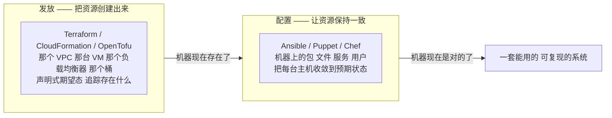
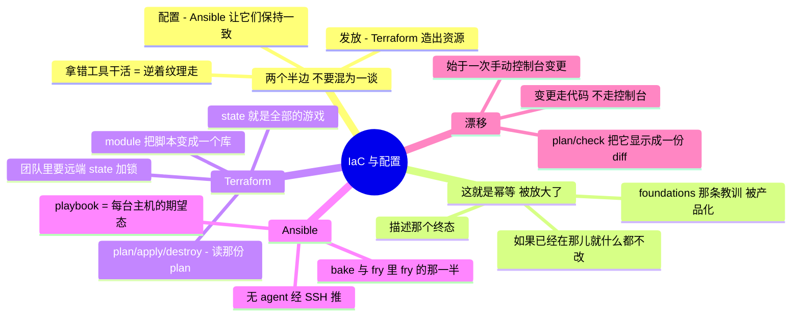

# 基础设施即代码与配置管理

> 🌐 **语言：** [English（默认）](../../../cross-cutting/iac-and-config.md) · **中文**
>
> ⚠️ 本项目**默认语言为英文**，`cross-cutting/iac-and-config.md` 是"事实来源"。本页中文是多语言支持的一部分，可能略滞后于英文版；两者不一致时以英文为准。

---

> 那个通用控制面。[运营模型](../00-the-operating-model.md)的第 3 招 ——
> *通过平台的 API 驱动它并把它写成代码* —— 被做成一门独立的纪律。把这个掌握一次，之后每个平台
> 都变成一样你写在文件里、在 git 里做版本的东西，而不是一个你点完就忘的控制台。

基础设施即代码，就是"我把它搭起来了"和"它被定义了、被评审了、可复现、可丢弃"之间的分界。这篇
笔记覆盖那两个总被混为一谈的半边 —— **发放**（Terraform：把资源创建出来）和**配置管理**
（Ansible/Puppet：让资源保持一致）—— 以及那门让两者中任何一个变得可信的纪律：state、幂等、
评审和漂移。

## 那个要紧的区分：发放与配置

最有用的一件事就是把它搞清楚，因为拿其中一个去干另一个的活，是一个常见且昂贵的错误：

Terraform **创建**那台 VM；Ansible **配置**它上面有什么。Terraform 造那个桶；它不装你的应用。
这些工具在边缘上会模糊（Terraform 能跑一个 provisioner；Ansible 能创建云资源），但把错的那个
当成主力工具去够 —— Terraform 管包版本、Ansible 当你的云发放器 —— 是在逆着纹理走。搞清楚你在
哪一半。

## 来自 foundations 的那座桥：这就是幂等，被放大了

[`foundations/`](../foundations/README.md) 论证过，一个**幂等**的脚本 —— 你能安全地跑两遍的那种
—— 就是基础设施和一份负债之间的差别。IaC 就是那个想法被变成了一整门纪律。这里每一个工具都建在
同一个承诺上：*描述那个终态；工具去搞清楚要改什么才能到那儿，而如果你已经在那儿，它什么都不改。*
一个说"nginx 这个包在场"的 Ansible playbook，第二次跑的时候不会重装它 —— 它检查一下就过去了。
如果你已经从一个 shell 脚本里内化了幂等，那你已经理解了下面每一个工具的核心；其余的是语法和
state 管理。

## Terraform —— 那个通用发放面

这个仓库之所以能对比七个平台的原因：Terraform（以及它的分叉 OpenTofu）用一套工作流对它们全部
说话。

- **State 就是全部的游戏。** Terraform 保留一个 **state file**，把你的代码映射到它创建出来的
  真实资源上。那个文件就是它知道该改什么的凭据，也是那个会出问题的东西：在一个团队里，state
  必须住在**带锁的远端存储**里（S3 + DynamoDB、一个 Terraform Cloud workspace 等等），否则两个
  工程师同时跑 `apply` 就会把它弄坏。笔记本上的本地 state 对一个 lab 没问题，对一个团队是灾难。
- **那套工作流：** `plan`（给我看会改什么）、**在信任它之前**读那份 plan、`apply`（照做）、
  `destroy`（干净地拆掉 —— 正是这个性质让一个 lab 安全、让一个评审环境便宜）。读 plan 才是那项
  技能；不读就 `apply`，就是意外抵达生产的方式。
- **Module** —— 可复用、可参数化的积木，好让"一个标准 VPC"写一次、到处调用。这就是 IaC 不再是
  脚本、开始成为一个库的地方。
- 这件事可跑的证明已经在仓库里：
  [`platforms/aws/labs/02-minimal-vpc-ec2-terraform/`](../platforms/aws/labs/02-minimal-vpc-ec2-terraform)
  —— 一个 VPC 加一台实例，从代码立起来、又拆掉。

## Ansible —— 配置管理，推模型

Terraform 停下的地方（机器存在了），Ansible 开始（机器是对的）：

- **无 agent** —— Ansible 就用普通 SSH 够到主机；没有 agent 要装、要维持存活，而这很大程度上正是
  它在需求信号里成为被点名最多的单一工具之一的原因。
- **Playbook** —— 用 YAML 描述每台主机的期望态：包在场、文件按模板生成、服务在跑、用户被创建。
  按设计就是幂等的 —— foundations 那条教训，被产品化了。
- **它比 Terraform 更合适的地方** —— 改变**已经存在的**主机、在一片机队上编排一次滚动变更，
  以及 [`the-stack/03`](../the-stack/03-compute-and-images.md) 那个 bake 与 fry 里 **fry** 的
  那一半（你在启动时配置、而不是烤进镜像里的那部分）。Ansible 也是一个不错的机队编排工具，
  不只是配置工具。

## Puppet —— 拉模型，作为对照

Puppet（和 Chef）代表那个更老的、基于 agent 的**拉**模型：每台主机跑一个 agent，周期性地从一台
服务器拉取它的期望态并收敛到它。相对 Ansible 无 agent 推模型的那笔交易：持续强制执行和规模
（agent 按自己的日程去拉），代价是一个 agent 和一台要运维的服务器。值得理解它作为那个对照，因为
它解释了**为什么**无 agent 的推模型赢得了这么多心智份额 —— 不是因为拉是错的，而是因为"没有
agent"移走了一整份运维负担。

## 漂移 —— 这一切之所以要紧的原因

**漂移**是代码所说的和现实实际是的之间那道缝，而它正是 IaC 存在去杀掉的东西：

- 它始于一次**手动的控制台变更** —— 某人在凌晨两点做的那个"快速修复"，而代码不知道。现在代码在
  撒谎，而下一次 `apply` 要么把那个修复回滚掉（意外故障），要么两者就此静默分岔。
- **检测：** 对着现实跑 `terraform plan`，把漂移显示成一份 diff；重跑 Ansible 会按任务显示
  changed 与 ok；配置管理工具能持续报告合规性。
- **那门纪律：** 变更走代码，不走控制台。控制台是用来**看**的（运营模型那条线）；它一旦变成用来
  **做**的，漂移就开始了。这和[安全那一章](../the-stack/07-security.md)用策略即代码强制执行的
  是同一条规则 —— 让控制台变更成为例外，而不是习惯。

## AI 辅助的 ramp（IaC 口味）

- **让它起草那个资源，然后每一行都读：** AI 写 HCL 和 playbook 很快，形状基本对 —— 而且它会发明
  资源参数、用已废弃的语法、并默认给出宽松的设置。生成出来的 IaC 是一份等着被审的初稿，绝不是
  "apply 一下看看"。
- **永远先 dry-run：** `terraform plan` 和 Ansible 的 `--check` 模式存在的意义，恰恰就是让 AI 的
  （以及你自己的）错误在碰到现实之前先以一份 diff 的形式浮出来。让任何生成物的 dry-run 变成
  不容商量。
- **AI 会烧到你的地方（验得最狠的地方）：** 它会**发明不存在的 Terraform 资源参数和 Ansible
  module 选项**；它会递给你训练年份的**已废弃语法**（provider 变得很快）；它会**硬编码宽松的
  默认值**（一个对全世界开放的安全组、一个没有锁的 state file）；而且它会**把发放和配置搅在
  一起**，对一件属于 Ansible 的活递给你 Terraform，反之亦然。读那份 plan；跑那次 check；diff
  不会产生幻觉。

## 诚实边界

混合，而且标得精确。**Ansible 和那门自动化纪律是 🔨** —— Python/Bash/Ansible 真的用来做过机队
自动化，而支撑整个 IaC 的那份幂等直觉是亲手做过的（见 [`foundations/`](../foundations/README.md)）。
**Terraform 是一条 🧭 ramp** —— 那些概念（state、plan/apply/destroy、module）是扎实的、测绘过的，
并在 [AWS lab](../platforms/aws/labs/02-minimal-vpc-ec2-terraform) 里被证明过，但没有被
声称成多年在规模上写生产 module。**Puppet 是概念级的** —— 作为拉模型的对照被理解，没有被运维过。
那句可迁移的声称是：一份很深的自动化与幂等地基，加上一条通向任何具体 IaC 工具的、快速且经过验证
的 ramp —— 正是 [`WHY.md`](../WHY.md) 所论证的那个形状。

## Guided run（规格）

**这是一次 [guided run](../CONTEXT.md)，不是一个 lab。** 它需要一个真实环境，所以这里没有任何
东西能断言你做过它，而 CI 也跑不了它。那就是全部的区分，而且它不是降级 —— 一次 guided run 够
得到真实的延迟、真实的报错和真实的账单，而那是没有模型做得到的。

**先发放再配置 —— 把那两半接起来。** 尽可能纯本地（拿一个容器或本地 VM 当目标）：

1. 用 Terraform **发放**（[AWS lab](../platforms/aws/labs/02-minimal-vpc-ec2-terraform)
   是云上版本；本地就用一台 VM/容器），并确认 `plan` → `apply` → `destroy` 能干净地跑一圈。
2. 用一个 **Ansible playbook** **配置**得到的那台主机（一个包、一个模板化的配置文件、一个在跑的
   服务）—— 然后跑**两遍**，并证明第二遍报告零变更：幂等，被演示出来。
3. **那次漂移演练：** 手动改掉主机上的某样东西（编辑那个由 playbook 管理的配置文件），重跑
   playbook，看着它**检测并纠正**那次漂移 —— 这门纪律之所以存在的全部理由，被看见了。

## 这一章一屏看完

