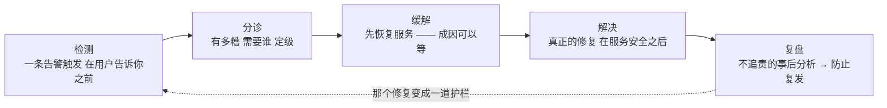
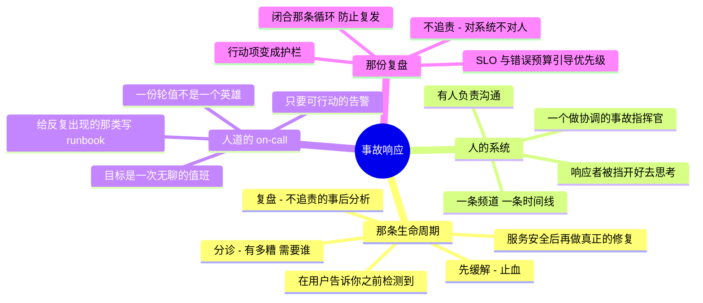

# 事故响应与 On-Call —— 在它坏掉的时候保持镇定

> 🌐 **语言：** [English（默认）](../../../cross-cutting/incident-response.md) · **中文**
>
> ⚠️ 本项目**默认语言为英文**，`cross-cutting/incident-response.md` 是"事实来源"。本页中文是多语言支持的一部分，可能略滞后于英文版；两者不一致时以英文为准。

---

> [`foundations/`](../foundations/README.md) 建起了调试的**技术**那一半 —— 那份找出什么坏了的
> 反射。这篇笔记是 SRE 路线图放在正中央的**另一**半：围着一次活的故障的**流程与人的系统** ——
> 角色、沟通、on-call，以及那次让它不再复发的复盘。这也正是 [`WHY.md`](../WHY.md) 所说的、
> 复利很慢而在 AI 时代更要紧的那部分，因为没有哪个模型拥有一次故障。

这个仓库里其余的一切都在帮你**预防**故障。这一篇讲的是预防失败之后你做什么 —— 而它会失败。
一次十分钟的小波动和一次两小时的灾难之间的差别，很少是那个技术修复；它是那次**响应**是有结构的
还是一场乱抓。事故响应是一项技能，而且它是被练出来的，不是在凌晨三点即兴出来的。

## 那条故障生命周期

一次故障是一条带具名阶段的流，而知道那些阶段，就是让一个高压情境不至于变成瞎折腾的东西：

那一条把资深者区分开来的本能：**先缓解，再诊断。** 止血 —— 回滚、切换、扩容、把那个功能关掉 ——
**然后**再去找成因。一次用户可见的故障不是做一次令人满足的调查的时候；先恢复。

## 人的系统 —— 角色与沟通

在任何真实的严重级别上，一次故障需要结构，而不是一堆人围着一起打字：

- **事故指挥官（IC）** —— **协调**，不动手修。拥有决策权、维护时间线、决定何时升级。在一次大
  故障里，最好的那个工程师往往就是那个 IC，恰恰因为瓶颈是协调、不是打字。
- **沟通** —— 有人负责给干系人（以及必要时给一个状态页）发更新，好让那些响应者不用每五分钟被
  "有进展吗？"打断一次。
- **响应者** —— 真正在做缓解的那些人，被从协调和沟通的负担里挡开，好让他们能思考。
- **那条频道和那条时间线** —— 一个地方（一个作战室频道），一切都在那儿被实时记录下来，因为复盘的
  质量上限就是那份记录 —— 就是那门[审计轨迹](itsm-and-assets.md)纪律，实时版。

小故障？一个人把所有帽子都戴上。重点从来不是那套仪式 —— 而是**有人在做决定**、**有人在做记录**，
好让那次响应即便只有一个疲惫的人，也仍然是有结构的。

## On-call —— 可持续的，不是英雄式的

On-call 是"总会有人注意到"变成一份保证的方式 —— 而它是一个要人道地去设计的系统，否则它会把人
烧穿，然后好的那些人就走了：

- **一份轮值，不是一个英雄** —— 传呼按一份日程轮转，好让没有哪一个人被永久拴住；并且有一条清楚的
  **升级路径**，用于主值班解决不了的时候。
- **只要可行动的告警** —— 每一次呼叫都必须是**紧急且可行动的**。告警疲劳
  （[the-stack/06](../the-stack/06-observability.md)）是 on-call 的杀手：呼叫太多会训练响应者
  忽略它们，而那次真正的呼叫就滚过去了。如果它不值得把人叫醒，那它是一块仪表盘，不是一次呼叫。
- **Runbook** —— 反复出现的那类故障应该有一份写下来的响应，好让凌晨三点是在照着一份测过的流程走，
  而不是在发明一份。AI 起草第一版（[itsm](itsm-and-assets.md)）；现实把它锤硬。
- **杂活预算** —— 如果 on-call 是持续救火，那是一个去修底下那些问题的信号
  （[问题管理](itsm-and-assets.md)那条循环），而不是一个去要求更多耐力的信号。最好的一次 on-call
  值班是无聊的那次。

## 不追责的复盘 —— 这整件事的意义所在

一次故障真正的交付物不是那个修复 —— 而是让**下一次**更不可能发生：

- **不追责** —— 聚焦在那个让失败得以发生的**系统与流程**上，而不是按下那个按钮的人。追责会让人
  藏起信息，而那会让下一次故障更糟。心理安全是一项运维要求，不是一项善意。
- **一条真实的时间线和一个成因** —— 发生了什么、什么时候、为什么，以及那些促成因素是什么
  （通常是好几个，不是一个）。
- **变成护栏的行动项** —— 每一次复盘都应该产出具体的变更：一条新告警、一道
  [策略即代码](../the-stack/07-security.md)护栏、一份被修好的 runbook、一个被闭合的
  [可观测性缺口](../the-stack/06-observability.md)。当那个修复让复发变得**不可能**、而不只是
  **被注意到**时，这条循环才闭合。

这接上了[可观测性](../the-stack/06-observability.md)那套可靠性算术：**SLO 与错误预算**把
"要多可靠？"变成一个数字，而一份被烧穿的错误预算就是那个"停止发布功能、把钱花在可靠性上"的信号
—— 事故响应反馈进工程优先级。

## 运维笔记 —— 响应本身会出什么错

- **在缓解之前诊断** —— 用户正在停摆时那个"令人满足的调查"陷阱。先恢复。
- **没有事故指挥官** —— 五个聪明人都在修，没有一个在协调，互相踩脚。必须有人在**决定**。
- **那个沉默的响应者** —— 埋头修、不出声，于是管理层慌了、涌上来。哪怕只说"还在处理，十五分钟后
  再更新一次"也要沟通。
- **告警疲劳** —— 真正的那次呼叫淹没在噪声里；那次没人响应的故障，是因为前面五十条告警都没事。
- **那份追责然后归档的复盘** —— 点了一个罪魁祸首、没产出任何护栏，然后同一次故障下个季度再来
  一遍。不追责，并且行动项要真的发布出去。
- **英雄式 on-call** —— 一个人扛着全部，直到他离开，并把那些没写下来的知识一起带走。

## 管理纪律（你应该做得到什么）

- 把一次故障走完**检测 → 分诊 → 缓解 → 解决 → 复盘**，并且**先缓解再诊断**。
- 担任**事故指挥官** —— 协调并决定，与动手修分开。
- 维护一条**时间线**，并按节奏沟通，哪怕在火当中。
- 设计一份**人道的 on-call** 轮值，带可行动的告警、一条升级路径和那些 runbook。
- 写一份**不追责的复盘**，它的行动项会变成防止复发的护栏。
- 把它接回 **SLO / 错误预算** —— 把可靠性变成一个引导优先级的数字。

## AI 辅助的 ramp（事故口味）

- **把 AI 当事故副驾**（来自 [aws/operations](../platforms/aws/operations.md)）：把那条报错、
  那段日志、那个指标贴进去 —— *"这指向什么，你接下来会查什么？"* —— 一个你去测的快速假设。
  以及从频道日志里起草那份**复盘时间线**，然后由你自己去纠正因果。
- **AI 帮得上和帮不上的地方：** AI 加速的是**查找**和**第一稿**；它**拥有不了这次故障** ——
  那个定级判断、那个缓解还是诊断的决定、那个爆炸半径的判断，以及那份问责，都留给人。它还会
  **写出自信的、追责的、或者错误的成因** —— 结论归你，而且由你保持它不追责。

## 诚实边界

混合，而且对是哪一半很诚实。那份**技术上的故障反射** —— 分解、一次只动一个变量、在压力下读系统
说了什么 —— 是 🔨（[foundations](../foundations/README.md)，以及那些传呼真的会响的真实基础设施
工作），那份**镇定**也是：在它坏掉的时候保持有条不紊。正式的**规模化 SRE 事故指挥实践**
（专职 IC 轮值、错误预算驱动的工程、大组织的复盘项目）是一条 **🧭 ramp** —— 那套框架被测绘并
验证过，没有被声称成运行过一个生产 SRE 组织。这里最可迁移的那样 🔨 东西，恰恰就是
[`WHY.md`](../WHY.md) 所说的、能熬过 AI 时代的那个：把一个混乱的、高赌注的局面结构化起来的那份
判断与镇定 —— 而那是没有模型提供的。

## Lab（✅ 已建成）

[`labs/mitigate-before-diagnose/`](labs/mitigate-before-diagnose)
—— **这一章的核心声称，被量出来而不是被重复。** 先缓解平均省下九分钟停摆时间，并在尾部付出六
分钟，而那份尾部代价**恰好就是那个缓解窗口**，花在一个通用缓解本来就覆盖不到的成因上。

值得带走的那个数字是那个交叉点：**在大约 40% 的缓解覆盖率以下，这条建议会翻转**，而这让它成为
可证伪的，而不只是正确的。而且它依赖于一个便宜的缓解 —— 一旦那次切换出岔子的期望代价超过大约
十分钟，先诊断才是更好的选择。这也正是这个仓库别处那些演练过的恢复和练过的切换之所以要紧的原因：
**它们不是给故障买的保险，它们是让这个直觉成立的东西。**

`--break-it` 先诊断，而那正是一个细心的工程师会做的事，也是你在压力之下会做的事 —— 除非你事先
决定了不这么做。

## Guided run（规格）

**这是一次 [guided run](../CONTEXT.md)，不是一个 lab。** 它需要一个真实环境，所以这里没有任何
东西能断言你做过它，而 CI 也跑不了它 —— 而这不是降级，因为一次桌面推演够得到一样没有模型够得到的
东西：那个房间、那些争论，以及搞清楚到底是谁在做决定。

**演练那次响应，而不只是那个修复。**

1. **桌面推演：** 拿一次说得通的故障 —— 磁盘满了、一张证书过期、一次糟糕的部署 —— 出声地走一遍
   那条生命周期：谁是 IC、诊断**之前**的缓解是什么、谁来沟通、那条时间线长什么样。不需要任何
   系统；要练的肌肉是那套流程。
2. **Game-day（实时）：** 故意弄坏点什么 —— 杀掉一个服务、让一张证书过期、在
   [备份演练](../the-stack/labs/04-backup-not-snapshot)里 drop 一张表 —— 然后跑一次真实的
   响应，先缓解后解决，掐着表。
3. **那个交付物：** 那份**不追责的复盘** —— 时间线、成因，以及至少一个会变成**护栏**的行动项，
   好让这一次故障不可能再复发。

## 这一章一屏看完

