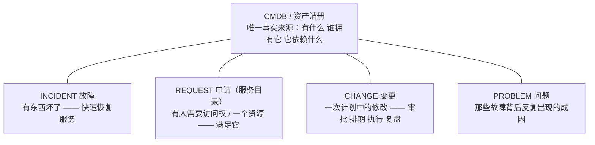
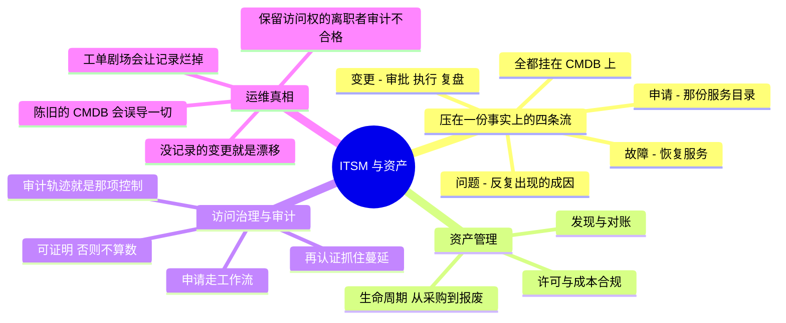

# ITSM、资产管理与治理 —— 那根运维脊柱

> 🌐 **语言：** [English（默认）](../../../cross-cutting/itsm-and-assets.md) · **中文**
>
> ⚠️ 本项目**默认语言为英文**，`cross-cutting/itsm-and-assets.md` 是"事实来源"。本页中文是多语言支持的一部分，可能略滞后于英文版；两者不一致时以英文为准。

---

> 这份工作里被云原生路线图跳过、而每一个真实 IT 组织都靠它跑的那部分：工单队列、资产清册、
> 访问申请，以及证明这一切的那次审计。它不光鲜，它是合规真正住着的地方，而且它是
> **🔨 亲手做过的地面** —— 多年 ServiceNow，外加真写过的审计对账自动化。

这个仓库里每一个平台回答的是"这台机器怎么工作"。这篇笔记回答的是"这些**工作**怎么工作" ——
申请、变更、故障、资产和访问是怎么被追踪的，好让一个组织能在规模上运转、并且**证明**它做到了。
它是审计师、安全评审和下一个工程师都依赖的那一层，而且它是一门货真价实的系统管理纪律，不是管理
开销。

## ITSM 实际追踪的那四样东西

把工具剥掉（ServiceNow、Jira Service Management、一套自建系统），IT 服务管理就是压在一个事实来源
之上的四条流：

- **故障** —— 快速恢复服务；技术那一侧是[那份调试反射](../foundations/README.md)，流程那一侧是
  分诊、优先级、沟通，以及一份记录。
- **申请** —— 那份服务目录：访问权、硬件、软件。这就是[身份](identity-iam.md)那条入转离生命
  周期变成工单的地方 —— 也是把它自动化（[SCIM/目录驱动](saas-admin.md)）之后，把**扩张工单**
  变成**扩张系统**的地方。
- **变更** —— 一次带审批、带窗口、带执行、带事后复盘的计划修改。它是套在一次
  [CI/CD](ci-cd.md) 部署或一次 [IaC](iac-and-config.md) apply 外面的那层人类流程包装 ——
  那个"谁批准了这件事，以及我们回得去吗"的层。
- **问题** —— 反复发生的故障背后那个成因；修掉它，队列才会停止被重新填满。

这四样全都挂在 **CMDB** 上 —— 那份"有什么、谁拥有它、什么依赖什么"的清册。一份错的 CMDB 比没有
更糟，因为人们信它。

## 资产管理 —— 那份让你保持诚实的清册

硬件和软件资产是 CMDB 的骨干，而让它们保持准确是真实的、持续的工作：

- **发现与对账** —— 你**以为**你有的（那张表格）和**实际**部署着的（那次网络扫描）从来对不上，
  而把这道缝合上就是这份工作。这恰好是[脚本能力](../foundations/README.md)的那份胜利：用代码
  把审计数据对起来，而不是在 Excel 里手动做。
- **生命周期** —— 采购 → 部署 → 换代 → 报废，绑在那些创建和退役这些资产的
  [endpoint](../endpoint/README.md) 与 [self-host](../../../platforms/self-host/) 发放流水线上。
- **软件/许可合规** —— 知道装了什么、授权了什么，既是一项成本控制（[成本](cost.md)）也是一项
  审计要求；就是那个"被遗忘的资源"问题，在资产这一侧。
- **成本那个角度** —— 把**部署了什么**对上**付了什么钱**就是成本卫生（[成本](cost.md)）；那次
  审计和那张发票是同一份清册的两个视图。

## 访问治理与审计 —— 证明最小权限

这就是 ITSM 与[安全](../the-stack/07-security.md)和[身份](identity-iam.md)相遇的地方：
最小权限在你能证明它之前只是一句**声称**。

- **走工作流的访问申请** —— 多人审批路由，这样一次授予就有一份记录，记着谁申请的、谁批准的、
  为什么（而不是某个人记了一半的一条 Slack 消息）。
- **访问复审 / 再认证** —— 周期性地重新证明每一条授予仍然是需要的；这门纪律把
  [身份](identity-iam.md)那份权限蔓延按住，也是审计要求拿出证据的那样东西。
- **那条审计轨迹** —— 每一次变更、每一次访问授予、每一次故障都留下一份记录，好让"谁在什么时候
  做了什么"答得上来。它是 [CloudTrail / 审计日志](../../../platforms/aws/operations.md)在人类
  流程侧的孪生：**治理只有在可证明的时候才是真的。**
- **受控环境** —— 最严格的那个版本：分段的、访问受闸的、被审计的运行，每一个动作都被记录、都可
  复查。运行这样一套环境所需的判断，直接从"在规模上运行一套有纪律的访问模型"迁移过来。

## 运维笔记 —— 什么会把你叫醒（以及什么会审计不合格）

- **陈旧的 CMDB** —— 一份人们信、但它是错的清册，会把每一个依赖它的决定（变更影响、故障范围、
  容量）都带偏。要么把它对起来，要么别再依赖它。
- **没有记录的变更** —— 那个没人开工单的"快速修复"，是流程层的[漂移](iac-and-config.md)：现在
  那份记录在撒谎，而下一次故障的成因追查是从一张假地图上起步的。
- **保留了访问权的离职者** —— 那次没有完整执行的离职申请；离开之后仍然悬着的访问权，是那条经典
  的审计发现和安全漏洞（[身份](identity-iam.md)那个离职问题，没被闭合）。
- **工单剧场** —— 为流程而流程，把表填完比把东西修好更要紧。ITSM 应该减少杂活并增加可追溯性，
  而不是自己变成杂活；一旦变成后者，工程师就会绕开它，而那份记录就烂掉了。
- **审计时拿不出证据** —— 存在过但从未被记录的控制，是监管者不会认账的控制。在运维上，那条审计
  轨迹**就是**那项控制。

## 管理纪律（你应该做得到什么）

- 把一次**故障**走完分诊 → 恢复 → 记录，把一次**变更**走完审批 → 执行 → 复盘。
- 让一份 **CMDB / 资产清册**保持准确 —— 而且用脚本去**对账**，不是手动。
- 让**访问申请**走一条多人审批工作流，并跑一次**访问再认证**。
- 为"谁改了这个、谁能访问那个、什么时候"产出那条**审计轨迹** —— 并且明白可证明性才是重点。
- 把那些枯燥的对账自动化（审计数据、许可计数、陈旧账号）—— 把一次手动的月度苦役变成一个定时任务。

## AI 辅助的 ramp（ITSM 口味）

- **翻译那套流程：** *"我跑过 ServiceNow 的故障/申请/变更和资产对账 —— 把这些映射到 Jira Service
  Management（或者一套自建工具）上，以及映射到云审计日志那个世界里。"*
- **让它起草自动化：** AI 在**脚本**这一块很强 —— 对账脚本、拉资产数据的 API 调用、陈旧账号
  报表。要拿真实数据去核那些 API 调用和那套逻辑（一次错误的对账会悄悄污染所有人都信的那个事实
  来源）。
- **AI 会烧到你的地方（验得最狠的地方）：** 它会**发明平台的 API 字段和工作流语义**
  （ServiceNow/Jira 的数据模型很大，它就靠猜）；它会**把审批/合规要求过度简化**（真实框架有具体
  的证据规则 —— 对着实际的控制集去核）；而且它会**把一份报表当成一项控制**，而那项控制是那条
  **被采取行动的**发现，不是那个 CSV。

## 诚实边界

🔨 **亲手做过的深度 —— 一项确实被展示不足的强项。** 在 Mphasis/Varian 多年的 **ServiceNow**
（故障/申请/变更）；在字节跳动经由 **Jira** 而后一套自建工单系统做的 ITSM；**硬件与软件审计**，
数据从表格迁进一个数据库，并写了**对账脚本**去比对（对照组：在 Excel 里手动做）；在一套严格的
**多人审批、最小权限访问模型**里作业，带着真实的访问复审纪律；以及把设备安全配置 / 网络准入
**合规检查**当成日常工作。属于 **🧭 ramp** 的地方：深度的 GRC 框架审计（把 SOC 2 / ISO 27001 /
FedRAMP 当成一门专家实践）和规模上的企业 CMDB 架构 —— 运维纪律是 🔨，正式审计师那个角色是那条
ramp。那句可迁移的声称是：真实的 ITSM、资产对账和访问治理运维 —— 一个合规 IT 组织赖以运转的那根
脊柱 —— 外加一条通向任何具体平台或框架的快速 ramp。

## Lab（✅ 已建成，分成两块）

**把事实对起来，把访问证明出来。** 纯本地，不需要特殊工具。下面这份规格原本是写成一个三段式
lab 的；它最后成了两个，因为对账那一半和访问那一半结果是不同的 drill。

1. **对账** —— ✅ [`labs/asset-reconciliation/`](../../../cross-cutting/labs/asset-reconciliation/)。
   建得比这份规格要求的更大：规格想要的是*在一份清单里而不在另一份里的东西*，那是浅的那一半。
   这个 drill 还度量了那个**连接键**让你付出什么（主机名报出 104 台设备，而实际存在 97 台），
   并且落在一个好的键也解不开的残差上 —— 因为那份裁定，而不是那次集合差，才是这份工作。
2. **生命周期** —— ✅ 在实质上，落在
   [`labs/permission-sprawl/`](../../../cross-cutting/labs/permission-sprawl/) 里：把某人从组里
   移除，在干净的那片 estate 上处处都被回收，而在蔓延的那一片上**什么都没被回收** —— 那正是
   "离职者仍然有访问权"这条发现，从访问那一侧到达。
   [`toolbox/user-lifecycle/`](../toolbox/user-lifecycle/) **执行**入转离；注意，执行一次离职和
   检测出一次静默失败的离职，是两件不同的活，而只有第二件是一条审计发现。
3. **可答性** —— ✅ [`labs/permission-sprawl/`](../../../cross-cutting/labs/permission-sprawl/)
   第四拍：每一条组授予都用一个比授予它的那个人活得更久的角色，回答了*这个人为什么有访问权*，
   而那些个人授予根本重建不出来。那就是"治理只有在答得上来的时候才是真的"这句声称，被做成可以
   随叫随失败。

## 这一章一屏看完

