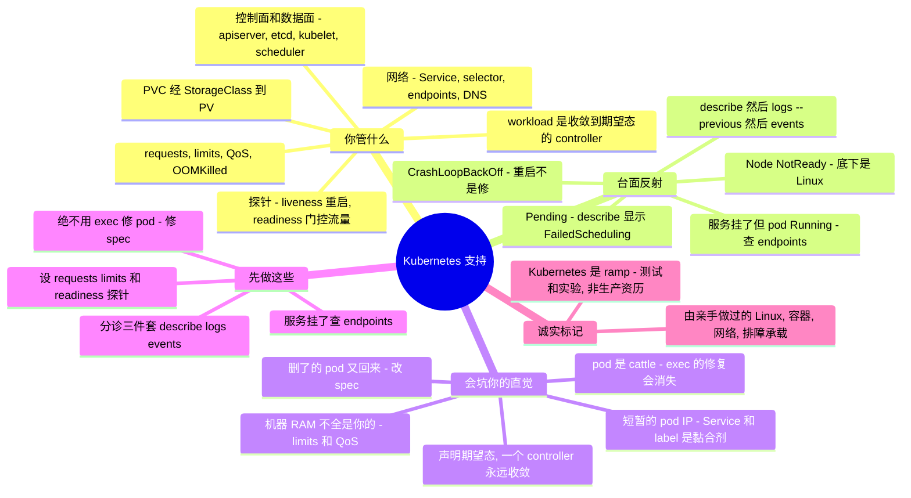

# Kubernetes 支持 —— Linux sysadmin 的转轨指南

> 🌐 **语言：** [English（默认）](../../../cross-cutting/kubernetes-support.md) · **中文**
>
> ⚠️ 本项目**默认语言为英文**，`cross-cutting/kubernetes-support.md` 是"事实来源"。本页中文是多语言支持的一部分，可能略滞后于英文版；两者不一致时以英文为准。

---

> [`kubernetes.md`](../../../cross-cutting/kubernetes.md) 讲**对象模型**和那一个核心思想——*声明期望态，让 controller 收敛*。本篇是另一半：**把 Kubernetes 支持当作一门修/救（break-fix）手艺**——真正反复出现的工单、精确的排查落点，以及**一个强 Linux / Docker / systemd sysadmin 接手一个集群时，哪些直觉会被烧到。** 诚实标记先说清：本篇是 **🧗 ramp**——我的 Kubernetes 亲手经验是**测试/实验级**（kind/minikube/k3s），由一套 ✋ **Linux + 容器 + 网络 + 排障**基本功承载。它的权威来自**研究**（kubernetes.io + practitioner 失效模式 + 一个可跑的 [lab](#lab--pods-是-cattle--可跑)），不是生产集群资历。全部意义就是*我正在跨的那道沟。*

一个 Linux sysadmin 上手 Kubernetes 很快——是容器、底下是 Linux（namespace + cgroup）、YAML 在 git 里。然后它在一个"一堆服务器"没有的地方咬人：**你不管理进程，你声明期望态,而 controller 把 actual 收敛到 desired,永远。** 删掉一个 pod 它又回来。SSH 进去修一个 pod、你的修复跟它一起死。机器有 16 GB、但你的容器在 limit 处被 `OOMKilled`。pod 是 `Running`,但服务"挂了"。这些每一个都是配置管理脑的反射——*把跑着的东西当宠物*——对着一个建在 cattle 和 control loop 上的系统失灵。本篇把职责、反复出现的工单及其诊断面、以及那几个失灵的 sysadmin 直觉一一点名——全程对着 Linux/Docker/systemd 作对比,因为读者是从那儿来的。

## 支持 Kubernetes 让你要为什么负责

修/救的面,大致按工单到达顺序:

| Surface | 你要为之负责的事 |
| --- | --- |
| **控制面 vs 数据面** | **kube-apiserver**(唯一前门)、**etcd**(事实来源——备份它)、**kube-scheduler**(放置 Pod)、**kube-controller-manager**(跑控制环);每个节点:**kubelet**(让 Pod 跑着)、**kube-proxy**(Service 网络规则——某些 eBPF CNI 下已*可选*)、**容器运行时**(containerd/CRI-O;`crictl`,不是 `docker`)、**CNI** 插件(扁平 pod 网络)。 |
| **workload 与 controller** | Pod / ReplicaSet / **Deployment**(滚动更新 + `rollout undo`)/ StatefulSet / DaemonSet / Job / CronJob——每一个都是把 **actual → desired** 收敛的 controller,永远。 |
| **网络** | **Service**(ClusterIP/NodePort/LoadBalancer)→ **selector → EndpointSlices**;**CoreDNS**(`<svc>.<ns>.svc.cluster.local`);**Ingress + 一个 ingress controller**(`ingressClassName`);**NetworkPolicy**(不加就默认全开);短暂的 pod IP。 |
| **调度与资源** | **requests**(驱动调度)vs **limits**(强制上限);**QoS**(Guaranteed/Burstable/BestEffort → 驱逐顺序);**OOMKilled**(内存 limit → SIGKILL,exit 137)vs **CPU 节流**;taint/toleration、affinity、节点压力驱逐。 |
| **健康** | **liveness**(失败 → 重启)、**readiness**(失败 → 从 endpoints 摘除,*不*重启)、**startup**(为慢启动挡住前两个)。 |
| **配置与存储** | ConfigMap / Secret(base64,默认不加密);**PVC → 经 StorageClass 的 PV**、动态 provisioning/CSI、`WaitForFirstConsumer`、访问模式(RWO/ROX/RWX/RWOP)。 |
| **访问与多租** | **RBAC**(Role/ClusterRole + binding)、ServiceAccount、**namespace**(多数 Forbidden 是 namespace 范围)、ResourceQuota / LimitRange。 |
| **分诊与可观测** | **`describe` → `logs` → `events`** 三件套、`kubectl get events --sort-by`、`kubectl debug`(ephemeral container)、metrics-server(`kubectl top`)、kube-state-metrics。 |

## 常见工单 —— 以及去哪查

Kubernetes 修/救就是 **describe → logs → events** 反射——你的 `systemctl status` / `journalctl` / `dmesg` 改了名。`kubectl describe pod` 和它的 **Events** 块自己就解决大半。

**`CrashLoopBackOff` —— 应用起来又崩,反复。** kubelet 用指数退避重启它。*去哪查:* **`kubectl logs <pod> --previous`**(崩掉那一实例的日志——`--previous` 是关键),再 `describe` 看退出码/事件。根因几乎总在应用或它的配置里,不在集群——**重启修不好一个坏 spec。**

**`ImagePullBackOff` / `ErrImagePull` —— 镜像根本拉不下来。** *去哪查:* `kubectl describe pod` 的 Events——找 `manifest not found`(tag 错)、`unauthorized`(缺 registry pull-secret)、`toomanyrequests`(registry 限流)、`i/o timeout`。

**`Pending` / 不可调度 —— 没有节点收它。** *去哪查:* `describe pod` 的 Events 显示 reason **`FailedScheduling`**——`Insufficient cpu`/`memory`(requests 太高或集群满)、一个**未被 tolerate 的 taint**、nodeSelector/affinity 不匹配、或一个**未绑定的 PVC**。

**`OOMKilled` —— 容器超了它的内存 limit。** *去哪查:* `describe pod` → 容器 `Last State: Terminated, Reason: OOMKilled, Exit Code: 137`。就是你熟的内核 OOM-killer——只是现在*按设计*在容器的 cgroup limit 处触发。抬 limit 或修泄漏;注意**CPU limit 节流,内存 limit 杀。**

**"服务挂了"但 pod 是 `Running` —— readiness 工单。** 一个 readiness 探针失败的 pod 被从 Service 的 endpoints 摘除(流量被门控、*不*重启)。*单点收益最高的检查:* **`kubectl get endpoints <svc>`**(或 `get endpointslices`)——endpoints 为空意味着 **selector/label 不匹配**、错的 namespace、或 pod 没 Ready。这一个检查解决"它坏了"报告里很大一部分。

**服务不可达。** 除了 endpoints 空:**CoreDNS** 挂了(从一个 pod 里 `nslookup <svc>`;查 `kube-system` 里的 `kube-dns` pod)、或 kube-proxy。label 是黏合剂——一个不*精确*匹配 pod label 的 Service selector 会静默地什么都不选。

**Ingress 502 / 503 / 404。** 通常是后端、不是 Ingress:503 = 没有 ready 后端、502 = 后端返回垃圾,常见是错的 `service`/`port`、`targetPort` ≠ 容器端口、或错的 `ingressClassName`。*去哪查:* ingress controller 的 pod 日志 + Service 有没有 endpoints。

**`PVC Pending`。** 没有 StorageClass/provisioner、不可满足的访问模式、或——预期而非 bug——`WaitForFirstConsumer` 在等一个消费它的 pod 被调度。*去哪查:* `describe pvc`、`get storageclass`、events。

**RBAC `Forbidden`。** `User "x" cannot list pods in the namespace "y"`。*找修法:* **`kubectl auth can-i <verb> <resource> --as <user> -n <ns>`**——然后加 Role/RoleBinding。

**Node `NotReady`。** kubelet 挂了、容器运行时故障、**CNI 没就绪**(`NetworkUnavailable`)、或资源压力。*去哪查:* `kubectl describe node`(condition——MemoryPressure/DiskPressure/PIDPressure/NetworkUnavailable),再到节点上 `journalctl -u kubelet`。这就是"底下是 Linux"救你的地方。

## 经验差 —— 一个强 sysadmin 的直觉会错在哪

做过集群支持的 sysadmin 和没做过的之间的差距不在 YAML——而在一组 Linux/systemd/Docker 反射,它们在这里是**错的**,每条都挂着失效模式。

- **你声明期望态;controller 收敛它——永远。** 一个 controller 是控制环(文档用*恒温器*类比),持续把 actual 驱向 desired。这**不是**一次性的 Ansible playbook,**也不是**命令式的 `systemctl start`。整个系统是 etcd 里被 controller 收敛的对象。这点没变成反射前,每个行为都令你意外。
- **Pod 是 cattle 不是 pets——你不能 SSH 进去修。** 用 `kubectl exec` 进一个跑着的 pod 做的修复,在 pod 被替换时**消失**(它从 template 重建,不是从活内存)。管理单位是 **Deployment/spec**,不是 pod。把 `exec` 当只读诊断。[lab](#lab--pods-是-cattle--可跑) 把这点做实。
- **"我删了 pod 它为什么又回来了?"** 因为它的 controller 维持 `replicas: N`、立刻重建它。要真的移除它,改期望态(scale 到 0 / 删 Deployment)——不是 `kubectl delete pod`。`describe pod` → **"Controlled By"** 显示属主。
- **网络是扁平 pod 网络 + Service + DNS——不是主机 IP。** pod IP 是**短暂的**;稳定抽象是 **Service**(虚 IP + **label selector → endpoints**),由 CoreDNS 解析。一个 selector/label typo = 没 endpoints = "服务挂了",且*没有报错*——对象有效,只是选了空集。没有 `/etc/hosts`、没有静态 IP。
- **requests/limits/QoS + OOMKilled——"机器有 16 GB,随便用"是陷阱。** **requests** 驱动调度;**内存 limit** 让你被 **OOMKilled**(137);**CPU limit** 静默**节流**;而 **QoS class**(忘了设 requests → BestEffort → 最先被驱逐)决定节点压力下谁死。节点按设计杀你的容器。
- **健康是探针驱动的,不是"进程在不在"。** **liveness** 失败 → 重启;**readiness** 失败 → 从 endpoints 摘除(门控流量、不重启)。"Running 但没流量"就是 readiness 失败。`systemctl is-active` 是二元的;这里"起来了"和"在收流量"是两个独立状态。
- **改 spec,别改跑着的东西。** 对活对象 `kubectl edit`/`set image` 会改它但不改你的 YAML(下次替换就丢);手改一个 pod 是徒劳。改 **template**;Deployment 做滚动替换。
- **label 和 selector 是黏合剂。** Service、Deployment、NetworkPolicy 全靠**匹配 label** 接线——一个 typo 静默地断掉接线。没有一行 `ProxyPass backend:8080` 让你 grep。
- **控制面 vs 数据面;kubelet 是每节点的 agent。** 有用(但不完美)的映射:**kubelet ≈ 节点上管 pod 的 systemd**——那个让声明的容器跑着的本地 agent。但收敛是集群级的,从 etcd 经 API server 驱动。
- **存储不是 `mount /dev/sdb`。** 一个 **PVC**(一个*请求*)绑定到一个 **PV**,由 **StorageClass** 动态 provision;`WaitForFirstConsumer` 把绑定推迟到 pod 被调度,好让卷落在对的 zone。你声明一个 claim;系统决定磁盘何时何地出现。

## 什么可迁移，什么不可

| 强迁移 | 带保留地迁移 | 别带过来 |
| --- | --- | --- |
| **Linux 本身**——就是 namespace/cgroup;OOMKilled/137 就是同一个内核 OOM-killer | 网络基本功——同样的 IP/DNS/路由,**重映射**到扁平 overlay + Service | "SSH 进去修"——pod 是 cattle;你的修复跟它一起死 |
| Docker/容器基本功(镜像、层、registry、entrypoint) | 容量/资源推理——现在表达为 **requests/limits/QoS** | "进程是单位"——**Deployment/spec** 才是;pod 是一次性的 |
| 排障方法学——**describe→logs→events** = `systemctl status`/`journalctl`/`dmesg` | **systemd→kubelet** 类比——真实但不完美(收敛是集群级) | 静态 IP / 主机名 / `/etc/hosts`——pod IP 短暂;用 Service + DNS |
| YAML + 声明式思维(来自 Ansible/Terraform) | 健康检查——但 liveness(重启)≠ readiness(门控流量),两个独立状态 | "改跑着的东西"——改 **spec**;活对象的改在替换时丢 |
| 可观测/日志习惯(重启计数、随时间的 events) | 存储规划——但是 PVC→PV→StorageClass,不是 `mkfs`/`mount` | "机器整个 RAM 是我的"——limits + QoS 让节点按设计驱逐/杀 |
| 变更纪律(GitOps、评审)——这里*更*重要 | | 命令式排序("先 A 再 B")——你声明终态、不脚本步骤 |

## 第一周 / 前 90 天

**第一周。**
1. **动手前先内化期望态 + 收敛**——"我声明,一个 controller 收敛,永远。" 读 [`kubernetes.md`](../../../cross-cutting/kubernetes.md) 的控制环思想并跑 [lab](#lab--pods-是-cattle--可跑)。
2. **练熟分诊三件套**——`kubectl describe pod`(Events + "Controlled By")、`kubectl logs --previous`(崩掉那实例)、`kubectl get events --sort-by=.lastTimestamp`。
3. **绝不用 exec"修 pod"**——把 `exec`/`debug` 当只读诊断;修 spec/Deployment。
4. **"服务挂了"先查 ENDPOINTS**——`kubectl get endpoints <svc>`;空 ⇒ selector/label 不匹配、错 namespace、或 pod readiness 失败。

**前 30 天。**
5. **部署前搞懂 requests/limits/QoS + OOMKilled**——永远设 requests(否则冒 BestEffort/不可调度风险);内存 limit = 硬杀(137),CPU limit = 节流。
6. **刻意加 readiness 探针**——缺/坏的 readiness 探针是"Running 但没流量"的头号原因。liveness 只留给真卡死的状态。
7. **记住底下是 Linux**——一旦定位到某节点/容器,用你已有的技能落到 cgroup / 内核 OOM / DNS / 路由;节点上用 `crictl`,不是 `docker`。
8. **读 rollout 的"plan"**——`kubectl rollout status` / `history` / `undo`;你改 template,controller 滚,你能回滚。

**前 90 天。**
9. **为替换而设计**——把状态外置(PVC/DB)、让容器无状态、预期 churn;别再把 pod 当宠物。
10. **用数据 right-size**——metrics-server(`kubectl top`)+ goldilocks/kube-capacity 从源头修 OOMKill/节流工单(requests/limits)。
11. **上生产前 lint**——CI 里跑 kube-score / polaris / kube-linter,在被 page 前抓出缺探针、缺 requests/limits、反模式。
12. **知道版本 delta**——dockershim 没了(containerd/CRI)、Endpoints → **EndpointSlices**、PodSecurityPolicy → **Pod Security Admission**;别教老做法。

## AI 辅助的 ramp（Kubernetes 口味）

- **从你已知的翻译过来——并索要 deltas:** *"我懂 Linux、Docker、systemd —— 把 Pod/Deployment/Service 和收敛环映射到进程/unit/主机网络上,只标出真正的差异。"* K8s 奖励 translate-then-verify——但 **收敛、cattle-不是-pets、readiness-门控-endpoints、QoS/OOMKill 在单机上没有对应物**,所以那些要往死里验证(lab 就是干这个的)。像 **k8sgpt** 这类工具能用大白话解释一个失败资源——快速的第一遍,不是 describe→logs→events 反射的替代品。
- **让它起草 manifest;你掌控收敛行为。** AI 写 YAML 很强——而它也会**漏掉 requests/limits**(BestEffort/OOMKill 惊吓)、**跳过 readiness 探针**(静默"服务挂了")、**让 selector 和 pod label 不匹配**(零 endpoints)、并**对活对象 `kubectl edit`** 而非改源。绝不 apply 一份你没读过的 AI 草稿 manifest,并先在 **kind/minikube** 一次性集群里跑。同一套往死里验证的纪律——见 [`ai-workflow/`](../../../ai-workflow/) 和 [`kubernetes.md`](../../../cross-cutting/kubernetes.md)。

## 诚实边界

本篇是 **🧗 ramp,而且明说。** 我的 Kubernetes 亲手经验是**测试/实验级**——kind/minikube/k3s 和对象模型,不是多年跑生产集群及其控制面。承载它的是真的:**✋ Linux + 容器 + 网络 + 排障深度**——namespace/cgroup、内核 OOM-killer、Docker/容器、DNS/路由,以及那套*就是* `systemctl`/`journalctl`/`dmesg` 改了名的 describe→logs→events 方法学(与 [`kubernetes.md`](../../../cross-cutting/kubernetes.md) 和 [`iac-and-config.md`](../../../cross-cutting/iac-and-config.md) 画的是同一条线)。上面那些 Kubernetes 特有机制——controller/收敛模型、Service/EndpointSlices、requests/limits/QoS/OOMKill、探针、PVC/StorageClass 绑定、RBAC——是映射并文档核验过的,**不是资历。** 更深的生产 Kubernetes(etcd 运维、规模化 CNI/网络、多租平台工程、operator/CRD、负载下的集群升级)仍在前方;注释如实说明、绝不吹。这是一个强 sysadmin **正在跨过就业市场反复问的那道沟**的诚实产物——公开记录、✋/🧗 标注。

## Field kit —— 真实工具与参考

以下指针在 GitHub 上逐个核实存在,按用途分组。已归档 / 改名 / 迁移状态都标了,因为这个生态变得快。

**本地集群(实验级 ramp 的落点):**
- [`kubernetes-sigs/kind`](https://github.com/kubernetes-sigs/kind) —— Kubernetes-IN-Docker;事实上的一次性测试集群(和 CI)。
- [`kubernetes/minikube`](https://github.com/kubernetes/minikube) —— 单节点本地集群,自带电池(dashboard、metrics-server)。
- [`k3s-io/k3s`](https://github.com/k3s-io/k3s) —— 轻量单二进制发行版*(从 rancher/k3s 改名)*。

**每日主力分诊驾驶舱:**
- [`derailed/k9s`](https://github.com/derailed/k9s) —— 快速浏览 pod/日志/事件/用量的终端 UI;单一最有用的交互分诊工具。
- [`ahmetb/kubectx`](https://github.com/ahmetb/kubectx) —— `kubectx`+`kubens`;防经典的"对着错的集群/namespace 跑了"。
- [`stern/stern`](https://github.com/stern/stern) —— 跨所有副本的多 pod 日志跟随*(维护中的 fork;老的 wercker/stern 没了)*。轻量替代:[`johanhaleby/kubetail`](https://github.com/johanhaleby/kubetail)。
- [`kubernetes-sigs/krew`](https://github.com/kubernetes-sigs/krew) —— `kubectl` 插件管理器;多数调试插件由它装。

**诊断、lint 与 right-sizing(从源头修工单):**
- [`derailed/popeye`](https://github.com/derailed/popeye) —— 只读集群消毒器(悬空配置、坏探针、资源问题)。
- [`zegl/kube-score`](https://github.com/zegl/kube-score) · [`stackrox/kube-linter`](https://github.com/stackrox/kube-linter) —— manifest 静态分析:上生产前抓缺探针 / requests-limits。
- [`FairwindsOps/polaris`](https://github.com/FairwindsOps/polaris) · [`FairwindsOps/goldilocks`](https://github.com/FairwindsOps/goldilocks) —— 最佳实践审计 + **right-size requests/limits**(直接干掉 OOMKill/节流工单)。配 [`robscott/kube-capacity`](https://github.com/robscott/kube-capacity)。
- [`doitintl/kube-no-trouble`](https://github.com/doitintl/kube-no-trouble) —— `kubent`:在升级弄坏你之前找出弃用/移除的 API。
- [`k8sgpt-ai/k8sgpt`](https://github.com/k8sgpt-ai/k8sgpt) —— AI 驱动的失败资源大白话分诊(CNCF sandbox)。

**可观测与 DR:**
- [`kubernetes-sigs/metrics-server`](https://github.com/kubernetes-sigs/metrics-server) —— `kubectl top` + HPA 必需。[`kubernetes/kube-state-metrics`](https://github.com/kubernetes/kube-state-metrics) —— 对象状态指标(pod-not-ready、失败 job)。[`prometheus-operator/kube-prometheus`](https://github.com/prometheus-operator/kube-prometheus) —— 开箱的 Prometheus+Grafana+Alertmanager。
- [`velero-io/velero`](https://github.com/velero-io/velero) —— 备份/恢复/迁移集群资源 + PV*(从 vmware-tanzu/velero 迁移)*。

**安全姿态:**
- [`kubescape/kubescape`](https://github.com/kubescape/kubescape)*(从 armosec 改名)* · [`aquasecurity/trivy`](https://github.com/aquasecurity/trivy)(`trivy k8s`)· [`aquasecurity/kube-bench`](https://github.com/aquasecurity/kube-bench)(CIS)· [`falcosecurity/falco`](https://github.com/falcosecurity/falco)(运行时)。

**精选清单 + 值得收藏的文档:** 最好维护的
[`ramitsurana/awesome-kubernetes`](https://github.com/ramitsurana/awesome-kubernetes);以及 kubernetes.io 自家的
[Controllers](https://kubernetes.io/docs/concepts/architecture/controller/) ·
[Debug Services(endpoints/selectors)](https://kubernetes.io/docs/tasks/debug/debug-application/debug-service/) ·
[Probes](https://kubernetes.io/docs/concepts/workloads/pods/probes/) ·
[QoS classes](https://kubernetes.io/docs/concepts/workloads/pods/pod-qos/) 优先于任何博客。
*(时效:**dockershim 已移除**(v1.24——containerd/CRI,用 `crictl` 不是 `docker`);**Endpoints → EndpointSlices**(Endpoints 于 v1.33 弃用);**PodSecurityPolicy → Pod Security Admission**(v1.25 稳定);**kube-proxy 在某些 eBPF CNI 下已可选**。对着当前文档核实。)*

## Lab —— pods 是 cattle ✅ 可跑

**亲手证明 Kubernetes 的签名级教训。** 一个纯本地、只用 stdlib 的 drill,把一个 Deployment controller 的**收敛环**(期望 replicas + template → 实际 pods)建模:一个**被删的 pod 被重建**(自愈);一次**手改在替换时消失**(cattle 不是 pets);**scale 期望值**收敛数量;一个**坏镜像循环**在 CrashLoopBackOff 里,直到你修 *template*(重启 ≠ 修);一次 **template 改动滚**每个 pod;而一个 **Running-但-not-Ready 的 pod 被从 Service endpoints 摘除**("服务挂了但 pod Running")。

```bash
python3 cross-cutting/labs/k8s-reconcile-loop/reconcile_drill.py
```

exit `0` 表示每条教训都成立(兼作 CI 检查);`--sabotage no-reconcile` 或 `--sabotage ready-ignores-probe` 破坏模型、断言就失败。见 [`labs/k8s-reconcile-loop/`](../../../cross-cutting/labs/k8s-reconcile-loop/)。

## 一页看全本章


