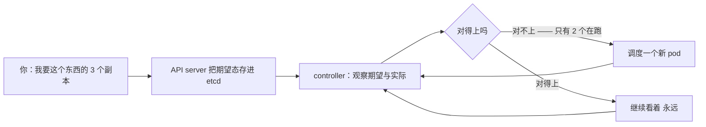
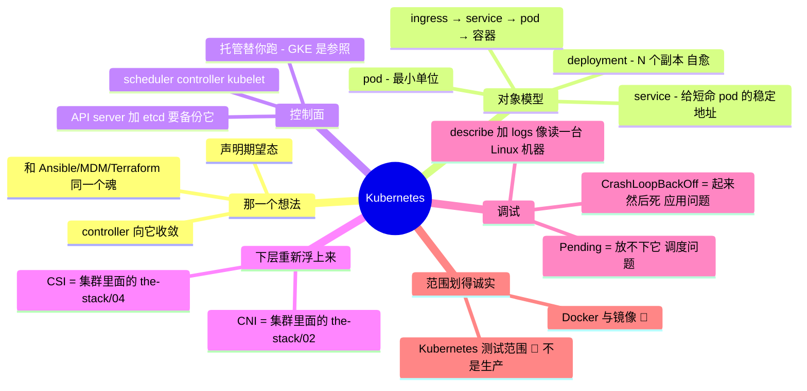

# Kubernetes 与容器

> 🌐 **语言：** [English（默认）](../../../cross-cutting/kubernetes.md) · **中文**
>
> ⚠️ 本项目**默认语言为英文**，`cross-cutting/kubernetes.md` 是"事实来源"。本页中文是多语言支持的一部分，可能略滞后于英文版；两者不一致时以英文为准。

---

> [`the-stack/05`](../the-stack/05-platform-services.md) 把 Kubernetes 放在了自建与租的光谱上；
> 这篇笔记往这件东西本身里再深一层 —— 因为"托管 Kubernetes"在它一闹脾气的时候，仍然要求你理解
> Kubernetes。那层抽象会漏水，而这就是它底下的东西。

Kubernetes 是整个仓库里最可移植的平台 —— 一个 EKS 集群、一个 AKS 集群和一个自跑的集群，是同一套
API 换了不同的控制面主人 —— 而这恰恰是它值得被认真学一次的原因。这篇笔记覆盖对象模型和操作者
视角：不是"怎么写一个微服务"，而是"怎么跑这个东西，以及在一个 pod 起不来的时候怎么调它"。

## 那一个想法：声明期望态，让 controller 收敛

Kubernetes 里的一切都是同一个模式，而这个模式这个仓库已经教过三遍了 ——
[Ansible playbook](iac-and-config.md)、[MDM profile](../endpoint/README.md)、
[Terraform state](iac-and-config.md)。你**声明期望态**；一条控制循环持续地**把它和现实比对，
并动手去合上那道缝**：

如果你已经从 [`foundations/`](../foundations/README.md) 和
[`iac-and-config.md`](iac-and-config.md) 里内化了幂等和期望态，你已经理解了 Kubernetes 的**魂**。
其余的是学它的名词，以及它的控制循环在哪里漏水。

## 对象模型 —— 那些名词，以及一个请求怎么抵达一个容器

- **Pod** —— 最小单位：一个或多个共享网络和生命周期的容器。通常你不直接创建它们。
- **Deployment** —— 声明"这个 pod 的 N 个副本，这个版本"；负责滚动发布和自愈。这才是你真正写的
  那个东西。
- **Service** —— 摆在一组 pod（它们来了又走）前面的一个稳定虚拟地址。它是"pod 是短命的，那怎么
  可靠地够到它们？"的答案。
- **Ingress** —— 把外部 HTTP 路由进 service（那扇南北向的门）。
- **ConfigMap / Secret** —— 注入 pod 的配置和凭据（[身份](identity-iam.md)那条"不把密钥烤进
  镜像"的规则，Kubernetes 版）。
- **Namespace** —— 集群内做隔离和访问控制的一个范围。

一个请求走的那条路把它们串了起来：**Ingress → Service → Pod → 容器**，而 Deployment 在底下让
正确的那些 pod 活着。学会那条链，"我的请求死在哪儿了？"就有了一个起点。

## 控制面 —— 托管产品替你跑的那部分

对象模型底下坐着的那套机械：

- **API server** —— 那扇正门；一切（你、controller、kubelet）都跟它说话。状态住在 **etcd** 里，
  也就是集群的数据库 —— 丢了 etcd 就丢了集群，这正是它的备份不是可选项的原因
  （[`the-stack/04`](../the-stack/04-storage.md)那份恐惧，集群版）。
- **Scheduler** —— 决定一个新 pod 落在哪个节点上。
- **controller-manager** —— 跑那些让期望态成真的控制循环。
- **kubelet** —— 每个工作节点上真正去启动容器的那个 agent。

**托管 Kubernetes（EKS/AKS/GKE/OKE）替你跑控制面和 etcd**；你跑工作负载，以及（视产品而定）那些
工作节点。这就是"托管"真正的价值：etcd 与升级那些杂活是真实且危险的杂活，把它交出去通常是对的
选择 —— 就是[自建与租](../the-stack/05-platform-services.md)那套算式，被套用了。
**GKE 被广泛当成参照**（Kubernetes 是 Google 的血脉）。自跑控制面是一份平台团队的承诺 ——
和 [`the-stack/01`](../the-stack/01-physical.md) 里的 OpenStack、
[`the-stack/04`](../the-stack/04-storage.md) 里的 Ceph 是同一条"控制面即产品"的警告。

## 网络与存储 —— 下层重新浮上来的地方

Kubernetes 逃不掉它底下那个栈；它通过插件把它重新导入了进来：

- **CNI（网络）** —— 那个给 pod 分 IP 和连通性的可插拔层；它就是
  [`the-stack/02`](../the-stack/02-network.md)那个 overlay/underlay 问题，搬进了集群**里面**，
  而且是一个高频的漏水点（pod 到 pod 的可达性、network policy、MTU —— 同一架调试梯子照样适用）。
- **CSI（存储）** —— pod 怎么从 [`the-stack/04`](../the-stack/04-storage.md) 那些块/文件存储里
  拿到持久卷；"我这个有状态的 pod 调度不上去"，通常是一个挂不上的卷（以及，又是 AZ 锁定）。

那条教训：Kubernetes 是一个坐**在**这个仓库已经覆盖过的那些层**之上**的调度器，不是"不用理解
它们"的替代品。它一坏，你就掉回到网络和存储的基本功上。

## 那份调试反射 —— 像读一台 Linux 机器那样读集群

[`foundations/`](../foundations/README.md) 那架调试梯子，移植到 Kubernetes：

- **`kubectl get` / `describe`** —— 有什么存在，以及*它为什么处在这个状态？* 对一个卡住的 pod
  跑 `describe`，会显示出解释它的那些事件。
- **`kubectl logs`** —— 容器自己说了什么（应用日志）。
- **一眼就要读出来的那两种故障模式：**
  - **`Pending`** —— 调度器*放不下它*：没有节点有那份资源，或者某个卷/亲和性约束满足不了。
    这是一个调度问题。
  - **`CrashLoopBackOff`** —— 它放下了、也*起来了，然后反复地死*：应用在启动时失败（配置错了、
    缺依赖、健康检查没过）。这是一个应用问题。

一眼把这两个分开，是 Kubernetes 版的"这个进程到底跑没跑起来？" —— 它立刻把你路由到问题正确的
那一半。

## AI 辅助的 ramp（Kubernetes 口味）

- **翻译那份期望态直觉：** *"我懂 Ansible 的期望态和 MDM profile —— 把这些映射到 Deployment、
  Service 和 controller 上，并让我看看 Kubernetes 的模型在哪儿是真的不同。"*
- **让它生成 YAML，拿集群去校验：** AI 写 manifest 很流畅，而且同样流畅地对字段和 **apiVersion**
  产生幻觉（这套 API 变得很快，也会废弃东西）。每一份 manifest 在被信任之前都要过一次
  `kubectl apply --dry-run=server` 或者一次 schema 校验 —— 集群才是事实来源，不是那段对话。
- **AI 会烧到你的地方（验得最狠的地方）：** 它会**发明不存在或已废弃的字段、apiVersion 和
  kubectl 参数**；它会**默认给出不安全的 manifest**（没有资源限额、特权容器、明文 ConfigMap
  里的密钥）；而且当一个工作负载根本不需要编排器时，它会**过度伸手去够 Kubernetes**
  （那是 AI 替你做不了的[自建与租](../the-stack/05-platform-services.md)判断）。校验那份
  manifest；然后质疑你到底需不需要它。

## 诚实边界

🧭 **诚实的 ramp —— 标得清清楚楚，而这也是这个标记最要紧的地方。** Docker 和镜像构建是 🔨
（[`the-stack/03`](../the-stack/03-compute-and-images.md)），但这里的 Kubernetes 是
**测试环境范围，不是生产平台所有权** —— 对象模型、控制面机械和操作者机制，是通过上面那套方法
理解并测绘的，没有被声称成多年跑生产集群、或者为一片机队背过 on-call。凡是这个仓库（或者一份
简历）需要一句生产 K8s 声称的地方，它都没有做出那句声称 —— 诚实的位置是一份很强的概念级和
测试级把握，加上一条通向运维一个真实集群的、快速且经过验证的 ramp，而这正是
[`WHY.md`](../WHY.md) 所说的那项耐久技能。这篇笔记就是那条 ramp，被写了下来。

## Guided run（规格）

**这是一次 [guided run](../CONTEXT.md)，不是一个 lab。** 它需要一个真实环境，所以这里没有任何
东西能断言你做过它，而 CI 也跑不了它。那就是全部的区分，而且它不是降级 —— 一次 guided run 够
得到真实的延迟、真实的报错和真实的账单，而那是没有模型做得到的。

**跑起来，弄坏它，读它。** 用 `kind` 或 `minikube` 纯本地做（笔记本上一个完整集群，零云）：

1. **部署**一个小应用：一个 Deployment（3 副本）加一个 Service，并够到它 —— 然后删掉其中一个，
   看着 controller 把 3 个 pod 维持住（期望态收敛，被摸得着）。
2. **用两种方式弄坏它：** 给它一个坏的镜像 tag（→ 读 `Pending`/`ImagePullBackOff`），以及一个
   过不了的健康检查（→ 读 `CrashLoopBackOff`）—— 并且只靠 `kubectl describe`/`logs` 分别诊断，
   把自己路由到"调度"还是"应用"。
3. **那次演练：** 加一个 ConfigMap 和一条资源限额，重新部署，然后 ——
   [自建与租](../the-stack/05-platform-services.md)那份反射 —— 写一句话，说清这个工作负载到底
   需不需要 Kubernetes，还是一个 serverless 容器就够了。

## 这一章一屏看完

