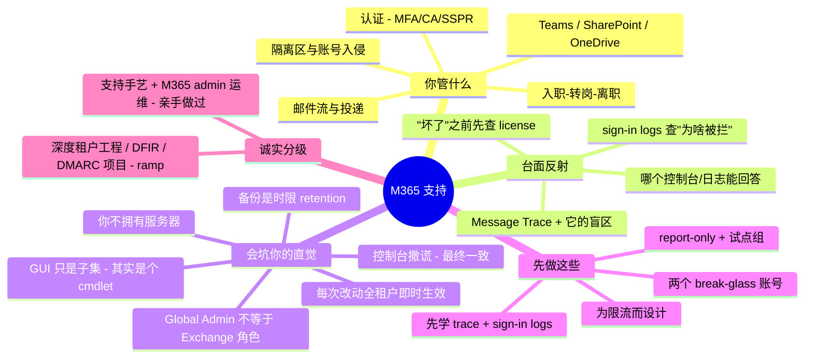

# Microsoft 365 支持 —— 运维者的转轨指南

> 🌐 **语言：** [English（默认）](../../../cross-cutting/m365-support.md) · **中文**
>
> ⚠️ 本项目**默认语言为英文**，`cross-cutting/m365-support.md` 是"事实来源"。本页中文是多语言支持的一部分，可能略滞后于英文版；两者不一致时以英文为准。

---

> [`saas-admin.md`](../../../cross-cutting/saas-admin.md) 讲的是把 M365 当作一份**受管资产（managed estate）** —— 生命周期与 admin-center 层面的工程。本篇讲另一半：**M365 支持（support）**，也就是让邮件、身份、协作对真实的人**保持可用**的那门修/救（break-fix）手艺 —— 并且专门讲清楚：**一个来自别的方向的强 sysadmin 接手它时，哪些直觉会坑他。** 支持这门手艺是 ✋ 亲手做过；再往深的租户工程尾巴是 🧗 ramp，如实标注。

一个熟练的 Linux / 网络 / on-prem-AD / 云运维，接手 M365 支持通常比一个新招的 helpdesk 快 —— **前提是**他能察觉自己哪些直觉已经不再适用。这段转轨里的痛，大多不是"不懂"，而是**把一身自信的肌肉记忆，指向了一个会打破自己规则的系统**。本篇把职责、真正反复出现的工单、以及有经验老手的反射恰好失灵的那几处一一点名 —— 让这次迁移变成一张核对清单，而不是一连串自找的故障。

## M365 支持到底管什么

这个角色是把"运维 + 排障"这条 lane 指向生产力套件。按工单到达的顺序，职责如下：

| 领域 | 你要为之负责的事 |
| --- | --- |
| **邮件流与投递** | "发出去了吗？去哪了？"—— message trace、transport rule、connector、NDR 解读、SPF/DKIM/DMARC、被入侵账号的限流。 |
| **邮箱与许可** | 开通、shared mailbox（委派 / automapping）、user→shared 转换、license 分配（直接与基于组）及其报错。 |
| **认证** | MFA 注册/重置、Conditional Access 设计与**解**除对合法用户的误拦、SSPR、密码重置、guest/B2B。 |
| **Teams** | 登录/缓存故障、会议/音频、成员、guest access。 |
| **SharePoint / OneDrive** | 同步失败、外部共享策略、权限继承、存储/配额。 |
| **Outlook 客户端** | profile/OST 损坏、"Trying to connect"、加载项、autodiscover。 |
| **服务健康与沟通** | 分清是微软侧事故还是本地问题，并对业务方说清楚。 |
| **入职/转岗/离职（JML）** | 阻断登录、吊销会话、保住邮箱及其数据、回收 license。 |
| **安全与隔离区** | 释放误判邮件、响应被入侵账号、allow/block 列表。 |
| **报表与合规** | 登录/审计日志、邮件流报表、license 使用情况。 |

其中两项 —— **邮件流**和**认证** —— 贡献了绝大多数工单量，而它们也正是外来者直觉栽得最惨的地方（见下）。

## 常见工单 —— 以及去哪查

M365 的修/救本质是在一小组界面上做模式识别。你要练成的反射是：**"哪个控制台/日志能回答这个问题，它又有什么局限？"**

**Exchange Online / Outlook —— 最大的一桶。**
- *"我的邮件没到。"* → **Message Trace**（Exchange admin center → Mail flow），全台面用得最多的工具。把它的局限背熟：一封邮件**要 ~5–10 分钟才会出现**；只有 **< 10 天**的消息才能交互式查（更老的以异步 CSV 返回）；trace 保留 **90 天且不可配置**；被 **IP 信誉 / connection filtering 丢弃**的邮件**根本无法 trace** —— 这就是云端版的"包在碰到任何你能看到的东西之前就被丢了"。
- *NDR / 退信码*是一张值得背下来的速查表，因为码本身就定位了故障：**5.1.1** 收件人错（常是邮箱迁移后 Outlook 自动补全缓存过期）；**5.7.1 / 5.7.133 / 5.7.124** 分发组发送限制；**5.7.23** SPF 失败；**5.7.509** 发件人 DMARC 失败且策略为 `reject`；**5.7.57** 某个 app/打印机通过 `smtp.office365.com` 匿名中继；**5.1.8 / 5.1.90 / submission-quota-exceeded** 几乎总意味着账号**被入侵** —— 该转事件响应，而不是去调邮件流。
- *Outlook "Trying to connect" / OST 问题* → 先在 **Outlook on the web** 里确认（隔离是客户端还是服务侧），再**新建 profile**、重建 **OST**、禁用加载项、清缓存凭据。**Support and Recovery Assistant (SaRA)** 能自动完成其中大部分。
- *Shared mailbox 不出现* → automapping 走 **autodiscover**，可能要 ~30 分钟；注意陷阱：`Add-MailboxPermission` **默认不启用 automapping**（admin center 会），而**通过组授予的访问永远不会 automap**。

**Teams。** 登录死循环几乎总是**缓存凭据过期** → 清 Teams 缓存和 Windows Credential Manager 里的条目，用 **web app** 测试以隔离是桌面端还是账号。Guest 加不进来通常是**外部协作设置**（域被封，或邀请者是 Member 而非 Owner），而新的 guest 设置**最多要 24 小时**才生效。

**SharePoint / OneDrive。** 同步卡在 "Processing changes" 通常是**有 Office 文件开着、路径里有不支持的字符**（`" * : < > ? / \ |`）、或同步树里有超大文件。"*你所在组织的策略不允许你共享*"是**两级共享模型**：SharePoint-admin 的组织级上限，和每站点设置，其中**站点只能等于或更严于**组织级。"Access Denied" → **Site permissions → Check Permissions**；并且要知道硬墙 —— 继承在**超过 10 万条目**后无法再更改，单个库支持的**唯一权限上限是 5 万**。

**身份 / Entra。** *"我被拦了，不知道为啥"* → **Entra sign-in logs**，打开那次失败的登录，看 **Conditional Access** 页（哪条策略）和 **Troubleshooting** 页（为什么）。`AADSTS53000–53004` 定位 CA 拦截（设备不合规、被 CA 阻止等）。legacy-auth 失败表现为 **Client app = "Other clients"**。MFA 死循环靠强制重新注册解决；SSPR 配一个**非 MFA 的恢复方式**能让用户自助解套。

**许可（Licensing）。** 在排查**任何**"功能缺失"之前，先确认它**有 license** —— 相当大比例的"坏了"其实是"从没授权过"。**基于组的许可**会悄悄失败：usage-location 必填、**不支持嵌套组**，而且把用户在两个许可组之间迁移时要**先加入目标组**，以免出现一个临时的无许可空档把他的邮箱剥掉。

## 经验差 —— 一个强 sysadmin 的直觉会错在哪

这才是职位名称藏起来的部分。**做过** M365 支持的人和没做过的人之间的差距，**不在**菜单 —— 聪明的运维一周就学会菜单。差距在于一组来自 on-prem / 云-IaaS 世界的**承重假设，在这里是错的**，而每一条都挂着一个失效模式。

- **你不拥有那台服务器。** Exchange Online 上没有 shell、没有 `tcpdump`、没有"去机器上看日志"。你的全部诊断面就是 **Message Trace + Service Health + sign-in logs**，而诚实的终点有时就是那句*"给微软开工单"*。那套*复现-然后打点*的反射只能用一半；你大多是**事后、按微软的粒度**去观察。
- **控制台会撒几分钟谎。** M365 是**最终一致（eventually consistent）**的 —— 一次成功写入并不保证立刻能读回。license 变更要几分钟到（偶尔）**24 小时**；微软明确说**新建 transport rule 后要等 ≥30 分钟再测**。那套 on-prem 反射 —— *改、刷新、没生效、再改* —— 在这里只会制造冲突状态。**改一次，然后等。**
- **GUI 只是子集。** 相当大一部分真实支持工作**只能靠 PowerShell**（Exchange Online 模块）或 **Microsoft Graph** —— 批量操作、细粒度邮箱与审计设置、详细报表。如果门户里找不到某个设置，正确的假设通常是*"这是个 cmdlet"*，而不是*"它不存在"*。跑通 `Connect-ExchangeOnline` 是**第一周**的技能，不是高阶技能。
- **"Global Admin" 不等于"一个 Exchange 角色"。** 这里有**多套互不重叠的权限面**：Entra 目录角色、**Exchange Online RBAC**、SharePoint、Purview/合规、Defender、Teams。微软明说 Exchange 的 role group **不与** Defender 或 Purview **共享成员**。那套"Domain Admin 无所不能"的模型在这里映射得很糟；最小权限在这里是真实、细粒度的，而且本身就是一类"我为啥做不了这个"的工单来源。**没有 `root`。**
- **许可会 gate 功能。** 上面讲过，但值得作为一条心智纠偏单列：一个缺失的功能，先是个**账单**问题，才是个**支持**问题。
- **每一次改动，保存的瞬间就对全租户生效。** 一条 transport rule、一条共享策略、一条 Conditional Access 策略，**一次命中所有人**。"先在机器上试试，不行再回滚"是从 on-prem 带来的最危险的一条反射。替代品是**试点组（pilot group）**、transport-rule 的 **test mode**、以及 Conditional Access 的 **report-only** 模式 —— 每次都用。
- **你能把自己锁在门外 —— 所以先修好逃生门。** 范围设成"All users"的 CA 策略经常连管理员一起拦。**break-glass / 应急访问账号是强制项，不是卫生习惯**：建**两个**、**cloud-only**（绝不同步）、Global Admin、**排除在每一条 CA 策略之外**、密码**离线**保存、**FIDO2** MFA、开**登录告警**、每季度演练。每条新 CA 策略先跑 **report-only** ~一周再启用。
- **对 1 万个邮箱 `foreach` 不是免费的。** Graph 和 Exchange Online 会**限流** —— HTTP **429** 带 **`Retry-After`** 头，外加租户级的 EXO PowerShell 限流策略。为它而设计（批量读、遵守 429、大迁移申请临时放宽），而不是硬扛。
- **"从昨晚的备份恢复"是虚假的安慰。** 微软不按你以为的方式给你做备份。恢复是一组**时限窗口，且微软能把它缩短**：soft-deleted mailbox **30 天**、已删项 **14（最多 30）天**，而 inactive-mailbox 窗口在 2022 年从 **183 → 30 天**。只有**事先配置的 retention policy / litigation hold** 才能长期保住数据 —— 在事故**之前**就设好它们（或一份真正的第三方备份），不是事故当中才想起。
- **混合身份有锋利的边。** 用了 Entra Connect，**`sourceAnchor` / immutableID 不可变**、在安装时定死；**source of authority** 意味着一次 hard-match 会让 on-prem 覆盖云端对象；重复的 `proxyAddresses`/UPN 会抛同步错误。而且结构上，**Entra ID 是扁平目录** —— 没有 OU、没有 GPO、没有 forest；GPO 曾经做的设备策略现在是 **Intune**。你那套 ADUC/GPMC 的肌肉记忆**不会**迁移；把 Entra 当成一个*不同的*系统，而不是"云上的 AD"。*（混合 Exchange 部署是否还需要保留最后一台 on-prem Exchange 服务器，这一点一直在演进 —— 针对具体租户去核实现状，别当成不变的事实。）*
- **邮件认证现在是你的活。** M365 对**入站**做 DMARC 校验，但**你自己域名的出站 SPF/DKIM/DMARC 要你去配** —— 自定义域的 DKIM 签名默认不开。而且 **basic auth 正在终结**：SMTP AUTH 的 basic authentication 计划在 **2026 年底默认关闭** —— 现在就把会因此报废的扫描仪和业务线发信端清点出来。
- **变更日历归微软掌握。** 行为变更**默认**通过 **Message center** 下发，常带一句*"无需管理员操作"*。on-prem 上是你定补丁/变更日历；这里你**监控一份你不拥有的日历** —— *"昨天还好好的、我啥也没改"*在这里是个合法的根因。把 Message center 放到一个试点环（**Targeted release**）上，并每周读它。

## 什么可迁移，什么不可

| 干净迁移 | 带保留地迁移 | 别带过来 |
| --- | --- | --- |
| DNS 与邮件底层（SPF/DKIM/DMARC、MX、TTL）—— 这里*更*核心 | "我有 admin，所以什么都能看到" —— 部分为假（不透明、限流、"开工单"） | 包/OS 级排查 —— 没 `tcpdump`、机器上没 shell |
| TLS / 证书推理（connector TLS、"force TLS failed" NDR） | 读写强一致 —— 要为最终一致性重新校准时序直觉 | "从昨晚备份恢复" —— 是你要事先配好的时限 retention |
| 身份与最小权限的*思维*（原则） | AD 管理 —— Kerberos/OU/GPO 不映射到 Entra 的 OAuth/RBAC/Intune | "在机器上试、不行回滚" —— 每次改动都对全租户即时生效 |
| 结构化排障（复现 → 隔离 → 验证） | | 拥有补丁/变更日历 —— 你只监控微软的 |
| 脚本与自动化（PowerShell/Graph *奖励*你） | | "`root` 能修一切" —— 没 root；连 Global Admin 都会把自己锁在外面 |
| 日志素养（sign-in / audit / trace 都是结构化日志） | | |
| 变更纪律（试点/分级/回滚）—— 这里*更*重要 | | |

## 第一周 / 前 90 天

**第一周 —— 在你动任何全租户的东西之前。**
1. **建两个 break-glass Global Admin 账号**（cloud-only、排除在所有 CA 之外、FIDO2、密码离线、开告警）—— 在你写第一条 CA 策略*之前*。
2. **连上 Exchange Online PowerShell 和 Microsoft Graph PowerShell。** 接受一个事实：约一半的活在这里。
3. **先学 Message Trace + Entra sign-in logs + Service Health** —— 你的主诊断面 —— 包括 Message Trace 的局限（5–10 分钟才出现、90 天不可配置保留、被 IP 拦的邮件无法 trace）。
4. **配好 Targeted release** 放到一个试点环，并开始读 **Message center**。

**前 30 天 —— 防止自己给自己造故障的习惯。**
5. **绝不在没有试点组的情况下改全租户策略。** 新 CA 策略 → report-only ~一周。新邮件流规则 → test mode，等 ≥30 分钟再测。
6. **在排查"功能缺失"前先查 license（和传播延迟）。** 别反复横跳 —— 改一次，然后等。
7. **摸清你租户的权限面** —— 谁有 Global Admin（保持人数很少），有哪些孤立的细分角色。
8. **背下恢复窗口** —— 邮箱 30 天、已删项 14/30 天 —— 并为任何需要更久留存的东西设一条真正的 retention policy。

**前 90 天 —— 抢在路线图前面。**
9. **清点 legacy/basic-auth 发信端**，赶在 2026 年底的截止点前。
10. **核实每个发信域的 SPF/DKIM/DMARC。**
11. **审计混合身份**（Entra Connect 的 source-of-authority、immutableID、同步错误），如果在用的话。
12. **让脚本为限流而设计**（批量、`Start-Sleep`、遵守 `Retry-After`）。

## AI 辅助的 ramp（M365-support 口味）

- **把你的直觉翻译成 M365 的行话：** *"我会 `tcpdump` 然后 grep 邮件日志 —— 一封没投递的邮件，Exchange Online 的等价做法是什么，我又有哪些看不到？"* 那个诚实的答案（Message Trace + 它的盲区）恰恰是 AI 擅长压缩的东西。
- **让它起草 cmdlet，你亲手做最小权限。** AI 在 **PowerShell / Graph** 上是真强 —— 而它也会**发明不存在的 cmdlet 和 Graph endpoint**、**把 Entra 角色和 Exchange RBAC 混为一谈**、并且爽快地给你一条**爆炸半径是整个租户的 transport rule 或共享改动**。每一段生成的脚本都要对着[官方 cmdlet 参考](#field-kit--真实工具与参考)核验、并先试点，才允许碰生产。这跟本仓库其余部分是同一套"往死里验证"的纪律 —— 见 [`ai-workflow/`](../../../ai-workflow/)。

## 诚实边界

✋ **支持这门手艺是亲手做过的**，而且它靠着真实的相邻深度：**M365 admin 运维**（Exchange 邮箱/shared mailbox/transport rule、SharePoint 权限、Teams —— 见 [`saas-admin.md`](../../../cross-cutting/saas-admin.md)）、**Entra ID 初始搭建**（租户级 MFA、一条 Conditional Access 策略、PIM —— 见 [`identity-iam.md`](../../../cross-cutting/identity-iam.md)）、以及 Intune 合规会 gate 访问的 **endpoint** 相邻面（[`endpoint/`](../../../endpoint/)）。DNS/TLS/身份这些基本功直接迁移。

🧗 **尾巴是 ramp，并且如实标为 ramp** —— 15 万用户规模的**深度 Exchange Online 租户工程**、专职的 **Defender for Office 365 / Proofpoint** 运营、**DMARC/DKIM 强制**推行、以及下面的 **DFIR / 入侵取证**工具，都是专精赛道，不是声明。这条线和 [`saas-admin.md`](../../../cross-cutting/saas-admin.md) 与 [`working-with-security.md`](../../../cross-cutting/working-with-security.md) 里画的是同一条：运维-排障是强项，跑整个安全项目是 ramp。

## Field kit —— 真实工具与参考

以下指针在 GitHub 上逐个核实存在，按用途分组。安全/IR 工具很强、属**进阶** —— 用于事件调查，不是日常工单。

**参考与脚本（每日台面）：**
- [`MicrosoftDocs/office-docs-powershell`](https://github.com/MicrosoftDocs/office-docs-powershell)
  —— 官方 cmdlet 参考（Exchange Online、Teams、SharePoint）。你拿它去核对生成出来的 `Get-MessageTrace`。
- [`12Knocksinna/Office365itpros`](https://github.com/12Knocksinna/Office365itpros)
  —— Tony Redmond 维护的一大批真实 admin/报表/整改脚本，活跃更新。
- [`microsoftgraph/msgraph-sdk-powershell`](https://github.com/microsoftgraph/msgraph-sdk-powershell)
  · [`merill/awesome-entra`](https://github.com/merill/awesome-entra) —— 现代 Graph SDK，以及身份/认证排障最好的起点。
- [`microsoft/CSS-Exchange`](https://github.com/microsoft/CSS-Exchange) —— 微软**自己的** CSS 诊断工具/脚本（HealthChecker、hybrid/EXO）。

**配置即代码与漂移（"到底改了什么？"）：**
- [`Microsoft365DSC/Microsoft365DSC`](https://github.com/Microsoft365DSC/Microsoft365DSC)
  —— 把整个租户的配置抽取/监控/检测漂移；"有人改了什么"的根因工具。
- [`maester365/maester`](https://github.com/maester365/maester) —— 基于 Pester 的持续校验 M365/Entra 安全配置。
- [`pnp/powershell`](https://github.com/pnp/powershell) —— SharePoint Online / OneDrive 权限与共享排障的首选模块。
- [`KelvinTegelaar/CIPP`](https://github.com/KelvinTegelaar/CIPP) —— MSP 的多租户管理门户（一处对多租户跑同一个修复）。
- [`merill/idPowerToys`](https://github.com/merill/idPowerToys) —— 把 Conditional Access 策略集导成可读文档，诊断"我为啥被拦"时有用。

**姿态与评估：**
- [`cisagov/ScubaGear`](https://github.com/cisagov/ScubaGear) —— CISA 对照 SCuBA 基线做的租户评估（Entra/Exchange/Teams/SharePoint/Defender）。
- [`cammurray/orca`](https://github.com/cammurray/orca) —— Defender for Office 365 的推荐配置分析器；定位投递/隔离工单背后的邮件防护配置问题。

**事件响应（进阶 —— 账号入侵 / BEC）：**
- [`T0pCyber/hawk`](https://github.com/T0pCyber/hawk) ·
  [`invictus-ir/Microsoft-Extractor-Suite`](https://github.com/invictus-ir/Microsoft-Extractor-Suite)
  —— 采集并分析 M365 日志（统一审计、sign-in、message trace），用于"用户被钓、邮箱规则被改"这类调查。

**值得优先于任何博客收藏的权威文档**：**Microsoft Learn** 的
[NDR 码](https://learn.microsoft.com/en-us/troubleshoot/exchange/email-delivery/ndr/non-delivery-reports-in-exchange-online)、
[Message Trace 局限](https://learn.microsoft.com/en-us/exchange/monitoring/trace-an-email-message/message-trace-faq)、
[Conditional Access 排障](https://learn.microsoft.com/en-us/entra/identity/conditional-access/troubleshoot-conditional-access)、
以及[基于组的许可问题](https://learn.microsoft.com/en-us/entra/fundamentals/licensing-groups-resolve-problems)。

## Lab —— Conditional Access 自锁 ✅ 可跑

**亲手证明租户级 blast radius。** 一个纯本地、只用 stdlib 的 drill，把 M365 在一条 Conditional Access 策略下的登录建模：上线一条天真的"all users、require compliant device"策略，看着 **admin 和 break-glass 账号把自己锁在门外**，加上排除，再看 **report-only 什么都不强制** —— 正是经验差一节里*排除 break-glass、先跑 report-only* 那条反射，落到实处。

```bash
python3 cross-cutting/labs/m365-conditional-access-lockout/ca_lockout_drill.py
```

exit `0` 表示四条教训都成立（兼作 CI 检查）。见 [`labs/m365-conditional-access-lockout/`](../../../cross-cutting/labs/m365-conditional-access-lockout/)。

## 一页看全本章


