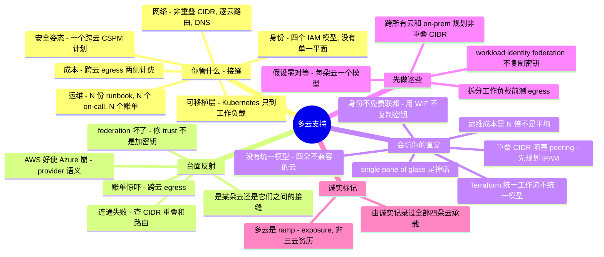

# 多云支持 —— 单云 sysadmin 的转轨指南

> 🌐 **语言：** [English（默认）](../../../cross-cutting/multi-cloud-support.md) · **中文**
>
> ⚠️ 本项目**默认语言为英文**，`cross-cutting/multi-cloud-support.md` 是"事实来源"。本页中文是多语言支持的一部分，可能略滞后于英文版；两者不一致时以英文为准。

---

> [平台篇](../../../platforms/)一次读一朵云;[`the-stack/`](../../../the-stack/) 横跨它们读一层。本篇是收官之作:**把多云支持当作一门修/救（break-fix）手艺**——反复出现在云*之间*的工单、精确的排查落点,以及**一个强单云 sysadmin 在几朵云必须协同工作时,哪些直觉会被烧到。** 诚实标记先说清:本篇是 **🧗 ramp**——我的多云亲手经验是 **exposure**(AWS/Azure/GCP/OCI 都映射并实验核验过,真正 ✋ 只在 Azure/Entra 身份上),由一个真实资产承载——我**给全部四朵云都写了诚实的逐云支持笔记**([AWS](../../../platforms/aws/support.md) · [Azure](../../../platforms/azure/support.md) · [GCP](../../../platforms/gcp/support.md) · [OCI](../../../platforms/oci/support.md)),*而那份综合本身就是多云技能。* 它的权威来自研究(厂商文档 + practitioner 失效模式 + 一个可跑的 [lab](#lab--重叠-cidr-断开互联--可跑)),不是跨三家的生产资历。

**多云是一种姿态,不是一个产品。** 没有一个你装上去的统一控制面——每朵云保有自己的 IAM、网络、配额、账单、遥测模型,而工作是拥有**它们之间的接缝。** 一个单云管理员带着一种虚假的踏实上手:"我懂云。" 但昂贵的错误不住在任何一朵云里(那些你学过了);它们住在四条接缝里——**CIDR/路由、跨云身份、egress/data-gravity、一致的安全姿态**——那里单云直觉假设了一种并不存在的对等。本篇把接缝职责、反复出现的跨云工单、以及失灵的直觉一一点名——全程倚靠四篇平台笔记,因为*多云就是那四个模型同时在跑。*

## 支持多云让你要为什么负责

修/救的面就是这组接缝,大致按它 page 你的频率:

| 接缝 | 你要为之负责的事 |
| --- | --- |
| **跨云身份** | **没有单一身份面**——四个结构不同的 IAM 模型([AWS](../../../platforms/aws/support.md) explicit-deny-wins JSON、[Azure](../../../platforms/azure/support.md) Entra-vs-RBAC 两平面、[GCP](../../../platforms/gcp/support.md) additive/继承 binding、[OCI](../../../platforms/oci/support.md) verb+compartment)。**workload identity federation**(OIDC/STS token 交换换短时凭证)*取代*复制的长期密钥;凭证/密钥泛滥。 |
| **云间网络** | 互联(site-to-site VPN / Direct Connect / ExpressRoute / Cloud Interconnect);各云的 transit hub(Transit Gateway / Virtual WAN / Network Connectivity Center)**不跨云联邦**;头号阻塞——**跨所有云 + on-prem 的非重叠 CIDR 规划**(没有中央 IPAM);跨云 **DNS**(条件转发);非对称路由。 |
| **成本与 egress** | **跨云数据传输(egress)——两侧都计费**,沉默的杀手;**data gravity**;N 个不同账单模型 + 被侵蚀的 committed-use 折扣;跨云 FinOps 可见性。 |
| **安全姿态** | 各云 secure-by-default 不同 → 同一意图产生不同暴露;一个**跨云 CSPM 计划**(不是一个开关);跨云的爆炸半径;最弱/最不熟的那朵云就是你的暴露。 |
| **provisioning 与可移植层** | Terraform/OpenTofu 多 provider(**HCL 统一、语义不统一**——资源不是 1:1);Crossplane;**Kubernetes 作为唯一可移植的*工作负载*层**,而身份/网络/存储仍是云特定的。 |
| **可观测性** | 日志/指标在每朵云自己的栈里(CloudWatch / Azure Monitor / Cloud Logging / OCI Logging)——默认没有单一视图;聚合要付两次钱(还有 egress)。 |
| **运维乘数** | N 朵云 ≈ **N 个 IAM 模型、N 个网络模型、N 个配额系统、N 套命名、N 份 on-call runbook**——toil 被乘,不是被平均。 |

## 常见工单 —— 以及去哪查

多云修/救就是知道 **N 朵云里哪个在撒谎,以及问题在某朵云里、还是在它们之间的接缝里。**

**"AWS 上好使,Azure/GCP 上崩。"** 同一份 Terraform、不同 provider 的语义——或一个没有 1:1 对应的资源(一个 AWS load balancer 是一个资源;一个 GCP HTTP LB 是 `backend_service` + `forwarding_rule` + `url_map` + 一个 proxy)。*去哪查:* 逐 provider 的 plan 和 state、那个具体资源的 provider 文档。HCL 统一,底下的模型不统一。

**跨云连通失败——网络工单。** 按可能性排序:**重叠的 CIDR**(peering/VPN 被*拒*——一个硬的厂商文档事实)、一侧**缺一条路由**(没有中央路由器——每朵云自己路由)、**非对称路由**(回程没路由的回复)、或**跨云 DNS 解析不了**(私有 zone 默认不跨;你在 resolver 间连条件转发)。*去哪查:* **逐云**的 route table、VPN/peering 状态、CIDR/IPAM 计划、DNS 转发配置。[lab](#lab--重叠-cidr-断开互联--可跑) 演练重叠和路由失败。

**egress 账单惊吓。** 一个跨云拆分的 chatty 服务、或跨边界运送的遥测——跨云数据传输按互联网 egress 在*两*侧计费。*去哪查:* 逐云的成本/账单工具、数据传输行项、网络流日志。*(注:2024 年 AWS/GCP/Azure 的"退出费豁免"覆盖的是**一次性完全退出**,不是日常传输——日常 egress 照样计费。)*

**federation 坏了。** 一个 workload 在另一朵云里 assume 不了 role:OIDC/SAML trust 或 issuer 配错、token/subject 映射错、token 过期。*去哪查:* 两侧的 trust 配置(IdP + 目标云)、token claim 对 trust 条件、JWKS 可达性。修法几乎从不是"加个密钥"——是修 federation。

**安全姿态不一致。** 一个资源在某朵云上公开、因为它的默认不同,或配置跨云漂移了。*去哪查:* 一个多云 CSPM 工具**同时跨所有云**的发现、逐云的 IaC-对-live 漂移。

**密钥/凭证泛滥。** 长期密钥被复制到云之间(一个 AWS key 放在 GCP 机器上)。*找修法:* 审计存储的跨云静态密钥 → 目标**归零**,换成 workload identity federation。

## 经验差 —— 一个强 sysadmin 的直觉会错在哪

做过多云的单云管理员和没做过的之间的差距,是一组**对等假设**——它们是错的。单云的一切都作为*方法*迁移;它在你假设几朵云一样的地方失灵。

- **没有统一的模型——四朵云,四个不兼容的授权模型。** "学一次云"严重低估了逐云差异:**AWS** explicit-deny-wins 的 JSON 并集;**Azure** 两个身份平面(Global Admin *不是* Owner);**GCP** additive/继承 binding(有一个单独的 Deny-policy 机制,但标准 binding 撤不掉继承来的授权);**OCI** verb + compartment,只 allow。把 AWS 的"explicit deny 胜"直觉套到 GCP、或假设 Azure 的 Global Admin 够得着你的 VM,就会犯真的访问错误。(这正是四篇平台支持笔记存在的理由——读它们*就是*这道 ramp。)
- **"Terraform 让它统一"是假的。** 它给你一个*工作流*(plan/apply/state/HCL),不是一个*模型*。资源不是 1:1,`forces replacement` 逐 provider 不同,一个 AWS 的 module **移植不到** Azure/GCP——你逐 provider 重写,复用实践、不复用代码。
- **"single pane of glass"多半是神话;Kubernetes 只在工作负载层可移植。** 标准 manifest 到处能跑,但 **IAM、storage class、load balancer、ingress、workload identity 在 EKS/AKS/GKE 之间不可移植**。可移植的接缝是应用;底座仍是云特定的。
- **身份不会免费联邦。** 默认没有跨云 SSO/trust。诱人的捷径——把长期密钥复制到另一朵云——是把万能钥匙(不撤就一直有效、常常过权)。建 **workload identity federation**:把原生身份换成短时 token,什么都不存。
- **egress 是沉默的杀手;data gravity 拴住工作负载。** 一个在单云跨 AZ 拆分~免费的 chatty 架构,跨云会产生账单惊吓(两侧计费)。计算被它的数据吸引——拆分一个工作负载*之前*先测字节流。
- **重叠的 CIDR 是头号连通阻塞——没有中央 IPAM、没有中央路由器。** 每个控制台都往 `10.0.0.0/16` 引;两朵云(或一朵云和 on-prem)都取了默认就**不能 peer/VPN**。你继承了 on-prem 的企业 IPAM 纪律——提前跨*所有*云 + on-prem 规划非重叠范围,并双向加逐云路由。
- **运维成本是 N 倍,不是被摊薄。** N 个要推理的 IAM 模型、N 个网络模型、N 份 runbook、N 个配额/账单系统。多云乘 toil;弹性——如果你拿到——是用 N 倍努力买的——而且你丢了单供应商的 committed-use 折扣。它不*平均*风险。
- **最小公分母 vs cloud-native 是真张力。** 真正可移植意味着放弃托管服务(或逐云重造)。"避免锁定"有持续的代价;只在系统真正对话的边界处建抽象。
- **爆炸半径和姿态跨云——一致性是个计划。** 你的暴露是最弱、最不熟那朵云上的一个配错,以及供应商*之间*的缝(不一致的 IAM、碎片化的审计日志、漂移)。
- **多数团队是意外多云。** 并购、数据驻留监管、best-of-breed、或影子 IT——你继承的是分裂的约定、事后强加一致性,不是干净的绿地。

## 什么可迁移，什么不可

| 强迁移 | 带保留地迁移 | 别带过来 |
| --- | --- | --- |
| **逐云操作模型**([seven surfaces](../../../00-the-operating-model.md))——每朵云跑一次,预期不同答案 | 最小权限*思维*——意图迁移;编码(4 个 IAM 模型)不迁移 | "一个 IAM"——四个不兼容的授权模型 |
| **网络基本功**——CIDR、路由、DNS、BGP、非重叠纪律;on-prem IPAM 是真资产 | 云/API 熟悉度——但每个 provider 的原语不同 | "一个网络 / 一个中央路由器"——逐云路由,没有中央 IPAM |
| **IaC 纪律**——plan-before-apply、state、评审(*工作流*经 Terraform 移植) | 托管服务反射——可移植性要它的命(LCD 张力) | "Terraform 统一模型"——它统一*工作流*,不统一语义/module |
| **成本意识**——尺寸、配额、committed-use 推理 | 可观测习惯——但指标/日志在 N 个独立栈里 | "single pane of glass"——不存在;K8s 只覆盖工作负载 |
| **排障方法学**——二分、读日志、查配额 | 身份联邦*概念*——但你要建它(WIF),不免费 | "云内 egress ~免费,所以跨云也没事"——两侧计费 |
| **诚实记录过每朵云**——那份综合*就是*多云技能 | | "把 AWS policy/module 复制到 Azure" · "admin 角色就是 admin 角色" |

## 第一周 / 前 90 天

**第一周。**
1. **跨所有云 + on-prem 规划非重叠 CIDR——在任何 peering/VPN 之前。** 这是唯一难以逆转的决定(给活 subnet 重新编址)。采用一份主地址计划 + 中央 IPAM;核实*整个*拓扑无重叠。
2. **用 workload identity federation,绝不复制长期密钥。** 立 OIDC/STS trust;审计资产里存储的跨云静态密钥 → 目标归零。
3. **脑子里保持每朵云一份权威模型——假设零对等。** 每朵云一页简短的"这里 auth / 路由 / secure-by-default 怎么运作"。那四篇[平台](../../../platforms/aws/support.md)[支持](../../../platforms/azure/support.md)[笔记](../../../platforms/gcp/support.md)[就是](../../../platforms/oci/support.md)这个,写下来了。
4. **把每个跨云工单重构为"某朵云、还是云之间的接缝?"**——最昂贵的都是接缝。

**前 30 天。**
5. **拆分任何工作负载前先测跨云 egress**——建模字节流,让 chatty 组件和它的数据同地(data gravity),对着实时定价核。
6. **把 Kubernetes + Terraform 当作共同*工作流*、尊重逐云*语义***——标准化应用层和 IaC 环;预期 provider 特定的 module 和显式的逐云存储/网络/身份。
7. **刻意连跨云 DNS**——resolver 间条件转发;私有 zone 不免费跨。
8. **双向加逐云路由**——非对称路由即使隧道通了也会半开连接。

**前 90 天。**
9. **把安全姿态做成跨云 CSPM 计划**——一套跨所有云、严重度一致的工具/策略,因为暴露是最弱那朵云和它们之间的缝。
10. **集中密钥**(Vault / external-secrets)用动态短时凭证——从源头杀掉泛滥。
11. **显式预算 N 倍运维**——N 份 runbook、N 个 on-call、N 个账单;规划人手、接受丢掉的量折扣。别把多云对内卖成 toil 平均。
12. **有意决定可移植的边界**——哪些部分 LCD 可移植、哪些 cloud-native;别不小心把一切都拉到最小公分母。

## AI 辅助的 ramp（多云口味）

- **在云之间翻译——并索要非对等:** *"我懂 AWS IAM 和 VPC —— 把 Azure 两平面 RBAC、GCP additive binding、OCI verb/compartment 模型映射到它们上,并标出它们**不**等价的每一处。"* AI 在逐云翻译上很有用(就是平台笔记那套 translate-then-verify)——但**四路 IAM 分歧、重叠-CIDR 阻塞、egress 经济学在单云里没有对应物**,那些要往死里验证。
- **让它起草逐云 IaC;你掌控接缝。** AI 会乐呵呵地**把一个 AWS module 复制到 Azure**(不移植)、**建议跨云复制密钥**(用 WIF)、**把两个网络都默认成 10.0.0.0/16**(重叠)、并**假设一个不存在的单一控制面**。绝不 apply 你没逐 provider 推理过的跨云改动,并在任何东西跨边界对话前核实 CIDR 非重叠 + federation。同一套往死里验证的纪律——见 [`ai-workflow/`](../../../ai-workflow/)、[`terraform-support.md`](../../../cross-cutting/terraform-support.md)、[`kubernetes-support.md`](../../../cross-cutting/kubernetes-support.md)。

## 诚实边界

本篇是 **🧗 ramp,而且明说。** 我的多云亲手经验是 **exposure**——每朵云的操作模型都映射并实验核验过,真正 ✋ 深度只在 **Azure/Entra 身份**上(以及 ✋ on-prem 网络/IPAM,它在这里强迁移)。承载它的是那个真实资产:我**给全部四朵云都写了诚实、有据可查的支持笔记**([AWS](../../../platforms/aws/support.md) · [Azure](../../../platforms/azure/support.md) · [GCP](../../../platforms/gcp/support.md) · [OCI](../../../platforms/oci/support.md))外加 [`identity-iam.md`](../../../cross-cutting/identity-iam.md) 和 [`cost.md`](../../../cross-cutting/cost.md)——而**多云支持*就是*那份综合**用在接缝上,由 ✋ 网络基本功和一个可跑的 [lab](#lab--重叠-cidr-断开互联--可跑) 撑着。上面那些接缝机制——federation、CIDR/IPAM、egress 经济学、跨云姿态——是映射并文档核验过的,**不是资历。** 更深的生产多云(跨三家真跑工作负载、一张活的跨云网络 fabric、规模化的多云 FinOps + CSPM 计划)仍在前方;注释如实说明、绝不吹。这是一个先记录每朵云、再记录它们之间接缝的 sysadmin 的诚实收官之作——公开记录、✋/🧗 标注。

## Field kit —— 真实工具与参考

以下指针在 GitHub 上逐个核实存在,按用途分组。已归档 / 改名 / 迁移状态都标了。

**provisioning 与可移植层:**
- [`hashicorp/terraform`](https://github.com/hashicorp/terraform) · [`opentofu/opentofu`](https://github.com/opentofu/opentofu) —— 跨每朵云的一个*工作流*(语义仍逐 provider);OpenTofu 是 MPL fork。
- [`crossplane/crossplane`](https://github.com/crossplane/crossplane) —— 用 CRD 声明式 provision 云基础设施的 Kubernetes 控制面——最接近"跨云一个 API"的东西。
- [`pulumi/pulumi`](https://github.com/pulumi/pulumi) · [`gruntwork-io/terragrunt`](https://github.com/gruntwork-io/terragrunt) —— 用真语言写 IaC;大型多账号/多云资产的 DRY 编排。
- [`kubernetes-sigs/cluster-api`](https://github.com/kubernetes-sigs/cluster-api)(+ CAPA/CAPZ/CAPG providers)· [`kubernetes-sigs/kubespray`](https://github.com/kubernetes-sigs/kubespray) —— 跨云一套声明式集群生命周期。

**跨云安全姿态(CSPM/CNAPP——注意覆盖面):**
- [`prowler-cloud/prowler`](https://github.com/prowler-cloud/prowler) —— 最强的真多云 CSPM(**AWS/Azure/GCP/K8s/M365**)。
- [`nccgroup/ScoutSuite`](https://github.com/nccgroup/ScoutSuite) —— 只读姿态审计,最广的原生覆盖(**AWS/Azure/GCP/OCI/Alibaba**)。
- [`bridgecrewio/checkov`](https://github.com/bridgecrewio/checkov)(**AWS/Azure/GCP/OCI/K8s** IaC)· [`aquasecurity/trivy`](https://github.com/aquasecurity/trivy)(IaC 配错多云;live 扫主要 AWS)· [`cloud-custodian/cloud-custodian`](https://github.com/cloud-custodian/cloud-custodian)(**AWS/Azure/GCP**——规则*和*整改)· [`deepfence/ThreatMapper`](https://github.com/deepfence/ThreatMapper)(运行时 CNAPP)。

**资产库存 / 图 / 查询("我们跨云到底有什么"):**
- [`turbot/steampipe`](https://github.com/turbot/steampipe) —— 用 SQL 实时查云 API(AWS/Azure/GCP/OCI 插件)· [`cloudquery/cloudquery`](https://github.com/cloudquery/cloudquery) —— 同思路,同步进你自己的 DB。
- [`cartography-cncf/cartography`](https://github.com/cartography-cncf/cartography) —— 资产**+关系**进 Neo4j 图(跨云攻击路径查询)*(CNCF;从 lyft/cartography 迁移)* · [`someengineering/fixinventory`](https://github.com/someengineering/fixinventory)。

**跨云 FinOps / 成本:**
- [`infracost/infracost`](https://github.com/infracost/infracost) —— 每个 IaC PR 的成本差 · [`opencost/opencost`](https://github.com/opencost/opencost) —— K8s 成本归属(CNCF)· [`mlabouardy/komiser`](https://github.com/mlabouardy/komiser) —— 多云库存 + 花费看板。

**跨云密钥:**
- [`hashicorp/vault`](https://github.com/hashicorp/vault) —— 云无关的密钥经纪,动态短时凭证 · [`external-secrets/external-secrets`](https://github.com/external-secrets/external-secrets) —— 一个 operator 把 AWS Secrets Manager / Azure Key Vault / GCP Secret Manager / Vault 同步进 K8s。

**⚠️ 诚实的缺口——多云网络是专有的。** 跨云网络 fabric(transit、统一路由/分段)*没有*强 OSS 方案。那层由**商业**平台主导——**Aviatrix、Alkira、Prosimo**。唯一有牵引力的 OSS 是 [`squat/kilo`](https://github.com/squat/kilo)(一个 WireGuard *pod-network* overlay,不是企业跨云 transit)。provisioning、姿态、库存、FinOps、工作负载、密钥的 OSS 很棒;至于把云缝起来的 fabric,**准备买、别自建。**

*(时效:**workload identity federation** 正在取代长期跨云密钥——把静态密钥当遗留。2024 年的 **egress 退出费豁免**(AWS/GCP/Azure)覆盖的是欧盟数据法下的一次性*完全退出*,**不是**日常跨云传输。egress $/GB 和 GCP Deny-policy 的确切行为随时间变——对着实时文档核实。没有维护中的精选 `awesome-multicloud`;本篇就是那份清单。)*

## Lab —— 重叠 CIDR 断开互联 ✅ 可跑

**亲手证明多云的签名级网络阻塞。** 一个纯本地、只用 stdlib 的 drill,把跨云路由建模:一个**非重叠**互联双向流通;一个**重叠的 CIDR** 让目的地**歧义**,于是 peering/VPN 被拒;一侧**缺一条路由**丢流量(没有中央路由器——每朵云自己路由);**非对称路由**半开连接;而一个 **on-prem `10.0.0.0/8`** 吞掉几朵云(混合重叠陷阱)。

```bash
python3 cross-cutting/labs/multi-cloud-cidr-overlap/cidr_overlap_drill.py
```

exit `0` 表示每条教训都成立(兼作 CI 检查);`--sabotage ignore-overlap` 或 `--sabotage central-router` 破坏模型、断言就失败。见 [`labs/multi-cloud-cidr-overlap/`](../../../cross-cutting/labs/multi-cloud-cidr-overlap/)。

## 一页看全本章


