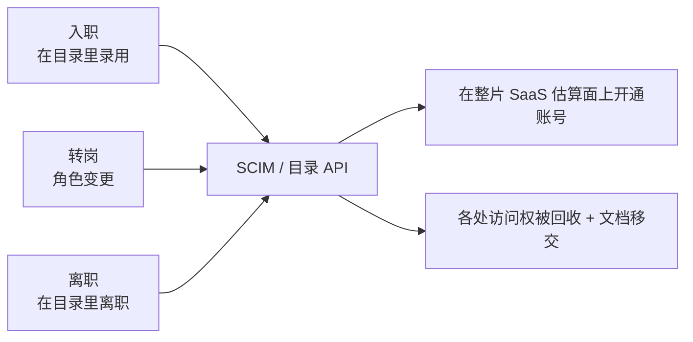
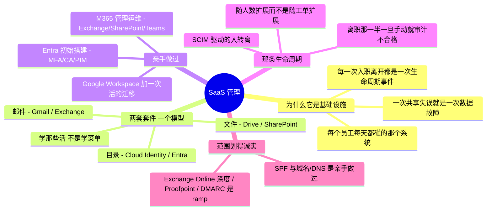

# SaaS 与协作管理

> 🌐 **语言：** [English（默认）](../../../cross-cutting/saas-admin.md) · **中文**
>
> ⚠️ 本项目**默认语言为英文**，`cross-cutting/saas-admin.md` 是"事实来源"。本页中文是多语言支持的一部分，可能略滞后于英文版；两者不一致时以英文为准。

---

> 各朵云跑你的基础设施；SaaS 跑你的公司。Google Workspace、Microsoft 365，以及它们底下那张身份
> 织物，才是大多数员工真正生活的地方 —— 而把它们管好是一门独立的、需求很高的手艺，platforms
> 那几个目录碰都没碰。这一篇是 **🔨 亲手做过的深度**。

它下面的每一层问的都是机器怎么跑；这一篇问的是**人**怎么工作 —— 邮件、文档、协作，以及那条把
这一切授予和回收的账号生命周期。

**这片估算面有两个尺寸，而只有其中一个是可知的。**
[参考办公室](../the-reference-office.md#parameters)叫得出大约十个服务，它的 build-out 要求
一样就是一个。它实际**在用**多少个，不是 IT 手上的一个数，因为八个职能各自刷卡买了自己的。
后果不是"不整齐"：离职流程够得到的是 IT 所管理的那些，所以在尾巴上根本没有什么回收率可以改进
—— **没有任何离职事件到达得了那些服务**，而整个租期里那是八十六次没有任何人去回收的离开。
这是那条"运维并自动化"的车道，对准了办公套件，而它直接靠在
[`identity-iam.md`](identity-iam.md) 那门身份纪律上：一个用户的 SaaS 访问权**就是**他的
入转离生命周期，被落到实处。

## 为什么 SaaS 管理是真正的基础设施工作

把"邮件管理"贬成在控制台里点来点去很容易。在一个用户上它确实是；在一万个用户上它是一个穿着
办公套件戏服的基础设施问题。整家公司沟通的能力，取决于你配置的邮件流转；每一次入职和离开都是
一次带着安全与合规赌注的身份生命周期事件；一次共享盘上的权限失误就是一次数据暴露故障。这套套件
是**每一个**员工每天都碰的那唯一一个系统，这让它的可靠性和它的访问模型的赌注**更高**而不是更低
——高过一台没人看得见的后台服务器。在规模上管理它，和这个仓库其余部分是同一门纪律：描述期望态、
把生命周期自动化、守住访问 —— 只不过工作负载是人。

## 两套套件，一个模型

Google Workspace 和 Microsoft 365 长得不一样，干的是同一批活。可迁移的模型是那张映射，不是任何
一个产品的菜单：

| 那件活 | Google Workspace | Microsoft 365 |
| --- | --- | --- |
| **目录 / 身份** | Cloud Identity / Google 目录 | **Entra ID（Azure AD）** |
| **邮件** | Gmail（Workspace） | **Exchange Online** |
| **文件与文档** | Drive / Docs | OneDrive / SharePoint |
| **协作** | Chat / Meet | **Teams** |
| **管理面** | Admin Console | Microsoft 365 admin center + Exchange/Teams/SharePoint admin |
| **组织结构** | Organizational Unit | administrative unit / 组 |
| **开通** | 目录 API / SCIM | Entra provisioning / SCIM |

学那些**活** —— 目录、邮件、文件、协作、开通 —— 之后每套套件都是一种方言。这和
[运营模型](../00-the-operating-model.md)对各朵云做的是同一个动作，套到生产力层上。

## Google Workspace 管理

亲手做过的范围：**Admin Console**，以及那些让一支全球员工队伍跑起来的运维。

- **目录与组织单元** —— 把用户组织进 OU，好让策略按组织形状生效，而不是逐用户生效。
- **账号生命周期** —— 开通、停用、删除，以及人们会忘的那一块：有人离开时的**文档所有权与权限
  移交**（一个离职员工的 Drive 是公司数据，不能跟着他走）。
- **邮件管理** —— Gmail 路由、委派，以及它底下那套域级水管。
- **跑一次迁移** —— 在一次邮件平台变更**过程中**管理这套套件（Google Workspace → 一套自建平台），
  而不在半路上弄坏任何人的邮件。迁移正是 SaaS 管理不再是点控制台、开始成为真正运维的地方。

## Microsoft 365 管理

亲手做过的范围：与终端用户支持不同的那些 admin center 运维。

- **Exchange** —— 邮箱配置、**共享邮箱**、**通讯组**，以及 **transport rule**（作为你配置的
  策略即代码的邮件流转，而不是你反复点的鼠标）。
- **SharePoint** —— 站点与权限管理：那套文件与协作的访问模型，在这儿一次错误的授予就是一次数据
  暴露事件。
- **Teams** —— 协作管理，连同它所坐落其上的 Exchange/SharePoint 主干。
- **那条诚实的边** —— 这是管理运维的深度（配置、运维、管理），与十五万用户规模上深度的
  **Exchange Online 租户工程**不同，后者是一条 ramp，不是一句声称（这正是为那个 Oracle M365
  岗位划下的那条线）。

## 那根身份主干

没有身份的 SaaS 管理只是在点鼠标；身份是笼罩整片估算面的控制面：

- **Entra ID / Azure AD** 作为 M365 底下的目录，带着初始搭建的深度：租户级 **MFA**、一条
  **Conditional Access** 策略，以及给特权角色用的 **PIM**（连到
  [`the-stack/07`](../../../the-stack/07-security.md) 和 [`identity-iam.md`](identity-iam.md)）。
- **SSO**，好让一次登录够得到整套套件以及它周围那些 SaaS。
- **访问复审** —— 那门让授予不至于越积越多的再认证纪律，在一套真实的多人审批、最小权限模型里
  完成。

## 规模化开通 —— 生命周期，自动化

这就是 SaaS 管理从工单活变成工程的那个点：

这就是 [`identity-iam.md`](identity-iam.md) 那套入转离，在办公套件上被落到实处：用 **SCIM** 和
目录驱动的自动化，让入职和离职随**人数**扩展而不是随**工单量**扩展。离职那一半，正是它一旦是手动
的就会审计不合格的那一半 —— 也是让一个已离职员工的访问权（和文档）悬在那里的那一半。

## 邮件作为基础设施

所有人视为理所当然的那封邮件底下的水管：

- **域名与 DNS** —— 域名与子域管理，以及那些决定你的邮件是否被信任、是否被投递的 DNS 记录
  （**SPF** 和它的亲戚）。
- **邮件流转** —— 路由、transport rule 和委派，作为被配置出来的策略。
- **那条诚实的范围** —— SPF 和域名/DNS 管理是 🔨；深度的邮件安全运维
  （**Proofpoint、Defender for Office 365、DMARC/DKIM** 强制执行）是 🧭 ramp，而且被那样标着
  —— 和这个仓库里到处划的是同一条线。

## AI 辅助的 ramp（SaaS 管理口味）

- **在两套套件之间翻译：** *"我管 Google Workspace —— OU、生命周期、Drive 权限移交。把这些映射
  到 M365 上：每一样在 Entra/Exchange/SharePoint 里的对应物是什么，以及这个模型在哪儿是真的
  不同？"*
- **让它起草管理自动化，最小权限由你手动来：** AI 在 **PowerShell / Microsoft Graph** 和 Google
  Admin SDK 脚本上确实很强 —— 而且它会发明 cmdlet、会把权限开得过宽。每一个生成出来的生命周期
  脚本，在碰到真实账号之前都要核过并收紧。
- **AI 会烧到你的地方（验得最狠的地方）：** 它会**发明不存在的 cmdlet、Graph 端点和管理控制台
  设置**；它会**把 Entra 角色和 Exchange 角色混为一谈**（就是 [`identity-iam.md`](identity-iam.md)
  里那个两权限平面陷阱的 M365 版）；而且它会**建议一条爆炸半径是整个租户的 transport rule 或者
  共享设置变更** —— 在一个试点组上测，因为一次邮件流转或共享失误是一次性打到所有人身上的。

## 诚实边界

🔨 **亲手做过的深度。** 为一支全球员工队伍管过 Google Workspace（文档所有权/权限移交、账号与
邮件运维），并且是穿过一次活的邮件平台迁移做的；**Microsoft 365 管理运维** —— Exchange（邮箱、
共享邮箱、通讯组、transport rule）、SharePoint 站点/权限管理、Teams —— 都是真做过的；
**Entra ID 初始搭建**（租户级 MFA、一条 Conditional Access 策略、PIM）；**SPF** 与域名/子域管理。
范围划得诚实，而且和这些岗位的简历划法一致：规模上深度的 **Exchange Online 租户工程**、
**Proofpoint / Defender for Office 365**，以及 **DMARC/DKIM** 强制执行，都是 🧭 ramp，不是声称。
注意它和 [`endpoint/`](../endpoint/README.md) 的差别：那条赛道管的是**设备**；这一条管的是
**生产力估算面及其身份** —— 相邻的两条车道，都是亲手做过的。

## Guided run（规格）

**这是一次 [guided run](../CONTEXT.md)，不是一个 lab。** 它需要一个真实环境，所以这里没有任何
东西能断言你做过它，而 CI 也跑不了它。那就是全部的区分，而且它不是降级 —— 一次 guided run 够
得到真实的延迟、真实的报错和真实的账单，而那是没有模型做得到的。

**把一次入职/离职自动化，并证明离职那一半。** 用一个免费的 Microsoft 365 开发者租户（或者一个
Google Workspace 试用）：

1. 用 Graph/PowerShell（或 Admin SDK）把一次**入职**写成脚本：创建用户、加进正确的组、分配一个
   许可 —— 从代码来，不是从控制台来。
2. 把**离职**写成脚本：回收访问权、把邮箱转成共享邮箱，并**移交文档所有权** —— 手动流程会忘掉的
   那一半。
3. **那次演练：** 跑一次**访问复审** —— 列出谁能访问某个共享资源，找出一条陈旧的或过宽的授予，
   并把它修掉；然后在你把那个离职脚本指向一个真实目录**之前**，写下它的爆炸半径。

## 这一章一屏看完

