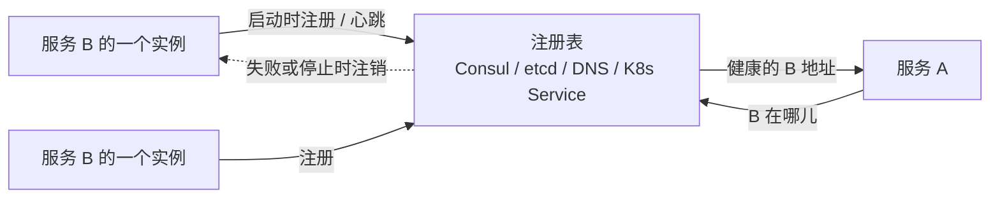
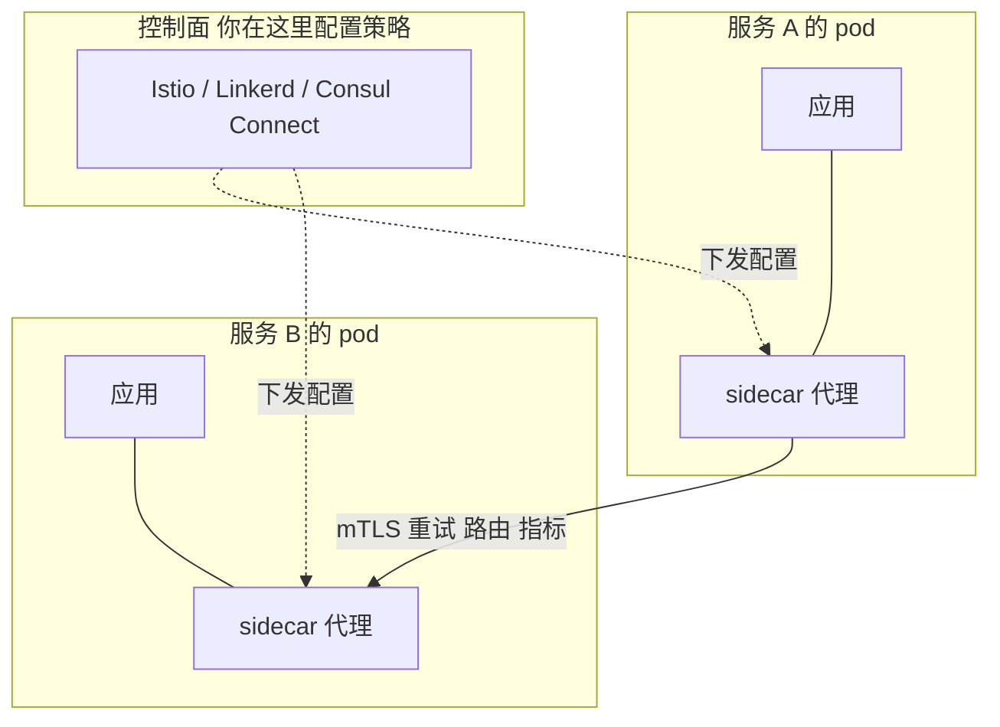
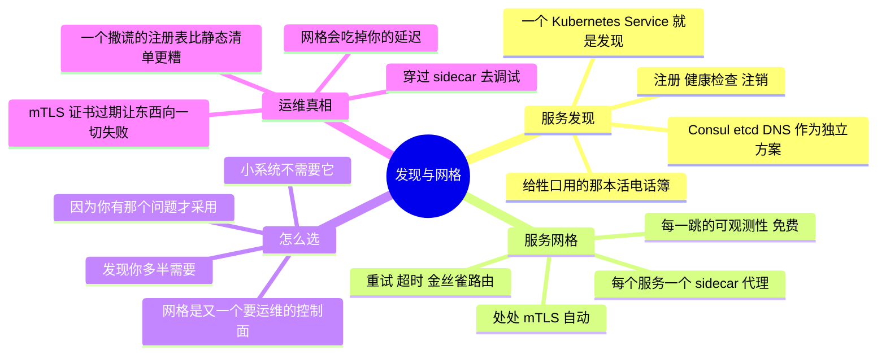

# 服务发现与服务网格 —— 服务之间怎么找到彼此、怎么互相信任

> 🌐 **语言：** [English（默认）](../../../cross-cutting/service-mesh.md) · **中文**
>
> ⚠️ 本项目**默认语言为英文**，`cross-cutting/service-mesh.md` 是"事实来源"。本页中文是多语言支持的一部分，可能略滞后于英文版；两者不一致时以英文为准。

---

> 一旦你有的是许多个小服务而不是几个大的
> （[`the-stack/05`](../the-stack/05-platform-services.md)），就冒出两个单体从来没有过的新问题：
> *当 B 的地址一直在变，服务 A 怎么找到服务 B？* 以及 *A 和 B 怎么互相信任、互相观测？*
> 服务发现回答第一个；服务网格回答第二个。这是一条 **🧭 ramp** —— 概念被测绘并验证过，没有在
> 生产里跑过。

单体调用一个函数；分布式系统发起一次网络调用 —— 而现在每一次调用都得**找到**它的目标、在目标
不健康时**活下来**、把那一跳**加密**、并且**出现**在一条 trace 里。在每个服务的代码里做这件事
不扩展；把它**往下压**进平台，就是发现和网格存在的意义。它和这个仓库里每一层是同一份直觉：把那个
横切问题在底下解决一次，好让上面那个东西不用重新实现它。

## 服务发现 —— 那本动态电话簿

牲口（[`the-stack/03`](../the-stack/03-compute-and-images.md)）来了又走 —— 自动扩缩、替换、
重新部署 —— 所以它们的 IP 从来不稳定。一个硬编码的 IP 或者一个静态 host 文件，就是一次等着发生的
漂移。**服务发现就是那个活的注册表，回答"服务 B *此刻*在哪里？"**

- **那个模式：** 实例在健康时**注册**，在不健康时**注销**（或者健康检查失败）；调用方**查询**
  当前那组健康实例。这个注册表是事实来源，就像 CMDB 之于资产（[itsm](itsm-and-assets.md)）——
  只不过它是活的，而且由机器驱动。
- **那些改名：** **Consul**（专门的）、**etcd**（同时也在 Kubernetes 底下的那个键值存储）、纯
  **基于 DNS** 的发现，以及 —— 今天最常见的 —— 一个 **Kubernetes Service**，它**就是**内建在
  平台里的服务发现（摆在短命 pod 前面的一个稳定虚拟名字，恰好就是
  [kubernetes](kubernetes.md) 那一章问的"怎么够到短命的 pod？"）。
- 如果你理解了 [Kubernetes Service](kubernetes.md)，你已经理解了服务发现 —— 它就是那个想法，
  有时候被做成一个独立系统。

## 服务网格 —— 服务间调用底下的那个平台层

服务彼此找到之后，**服务网格**接管那次调用的**质量** —— 把那些关注点从应用代码里挪出来，挪进
每个服务旁边的一个 **sidecar 代理**，并集中控制：

网格替你处理、好让你的代码不用处理的东西：

- **处处 mTLS** —— 服务之间自动的双向 TLS，让东西向流量被加密、身份被验证，而应用不用做任何
  加密。这就是服务间的[零信任](../the-stack/07-security.md)，被自动化了。
- **流量管理** —— 重试、超时、熔断，以及**金丝雀/加权路由**（把 5% 的流量发给新版本）——
  [CI/CD](ci-cd.md) 那一半发布安全，在网络上被强制执行。
- **免费的可观测性** —— 因为每一次调用都穿过一个代理，你在**每一跳**上都拿到黄金信号指标和分布式
  trace span，而不用给应用埋点（[the-stack/06](../the-stack/06-observability.md)）。

那些改名：**Istio**（强大、重）、**Linkerd**（更轻、更简单）、**Consul Connect**，以及越来越多的
**无 sidecar / ambient** 和 **eBPF** 路线（Cilium），它们在内核里做这件事，不给每个 pod 配一个
代理。

## 怎么选 —— 以及那句诚实的"你到底需不需要它？"

- **发现你几乎肯定需要**，在任何真实规模上 —— 但在 Kubernetes 上它已经在那儿了（Service），
  所以"采用服务发现"往往就是"用你已经在跑的那个平台"。
- **网格是一份严肃的承诺。** 它是又一个要运维的控制面（又一次那条
  [控制面即产品](../the-stack/01-physical.md)的警告），它增加延迟和活动部件，而一个小系统
  **不**需要它。那个诚实的问题是：处处 mTLS、细粒度流量控制、逐跳可观测性，是你真的有的问题吗？
  如果不是，那个网格就是你会为之付费、却用不上的复杂度。
- **把答案调到合适的尺寸：** 几个服务 → 发现加上好的库。许多服务，加上真实的安全/流量/可观测性
  需要 → 一个网格，被刻意地采用。因为你有那个问题才去够它，而不是因为它时髦 —— 就是那份 AI 替你
  做不了的[自建与租的判断](../the-stack/05-platform-services.md)。

## 运维笔记 —— 什么会把你叫醒

- **那条陈旧的注册表条目** —— 一个死掉的实例仍然被列着，于是调用方被路由进一个黑洞。健康检查和
  注销必须真的能用；一个撒谎的注册表比一份静态清单更糟。
- **那个吃掉你延迟的网格** —— 现在每一跳都要穿过两个代理；一次配错或者一个过载的 sidecar，会以
  神秘的尾部延迟的形式出现。这个网格现在也是你要调试的基础设施。
- **mTLS 证书过期** —— 一直是自动的，直到轮换坏掉，然后东西向的**一切**同时失败。证书生命周期
  是一个要监控的系统（[the-stack/07](../the-stack/07-security.md)）。
- **你根本不需要的复杂度** —— 最常见的网格故障，就是给一个从来不需要它的、那么小的系统上了一个
  网格；解法是架构上的谦逊，不是更多网格。
- **跨代理调试** —— "A 为什么够不到 B"，现在在那架朴素的[网络调试梯子](../the-stack/02-network.md)
  之上又叠了代理配置、mTLS 策略和路由规则。同一架梯子，更多级。

## 管理纪律（你应该做得到什么）

- 解释**服务发现**，以及为什么硬编码 IP 就是漂移；把一个 Kubernetes Service **当作**发现来用，
  并且知道一个独立注册表（Consul/etcd）在什么时候挣得到它的位置。
- 说出一个**服务网格**做什么（mTLS、流量管理、可观测性），以及更要紧的，**一个系统在什么时候
  不需要它**。
- 通过网格配置一次**金丝雀/加权发布**，并把它接到 [CI/CD](ci-cd.md) 那个发布安全的故事上。
- **穿过那些 sidecar** 调试一次服务间失败 —— 就是那架网络调试梯子，加上代理和 mTLS 那几级。
- 把**网格证书轮换**和注册表健康当成一等信号来监控。

## AI 辅助的 ramp（网格口味）

- **从你已知的东西翻译过来：** *"我理解 Kubernetes Service、DNS 和 TLS —— 把服务发现和服务网格
  映射到这些上面，并告诉我网格比单靠 Service 多了什么。"*
- **让它起草配置，然后质疑那份需要：** AI 写 Istio/Linkerd 的 YAML 很流畅 —— 而且它会很乐意给
  一个从来不需要网格的三服务应用递上一个网格。让它先论证**要不要**，再论证**怎么做**。
- **AI 会烧到你的地方（验得最狠的地方）：** 它会**发明 CRD 字段和网格 API 版本**（Istio 的 API
  面很大而且变得很快）；它会**低估**运维那个控制面的**运维成本**；而且对那些一个库或者一个
  Kubernetes Service 就能解决的问题，它会**默认"加个网格"**。那份自建与租的判断仍然是你的。

## 诚实边界

🧭 **ramp —— 标得清清楚楚。** 服务发现的**概念**坐在 🔨 地面上 —— DNS、健康检查，以及
[Kubernetes Service](kubernetes.md) 那个模型（测试范围的 Kubernetes，它本身是 🧭）—— 而底下那些
网络/TLS/最小权限的直觉是 🔨（[the-stack/02](../the-stack/02-network.md)、
[07](../the-stack/07-security.md)）。但运维一个**生产服务网格**（Istio/Linkerd/Consul Connect
的运维、mTLS 生命周期、规模上的网格调试）是一条 **🧭 ramp** —— 测绘并验证过，没有被声称成生产
运维。这篇笔记携带的最有价值的那样 🔨 东西是**判断**：知道网格在什么时候是答案，以及更常见的，
它在什么时候是一个更小的架构并不需要的、昂贵的复杂度。

## Guided run（规格）

**这是一次 [guided run](../CONTEXT.md)，不是一个 lab。** 它需要一个真实环境，所以这里没有任何
东西能断言你做过它，而 CI 也跑不了它。那就是全部的区分，而且它不是降级 —— 一次 guided run 够
得到真实的延迟、真实的报错和真实的账单，而那是没有模型做得到的。

**先发现，只有在你感觉到需要时才上网格。** 在本地 Kubernetes 上
（`kind`/`minikube`，来自 [kubernetes lab](kubernetes.md)）：

1. **发现：** 部署两个服务；让其中一个**按 Service 名字**（不是 IP）够到另一个，然后在你删掉并
   重建目标的那些 pod 时看着它照样能用 —— 发现，内建在平台里。
2. **网格：** 装上 **Linkerd**（轻的那个），注入 sidecar，并观察 **mTLS 加逐跳指标**在应用零改动
   的情况下出现 —— 网格的回报，被看见了。
3. **那次演练：** 通过网格在两个版本之间做一次**加权金丝雀**（90/10）—— 然后写一句话，说清这个
   三服务的演示到底需不需要一个网格，还是 Service 加一个好的客户端库就够了。

## 这一章一屏看完

