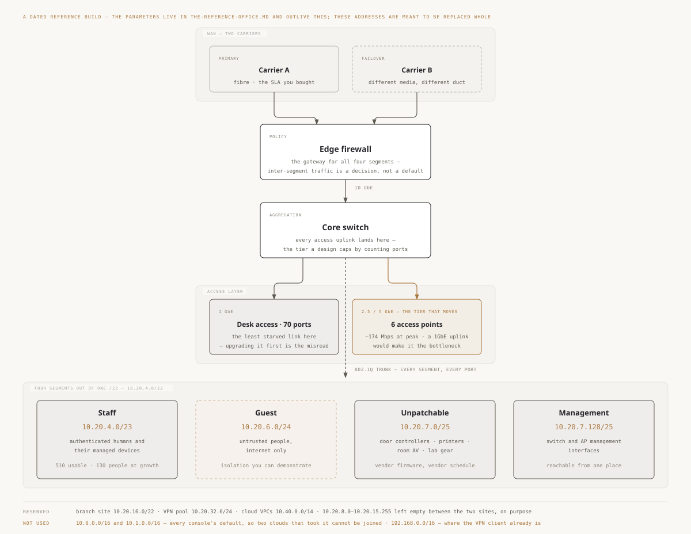

# 设计一个站点网络

> 🌐 **语言：** [English（默认）](../../../cross-cutting/site-network-design.md) · **中文**
>
> ⚠️ 本项目**默认语言为英文**，`cross-cutting/site-network-design.md` 是"事实来源"。本页中文是多语言支持的一部分，可能略滞后于英文版；两者不一致时以英文为准。

---

> [`the-stack/02-network.md`](../the-stack/02-network.md) 是横跨七个平台读那个网络层。这一篇读的是
> **一个物理地点**：一间办公室、一层楼、一个站点。每一次做它，那些决定都是同一批 —— 而这正是它们
> 值得被写下来一次的原因。

[`the-reference-office.md`](../the-reference-office.md) 给你那些参数 —— 一百个人、星期二六十五个、
七间会议室、一层楼。这一篇把它们变成一份设计。**它刻意不把它们变成数量**：多少个接入点、多少个
交换端口，是在那个文件的[Selection rules](../the-reference-office.md#selection-rules)里推导的，
因为那些是参数，而这一篇不是。

**这篇笔记在哪儿停。** 和那一层的章节同一个高度：某个人必须做出、然后担起来的那些决定。不是一个帧
怎么找到一个交换端口，不是射频传播建模。*能设计一个办公网和能给它的无线电环境建模，是两种不同的
能力，而这里只有第一种。*

## 一个站点网络必须做什么

把厂商剥掉，一个站点网络回答四个问题，按这个顺序，因为每一个都约束下一个：

1. **谁被允许和谁说话** —— 分段
2. **地址是什么，它们会和什么撞** —— 地址规划
3. **东西怎么接上去** —— 有线端口、无线，以及什么来认证它们
4. **谁回答一个名字，谁发放一份租约** —— DNS 与 DHCP 的归属

把顺序搞错，你就会得到那个经典失败：在有人决定什么需要被分开之前，这层楼的地址和线就都做完了，
于是分段变成一次永远不会发生的改造。

## 分段 —— 每个网段一个理由 🔨

**一个信任级别一个网段，绝不是一种设备类型一个网段。** 对一间百人办公室，诚实的清单很短：

| 网段 | 它为什么存在 |
| --- | --- |
| **Staff** | 默认那个。被认证过的人，以及他们被纳管的设备。 |
| **Guest** | 不受信的人，只有互联网，并且可证明是隔离的。 |
| **Unpatchable** | 门禁控制器、打印机、会议室设备、实验室器材 —— 跑着厂商固件、按厂商日程走、而且坐在任何人都能走到跟前的地方的那些东西。 |
| **Management** | 交换机和 AP 的管理接口，只从一个地方够得到。 |

四个通常是对的，五个通常是一个错误。**每多一个网段，就是一年之后某个人得去解释的一套规则**，
而那个"整齐"的论证 —— 一个部门一个、一层楼一个 —— 恰好产出那些在弄坏了什么东西之后没人辩护得了
的规则。

**四个里有两个从不churn，而那正是它们的共同点。**
在[参考办公室](../the-reference-office.md#parameters)里，staff 一年周转大约四十次 —— 每一个事件
都有一个归属人、一个日期和一张工单 —— 而 unpatchable 装着大约二十六样东西、management 大约十一个，
两份清单都不会一年一年地变。既然 802.1X 给它们每一个都放了一份凭据，那么**存在三十七份凭据，
而日历上没有任何东西会让人去看它们一眼。** 一次离职会强制复审一个人的访问权。没有任何东西会强制
复审一个门禁控制器的。

对一个被提议的网段，那个测试不是*"这些东西是不是不一样？"*，而是**"我愿意在它们之间拦掉什么，
以及我真的会去拦吗？"** 一个对 staff 网络有一条 any-any 规则的网段是一个 VLAN，不是一条安全边界，
而把它叫成边界，就是一片估算面获得一项只存在于图上的控制的方式。

## 地址规划 —— 那份熬得过一次合并的规划 🔨

在第一个子网存在**之前**写下地址规划，并且要对着那个终将打破它的东西来写：
**某样你有一天要建隧道过去的东西。**

- **横跨每一个站点、分支、VPN 地址池和云 VPC 都不重叠的 RFC1918。** 不是"大概没事" —— 是核过的。
  [`toolbox/cidr-check`](../toolbox/cidr-check/) 相对于它所预防的东西，是这个仓库里最便宜的工具。
- **不要挑 `192.168.0.0/24` 或 `192.168.1.0/24`。** 它们完美地能用，直到有一天必须从某个也挑了
  它们的地方够过来，而每一台家用路由器和一半的厂商设备都默认落在那片空间里。
- **按租期内的增长来定尺寸，不是按搬入日。** 参考办公室不搬家就增长到大约 130；一份恰好装得下
  100 的地址规划，是一次日期还没人挑的重新编号。
- **刻意留空隙。** 连续分配看起来整齐，并且让下一个网段无法被汇总。要像"有一天一条汇总路由会
  要紧"那样去分配，因为在你加上第二个站点的那一天，它就要紧了。

**这所预防的那个失败既不微妙也不便宜。** 两片都选了 `10.0.0.0/16` 的估算面有三个选项 ——
把一边重新编号、给重叠做 NAT，或者在应用层做代理 —— 而这三个都是有名字的项目。
[CIDR 重叠 lab](labs/multi-cloud-cidr-overlap)把它的形状在云的尺度上
做得摸得着；它在办公室的尺度上是同一个形状，只是能帮忙的人更少。

## 有线 —— 还有什么需要一根线 🔨

无线现在是那个接入层，而这改变的是有线**用来干什么**，不是把有线拿掉。仍然想要铜线的那些东西：

- **接入点** —— 而这才是真正驱动交换机选型的那个有线需求，因为现代 AP 想要 PoE+ 或 PoE++ 以及
  一条 2.5GbE 上联。
- **会议室系统与显示设备** —— 那些不该在它们正承载着会议的那间屋子里去争抢空口的设备。
- **打印机、门禁控制器，以及任何在 unpatchable 网段上的东西** —— 一根线同时也是一个布点决定，
  而一个有线端口比一个无线客户端更容易被钉在一个 VLAN 上。
- **桌子，仍然要** —— 不是因为人们在用它，而是因为在装修期间拉线的成本，只是事后拉线的一个零头。
  阔气的下线现在便宜、以后昂贵，而这和那个建筑步骤关于
  [管道与冗余容量](../build-out/02-the-building.md)的论证是同一个。

**上联和堆叠才是尺寸错误住的地方。** 端口数好数、也容易做对；被配得不足的是从接入交换机通往其余
一切的那条路径，因为它不出现在一个端口计数里。

### 速度是一个逐层的决定，而各层在不同的时间移动

"到现在还是千兆吗？"有三个答案，因为三个层按三份不同的日程、为不同的理由升级：

| 层 | 什么驱动它 |
| --- | --- |
| **桌面端口** | 几乎什么都不驱动。一层混合办公的楼把它的负载挪到了无线上、把它的存储挪到了 SaaS 上；桌面是这栋楼里**最不**挨饿的那条链路。先在这儿升级，是那个经典的误读。 |
| **AP 上联** | **真正在移动的那一层。** 一个现代接入点的射频能超过一个千兆，所以一条 1GbE 上联会把这个 AP 变成它被买来消除的那个瓶颈。这就是 multi-gig 挣到钱的地方。 |
| **汇聚与核心** | 收敛比。每一台接入交换机的上联都落在这里，而这一层正是一份设计通过数端口而不数路径悄悄给自己封顶的地方。 |

**顺序比数字更要紧。** 那份本能是去升级人们碰得到的东西，而人们碰得到的是桌面。承压的那条链路
是没人去看的那条，因为它在天花板里。先定 AP 上联，再定汇聚路径，桌面等到真的有东西需要它的时候
—— 而对多数办公室来说那还没到。

*这一节里放一个数字会过期；那个排序不会。* 当代的数字和其他会过期的东西住在一起，在参考办公室的
[Selection rules](../the-reference-office.md#selection-rules)里。

## 无线 —— 密度，不是覆盖 🧭

**🧭 这一节是一条经过验证的 ramp，不是亲手做过的深度。** 上面那些分段和地址规划是多年的生产；
**无线设计不是** —— 见[诚实边界](#诚实边界)。接下来是公开实践所描述的那套方法，被核过的是那套
推理，而不是被经历过的那个结果。

那个设计问题不是*"信号够不够得到？"* —— 够得到，那个问题十年前就解决了。它是
**"当最大那间屋子把所有人同时放上视频的时候会发生什么？"** 一次覆盖勘测回答的是一个没人有的问题。

三样东西决定这份设计，而只有第三样是关于无线电的：

**容量算两遍，取大的那个。** 一遍按客户端数，一遍按吞吐 —— 那套算术在参考办公室的
[Selection rules](../the-reference-office.md#selection-rules)里，因为一个计数是一个参数，而这个
文件不是。

**布点跟着那些屋子走，不跟着网格走。** 一层有七间会议室的百人楼面不是一个均匀负载。忙碌星期二的
那间大屋子，是这栋楼里最密的那几平方米，而一个按整个楼板平均放置的 AP 服务它的效果，比一个为它
而放的要差。**为峰值那平方米设计，不为均值。**

**信道宽度是一个伪装成性能设置的容量决定。** 宽信道给一个客户端一个更大的数字，也给一层拥挤的
楼面留下更少的互不重叠信道可用。在密度之下，窄一些、多一些胜过宽一些、少一些 —— 而这之所以
反直觉，恰恰是因为随着楼面变糟，那个单客户端跑分反而变好。

**那样该被怀疑的东西**是厂商的"AI 驱动"射频优化。其中一些是真的；很多是同样那套信道与功率启发式，
换了个新标签。在把任何功劳算给它之前，先问它到底在调什么。

## DNS 与 DHCP —— 谁回答一个名字 🔨

小、无聊，而且是那些"网络挂了"、其实跟网络无关的工单里占比大得不成比例的来源。

- **给这两样各点一个归属人，并写下什么解析什么。** 刻意做的 split-horizon 没问题，意外造成的
  是一个永久的间歇性故障 —— 一条为某次迁移加上、然后再没被移除的条件转发，意味着一个名字会因为
  客户端碰巧拿到哪个 resolver 而解析得不一样。
- **DHCP 作用域的尺寸是一个地址规划问题**，不是一个 DHCP 问题。一层混合办公的楼上作用域耗尽很
  常见，恰恰因为尺寸是对着人头数、而不是对着峰值日的人均设备数定的。
- **给基础设施用保留，而不是静态地址。** 一台静态配置的打印机，对那个本该知道网上有什么的东西
  来说是隐形的。
- **TTL 就是你的回滚窗口。** 在一次变更**之前**把它降下来，而不是在它引发的那次故障当中。

## 网络认证 —— 戴着网络帽子的身份 🔨

**如果网络访问不去查那个目录，你手上就是一把会永远住在某个人手机上的共享密钥。** 这是对
[步骤 03](../build-out/03-identity.md) 的一份真实依赖，不是一个偏好：对着目录做 802.1X 意味着
入转离够得到网络，而一把预共享密钥意味着够不到。

人们会漏掉的那个设计后果是那个**故障模式**。当目录够不到的时候，这层楼会怎么样？刻意地设计那个
答案 —— 一个缓存凭据窗口、一个访问权受限的回退 VLAN，某种东西 —— 因为另一个选项是在那次让目录
够不到的故障当中才发现它。同一个循环依赖也咬着[远程访问](../build-out/10-remote-access.md)，
而把两者放在一起看、只解决一次是值得的。

## 访客网络 —— 可证明的隔离 🔨

不是*被配置了的*隔离。是**可演示的**隔离，因为一家中型客户的安全问卷会问这个具体的问题，而一张
勾选框的截图不是一个答案。

- 只有互联网，没有任何通往内部网段的路由 —— 并且有一个能展示这一点的测试。
- 它自己的 DHCP 作用域和 DNS，好让一台访客设备解析不了内部名字。
- 打开客户端隔离，好让访客之间也看不见彼此。
- 一个带宽上限，因为访客网络也是当有人误连上去时，全员大会被串流的那个网络。

证据和那项控制一样要紧：在[合规证据](../build-out/14-compliance-evidence.md)变得紧急之前，这是
最便宜的一件真实产物之一。

## 什么时候规模会改变设计

参考办公室是一层楼上一百个人。上面绝大部分从十五个人到五百个人都成立 —— 但**有八个决定会翻转**，
而知道*每一次翻转由什么驱动*，比知道它落在哪儿更有用，因为那个驱动因素可迁移，而那个阈值不可。

| 决定 | 小（<25） | 参考（~100） | 大（500+） | 真正驱动这次翻转的 |
| --- | --- | --- | --- | --- |
| **无线管理** | 独立 AP | 云管理或控制器 | 控制器集群 | AP 数量 —— 大约五个，也就是逐个手工配置不再能忍的那个点 |
| **交换** | 一台交换机 | 堆叠，上联有规划 | 接入 / 汇聚分层 | 端口数和楼层数 |
| **路由边界** | 扁平 L2 | 在边缘做段间路由 | L3 下到接入层 | 广播域大小，以及有第二层楼的那一天 |
| **防火墙** | 一台 | 一台，或者一对 HA | 一对 HA，外加分区 | **停机成本超过第二台盒子的成本** —— 不是人头数 |
| **DHCP / DNS** | 在防火墙上 | 一个有归属人的服务 | 冗余的，带 IPAM | **变更速率，不是规模。** 一间稳定的五十人办公室，需要的比一间在 churn 的二十人办公室更少。 |
| **接入速度** | 处处 1GbE | 到 AP 是 multi-gig | multi-gig 接入，10G+ 汇聚 | 永远是 AP 上联优先；桌面最后 |
| **网络认证** | 预共享密钥 | 对着目录的 802.1X | 带动态 VLAN 分配的 802.1X | 员工流动率 —— "换掉密钥并通知所有人"不再管用的那个点 |
| **站点** | 一个 | 一个，加 VPN | 路由 WAN 或 SD-WAN | 第二个站点存在这件事本身 |

**读最后那一栏，不要读前三栏。** 八次翻转里有两次根本不由规模驱动 —— 防火墙成对是一个停机成本
决定，DHCP/DNS 的拆分是一个变更速率决定 —— 这也是为什么一份从同样人头数的办公室抄来的设计仍然
可能是错的。*人头数是那些驱动因素的一个代理，而和每一个代理一样，它一直是对的，直到它不是。*

**反方向走才是更难的那个方向。** 这些翻转多数是加法式的，可以在驱动因素到来时再做。有两个不行：
**地址规划**和**分段**是在最小的规模上落下的，也是以后最贵去改的东西。一间十五人的办公室挑了
`192.168.1.0/24` 和一个扁平网段，它什么都没省下来；它是向"它有一百个人"的那一天借了债。

## 把它应用到参考办公室

那些[参数](../the-reference-office.md) —— 100 个人、星期二约 65 个、70 张桌、7 间会议室
（1 大 / 2 中 / 4 小）、6 个电话亭、一层楼、增长到约 130 —— 产出这个形状：

<picture>
  <source media="(prefers-color-scheme: dark)" srcset="../../../site/assets/diagrams/site-network.dark.svg">
  
</picture>

*上面一切的一个实例，被画了出来。那些地址是一个**有日期的**例子，本来就是要被整体替换的 ——
它们不是参数，也不属于[参考办公室](../the-reference-office.md)，那个文件的 `Reference build`
一节只接纳某个人真的能去买的东西。这张图携带而下面那张表没有的，是那条**边界**（防火墙是哪个
网段的网关）和那个**层**（哪条链路真的在移动），而且它是用
[`toolbox/cidr-check`](../toolbox/cidr-check/) 核过的、不是用眼睛核的 —— 包括对着它说不要用的
那三个地址段核过。*

| 决定 | 对这间办公室 |
| --- | --- |
| 网段 | 四个：staff、guest、unpatchable、management |
| 地址规划 | 从一个有记录的站点地址段里划出一个 `/22`，逐网段做子网并留出翻倍的余地；对着 VPN 地址池和每一个云 VPC 核过 |
| 有线 | 每张桌、每间屋、每个 AP、每一台 unpatchable 设备 —— 端口数在 [Selection rules](../the-reference-office.md#selection-rules) 里 |
| 无线 | 按屋子布点，用那套两次计算的方法定尺寸；那间大屋子是设计工况 |
| DNS/DHCP | 一个归属人，作用域按峰值时的人均设备数定尺寸，不按人头数 |
| 网络认证 | 对着目录做 802.1X，并对"目录够不到"有一个刻意的答案 |
| 访客 | 隔离且可演示，在那份问卷到来之前就准备好 |

这些决定背后的数量住在参考办公室里，因为它们是参数、而且会过期；这些决定住在这里，因为它们不会。

## 诚实边界

**🔨 亲手做过的深度** —— 分段、地址规划、有线设计、DNS/DHCP 归属、对着目录的 802.1X，以及访客
隔离。这是那套经典的企业栈：CCNP 级别的路由与交换、多年的 BIND/DHCP、VLAN，以及横跨办公室与数据
中心的防火墙与 VPN。

**🧭 经过验证的 ramp** —— **无线设计。** 密度规划、信道与功率策略、射频勘测实践，以及接入点选型，
是对着公开的工程指南测绘并验证过的，不是在一层楼上执行过、然后跟着它一起生活过。上面那套方法是
可复现的，那套推理是可核对的；**缺的是你只有在对一间真实的屋子判断错过之后才拿得到的那部分。**
把它平白说出来，是因为这篇笔记其余部分足够深，读者否则会合理地以为无线那一节也一样。

**同样是 🧭** —— 采购与厂商谈判，和[步骤 01](../build-out/01-uplink.md) 为上行链路划的是同一条
边界。

## 这一章一屏看完

