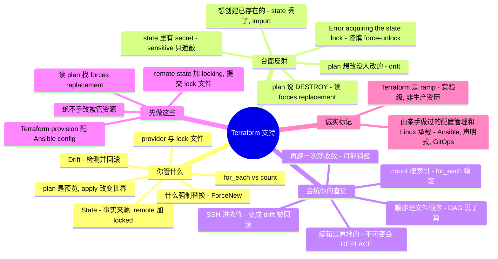

# Terraform 支持 —— 配置管理 sysadmin 的转轨指南

> 🌐 **语言：** [English（默认）](../../../cross-cutting/terraform-support.md) · **中文**
>
> ⚠️ 本项目**默认语言为英文**，`cross-cutting/terraform-support.md` 是"事实来源"。本页中文是多语言支持的一部分，可能略滞后于英文版；两者不一致时以英文为准。

---

> [`iac-and-config.md`](../../../cross-cutting/iac-and-config.md) 划清了 **provisioning**（Terraform 造资源）与 **configuration**（Ansible 让资源一致）的界线。本篇是 provisioning 那一侧的另一半：**把 Terraform 支持当作一门修/救（break-fix）手艺** —— 真正反复出现的工单、精确的排查落点，以及**一个强 Ansible / Puppet / Chef sysadmin 接手 Terraform 时，哪些直觉会被烧到。** 诚实标记先说清：本篇是 **🧗 ramp** —— 我的 Terraform 亲手经验是**实验/exposure 级**，从一套 ✋ **配置管理 + Linux 基本功**（Ansible、声明式思维、GitOps、幂等）映射并承载。它的权威来自**研究**（HashiCorp 文档 + practitioner 失效模式 + 一个可跑的 [lab](#lab--state-是事实来源--可跑)），不是生产资历。本篇存在的全部意义，就是*我正在跨的那道沟。*

一个 Ansible sysadmin 上手 Terraform 很快——它声明式、配置在 git 里、同样是"描述终态"的直觉。然后它在配置管理没有的那个地方咬人：**Terraform 保有一份 state 文件，而它就是事实来源。** Ansible/Puppet/Chef 是*收敛式*的——每次运行把期望态推到目标机，从不保留一份它造了什么的权威记录。Terraform 是对着 **state**（从现实 refresh 而来）做 plan，不是直接对着现实——所以一份丢失的 state、一次导致 drift 的手改、一把锁住的 state、一个强制 destroy 的不可变属性、或一个你重排了的 `count` 列表，任何一个都可能**删掉生产**。本篇把职责、反复出现的工单及其诊断面、以及那几个失灵的配置管理反射一一点名——全程对着 Ansible 作对比，因为读者是从那儿来的。

## 支持 Terraform 让你要为什么负责

修/救的面，大致按工单到达顺序：

| Surface | 你要为之负责的事 |
| --- | --- |
| **State** | `terraform.tfstate` 作为**事实来源**——一个**带 locking 的 remote backend**（S3 原生 lockfile / GCS / HCP Terraform Cloud），团队绝不用本地 state；`terraform state list/show/mv/rm/pull/push`；`terraform import` 去对账；**state 里明文存着 secret**。 |
| **plan/apply 生命周期** | `plan`（一个会从现实 **refresh** state 的预览）、`apply`（唯一改变世界的东西）、`destroy`；`-target`、`-refresh-only`（只读 drift 检查）、`-replace`（`taint` 的继任者）；绝不 apply 一份**过期的** saved plan。 |
| **Drift** | 对被管资源的带外/手动改动 → 下一次 `apply` **把它们回滚**；用 `plan -refresh-only` 在 drift 于 apply 中途冒头前刻意检测它。 |
| **什么会强制替换** | 哪些属性改动触发 **destroy+recreate**（`ForceNew`）vs 原地更新——每次生产 apply 前读 plan 找 `# forces replacement`。 |
| **provider 与 lock 文件** | `required_providers` 版本 pin + **提交 `.terraform.lock.hcl`**（只 pin provider；module 另行 pin）；provider 认证、限流、bug。 |
| **HCL 与 module** | variable/output/local、**`for_each` vs `count`**（索引位移churn）、`depends_on` 处理隐藏依赖、`data` source、`moved` block、module 源 + 版本 pin、依赖 **DAG**。 |
| **CI/CD 与治理** | plan-in-PR（**Atlantis** / Terraform Cloud）、policy-as-code（Sentinel / **OPA-conftest**）、`validate` / `fmt` / **tflint** / **checkov** / `trivy config`、CI 里的 drift 检测、成本预览（**infracost**）。 |
| **升级 / 对账** | state 手术走可评审的迁移（**tfmigrate**），而非手跑改动性命令；resource 级 bug 去 provider issue tracker。 |

## 常见工单 —— 以及去哪查

Terraform 修/救就是像鹰一样读 **plan**，并知道 config、state、real 三个世界里哪个在撒谎。要练成的反射：*"state 相信什么，它和现实对得上吗？"*

**`Error acquiring the state lock` —— 头号工单。** 上一次 `apply` 崩了、或有人在并发跑，锁卡住了。*去哪查：* backend 的锁（锁 ID + 谁/何时在错误里）。`terraform force-unlock <ID>` 清它——但这是把**上了膛的枪**：在 apply 中途解锁会损坏 state。先确认真的没有东西在跑，然后 `terraform state pull` 事后校验。（这个工单在 Ansible 里不存在——没有共享可变 state 需要锁。）

**"plan 想改一个没人改过的东西" —— drift。** 有人 SSH 进去或点了控制台，手改了一个 Terraform 管的资源。`plan` 从现实 refresh 了 state、看到了差异、并会把你的 hotfix **回滚**到代码。*去哪查：* `terraform plan`（drift 显示为 `~ update`）、`terraform plan -refresh-only` 只看 drift 不动手。*修法是一门纪律，不是一条命令：* **绝不手改被管资源——改代码再 apply。**

**"plan 说它要 DESTROY 我的数据库" —— 强制替换。** 你改了一个自以为可编辑的属性，但它是 `ForceNew`，于是 Terraform plan **destroy + recreate**。*去哪查：* 在 plan 里扫 **`-/+`** 和那条不可变属性上字面的 **`# forces replacement`**。任何有状态/生产资源上的意外替换都当 stop-and-review——数据可能活不下来。（要刻意强制替换：`terraform apply -replace=ADDRESS`；老的 `terraform taint` 已弃用。）

**"Terraform 想创建已经存在的东西" —— state 丢失/不匹配。** state 文件被删了、或你指到了错的 backend。没有 state，Terraform 把一切重新 plan 成**创建**，会复制或覆盖线上基础设施。*修法：* `terraform import <address> <real-id>`（或 `import` block）教 state 已存在什么，然后 plan 应回到干净的 no-op。

**"昨天还好好的" —— provider 版本漂移。** 一个没 pin 的 provider 升级了、行为变了。*去哪查：* `.terraform.lock.hcl`（提交了吗？解析到哪个版本？）、`required_providers` 约束、`terraform init -upgrade` 的输出。**提交 lock 文件**——队友和 CI 就是靠它拿到一致的 provider。

**`count` 在重排时 churn。** 你删/重排了一个 `count`-索引列表里的项，plan 想替换一堆只是*位移了索引*的资源。*修法：* 用 **`for_each`**（用稳定字符串做 key）；对已有的 `count` 资源，用 `moved` block 或 `terraform state mv` 不销毁地重 key。

**一个 secret 出现在 state / 一个 diff 里。** `sensitive` 只**遮蔽 CLI/UI 输出**——它**不**加密 state。DB 密码、token、生成的 key 明文落在 `terraform.tfstate` 里。*修法：* 把 state 文件本身当 secret（backend 静态加密、锁死访问），并在 provider 支持处优先用 ephemeral / write-only 值。

**"Saved plan is stale。"** 在你 `plan -out` 和之后的 `apply` 之间 state 动了。重新 plan；绝不 apply 一份不再描述你评审过的那个改动的旧 saved plan。

## 经验差 —— 一个强 sysadmin 的直觉会错在哪

做过 Terraform 的 Ansible/Puppet sysadmin 和没做过的之间的差距不在 HCL 语法——而在一组配置管理反射，它们在这里是**错的**，每条都挂着失效模式。

- **State 是事实来源——"再跑一次它就收敛"是个陷阱。** 配置管理是收敛式的：每次运行把期望态推给目标机，不保留它造了什么的权威记录。Terraform 是对着一份 **state 文件**（从现实 refresh）做 plan，而*"如果你的 state 和配置与你的基础设施不匹配，Terraform 会尝试对账……这可能无意中销毁或重建资源。"* 盲目重跑可能**删掉生产**。[lab](#lab--state-是事实来源--可跑) 把这点做实。
- **Drift 会被回滚——"SSH 进去修一下"会反噬。** 对被管资源的手动 hotfix 变成 **drift**，下一次 `apply` **把它撤销**去匹配代码。你的控制台修复活到下次运行，然后消失。纪律：改代码，别改资源。
- **编辑不总是原地。** 改一个不可变（`ForceNew`）属性会强制 **destroy + recreate**，不是编辑——可能抹掉一个数据库。配置管理原地编辑；Terraform 对这些属性默认是不可变的。**读 plan** 找 `forces replacement`——每一次。
- **`count` 按索引寻址；`for_each` 按 key 寻址。** 重排或删掉 `count` 列表的中间项，*之后每个索引都位移*，于是 Terraform 替换只是挪了位的资源。`for_each` 的 key 是稳定的。任何有身份的东西都默认 `for_each`。
- **State 对团队必须 remote + locked——而且它是敏感的。** 本地 `terraform.tfstate` 撑不过两个人;你需要一个**带 locking 的 remote backend**,否则并发 apply 会损坏它。而且 **secret 明文坐在 state 里**——`sensitive` 只遮输出。(Ansible 没有共享可变 state 可损坏;这是一类新危害。)
- **provider 才是真正干活的——pin 住它们。** Terraform core 是个薄引擎;**provider**(aws/azurerm/google)干 API 调用。pin 版本并**提交 `.terraform.lock.hcl`**,否则一次静默 provider 升级把你搞坏。
- **plan 是预览;apply 改变世界——而过期 plan 危险。** 一份绿色 plan 不是"完成",一份旧 saved plan 之后 apply 可能干错事。
- **依赖图决定顺序,不是文件。** Terraform 从资源引用建一张 **DAG**、并行跑独立资源——与 Ansible playbook 自上而下的任务相反。只在它推不出的隐藏依赖上用 `depends_on`。
- **Terraform 和 Ansible 互补,不是二选一。** Terraform **provision**(VM、网络、bucket —— Day 0);Ansible **在里面 configure**(包、文件、服务 —— Day 1+)。你的 Ansible 技能是*同一条流水线的 config 那一半*,经 Terraform output → 动态 inventory 接起来——不是被替代的东西。

## 什么可迁移，什么不可

| 强迁移 | 带保留地迁移 | 别带过来 |
| --- | --- | --- |
| 声明式 / 期望态思维（尤其 Puppet manifest） | 幂等思维——同一个词、不同保证（Terraform 的由 **state** 中介;Ansible 的你逐任务设计） | "再跑一次它就收敛"——Terraform 对着 **state** 重跑、可能销毁 |
| 版本控制 / GitOps / PR 评审纪律——这里*更*重要（state + plan 评审） | 最小权限与 secret 卫生——把"什么是 secret"扩到包含 **state 文件** | "SSH 进去 hotfix"——变成 drift、被回滚 |
| 结构化声明式书写（YAML → HCL;Jinja ≈ HCL 插值） | 依赖推理——映射到 DAG + `depends_on` | "编辑是原地的"——不可变属性 **destroy+recreate** |
| CI/CD 与流水线纪律（plan-in-PR、gate） | 云/API 熟悉度——但 **provider** 才是那个东西,pin 住它 | "顺序 = 我写的顺序"——**DAG** 说了算 |
| 调试方法学（读输出、最小复现、二分） | on-prem → 云 provision——新的爆炸半径（一个 typo 能删生产） | "我不用读 plan"——一份没读的 plan 藏着 `forces replacement` |
| **Ansible 本身**——它是 Terraform 下游的 config 层 | | "一个工具搞定一切"——用 Terraform provision、用 Ansible configure |

## 第一周 / 前 90 天

**第一周。**
1. **从第一天起就用带 locking 的 remote backend**——团队绝不上本地 state（S3 原生 lockfile / GCS / HCP）。而且**提交 `.terraform.lock.hcl`;绝不提交 `terraform.tfstate`。**
2. **每次 apply 前读 plan**——专门扫 **`-/+`** 和 **`forces replacement`**;任何有状态/生产资源上的意外替换都是 stop-and-review。
3. **绝不手改被管资源**——控制台/CLI hotfix 变成 drift 被回滚。改代码、`apply`。
4. **内化三个世界**——config vs state vs real;任何令你意外的 plan,先问*哪个在撒谎?*(跑 [lab](#lab--state-是事实来源--可跑)。)

**前 30 天。**
5. **pin provider;任何 provider 升级后先重新 plan** 再提交新 lock。
6. **任何有身份的列表优先 `for_each` 而非 `count`**;`count` 只留给简单的 N 份相同缩放。
7. **刻意检测 drift**,用 `terraform plan -refresh-only`,而非在 apply 中途发现它。
8. **把 state 当 secret**——`sensitive` 只遮输出;state 静态加密并锁死访问。

**前 90 天。**
9. **state 手术走可评审的迁移**(tfmigrate / `import` block / `moved`),别手跑改动性命令。
10. **把 Terraform 接到 Ansible**——用 Terraform provision、把它的 output 喂给动态 inventory、用 Ansible configure;别再想让一个工具干两份活。
11. **CI 里放 plan-in-PR + policy/lint gate**(Atlantis / Terraform Cloud + tflint / checkov / conftest / infracost),让 state 改动被评审、而非从笔记本 YOLO。
12. **搞清你要动的资源什么会强制替换**,再去改数据库、磁盘、实例上的不可变字段。

## AI 辅助的 ramp（Terraform 口味）

- **从你已知的翻译过来——并索要 deltas:** *"我懂 Ansible 和 Linux —— 把 Terraform 的 state 模型、plan/apply 生命周期、和 drift 映射到我用 playbook 已经在做的事上,只标出真正的差异。"* Terraform 奖励 translate-then-verify——但 **state、drift-回滚、强制替换、`count` 索引位移在配置管理里没有对应物**,所以那些要往死里验证(lab 就是干这个的)。
- **让它起草 HCL;你掌控 plan 和 state。** AI 生成 Terraform 很强——而它也会**在该用 `for_each` 的地方写 `count`**、**忘了 lock 文件**、**建议本地 state**、**把 secret 放进普通 variable**、并产出一份在改不可变属性时悄悄**销毁数据库**的 plan。绝不 apply 一份你没读过 plan 的 AI 草稿 HCL,并先在一次性 workspace 里跑。同一套往死里验证的纪律——见 [`ai-workflow/`](../../../ai-workflow/) 和 [`iac-and-config.md`](../../../cross-cutting/iac-and-config.md)。

## 诚实边界

本篇是 **🧗 ramp,而且明说。** 我的 Terraform 亲手经验是**实验/exposure 级**——建在 Ansible/Puppet 配置管理和 Linux 基本功上,不是多年跑 Terraform 生产 state。承载它的是真的:**✋ 配置管理 + Linux 深度**(Ansible/IaC、声明式思维、幂等、GitOps/PR 纪律、依赖推理、调试方法学——与 [`iac-and-config.md`](../../../cross-cutting/iac-and-config.md) 画的是同一条线),外加一套研究扎实的 Terraform 机制模型和一个可跑的 [lab](#lab--state-是事实来源--可跑)。上面那些 Terraform 特有机制——state/locking、plan/apply/refresh 生命周期、强制替换、`count`-vs-`for_each`、provider/lock、drift——是映射并文档核验过的,**不是资历。** 更深的生产 Terraform(大型多团队 state、规模化 module 编写、Sentinel/OPA policy 程序、Terragrunt 单仓、负载下的 state 迁移)仍在前方;注释如实说明、绝不吹。这是一个强 sysadmin **正在跨过就业市场反复问的那道沟**的诚实产物——公开记录、✋/🧗 标注。

## Field kit —— 真实工具与参考

以下指针在 GitHub 上逐个核实存在,按用途分组。已归档 / 停更 / 改名状态都标了,因为这个生态变得快。

**核心与许可证 fork(两个都要懂):**
- [`hashicorp/terraform`](https://github.com/hashicorp/terraform) —— 引擎;它的 issue tracker 是你要对着调的 CLI/state 行为的事实来源。
- [`opentofu/opentofu`](https://github.com/opentofu/opentofu) —— **MPL-2.0 社区 fork**(`tofu` CLI,Linux Foundation),源于 HashiCorp 2023 的 BSL 改许可;state/HCL 兼容,加了 state 加密。越来越是许可证安全的目标。
- [`hashicorp/terraform-provider-aws`](https://github.com/hashicorp/terraform-provider-aws)(· `-azurerm` · `-google`)—— provider 仓是 resource 级 bug 的归属地。

**State、import 与 drift(硬骨头):**
- [`snyk/driftctl`](https://github.com/snyk/driftctl) —— 专用 drift 检测。*(⚠️ Snyk 已停止主动开发——实为维护/EOL,但仍是参考。)*
- [`cycloidio/terracognita`](https://github.com/cycloidio/terracognita) —— 从已有云基础设施逆向 Terraform → HCL + import(活跃维护;归档的 [`GoogleCloudPlatform/terraformer`](https://github.com/GoogleCloudPlatform/terraformer) 是经典款)。
- [`minamijoyo/tfmigrate`](https://github.com/minamijoyo/tfmigrate) —— **把 state 迁移当可评审的 plan**(`state mv`/`import`/`rm` 走 GitOps)——安全做 state 手术的方式。配 [`minamijoyo/hcledit`](https://github.com/minamijoyo/hcledit)。
- [`im2nguyen/rover`](https://github.com/im2nguyen/rover) —— 交互式 state/graph 可视化,搞懂 state 里到底装了什么。

**工作流、DRY 与 PR 自动化:**
- [`runatlantis/atlantis`](https://github.com/runatlantis/atlantis) —— **从 PR plan/apply** 的 GitOps + 审计链的 OSS 骨干。
- [`gruntwork-io/terragrunt`](https://github.com/gruntwork-io/terragrunt) —— 规模化多环境/多账号 backend 的 DRY/编排 wrapper。
- [`hashicorp/setup-terraform`](https://github.com/hashicorp/setup-terraform) · [`tfutils/tfenv`](https://github.com/tfutils/tfenv) —— 在 CI 和本地 pin CLI 版本(调版本相关行为时第一个 pin 的东西)。

**测试、lint、policy 与成本(CI gate):**
- [`terraform-linters/tflint`](https://github.com/terraform-linters/tflint) —— provider 感知的 lint,抓 `validate` 漏的。
- [`aquasecurity/trivy`](https://github.com/aquasecurity/trivy)(`trivy config`)—— IaC 配错扫描;**tfsec 现已并入 Trivy**(独立的 [`aquasecurity/tfsec`](https://github.com/aquasecurity/tfsec) 已弃用)。
- [`bridgecrewio/checkov`](https://github.com/bridgecrewio/checkov) · [`open-policy-agent/conftest`](https://github.com/open-policy-agent/conftest) —— 对配置和 **plan JSON** 做 policy-as-code(Sentinel 的 OSS 替代)。
- [`gruntwork-io/terratest`](https://github.com/gruntwork-io/terratest) —— 基于 Go 的端到端 module 测试。
- [`antonbabenko/pre-commit-terraform`](https://github.com/antonbabenko/pre-commit-terraform) —— 把 fmt/validate/tflint/docs/checkov 接进一份 pre-commit 配置。
- [`infracost/infracost`](https://github.com/infracost/infracost) —— 在 PR 里给出一份 plan 的 `$` 差额。

**精选清单、参考 module 与文档:** 最好维护的
[`shuaibiyy/awesome-tf`](https://github.com/shuaibiyy/awesome-tf)*(从 awesome-terraform 改名)*;
[`terraform-aws-modules/*`](https://github.com/terraform-aws-modules)(如 `terraform-aws-vpc`、`terraform-aws-eks`)—— 可抄可对着调的参考级 module;
[`terraform-docs/terraform-docs`](https://github.com/terraform-docs/terraform-docs) —— 让 module README 保持诚实。把 HashiCorp 自家的
[State](https://developer.hashicorp.com/terraform/language/state) ·
[Resource drift + `-refresh-only`](https://developer.hashicorp.com/terraform/tutorials/state/resource-drift) ·
[Manage sensitive data](https://developer.hashicorp.com/terraform/language/manage-sensitive-data) ·
[依赖 lock 文件](https://developer.hashicorp.com/terraform/language/files/dependency-lock) 优先于任何博客收藏。
*(时效:**OpenTofu** 是活的 MPL fork;**tfsec→Trivy**;**DynamoDB state-locking 已弃用**,改用 S3 原生 lockfile(`use_lockfile`,TF 1.10+);`taint`→`-replace`、`refresh`→`plan -refresh-only`。对着当前文档核实。)*

## Lab —— State 是事实来源 ✅ 可跑

**亲手证明 Terraform 的签名级教训。** 一个纯本地、只用 stdlib 的 drill,把 **config / state / real** 三角建模:空 state plan 出**创建**;`apply` 让三者收敛;一次**对 real 的手改被检测并回滚**(drift——"Terraform 跟你对着干");一个**不可变属性强制 REPLACE**、不是原地;**丢失的 state** 想重新创建一个已存在的资源(`import` 对账);而 **`count` 重排会 churn** 资源、**`for_each` 的 key 保持稳定**。

```bash
python3 cross-cutting/labs/terraform-state-and-drift/state_drift_drill.py
```

exit `0` 表示每条教训都成立(兼作 CI 检查);`--sabotage no-refresh` 或 `--sabotage mutable-all` 破坏模型、断言就失败。见 [`labs/terraform-state-and-drift/`](../../../cross-cutting/labs/terraform-state-and-drift/)。

## 一页看全本章


