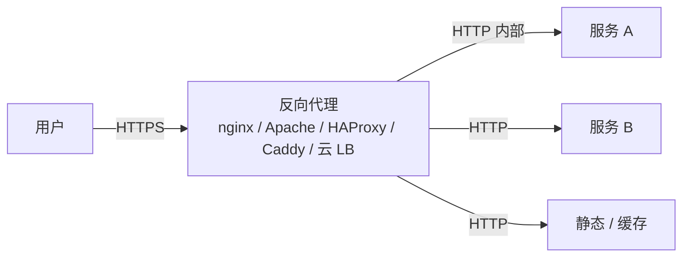
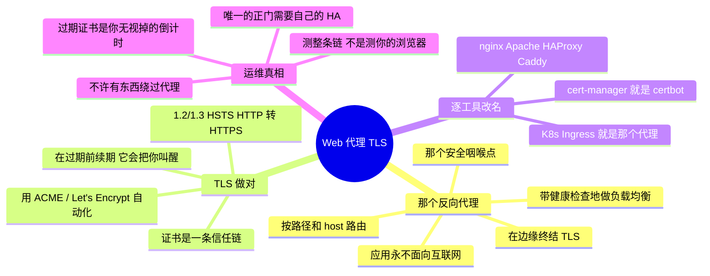

# Web 服务器、反向代理与 TLS —— 通往一切的那扇正门

> 🌐 **语言：** [English（默认）](../../../cross-cutting/web-and-tls.md) · **中文**
>
> ⚠️ 本项目**默认语言为英文**，`cross-cutting/web-and-tls.md` 是"事实来源"。本页中文是多语言支持的一部分，可能略滞后于英文版；两者不一致时以英文为准。

---

> 用户碰得到的几乎每一个服务，都坐在一台 web 服务器或者一个反向代理后面，而通往它的几乎每一条
> 连接都是 TLS。这是存在的最老、最普适的一片横切面 —— 也是云原生路线图假定你已经会了的那一片。
> 这篇笔记在**基本功上是 🔨 地面**（真的运维过 Apache、DNS 和核心服务），而现代代理和自动化证书
> 是那条 ramp。

反向代理就是互联网与你的服务相遇的地方：它终结 TLS、路由请求、分摊负载，并遮蔽它后面的东西。
做对了它是隐形的；做错了它就是每一个用户同时看见的那次故障。不管它是 nginx、Apache、HAProxy、
Caddy 还是一台云负载均衡器，它们干的都是同样那几件活 —— 就是
[运营模型](../00-the-operating-model.md)那句"学概念，逐工具改名"，套到正门上。

## 一个反向代理实际上干什么

一台盒子（或者一片机队）坐在你的服务前面，干五件活：

- **TLS 终结** —— 在边缘解密 HTTPS，好让后面的服务在一个受信网络上说明文 HTTP
  （[the-stack/02](../the-stack/02-network.md)）；证书住在一个地方，不住在每一个应用里。
- **路由** —— 把 `/api` 送到一个服务、`/` 送到另一个，把 `app.example.com` 和 `api.example.com`
  送到不同的后端（基于名字的虚拟主机 / 按 host 路由）。
- **负载均衡** —— 把请求分摊到健康的后端上，带健康检查，好让一个死掉的实例停止收到流量
  （[故障域](../the-stack/01-physical.md)那份直觉，在请求这一层）。
- **卸载** —— 缓存、压缩、限流，以及提供静态内容，好让应用服务器少干点活。
- **一个安全咽喉点** —— 一个地方去强制执行 TLS 策略、响应头、WAF 规则和黑名单
  （[the-stack/07](../the-stack/07-security.md)）。

那唯一一条规则：**应用服务器绝不应该直接面向互联网。** 代理是那扇加固过的正门；应用在它后面的
一个私有网络里。

## TLS / HTTPS —— 所有人都必须做对的那部分

TLS 不容商量，而它也是细心的管理员被锻造出来的地方：

- **一口气讲完那次握手：** 客户端和服务器就一个密码套件达成一致，服务器用一张由客户端信任的
  **证书颁发机构**签发的**证书**证明自己的身份，然后双方推导出一个会话密钥。那条信任链
  （叶子 → 中间 → 根）才是实践中会坏掉的那部分 —— 一张**缺失的中间证书**就是那个经典的
  "在我浏览器里好使、在 `curl` 里失败"的 bug。
- **证书是一条生命周期，不是一个文件。** 签发、安装，以及那个会把你叫醒的：**在过期之前续期**。
  一张过期的证书会在一个你本来看得见的时间戳上把整个站点带下去；证书过期监控是一条一等告警
  （[the-stack/06](../the-stack/06-observability.md)）。
- **把它自动化：Let's Encrypt + ACME。** `certbot` 或者 Caddy 内建的 ACME 免费签发并
  **自动续期**证书 —— 把那个老派的手动续期故障变成一个已解决的问题。现代默认：再也不要手工管一张
  公网证书。
- **现代卫生：** 只用 TLS 1.2/1.3、强密码套件、HSTS、HTTP→HTTPS 跳转，以及 OCSP stapling。和
  [the-stack/07](../the-stack/07-security.md) 是同一份"默认安全"的姿态。

注意这怎么把整个仓库串起来：这里是 TLS 终结，[网格](service-mesh.md)里是**服务间 mTLS**，
[saas-admin](saas-admin.md) 里是邮件的 **SPF/DNS** —— 同一套 PKI 和 DNS 基本功，不同的面。

## 工具，改了名

| 那件活 | nginx | Apache（httpd） | 现代 / 云上 |
| --- | --- | --- | --- |
| **反向代理** | `proxy_pass` | `mod_proxy` | Caddy、Traefik、云 LB |
| **TLS** | `ssl_certificate` | `mod_ssl` | Caddy（自动 ACME）、ACM/托管证书 |
| **虚拟主机** | `server {}` 块 | `<VirtualHost>` | host 规则 / ingress |
| **负载均衡** | `upstream {}` | `mod_proxy_balancer` | HAProxy、云 LB、K8s Ingress |
| **证书自动化** | + certbot | + certbot | Caddy 内建、cert-manager（K8s） |

在 Kubernetes 上同样这几件活换了新名字 —— 一个 **Ingress**（或者 Gateway API）就是那个反向代理，
而 **cert-manager** 就是 certbot —— 但它是完全同一个概念，而这恰恰是基本功可以迁移的原因。

## 运维笔记 —— 什么会把你叫醒

- **那张过期的证书** —— 那次你无视了倒计时的故障。用 ACME 把续期自动化，并提前很久对过期告警；
  这是存在的最可预防的 web 故障。
- **那张缺失的中间证书** —— 浏览器会替它遮掩，`curl` 和手机 App 不会。测**整条链**
  （SSL Labs、`openssl s_client`），不是测"我这儿能打开"。
- **面向互联网的应用服务器** —— 一个能被直接够到的后端，绕过了代理的 TLS 和 WAF。只有在没有东西
  绕得过去的时候，代理才算是一扇正门。
- **跳转循环和错误的响应头** —— `X-Forwarded-For`/`Proto` 配错了，于是应用以为自己在一个 HTTPS
  代理后面跑 HTTP，然后跳转成环。一个经典的反向代理 bug；搞清楚那份 forwarded-header 契约。
- **只有一个代理，没有冗余** —— 那扇唯一的正门就是一个单点故障；它需要自己的 HA（一对加一个虚拟
  IP，或者一台托管 LB），否则它就是那个把一切一起带走的
  [故障域](../the-stack/01-physical.md)。

## 管理纪律（你应该做得到什么）

- 立起一个**反向代理**，让它终结 TLS 并路由到两个后端，而那些应用服务器**不**面向互联网。
- 用 ACME/Let's Encrypt **把证书自动化**，并证明自动续期真的能用。
- 调试一条**坏掉的 TLS 链** —— 缺失的中间证书、过期的证书、错的 SNI —— 用 `openssl s_client`
  和一个链检查器。
- 配置**基于名字的虚拟主机**和**带健康检查的负载均衡**。
- 设定那些让它默认就安全的**安全响应头与 TLS 策略**（1.2/1.3、HSTS、HTTP→HTTPS）。
- 读懂那份 **forwarded-header** 契约，并修好一个跳转循环。

## AI 辅助的 ramp（web/TLS 口味）

- **从你跑过的东西翻译过来：** *"我跑过带 mod_ssl 的 Apache 和 DNS —— 给我这个 vhost 加 TLS 配置
  的 nginx 等价物，以及那个自动管理证书的 Caddy 版本。"*
- **让它起草配置，安全部分你来核：** AI 写 nginx/Apache 配置很快 —— 而且它会交付**弱的 TLS
  默认值、缺失的安全响应头，以及暴露出去的应用**。每一份生成出来的配置，密码套件、响应头和跳转
  都要核过，那条链要端到端测过。
- **AI 会烧到你的地方（验得最狠的地方）：** 它会**发明指令、把 nginx 和 Apache 的语法混起来**；
  它会**漏掉中间证书或者 HTTP→HTTPS 跳转**；而且它会引用**过时的密码套件**。去测那次真实的握手
  （`openssl s_client`、SSL Labs）—— 那份"看起来对"却提供了一条坏链的配置，是那个经典陷阱。

## 诚实边界

🔨 **在基本功上，🧭 在现代那条边上。** 运维 **Apache**、**DNS/BIND** 和 web/核心服务是 🔨 地面
—— 真实地运维过那套正门栈（Sunteck 时期及之后），而它底下那些 TLS/PKI 和 DNS 基本功，就是
[身份](identity-iam.md)、[网格](service-mesh.md)和 [saas-admin](saas-admin.md) 几篇笔记所倚靠的
同一批。属于 **🧭 ramp** 的地方：规模上的现代代理（生产里的 Traefik/Caddy/Envoy）、Kubernetes
Ingress 加 cert-manager 的运维，以及 WAF/边缘 CDN 调优 —— 测绘并验证过，没有被声称成生产规模。
那句可迁移的声称是：扎实的 web 服务器、反向代理和 TLS 生命周期基本功，加上一条通向你面前那个
代理的快速 ramp。

## Guided run（规格）

**这是一次 [guided run](../CONTEXT.md)，不是一个 lab。** 它需要一个真实环境，所以这里没有任何
东西能断言你做过它，而 CI 也跑不了它。那就是全部的区分，而且它不是降级 —— 一次 guided run 够
得到真实的延迟、真实的报错和真实的账单，而那是没有模型做得到的。

**从零做一扇加固过的正门。** 纯本地（一台 VM/容器，或者两台）：

1. **代理 + TLS：** 把 **nginx**（或 Caddy）放到一个很小的后端前面，终结 TLS，并把 `/api` 和
   `/` 路由到不同的服务 —— 而那个后端**不**监听在一个公网接口上。
2. **把证书自动化：** 通过 **Let's Encrypt/ACME**（或者 lab 里用一个本地 CA）签发一张真实证书，
   并证明**自动续期**；然后把它弄坏（让它过期 / 移掉中间证书），并用 `openssl s_client` 诊断。
3. **那次演练：** 对着它跑 SSL Labs（或者一个本地等价物），把任何低于 A 的项目都修掉 ——
   TLS 版本、密码套件、HSTS、跳转 —— 并确认这个应用没法绕过代理被够到。

## 这一章一屏看完

