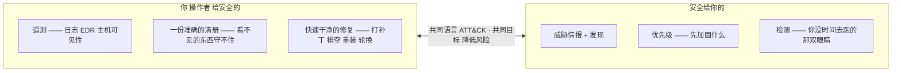
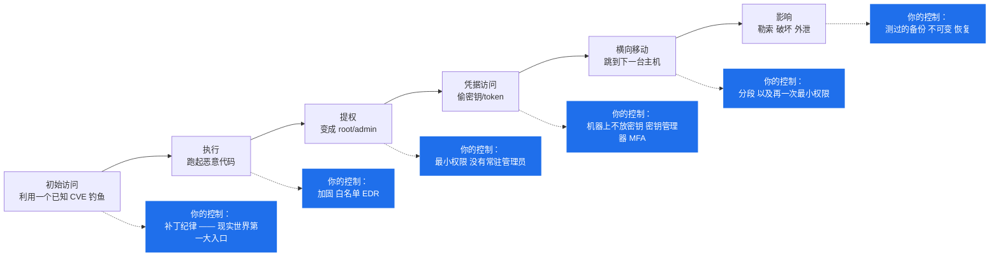
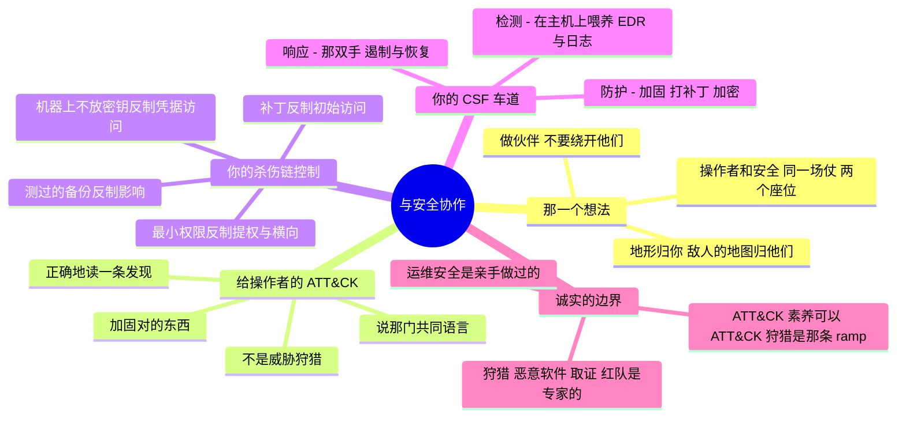

# 与安全协作 —— 给操作者的 ATT&CK 素养

> 🌐 **语言：** [English（默认）](../../../cross-cutting/working-with-security.md) · **中文**
>
> ⚠️ 本项目**默认语言为英文**，`cross-cutting/working-with-security.md` 是"事实来源"。本页中文是多语言支持的一部分，可能略滞后于英文版；两者不一致时以英文为准。

---

> 你不是安全团队。你是他们所守护的那片面 —— 也是他们最大的那个力量放大器。攻击者进来的路上碰到的
> 大部分东西都是**你的**：身份、主机、补丁、端口、日志。这篇笔记是安全的操作者那一半 ——
> 怎么让环境守得住、怎么说安全团队的语言，以及怎么知道你的工作在哪儿结束、一个专家的工作从哪儿
> 开始。

[`the-stack/07`](../the-stack/07-security.md) 把安全当成一个你去建的**层**来覆盖（纵深防御、
CSPM/EDR/SIEM、密钥）。这篇笔记讲的是那份**关系**和那份**素养**：一个系统管理员怎么**与**
InfoSec/SOC 协作，以及足够的 **MITRE ATT&CK** 素养去加固对的东西、正确地读一条发现 —— 而不假装
自己是一个威胁猎手。

## 那一个想法：操作者和安全是同一场仗的两个座位

这里有一份天然的张力 —— 安全想把它锁死，你想让它能用 —— 而化解它的那些团队，靠的是一个共同目标和
一门共同语言，不是一场对峙：

那个终结对峙的重构：**安全去发现和狩猎；你去加固、打补丁、在主机上检测，以及修复。** 地形归你；
敌人的地图归他们。谁都赢不了单打独斗 —— 而那个把安全当成伙伴、而不是一道要绕开的闸的操作者，
比再多一个工具值钱。

## 给操作者的 MITRE ATT&CK（不是给威胁猎手的）

**ATT&CK** 是一份关于真实对手如何行动的目录 —— **战术**（那个*为什么*：他们的目标，作为列）和
**技术**（那个*怎么做*：具体的招式）。对一个安全分析师来说，它是一套狩猎与检测框架。对**你**来说，
ATT&CK 素养是三件具体的事，而没有一件是"成为一个威胁猎手"：

1. **加固对的东西。** 知道攻击者的路径，就知道**你的**哪些控制真的要紧 —— 你不是在勾一份通用的
   加固清单，你是在反制具体的招式。
2. **正确地读一条发现。** 当安全说"我们看到凭据访问和横向移动"，你立刻知道该去查你的哪一片面、
   并且快速把它锁上。
3. **说那门语言。** ATT&CK 是故障频道和设计评审里的那门共同词汇。用它，能让你成为一个伙伴，
   而不是一张工单。

那条杀伤链，以及每一阶段上**你**所拥有的那项控制 —— 这就是 ATT&CK 的操作者视角：

把底下那一行读一遍，它就是这个仓库已经在教的每一门纪律 —— 补丁合规、最小权限
（[身份](identity-iam.md)）、机器上不放密钥（[ci-cd](ci-cd.md)）、分段
（[the-stack/02](../the-stack/02-network.md)）、测过的备份
（[the-stack/04](../the-stack/04-storage.md)）。**ATT&CK 不添新活；它告诉你，你已经在做的那些活
*为什么*是要紧的那些活。**

## 那些框架，按操作者的诚实说法

你会听到被点名的三个 —— 在一个操作者的深度上，搞清楚每一个是**用来干什么**的：

| 框架 | 它是什么 | 你和它的关系 |
| --- | --- | --- |
| **ATT&CK** | 对手战术与技术的目录 | 那门共同**语言** —— 认出打到你那片面上的那些技术 |
| **D3FEND** | 防御侧的对应物 —— 把控制映射到它们所反制的技术 | 你的**地图** —— 把"加固那台机器"变成"反制这些具体招式" |
| **NIST CSF** | 那套项目框架：识别 · **防护** · **检测** · **响应** · 恢复 | 你主要住在**防护** + 主机级**检测** + **响应**的双手 |

那个 CSF 轮盘上诚实的操作者车道：**防护**（加固、打补丁、最小权限、加密）、主机上的**检测**
（部署并喂养 EDR/日志），以及**响应的双手**（遏制、根除、恢复 ——
[incident-response](incident-response.md)）。*识别*（风险/资产 —— 但见
[itsm-and-assets](itsm-and-assets.md)：你的 CMDB **就是**那个识别职能）和深度的*检测*/狩猎，是
共享到专家的那一段。

## 操作者的安全节奏

与安全协作是一份节奏，不是一次事件：

| 节奏 | 你做什么 | 它为什么要紧 |
| --- | --- | --- |
| **持续** | 给 SOC 喂遥测（主机日志、EDR）；让清册保持准确 | 你不给他们看的东西他们守不住 |
| **每日** | 分诊落到你这儿的那些发现；给正在被利用的东西打补丁 | 未打补丁的已知 CVE 是那个经典入侵 |
| **每周** | 最小权限复审；关掉那些爬上来的访问权和暴露面 | 权限蔓延正是提权和横向移动所骑的东西 |
| **每月** | 推加固过的黄金镜像（[the-stack/03](../the-stack/03-compute-and-images.md)）；基线漂移检查 | 重装优于打补丁，让机队保持守得住 |
| **每季** | 和安全一起做一次桌面推演；测一次恢复 | 在你需要它之前演练那次响应 |
| **有发现时** | 遏制 → 快速修复（排空/重装/轮换），并回报 | 你那份牲口纪律是一项安全超能力 |

那个主题：**你日常的运维卓越 —— 打补丁、最小权限、清册、快速重装 —— 就是防护与响应的大部分。**
安全的工作变轻松的程度，恰好正比于你把自己那份做得多好。

## 运维笔记 —— 操作者与安全那条接缝上会出什么错

- **那份对抗关系。** 把安全当成那个说不的团队 —— 于是你绕开他们 —— 就是影子基础设施和未打补丁的
  例外累积起来的方式。要么做伙伴，要么那些缝隙变成入侵。
- **那个瞎掉的 SOC。** 检测的好坏上限就是你喂给它的遥测；一台没有日志或 EDR 的主机是攻击者最爱的
  一个盲点。覆盖率是**你的**产出。
- **又是那份陈旧的清册。** 你保护不了一个没人知道它存在的资产
  （[itsm-and-assets](itsm-and-assets.md)）；影子的和被遗忘的系统，正是初始访问落地的地方。
- **修复得慢。** 一条搁了几周的发现是一扇被撑开的窗。操作者的优势是**速度** —— 排空、重装、
  轮换 —— 不是完美的分析。
- **ATT&CK 剧场。** 把你行动不了的技术名字挂在嘴上，对谁都没帮助。重点是把一项技术映射到
  **你所拥有的那项控制**上，然后把它关上。
- **越界。** 声称你并不具备的威胁狩猎或取证深度，就是这整个仓库那份诚实失败的安全版 ——
  而它在一个真正的专家追问一句的那一刻就崩了。

## 管理纪律（你应该做得到什么）

- 用 **ATT&CK 的说法**读一条安全发现，并点名**你的**哪项控制反制它。
- 为杀伤链的每一个阶段指出**你所拥有的那项控制**（补丁 → 初始访问，最小权限 → 提权/横向，
  备份 → 影响）。
- **喂养检测**：部署 EDR 和集中日志，好让 SOC 有主机可见性。
- 在一条发现上**快速而干净地修复** —— 排空、重装、轮换 —— 而不是一次缓慢的手工打补丁。
- 在一次故障里**作为那双手做伙伴**（[incident-response](incident-response.md)）：遏制、根除、
  恢复。
- 维护一份**守得住的清册**（[itsm-and-assets](itsm-and-assets.md)）—— 那个识别职能，以一个操作者
  的方式完成。
- 知道那条**边界**：运维安全在哪儿结束，而一个安全专家的手艺（狩猎、恶意软件分析、检测工程、
  取证、红队）从哪儿开始。

## AI 辅助的 ramp（与安全协作口味）

- **翻译一条发现：** *"一条发现说 T1078（有效账户）和 T1021（远程服务）。主机和身份归我管 ——
  我的哪些控制反制这些，以及我先查什么？"* AI 把 ATT&CK 技术 ID 映射到具体的操作者动作上很快。
- **把你的控制映射到 D3FEND：** *"这是我的加固基线 —— 每一条实际反制了哪些 ATT&CK 技术，
  缺口在哪？"* 把一份清单变成一张覆盖图。
- **AI 会烧到你的地方（验得最狠的地方）：** 它会**发明技术 ID 和缓解措施**（ATT&CK 很大，它就靠
  猜 —— 在你动手之前先去核那个真实的技术）；它会**夸大一项控制覆盖了什么**（一项单一控制很少能
  反制一整个战术）；而且它会很乐意让你**说超出自己车道的话** —— 它不知道"读 ATT&CK"对你是诚实的，
  而"声称用它去*狩猎*"不是。那条边界要你自己守住。

## 诚实边界

🔨 **运维安全是亲手做过的地面。** 防护 / 主机检测 / 响应之手这条车道是真实经验：把**补丁合规**
当成日常运维、机队规模的**全盘加密**、在整片机队上部署并迁移过的 **EDR**（Defender for Endpoint
→ SentinelOne，两个控制台都用过）、**设备安全配置与网络准入合规检查**、在一套多人审批模型里的
**最小权限访问治理**、在**分段的、访问受闸的、被审计的环境**里作业，以及担任
**横跨基础设施、网络与安全的系统联络人** —— 在终端安全模型上做伙伴（恰好就是许多基础设施岗位要
的那句"与 InfoSec 做伙伴"）。那就是操作者的安全，而它是 🔨。

🧭 **而且诚实地就停在这里。** **威胁狩猎、恶意软件分析、检测工程、数字取证和红队**是这篇笔记
**不**声称的专家手艺。**ATT&CK *素养*** —— 读它、把你的控制映射到它、在故障频道里说它 ——
是诚实的操作者素养；**基于 ATT&CK 的狩猎或检测*工程*** 是那条专家 ramp。如果你想走那条路，那个
专家库的链接在
[`the-stack/07`](../the-stack/07-security.md#往深里走--越过系统管理员那条防御基线)
—— 而如果你引用它，就把那条边界担起来。这里的声称是诚实的那个：一份很强的运维安全地基，加上那份
让你成为安全团队最好的伙伴的框架素养 —— 不是一枚安全分析师的徽章。

## Lab（✅ 已建成）

[`labs/one-control-three-stages/`](labs/one-control-three-stages)
—— **先做下面那个练习，然后去读答案页看看它藏了什么。** 六个阶段六个都被覆盖、十一行填好的格子
压在七项不同的控制上，而 **EDR 独自作为其中三个阶段上唯一的预防性控制** —— 这是那种矩阵格式问
不出来的问题，因为它是按阶段索引的，而这是一个关于一项控制的问题。

还有两件那个格式表达不了的事。**最后那个阶段不是被阻止的，它是被熬过去的**：测过的备份是一项
**恢复**控制，而把它们写在"影响"那一行里，等于说攻击者在那儿失败了，而他们没有。以及在一份审计
回答里，**被设计过和被部署了是分不出来的** —— 这个模型里那两项只存在于纸上的控制，正是没人注意到
EDR 独自扛着三个阶段的原因。

`--break-it` 按阶段打分，而那正是每一张控制矩阵和每一份安全问卷的格式，然后它报告 6 / 6。

## Guided run（规格）

**这是一次 [guided run](../CONTEXT.md)，不是一个 lab。** 它是关于**你自己**那片估算面的判断，
所以这里没有任何东西能断言你做过它 —— 而做它本身就是重点。

**把你自己的环境映射到那条杀伤链上。** 不需要工具，只需要判断：

1. 拿一个你真的在跑的服务。对上面每一个杀伤链阶段 —— 从初始访问到影响 —— 写下反制它的
   **你所拥有的那一项控制**，以及它是不是真的到位了。
2. 找出你**最弱的那个阶段** —— 通常是一片没打补丁的暴露面、一个常驻管理员，或者一台没有 EDR 或
   日志的主机 —— 并写下那个具体的修复。
3. **那次演练：** 用 ATT&CK 的说法，写下你会交给一个 SOC 分析师的那两句关于这个服务的交接，
   好让他们知道你覆盖了什么、缺口在哪。那份交接**就是**与安全协作。

**先跑那个 lab。** 它会告诉你，在你把自己那张表写完之后，该对它问哪三个问题 —— 而那三个才是会
改变你下一步做什么的问题。

## 这一章一屏看完

