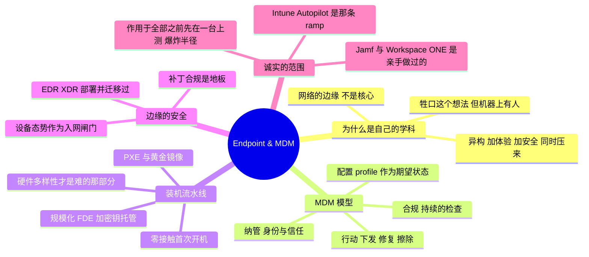

# Endpoint & MDM

> 🌐 **语言：** [English（默认）](../../../endpoint/README.md) · **中文**
>
> ⚠️ 本项目**默认语言为英文**，`endpoint/README.md` 是"事实来源"。本页中文是多语言支持的一部分，可能略滞后于英文版；两者不一致时以英文为准。

---

> 整个需求信号里最密的集群之一，而平台目录覆盖不到它：管理那一队人们真正在上面干活的笔记本
> 和手机。它是一条一等公民的轨道，因为它是一份一等公民的工作 —— 而且它是这个仓库里从最深的
> 亲手经验写出来的那一条。

终端管理这门学科，是把成千上万台异构设备 —— macOS、Windows、iOS、Android —— 做到一致、
安全、并且能自我发放，而不需要人去碰每一台。它和
[`the-stack/03`](../the-stack/03-compute-and-images.md) 是同一条
*注册 → 装机 → 个性化 → 维护* 流水线，只是指向终端而不是服务器，而且它是
**🔨 亲手做过的深度**：一个从零建起、在约 10 万台设备规模上运行的多 OS 发放平台。

## 三篇 companion

这一页是总览。凡是它点出一个设计问题然后继续往下走的地方，都有一篇 companion 来回答它 ——
而这正是这条轴需要的形状，因为它点出的那些问题，正是这个仓库最深的那条亲手声明所坐的地方。

| | 它回答什么 |
|---|---|
| [`provisioning.md`](../../../endpoint/provisioning.md) | 一个平台在要同时覆盖 Windows、macOS **和** Linux 时决定什么 —— 两个发放时代以及你的估算面实际在哪一个里、三个操作系统真正共享的是什么，以及为什么硬件多样性是约束而不是渗漏 |
| [`management.md`](../../../endpoint/management.md) | 机器到了人手上之后 MDM 管什么 —— 你租来的那个管理面、为什么*已纳管*、*受管中*和*合规*是三个不同的断言、一套 Apple 估算面的形状告诉你什么，以及那个带时间轴的作用域问题 |
| [`encryption-and-keys.md`](../../../endpoint/encryption-and-keys.md) | 这一页称之为*真正的活*却从未展示过的那件事 —— 为什么托管是把风险搬走而不是移除、位于中心的那个循环依赖，以及那些活得比它们所解锁的机器更久的密钥 |

## 为什么终端是它自己的学科（而不是"IT 支持"）

云教会了这个行业把服务器当作牲口 —— 从代码装出来，坏了就换不修。终端是同一个想法被拖到
最难的地形上：**这些机器上有人。** 一台服务器你可以在凌晨三点排空并重装；一台笔记本属于
某个正赶截止日期的人，在另一个国家，用他家的 wifi，他不会容忍停机，而且**一定**会开工单。
在规模上把这件事做好是一个真实的工程问题 —— 异构、用户体验、安全和生命周期同时压在一起 ——
而它恰恰是这个仓库所围绕的那条运维与自动化的 lane，只是指向网络的边缘而不是核心。

## MDM/UEM 模型 —— 设备的 infrastructure-as-code

剥掉厂商名，每一个 MDM/UEM 平台做的都是同样四件事 ——
[operating model](../00-the-operating-model.md) 的终端版本：

- **纳管** —— 设备获得一个受管身份和一段信任关系（对应
  [身份](../cross-cutting/identity-iam.md)那边"注册一个受限范围的 principal"）。
  用户自有（BYOD）和公司自有正是在这里分叉的。
- **配置** —— 声明式的 **profile** 描述期望状态：设置、限制、证书、wifi/VPN 载荷。和
  [IaC](../../../cross-cutting/iac-and-config.md) 是同一个本能：描述终态，让平台把设备收敛
  过去。
- **强制合规** —— 这台设备**仍然**是策略要求的样子吗：加密的、打过补丁的、没越狱的、跑在
  受支持的 OS 上？合规是一次持续的检查，不是一道一次性的闸门。
- **行动** —— 分发软件、修复漂移，最坏的情况下锁定或擦除一台丢失的设备。上面那一整套结构
  的安全回报。

"两个业界标准 MDM"是一条真实的岗位要求，而这里是真的满足了它：**Jamf**（macOS）和
**VMware Workspace ONE / UEM** 在整个机队上亲手运行过 —— 同一个模型，两种厂商方言，而这
正是可迁移性的全部要点。

## 装机与发放 —— 流水线的边缘版

这是 [`the-stack/03`](../the-stack/03-compute-and-images.md) 的
*启动 → 装机 → 个性化* 流水线，而且是它最难的那个版本，因为目标是各式各样偏消费级的硬件，
而产出必须让一个非技术的人在第一天就能用：

- **PXE 与自制镜像** —— 网络引导、一个按硬件代际调过的黄金镜像，以及云藏起来的那个真相：
  你的镜像必须在你拥有的每一款笔记本上、带着对的驱动、每一次都启动起来。
- **零接触首次开机** —— 目标是一台设备到货、联网、然后自己把自己配好，不需要 IT 的手 ——
  Apple 的 Automated Device Enrollment、Windows Autopilot 以及它们的等价物，就是这个想法被
  产品化。
- **仓库现实** —— 一天装几百台、给退回机重装，以及**规模化地登记全盘加密**（在机队量级上，
  加密不是一个勾选框 —— 它是密钥托管、恢复密钥保管，和一套流程）。
- **硬件多样性与驱动** —— 云永远不会展示给你的那个渗漏点，也是让终端装机真正变难的那一个：
  同一个镜像、十二款笔记本、其中一款装不上 wifi 驱动。

## 软件与补丁生命周期

不体面的那一半，而它是这份工作的大部分：

- **应用打包** —— 把一个安装程序变成一个可由策略下发的包（对应
  [`the-stack/03`](../the-stack/03-compute-and-images.md) 里 RPM/deb 那部分活的终端
  表亲），主要是 `.deb` 和 `.pkg`/MSI 形态的载荷。
- **定向分发** —— 把软件推给**对的**设备：按用户、按组、按地区、按国家或按合规状态，通过
  UEM —— 而不是一次广播。
- **补丁合规** —— 那份关掉 [`the-stack/07`](../the-stack/07-security.md) 里"未打补丁
  的已知 CVE"的日常纪律，是被测量和强制的，不是被指望的。补丁合规**就是**终端安全的地板。

## 终端安全

安全那一章，落在边缘 —— [`the-stack/07`](../the-stack/07-security.md) 里住在设备上的
那一片：

- **EDR/XDR** —— 端点检测与响应，部署并运行过：Microsoft **Defender for Endpoint** 部署过
  并**迁移到了 SentinelOne**，两个管理控制台都亲手操作过（诚实地界定范围：这是**终端**侧的
  Defender，不是 Defender for Office 365）。
- **合规作为闸门** —— 设备安全配置检查与安全入网检查，例行执行 —— 一台设备要先证明自己是
  健康的，才被信任接入网络。这是 [zero-trust](../the-stack/07-security.md) 的设备态势
  那条腿，在实践中做出来。
- **加密与恢复的故事** —— 登记了 FDE，配上让"有人忘了密码"这件事可以活过去的密钥托管与恢复
  流程（丢了密钥就等于丢了这台笔记本 —— [`the-stack/04`](../the-stack/04-storage.md)
  的保管这一课，施加在 3,000 台设备上）。

## BYOD —— 最难的信任问题

个人设备接触公司数据，是身份、安全和隐私相撞的地方：

- **纳管与隔离** —— iOS/Android 的纳管方式要管住一台设备上的**工作**，而不拥有这台**设备**，
  把个人数据和公司数据分开。
- **那个身份问题** —— BYOD 正是云 SSO 选择被做出的地方；它是
  [身份那一章](../cross-cutting/identity-iam.md)里"自建 vs Okta vs Google"这个决定背后
  的具体压力。
- **隧道那套管道** —— UAG / per-app VPN，好让一部个人手机安全地够到一个内部应用。
- **诚实地界定范围** —— 纳管和平台生命周期是 🔨；深度的 iOS/Android **机队合规 profile 精通**
  更进一步，而它被标注出来而不是被声称。

## Intune 在哪里是一条 ramp

Microsoft 的终端栈 —— **Intune、Autopilot、Configuration Manager** —— 是 🧭，不是 🔨。但
上面那个模型是完全可迁移的：Intune 就是 *纳管 → 配置 → 合规 → 行动* 的 Microsoft 方言，
而 Autopilot 是它的零接触首次开机。纪律是亲手做过的；具体那个控制台是一次查找 —— 而这正是
这个仓库的整个论点，被施加到又一个工具上。

## AI 辅助的 ramp（终端口味）

- **从你在跑的东西翻译过去：** *"我在运维 Jamf 和 Workspace ONE —— 把我的
  纳管/profile/合规/应用下发工作流映射到 Intune 上，并标出模型真正不同的地方。"* 那个差值
  很短；这正是要点。
- **让它起草打包和脚本，再在测试设备上验证：** AI 写部署脚本和 profile 载荷很快，而且会在
  plist/XML/JSON 结构上微妙地写错 —— 每一个 profile 在碰机队之前都要在一台真实纳管的设备上
  测过，因为一条坏的合规策略能把几千台锁在外面。
- **AI 会烧到你的地方（验得最狠的地方）：** 它会**发明不存在的 MDM 载荷键和 cmdlet**；它会
  **混淆各 MDM 厂商的能力**（Jamf 原生能做什么 vs Workspace ONE 需要一个脚本才能做什么）；
  而且它**低估爆炸半径** —— 一次误擦除或误锁定策略不是一次回滚，而是它触达的每一台设备上的
  一次事故。在信任它作用于全部之前，先在一台上测。

## 诚实边界

🔨 **亲手做过的深度 —— 核心那条 lane。** 设计并运行过一个被全组织采用的多 OS
（Win/macOS/Linux）PXE 与镜像式发放平台，累计发放 10 万+ 台设备；**Jamf + Workspace ONE /
UEM** 亲手运行（在 Jamf 那一侧负责北美的测试与维护）；应用打包、定向分发、补丁合规、规模化
全盘加密，以及 **EDR 部署/迁移**（Defender for Endpoint → SentinelOne，两个控制台）都是日常
的活。🧭 只在标注处、别处没有：**Intune/Autopilot/ConfigMgr**（不同的控制台，同一门纪律）
以及深度的 **iOS/Android 机队合规 profile 工程**（纳管和生命周期是 🔨；机队 profile 的精通
是那条 ramp）。这是最直接**就是**整个仓库所瞄准的那份工作的一条轨道。

## Lab（✅ 已建成）

[`labs/policy-blast-radius/`](../../../endpoint/labs/policy-blast-radius/) ——
**控制台说这条策略触达 3 台，它触达 22 台，而三年后它触达 30 台，期间没有任何人编辑过它。**
被作用的那个组由入转离填充，所以爆炸半径是一个时间的函数，而它被当作一个常量来复审。
`--break-it` 按控制台的方式计数，在两端都返回一个稳定、自信的 **3**。

**它所替代的那份 spec 要一个试用 MDM 和一台备用设备**，那会是一次 *guided run* 而不是一个
lab —— 而且它教不了那一课，因为你没法在一个试用租户上看三年过去。从它那里值得保留的是第三步
*在你要把它推到 3,000 台机器上之前，先把爆炸半径写下来*，而那件事结果完全可以被建模。

## 这一章一屏看完

