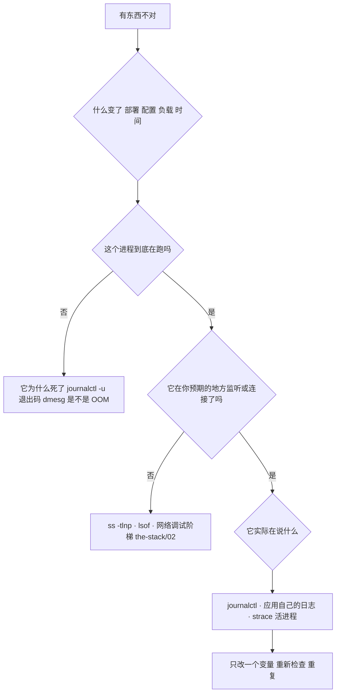
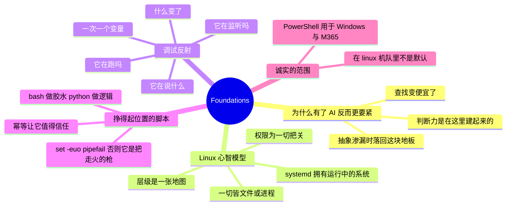

# Foundations —— Linux 与脚本

> 🌐 **语言：** [English（默认）](../../../foundations/README.md) · **中文**
>
> ⚠️ 本项目**默认语言为英文**，`foundations/README.md` 是"事实来源"。本页中文是多语言支持的一部分，可能略滞后于英文版；两者不一致时以英文为准。

---

> 这个仓库里每一个岗位脚下的那块地板。启发了这个项目的每一份岗位描述都**默认**它、却从不
> 列出它 —— 而这恰恰是它值得被明说的原因。不站在这上面，你到不了云。

roadmap 以横切技能开路，因为它们可迁移；而这个模块是连那些之下的东西 —— Linux 命令行，
以及那种把"我手工做过一次"变成"它现在自己会跑"的脚本能力。它是整个需求信号里被要求最多、
被教得最少的技能，恰恰因为所有人都默认你已经有了。而它也是这个仓库里唯一一处诚实标记不带
任何限定的地方：**🔨 亲手做过的深度** —— RHCE 级别的 Linux 在机队规模上运维过，Python 和
Bash 作为日常工具用了十年以上。这里其余的一切，都是从这块地板往**上**看写出来的。

## 为什么在 AI 时代地板更要紧，而不是更不要紧

[`WHY.md`](../WHY.md) 论证 AI 让工具查找变得便宜，并把考题往上推到判断力。Foundations 正是
那份判断力被**建起来**的地方。你可以 prompt 出一条 `kubectl` 命令或一段 Terraform，但你
prompt 不出那种说*"那个输出在骗我"*的直觉 —— 那来自多年阅读 Linux 实际告诉你的东西。云是
这一层之上的抽象；当抽象渗漏时（而 [`the-stack`](../the-stack/) 就是一本"它在哪里渗漏"
的目录），你退回来落在的恰恰是这些技能上。AI 抬高天花板；foundations 是地板，而地板是承重的。

## Linux 心智模型

你不是去背 Linux；你是内化几个让命令变得**可猜**的模型。四个承载了大部分重量。

**一切皆文件（或进程）。** 设备、套接字、内核状态、运行中的程序 —— Linux 把几乎一切都暴露
成一条你可以读或写的路径。一块磁盘是 `/dev/sda`；一个进程打开的文件在 `/proc/<pid>/fd` 下；
一个内核可调参数是 `/proc/sys` 里的一个文件。一旦你相信这一点，"我怎么检查 X？"几乎总有那
个答案：*"找到那个文件。"*

**文件系统层级是一张地图，不是一个杂物抽屉。** `/etc` 是配置，`/var` 是会变的状态（日志、
队列、数据库），`/usr` 是装好的软件，`/proc` 和 `/sys` 是通往内核的活窗口，`/home` 是人。
当有东西坏了，这个层级在你跑任何一条诊断之前就告诉你**该去哪儿看** —— 一个满了的 `/var`
和一个满了的 `/home` 是不同的问题，而路径说出了是哪一个。

**权限和身份为一切把关。** user、group、other；读、写、执行；再加上归属。多数"它跑不起来"
和"permission denied"的事故就是这个模型，而修法是把它读对，不是 `chmod 777`（那个把一个权限
bug 变成一个安全 bug 的反射）。[身份那一章](../cross-cutting/identity-iam.md)的最小
权限纪律就是从这里起步的 —— 在一台机器上，对着一个文件。

**systemd 拥有正在运行的这个系统。** 启动路径（固件 → 引导器 → 内核 → init → systemd →
unit）、作为 unit 的服务、用 `systemctl` 控制它们，以及作为记录的 journal。知道一个服务是
一个带依赖、带顺序、带被记录的生命周期的 **unit**，会把"这个服务起不来"从一个谜变成一次
查询。


这和 [`the-stack/01`](../the-stack/01-physical.md) 从串口控制台调试的、以及
[`the-stack/03`](../the-stack/03-compute-and-images.md) 用 cloud-init 个性化的，是同一
条启动路径 —— foundations 是你学会读它的地方。

## 调试反射 —— 真正的区分点

工具知识现在很便宜；而**查出哪里不对**的那份反射不便宜，而且它正是 [`WHY.md`](../WHY.md)
说会存活下来的东西。它是一把梯子，每一次都以同样的方式爬，在笔记本上、服务器上或容器里都
一样：



爬它的那些工具，以及每一个回答的问题：

- **`ps` / `top` / `htop`** —— 它在跑吗，它对 CPU/内存做了什么？
- **`ss -tlnp`**（现代的 `netstat`）—— 什么在监听，套接字归谁？
- **`lsof`** —— 这个进程打开了哪些文件/套接字？（"一切皆文件"这个模型，被武器化用于调试）
- **`strace`** —— 它实际在发出哪些系统调用，哪一个失败了？这是那个终结争论的工具：程序不是
  "卡住了"，它是阻塞在一个特定 fd 上的一次特定 `read()` 里。
- **`journalctl` / `dmesg`** —— systemd 和内核记录了什么？（OOM killer、段错误、挂载失败都
  住在这儿）
- **`df` / `du` / `free`** —— 那些无聊的杀手：一块满了的盘或耗尽的内存，伪装成一个应用 bug。

这些工具底下那份纪律才是没有模型能提供的部分：**一次只改一个变量，然后读系统告诉你什么。**
乱抓 —— 一次改三样东西然后重跑 —— 是把一个十分钟的修复变成两小时、而且永远学不到到底哪里
坏了的方式。这份反射正是为什么网络那一章有一把调试**阶梯**而不是一张调试**清单**：顺序就是
那门技能。

## 挣得起自己位置的脚本

自动化是一个 sysadmin 停止**扩张工单**、开始**扩张系统**的地方。两门语言承载它，而知道它们
之间那条线，是这门技能的一半。

**Bash 做胶水，Python 做逻辑。** Bash 在把命令串起来、管道、以及快速的机队单行命令上无可
匹敌 —— 而一旦出现真正的分支、数据结构或错误处理，它就变成一份负债。经验法则：如果它有超过
一两个 `if`，或者碰到了结构化数据（JSON、CSV、一个 API），那它想成为 Python。把 Bash 硬掰
去干 Python 的活，是一个经典的时间黑洞。

**幂等是让一个脚本值得信任的那个性质。** 一个你可以安全地跑两遍的脚本 —— 它收敛到同一个
状态而不是把它翻倍 —— 是基础设施；一个第二次跑就坏掉或者重复的脚本，是一份你得看着的负债。
"如果用户**不存在**就创建"、"**只在缺失时**追加这一行"、"创建目录**而在它已存在时不失败**"。
这和 Ansible（[`cross-cutting/iac-and-config.md`](../cross-cutting/iac-and-config.md)）
建立它整个模型所依据的是同一个想法 —— foundations 是你学会**想要**它的地方。

**错误处理把一个工具和一把走火的枪区分开。** 一个没有 `set -euo pipefail` 的 Bash 脚本会
径直越过它自己的失败，并带着一个只设了一半的变量去造成破坏；一个在第一个错误处停下的脚本，
和一个用空的 `$DIR` 去 `rm -rf "$DIR/"` 的脚本，差别就是开头那一行。快失败、响亮地失败，并
让那次失败对下一个人（往往是凌晨三点的你自己）是可读的。

```bash
#!/usr/bin/env bash
set -euo pipefail        # 出错即退出、未定义变量即退出、管道中任一段失败即退出

target="${1:?usage: setup.sh <dir>}"   # $1 缺失时带一条消息失败
mkdir -p "$target"                     # 幂等：已存在也没关系
```

四行，而每一行都是一课：一个在任何系统上都能找到 bash 的 shebang、那些安全开关、一个拒绝
为空的参数，以及一次幂等的操作。这就是一个你可以在流水线里信任的脚本的形状。

## PowerShell，诚实地界定范围

PowerShell 是真东西、也值得会 —— 传对象的管道在 Windows 管理上确实比 Bash 的文本流好用 ——
但在这里诚实地界定：它是用于 **Windows Server 维护和 M365/Entra 管理面**
（[`cross-cutting/saas-admin.md`](../cross-cutting/saas-admin.md)）的工具，而不是一个
以 Linux 和 macOS 为主的机队里的主力自动化语言。那些概念（管道、对象、cmdlet）从 Bash/Python
的底子上迁移过去很快；要点是知道它**什么时候**是对的工具 —— 管理 Windows 和微软的云 ——
而不是默认就伸手去拿它。

## AI 辅助的 ramp（foundations 口味）

Foundations 是 AI **最**立竿见影有用、也**最**危险去信任的那一层 —— 因为一条 shell 命令是
以你的身份、就在此刻、带着你的权限运行的。

- **让它起草单行命令，然后在它运行之前读一遍：** AI 非常擅长
  *"删除这几个目录里超过 30 天的文件的那条 `find` 命令"* —— 而一个错的 flag 就是在错误的
  地方 `rm`。把每一条生成的命令都当作你正要以 root 身份运行它来读，因为你就是。
- **让它解释，而不只是产出：** *"逐个字段带我过一遍这条 `awk`/`sed`/`jq` 在做什么"* 把 AI
  从一台代码自动售货机变成一个导师，而且是在**建立**那个模型而不是在**租用**它。
- **用它加速那份反射，而不是替代它：** *"这是 `strace` 的尾巴和 journal —— 那个失败的系统
  调用指向什么？"* 是一个很好的用法；而在没有任何证据的情况下*"直接告诉我我的服务器为什么
  慢"*，正是你拿到一个自信、说得通、且错误的答案的方式。
- **AI 会烧到你的地方（验得最狠的地方）：** 它会**发明**你那个版本的工具上**不存在的 flag
  和选项**（光是 GNU 与 BSD 的 `sed` 就是一片雷区）；它会**假设一个发行版/shell**，然后给你
  一堆和你的不匹配的命令；而且它会**自信地给出一条破坏性命令**，却没有你出于本能会加上的那道
  护栏。在这一层上，一次幻觉的代价是以被删掉的文件来计量的，所以那份验证的习惯不是可选的 ——
  它正是 foundations 必须是**你的**而不是模型的全部理由。

## 诚实边界

🔨 **亲手做过的深度 —— 这个仓库里最直接的一处。** Linux（RHEL/CentOS/Ubuntu）在机队规模上
运维过，RHCE 认证，十余年间以 Python 和 Bash 作为日常自动化工具 —— 发放流水线、审计对账脚本，
以及 [`the-stack`](../the-stack/) 各章所依据的那些跨栈排障。PowerShell 是真的，但被
界定了范围（Windows Server 维护、M365/Entra 管理）并被这样标注，没有被吹成一门主力语言。
这个模块里没有 🧭，因为这里没有任何东西是一条 ramp —— 这是那些 ramp 起飞所依据的地面。

## Lab（✅ 可跑 —— [`labs/idempotence-drill/`](labs/idempotence-drill)）

**在 bash 里亲身感受幂等这一课** —— 这一个能跑，不需要云，不需要 root：

```bash
bash foundations/labs/idempotence-drill/idempotence_drill.sh
```

它构造一个**脆弱**脚本（无条件追加、裸 `mkdir`、没有 `set -e`）和一个**安全**脚本
（`set -euo pipefail`、一个必填参数守卫、`mkdir -p`、先检查再追加），把每一个反复运行，然后
检查差别：脆弱的那个**把自己的活翻倍**、并且**用退出码 0 掩盖自己的失败**；安全的那个
**收敛**，并在参数缺失时**快速失败**。退出码 `0` 意味着教训成立。它是可跑的
[备份 drill](../the-stack/labs/04-backup-not-snapshot) 和
[failure-domains lab](../the-stack/labs/01-failure-domains) 的天然同伴 —— 全都是纯
本地的，全都在证明一门纪律而不是一个事实。

**反射那一半**（已规划）：一个 setup 脚本弄坏**一样**东西（一个跑在满盘上的服务、一个被翻转
的权限、一个卡在缺失文件上的进程）；只用 `systemctl`/`journalctl`/`ss`/`lsof`/`strace`/`df`
去爬那把调试阶梯，直到你点出那个失败的系统调用 —— 不猜，一次一个变量。

## 这一章一屏看完


