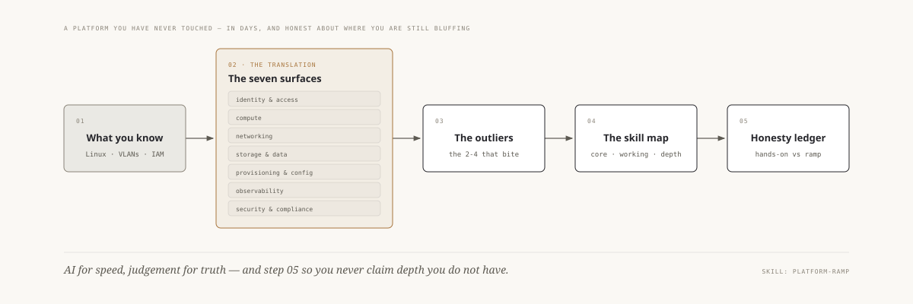

# platforms/

> 🌐 **语言：** [English（默认）](../../../platforms/README.md) · **中文**
>
> ⚠️ 本项目**默认语言为英文**，`platforms/README.md` 是"事实来源"。本页中文是多语言支持的一部分，可能略滞后于英文版；两者不一致时以英文为准。

---

一个平台一个目录。每个模块都遵循**同一份四段式模板**，好让你在它们之间移动时不用重新学
怎么读它们：

1. **`README.md`** —— 它是什么（映射到七个面）+ 提纲式技能图 + AI-ramp 摘要。
2. **`skills-map.md`** —— 完整的、可勾选的能力清单（Core / Working / Depth）。
3. **`ai-ramp.md`** —— 快速变得称职的 AI 辅助方法，以及怎么让 AI 保持诚实。
4. **`labs/`** —— 可跑、可拆的练习。

<picture>
  <source media="(prefers-color-scheme: dark)" srcset="../../../site/assets/diagrams/seven-surfaces.dark.svg">
  
</picture>

*这个目录里每一个 `README.md` 都是那条 ramp 的第 02 步，为某一个平台填好：七个面，里面装
着那个平台的词。[`platform-ramp`](../../../.claude/skills/platform-ramp/SKILL.md) skill 是
同一套方法，可被调用。*

这些是一个 admin **端到端运维**的平台。它们同时也是
[`the-stack/`](../the-stack/) 里逐层对比的七个中的五个（另外两个是 OCI 和
self-host）—— 平台目录是"运维这一个"的视图；the stack 是"逐层对比它们"的视图。

这些就是在 [`the-stack/`](../the-stack/) 里被逐层对比的**七个平台** —— 现在每一个都
有一个专门的"端到端运维它"的模块，而且**七个全部带着更深的 architecture · operations ·
automation 三件套。**

**公有云** —— 一个你用 API 驱动的租来的数据中心：

| 平台 | 状态 |
| --- | --- |
| **[aws/](aws/)** | ✅ 范例 + architecture + operations + automation 笔记 + 2 个可跑 lab（先读这个） |
| **[azure/](azure/)** | ✅ 范例级深度 —— + architecture + operations + automation 笔记；lab 已规划。Entra/身份是那个亲手做过的强项。 |
| **[gcp/](gcp/)** | ✅ 范例级深度 —— + architecture + operations + automation 笔记（含 GKE）；lab 已出规格。global-VPC 那个异类是要学的东西。 |
| **[oci/](oci/)** | ✅ 范例级深度 —— + architecture + operations + automation —— 🧭 ramp；最年轻的超大规模云（compartment、OCPU vs vCPU、裸金属优先、便宜出网）。 |

**私有云 / 本地** —— 跑在**你自己**硬件上的平台：

| 平台 | 状态 |
| --- | --- |
| **[vsphere/](vsphere)** | ✅ 范例级深度 —— + architecture + operations + automation —— **🔨 亲手做过的深度**：区域 vCenter 管理员，VCP6-DCV/NV。这是强项，不是 ramp。 |
| **[openstack/](openstack)** | ✅ 范例级深度 —— + architecture + operations + automation —— 🧭 ramp，与真实的 KVM/Proxmox 🔨 邻接；"云是你自己搭的"，控制面即产品。 |
| **[self-host/](self-host)** | ✅ 范例级深度 —— + architecture + operations + automation —— **🔨 亲手做过的深度**，最深的那条根：10 万+ 规模的 PXE/镜像/cloud-init 机队、BMC/IPMI、DNS/BIND、RAID。每一朵云都抽象在它之上的那一层。 |

每个模块所围绕组织的那副可迁移骨架，见
[`../00-the-operating-model.md`](../00-the-operating-model.md)。
