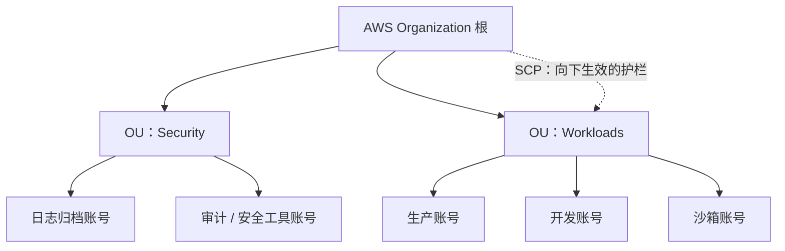
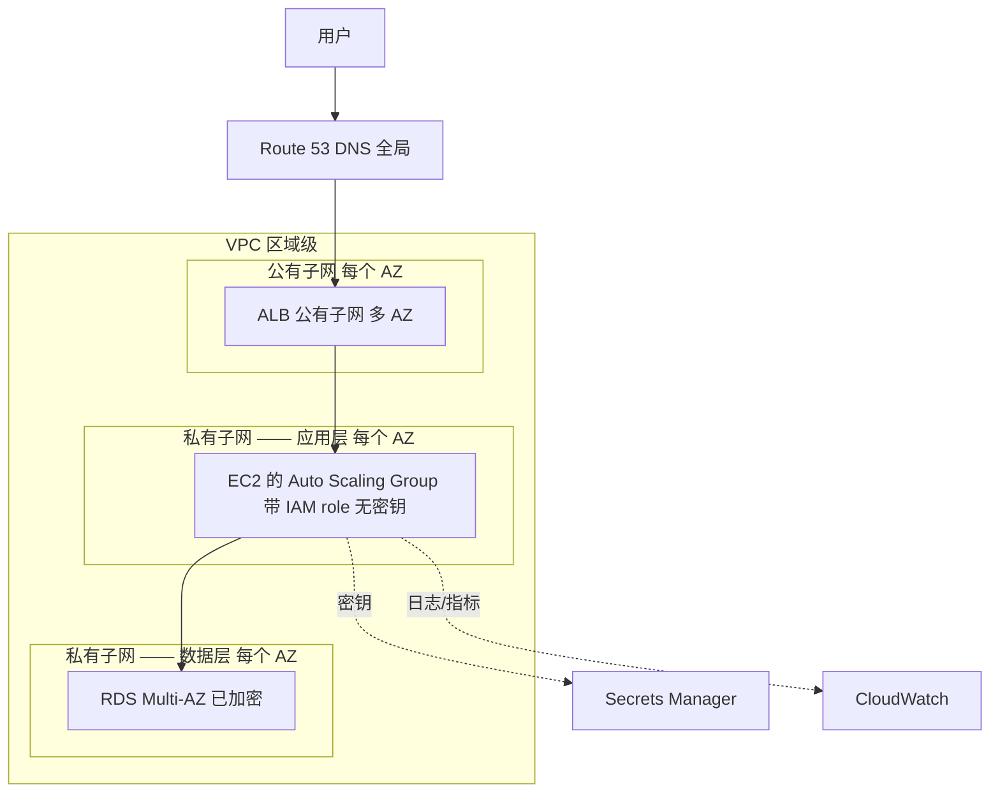

# AWS —— 理解它的架构

> 🌐 **语言：** [English（默认）](../../../../platforms/aws/architecture.md) · **中文**
>
> ⚠️ 本项目**默认语言为英文**，`platforms/aws/architecture.md` 是"事实来源"。本页中文是多语言支持的一部分，可能略滞后于英文版；两者不一致时以英文为准。

---

> [README](README.md) 把 AWS 映射到了那七片面上 —— *那些服务是什么*。这篇笔记是上面那一层：
> *AWS 是怎么组织的*，好让你**顺着**它的架构去设计，而不是跟它打架。把账号模型、region/AZ 的
> 地理，以及全局与区域的分野弄对，多数"这个为什么不好使"的问题会自己回答自己。

AWS 不是一堆两百个服务；它是一小组组织原则，上面挂着一些服务。学会那些原则，那些服务就变成查表。
承重的有四个。

## 1. 账号与组织模型 —— 那个爆炸半径单位

被教得最不够、后果最重的那个 AWS 决定不是一个服务 —— 而是你怎么切分**账号**。一个 AWS 账号是一条
硬的安全与计费边界：一个账号里的资源碰不到另一个账号的，除非通过显式的跨账号授予。这让账号成为
**爆炸半径**的天然单位。

- **在规模上，一个账号不是答案。** 生产和开发在同一个账号里，意味着一次开发失误能够到生产；
  用 **AWS Organizations** 做的多账号布局给你真实的隔离、逐账号的计费，以及 **Service Control
  Policy（SCP）** —— 组织级的护栏，让整类动作在某个点之下变得**不可能**
  （[`the-stack/07`](../../the-stack/07-security.md) 那份策略即代码）。
- **那个心智模型：** 一个账号是一间带锁的屋子；那个 Organization 是那栋楼；SCP 是那栋楼的规矩。
  在给屋子添家具之前先设计屋子。
- 这也是[`成本`那一章](../../cross-cutting/cost.md)的打标签和[`安全`那一章](../../the-stack/07-security.md)
  的分离共同落地的地方 —— 账号边界是 AWS 给你的最强控制，而它是一个设计期的决定，事后改起来很痛。

## 2. Region 与可用区 —— 你要对着设计的那份地理

这就是 [`the-stack/01`](../../the-stack/01-physical.md) 那个故障域模型，用 AWS 的话说：

- 一个 **Region**（例如 `us-east-1`）是一片地理区域 —— 按到用户的延迟、数据驻留/合规，以及哪些服务
  在那儿可用来挑（不是所有服务在所有 region 都有）。
- 一个**可用区（AZ）** 是一个或多个有独立供电、制冷和网络的离散数据中心。**多 AZ 就是你怎么熬过
  一次建筑故障；** 把任何东西的两个副本都放在一个 AZ 里，正是那整个故障域模型存在去防止的那个错误。
- **各 Region 按设计是隔离的** —— 跨 region 是你的显式选择，而它要花出网费
  （[`the-stack/02`](../../the-stack/02-network.md)）。你不会意外地横跨 region。

那份设计直觉：**为可用性跨 AZ 铺开、刻意地挑 region，并把跨 region 当成一个被定过价的决定，
而不是一个默认项。**

## 3. 全局服务与区域服务 —— 那个经典陷阱

有些 AWS 服务住**在**一个 region 里；有些是**全局**的。把这两者搞混，是"我为什么找不到我的资源"
和自动化坏掉的头号来源：

| 范围 | 服务 | 含义 |
| --- | --- | --- |
| **全局** | IAM、Route 53、CloudFront、WAF（部分）、Organizations | 横跨所有 region 的一个命名空间；一个 IAM role 到处都存在。 |
| **区域** | EC2、VPC、S3（桶命名空间是全局的，数据是区域的）、RDS、Lambda，以及绝大多数其他 | 只存在于你创建它的那个 region；你必须遍历 region 才能盘点。 |

这恰好就是那个[盘点 lab](labs/01-scoped-identity-inventory)所教的陷阱 ——
它让你为 EC2/VPC 去遍历 region，而 IAM/列 S3 是一次搞定。当 AI 给你写了一个忘了循环 region 的
盘点脚本（[`ai-ramp.md`](ai-ramp.md)），正是这份知识抓住它。

## 4. 共担责任模型 —— 你的工作从哪儿开始

AWS 保障云**本身**；你保障云**里面**的东西 —— 而那条线随服务而动
（[`the-stack/07`](../../the-stack/07-security.md)）：

- **AWS 那一侧：** 那些物理数据中心、硬件、hypervisor，以及托管服务的内部。
- **你那一侧，永远：** 你的数据、你的 IAM、你的网络配置、你的加密选择 —— 而绝大多数入侵住在这里
  （一个公开的 S3 桶、一个过宽的 role），不住在 AWS 失败那边。
- 你在这个栈上走得越高（EC2 → RDS → Lambda），AWS 处理得越多 —— 但你的数据和访问控制永远不会
  不再是你的。

## Well-Architected 框架 —— 那份设计检查单

AWS 自己关于"这套架构好不好"的心智模型 —— 六根支柱，值得当作一面评审镜子来知道，而不是当作冷知识
去背：

- **卓越运营** —— 你跑得动它、改进得了它吗？（那份 [operations](operations.md) 文档）
- **安全** —— 最小权限、加密、可审计（[`the-stack/07`](../../the-stack/07-security.md)）。
- **可靠性** —— 多 AZ、故障恢复、测过的备份（[`the-stack/04`](../../the-stack/04-storage.md)）。
- **性能效率** —— 尺寸合适、用对了服务。
- **成本优化** —— 承诺与工作负载匹配（[`成本`](../../cross-cutting/cost.md)）。
- **可持续性** —— 高效使用你所发放的东西。

用得好，它就是在发布一套架构**之前**该问的那组问题 —— 就是这个仓库所教的那份"什么会坏、什么暴露
在外、这要花多少钱"的直觉，被打包成 AWS 自己的检查单。

## 一份参考架构 —— 那些面怎么组合起来

那个典范式的三层 web 应用，以及每一片面出现在哪：

每一片面都在场：**身份**（instance role，没有烤进去的密钥）、**网络**（VPC、跨 AZ 的公有/私有
子网、security group）、**计算**（ASG）、**存储**（加密的 RDS Multi-AZ）、**可观测性**
（CloudWatch）、**安全**（Secrets Manager、加密、分层子网）。读这张图，你就能看见整张
[技能图](skills-map.md)在干同一件活。

## 诚实边界

🧭 **ramp，诚实地说。** 这是那个可迁移的架构模型 —— 账号/组织设计、故障域、共担责任 —— 被映射到
AWS 上并对着它的文档验证过，不是一句"多年架构生产 AWS 估算面"的声称。底下那些**直觉**
（爆炸半径思维、多 AZ 布置、最小权限、"在添家具之前先设计屋子"）是 🔨 —— 它们来自真实的基础设施
和机队工作（[`the-stack`](../../the-stack/README.md) 取材于它）；AWS 特有的那套服务组合是那条
ramp。这里的声称是：一套扎实的架构模型，加上一条通向 AWS 版本的、快速且可验证的 ramp ——
这个仓库诚实的立场，套到架构上。
