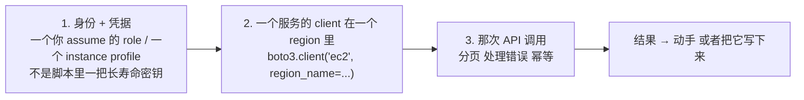
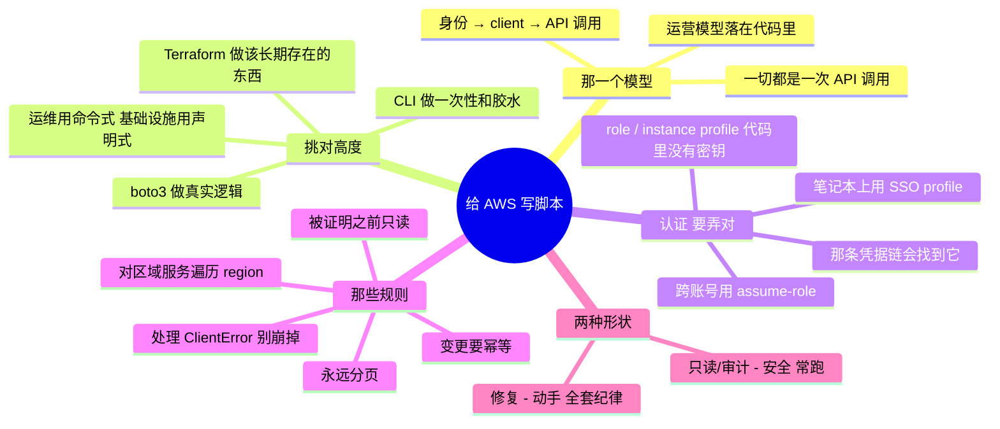

# AWS —— 把 API 写成脚本（从代码去管理与运维）

> 🌐 **语言：** [English（默认）](../../../../platforms/aws/automation.md) · **中文**
>
> ⚠️ 本项目**默认语言为英文**，`platforms/aws/automation.md` 是"事实来源"。本页中文是多语言支持的一部分，可能略滞后于英文版；两者不一致时以英文为准。

---

> [`architecture`](architecture.md) 是 AWS 怎么组织的；[`operations`](operations.md) 是跑它长什么
> 样。这篇笔记是那个*怎么做*：**从代码通过 API 驱动 AWS** —— 也就是
> [运营模型](../../00-the-operating-model.md)第 3 招"通过平台的 API 驱动它并把它写成代码"背后那门
> 具体的手艺。控制台是用来看的；脚本和 IaC 是用来做的。

AWS 里的一切都是一次 API 调用。控制台、CLI、Terraform、那些 SDK —— 全都是同一套 HTTPS API 的包装。
一旦你把这件事内化，"我怎么自动化 X？"就不再是一次找功能的搜索，而变成
*"哪一次 API 调用，用哪个身份，处理哪些故障模式？"* 这一层正是一份脚本加 Linux 的背景
（[`foundations/`](../../foundations/README.md)）直接变成云运维技能的地方。

## 那一个模型：一切都是 `(身份) → (client) → (API 调用)`

你对着 AWS 写的每一个脚本，都是[运营模型](../../00-the-operating-model.md)那三招，落在代码里：

把这三样弄对 —— 一个**受限身份**、一个**知道 region 的 client**，以及一次**被正确调用的 API** ——
你就能自动化 AWS 所暴露的任何东西。那个
[盘点 lab](labs/01-scoped-identity-inventory) 恰好就是这个模型的只读版：
值得和这篇笔记并排读一遍 `inventory.py`，因为它用能跑的代码演示了下面每一条规则。

## 那架工具阶梯 —— 挑对高度

驱动这套 API 的四种方式，从快到耐久。够错了高度是一个常见错误：

| 工具 | 它是什么 | 什么时候去够它 |
| --- | --- | --- |
| **AWS CLI**（`aws ...`） | 作为 shell 命令的 API | 一次性检查、快速修复、Bash 脚本里的胶水、探索 |
| **boto3 / SDK**（Python） | 作为一个库的 API | 真实逻辑 —— 循环、分支、数据整形、一个真正的工具 |
| **CloudShell / 脚本** | 托管 shell 里的 CLI+SDK | 临时运维，不需要本地凭据 |
| **Terraform / IaC** | **声明式**期望态 | 任何应该可复现、被评审、可销毁的东西（[`iac`](../../cross-cutting/iac-and-config.md)） |

那条要紧的分界线：**CLI 和 SDK 是*命令式*的 —— "现在做这次调用"；Terraform 是*声明式*的 ——
"这是应该存在的东西。"** 用命令式脚本做*运维*（盘点、修复、一次性查询、编排）；用 IaC 做*发放*
（那些应该长期存在的基础设施）。用一个 boto3 `create_*` 脚本而不是 Terraform 去建持久的基础设施，
是在逆着纹理走 —— 你只是写了一个更差的、没有 state 文件的 Terraform。

## 认证 —— 把这个弄对，否则别的都不要紧

那条最重要的规则，也是 AI 和教程最常搞错的一条：**绝不要把一把长寿命访问密钥放进一个脚本。**
那条凭据链，按优先顺序：

- **在一台 EC2 实例上 / 在 Lambda 里 / 在一个容器里** → 一个挂在那个计算资源上的 **IAM role**
  （一个 instance profile / task role）。SDK 会自动捡起它；*任何地方都没有密钥*。这是任何跑在
  AWS 里的东西的正确默认项。
- **在你笔记本上** → 一个由 SSO / IAM Identity Center 或 `aws sso login` 支撑的**具名 profile**
  （`AWS_PROFILE`）—— 短寿命、自动刷新的会话凭据。
- **做跨账号自动化** → 通过 STS 做 **assume-role**：你的身份在目标账号里扮演一个受限 role，
  拿到会过期的临时凭据。
- **绝不** → 一个硬编码在脚本里、在一个仓库里，或者在一个你可能会提交的 env 文件里的访问密钥 ID
  加 secret。那就是 [`operations.md`](operations.md) 里那次泄露密钥事故，提前提交了。

`boto3.Session()` 替你走这条链 —— 而这**就是**为什么那个盘点脚本只调用 `boto3.Session()`、从来不
提一把密钥。让那条链去做它的活；你代码里没有凭据，正是重点。

## 把一个能用的脚本和一把自伤枪分开的那些规则

就是 [`foundations/`](../../foundations/README.md) 那门幂等与错误处理的纪律，落在 AWS 的具体上：

- **分页 —— 永远要。** AWS 会截断列表响应。一个调用一次 `describe_instances()` 并相信结果的脚本，
  会静默地漏掉第一页之后的一切。用那些 **paginator**（`get_paginator(...).paginate()`）——
  那个盘点脚本在每一次列表调用上都这么做，而它是手写和 AI 写的 AWS 脚本里同样的第一号 bug。
- **对区域服务遍历 region。** EC2、VPC、RDS 是*逐 region* 存在的；IAM、列 S3、Route 53 是全局的
  （[`architecture.md`](architecture.md)）。一个从一个 region 盘点"一切"的脚本，静默地只看到一个
  切片。
- **逐资源处理 `ClientError`，别让整次运行崩掉。** 一个你没有权限的 region、或者一次被限流的调用，
  应该记录下来然后继续 —— 而不是中止整次盘点。那个脚本把每个 region 的调用包在
  `try/except ClientError` 里，正是为了这个。
- **预期会被限流；退避。** AWS 对 API 限速。boto3 会自动重试，但重的脚本仍然需要尊重 `Throttling`
  错误 —— 指数退避，不是一个紧凑的重试循环。
- **变更要幂等。** 一个修复脚本必须能安全重跑：先检查再动手（"这条 SG 规则已经没了吗？"），不是
  盲目动手。重跑应该收敛，不该重复施加或者崩掉 —— 就是 Ansible 和 Terraform 在结构上强制的同一条
  规则（[`iac`](../../cross-cutting/iac-and-config.md)）。
- **在被证明之前只读。** 先对着 `describe_*`/`list_*` 调用去开发和测试；只有在逻辑被证明之后才加
  `create_*`/`delete_*`/`modify_*`。给任何破坏性的东西加一个 `--check` 式的 dry 参数，是便宜的保险。

## 自动化脚本的两种形状

多数 AWS 运维脚本是两种形状之一：

- **只读/审计脚本** —— 盘点、合规检查、成本/标签报表、"找出每一个违反 Y 的 X"。只读、安全、常跑。
  那个[盘点 lab](labs/01-scoped-identity-inventory)是那个典范例子；
  一个合规变体（"找出每一个公开的桶"、"每一个对 0.0.0.0/0 开放的 SG"、"每一个未加密的卷"）是同一副
  骨架换一个过滤器。
- **修复/编排脚本** —— 它**动手**：给没打标签的资源打标签、按日程停掉闲置实例、轮换一把密钥、
  在收到回收通知时排空并替换一个节点。它会变更状态，所以它承担上面那全套纪律 —— 幂等、受限身份、
  先 dry-run、有记录。

要内化的那个递进：**只读脚本安全地把肌肉练出来；修复脚本小心地把它施加出去。** 每一个新的自动化
都从一个"找出那个问题"的只读脚本开始，等你信得过那个发现之后再加上那个修复。

## AI 怎么协助写这些自动化

[运营循环那一节的 AI](operations.md)讲的是故障里的 AI；这里讲的是 AI 写*代码*。确实提速，
而且有具体的陷阱：

- **对骨架很在行：** *"一个 boto3 脚本，跨一个账号、分页地列出每一个没有加密的 S3 桶"* ——
  AI 几秒钟就写出那个形状，而且它在结构上通常是对的。
- **对查 API 很在行：** *"哪一次 boto3 调用和哪些参数能拿到一个桶的加密状态？"* —— 比翻文档更快，
  *前提是*你去核实那个调用真的存在。
- **AI 会烧到你的地方（验得最狠的地方）：** 它会**发明不存在的 boto3 方法名和参数**（那片 API 面
  很大，而它靠猜）；它会**忘掉分页**，递给你一个静默少报的脚本；它会**忘掉遍历 region**；
  而且它会**硬编码或者建议一把静态密钥**，而不是用那条凭据链。这里面每一条都是上面的一条规则 ——
  而这正是为什么你必须**拥有**那些规则，并把 AI 的初稿当成一份等着被审的初筛。对着一个沙箱只读地
  跑一遍；那个被截断的结果或者那个漏掉的 region 会立刻冒出来。

## 管理纪律（你应该做得到什么）

- 用一个**受限 role** 给一个脚本做认证，代码里没有密钥，并解释是哪条凭据链让它成功的。
- 写一个**分页的、知道 region 的、处理了错误的**只读脚本 —— 并证明它看到了一个天真的
  单 region 单页脚本会漏掉的资源。
- 把一个只读脚本变成一次**安全的修复** —— 幂等、先 dry-run、有记录 —— 针对一件真实的任务
  （标签强制、停掉闲置实例）。
- 为一件任务在 **CLI 对 boto3 对 Terraform** 之间做选择，并为那个高度辩护。
- 读懂一条 AWS **API 错误**（`AccessDenied`、`Throttling`、`ResourceNotFound`），并知道每一条告诉
  你接下来该做什么。

## 诚实边界

🔨 **在要紧的地方，而且这里就要紧。** 那门脚本与自动化纪律是亲手做过的 —— Python 和 Bash 是日常
工具、分页/幂等/处理错误的自动化，以及那份建在真实机队脚本工作之上的"先只读、再动手"的直觉
（[`foundations/`](../../foundations/README.md)）。AWS API 的那些**细节**（准确的 boto3 调用、
服务的怪癖）是那条 🧭 ramp，而那个
[盘点 lab](labs/01-scoped-identity-inventory)就是那条 ramp 被证明在
能跑的代码里 —— 只读、最小权限、分页、知道 region。这里的声称是一份很强的自动化地基，加上一条通向
AWS API 面的、可验证的 ramp —— 不是多年的生产 AWS 平台工程。

## Lab（✅ 已建成 —— 去读那份代码）

那个[受限身份盘点 lab](labs/01-scoped-identity-inventory)**就是**这篇
笔记的可运行形态：一个最小权限 role，加一个 `boto3` 脚本 —— 它通过凭据链认证、给每一次列表调用
分页、为区域资源遍历 region、逐 region 处理 `ClientError`，并写出 CSV —— 全程只读。开着这篇笔记去读
[`inventory.py`](../../../../platforms/aws/labs/01-scoped-identity-inventory/inventory.py)，上面
每一条规则都在大约 150 行里看得见。那个自然的下一个练习（已写规格）：把它分叉成一个**合规扫描器**
—— 同一副骨架，换一个过滤器去找公开的桶 / 开放的 security group / 未加密的卷。

## 这篇文档一屏看完

