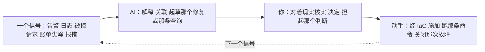

# AWS —— 跑它（day-2 的现实）

> 🌐 **语言：** [English（默认）](../../../../platforms/aws/operations.md) · **中文**
>
> ⚠️ 本项目**默认语言为英文**，`platforms/aws/operations.md` 是"事实来源"。本页中文是多语言支持的一部分，可能略滞后于英文版；两者不一致时以英文为准。

---

> [README](README.md) 是 *AWS 是什么*；[architecture](architecture.md) 是*它怎么组织*；
> 这篇笔记是**跑它实际长什么样** —— 那份运维简报、凌晨三点什么会把你叫醒、按节奏拆开的真实运维活，
> 以及 AI 怎么在那条运营循环里挣到它的位置（和那条[学习 ramp](ai-ramp.md) 不同）。

## 那份简报 —— "运维 AWS"意味着什么

在本地，运维意味着手放在硬件上：换盘、给机器打补丁、在数据中心里走。在 AWS 上硬件没了，而这份工作
往上挪：**你通过声明意图来运维，看着平台拿它做了什么，并让结果保持安全、可靠、负担得起。**
定义 day-2 工作的那三个问题：

- **它健康吗？** —— 而且你会在一位用户告诉你之前知道吗？（可观测性）
- **它安全吗？** —— 最小权限还守着吗、没有东西暴露在外、没有东西在漂移吗？
- **它负担得起吗？** —— 没有被遗忘的资源在安静地计费，没有工作负载挂在错误的定价模型上吗？

下面的一切都是这三个问题，被落到实处。

## 运维笔记 —— 在 AWS 上什么会把你叫醒（以及什么应该）

那些真正产生故障的故障模式，其中大部分都在那条[共担责任线](architecture.md)的客户那一侧：

- **那个公开的 S3 桶** —— 私有数据被一次配置错误弄成了公开；那次典范式的 AWS 入侵。默认开着
  block-public-access，加上一次有人**真的去读**的姿态扫描
  （[`the-stack/07`](../../the-stack/07-security.md)）。
- **git 里泄露的那把 IAM 密钥** —— 一把被提交进仓库、被扫描器找到的长寿命访问密钥。这**就是**为什么
  整个仓库都在讲 role 和短寿命凭据优于密钥（[`身份`](../../cross-cutting/identity-iam.md)）；
  CI 里的密钥扫描是基本盘。
- **"这个为什么够不到那个？"** —— 那个每日网络故障。通常是一个 security group、一张 route table、
  一条 NACL 的无状态回程路径，或者一个没有通往 NAT 的路由的子网 ——
  [`the-stack/02` 那架调试梯子](../../the-stack/02-network.md)原封不动地适用。
- **那份账单意外** —— 出网、跨 AZ 流量、一笔 NAT 网关处理税，或者一台被遗忘的 GPU 实例
  （[`成本`](../../cross-cutting/cost.md)）。在 AWS 上，如果你设过一条预算告警，它以那条告警把你
  叫醒；如果没设，它以一张发票把你叫醒。
- **本想多 AZ 却成了单 AZ** —— 一个"高可用"的服务，两个副本都在一个 AZ 里，而它是在那次它本该
  熬过的 AZ 事件当中被发现的（[`the-stack/01`](../../the-stack/01-physical.md)）。
- **实例回收 / 降级事件** —— AWS 告诉你你实例底下的硬件正在故障；那门纪律是"收到通知就排空并替换"
  的自动化，不是一个读邮件的人。
- **IAM 权限漂移** —— 那个权限越积越多、直到什么都能干的 role，在它被滥用的那天被发现。最小权限是
  一次持续的复审，不是一次性的授予。

## 那些运维活，拆开来看

一个 AWS 管理员反复要做的那些活，按**节奏**分解 —— 因为"这份工作到底包含什么"，最好由"你做什么、
多久做一次"来回答：

| 节奏 | 任务 | 面 | 它为什么要紧 |
| --- | --- | --- | --- |
| **持续（自动）** | 对健康、错误率、延迟、预算、安全发现告警 | 可观测性、成本、安全 | 系统自己看着自己；你是被叫醒，不是被意外。 |
| **持续（自动）** | Auto Scaling 替换掉不健康的实例；收到回收通知就排空 | 计算 | 牲口，不是宠物 —— 故障是被处理的，不是被守着的。 |
| **每日** | 分诊那些告警和 Security Hub / GuardDuty 发现；对真的那些动手 | 安全、可观测性 | 那些发现只有在有人读它并动手时才有用。 |
| **每日** | 回答"X 为什么够不到 Y"和"这是谁干的"（CloudTrail） | 网络、身份 | 那两个最基本的故障与审计问题。 |
| **每周** | 复审 IAM：陈旧的 user/role、过宽的 policy、没用过的访问权 | 身份 | 最小权限会衰减；这就是你怎么抓住那次漂移。 |
| **每周** | 成本复审：异常、没打标签的花费、涨得最多的项 | 成本 | 在发票之前抓住那个被遗忘的资源。 |
| **每月** | 从利用率数据 rightsizing；重新审视预留/spot 的覆盖 | 成本、计算 | 多数实例配得过大，因为没人看过。 |
| **每月** | 给 AMI 打补丁/换代；用一个新的黄金镜像滚一遍机队 | 计算、安全 | 关掉已知 CVE 的暴露面；重装优于就地打补丁。 |
| **每季** | 对一份备份做恢复测试；真的核实 RPO/RTO | 存储 | 一份没测过的备份是一个希望（[`the-stack/04`](../../the-stack/04-storage.md)）。 |
| **每季** | 访问再认证；复审 SCP 和账号护栏 | 身份、安全 | 证明那些护栏还守着；审计要证据。 |
| **有故障时** | 检测 → 遏制 → 根除 → 恢复 → 写那份复盘 | 全部 | 这整个仓库所关乎的那份判断；凌晨三点的那份镇定。 |
| **有变更时** | 一切走 IaC 加评审，不走控制台 | 发放 | 控制台是用来看的；变更走代码（[`iac`](../../cross-cutting/iac-and-config.md)）。 |

这张表让两件事变得可见。第一，**多数例行工作是自动的、或者本该是自动的** —— 人的活是分诊、复审和
判断，不是杂活。第二，**那个复审节奏（每周 IAM、每周成本、每季恢复）是团队会跳过、然后后悔的那
部分** —— 它不光鲜，而它恰恰是漂移、超支和恢复不出来的备份藏身的地方，直到它们变成故障。

## AI 怎么协助运维工作（不只是学习）

[ai-ramp](ai-ramp.md) 那篇笔记讲的是*快速走到胜任*；这一节讲的是在你已经懂 AWS 之后，AI 在*日常
运营循环*里的位置。不同的活，同一门纪律：**AI 提供速度，判断提供真相。**

AI 在运维里真正挣到饭钱的地方：

- **故障副驾 / 橡皮鸭** —— 把那条 CloudTrail 条目、那次被拒绝的请求、那条 `aws` CLI 报错、那段栈
  回溯贴进去：*"这是什么意思，你接下来会查什么？"* AI 在把一个晦涩信号变成一个假设上很快 ——
  而你去测那个假设。
- **写查询** —— *"一条 CloudWatch Logs Insights 查询，找出过去一小时里按路径分的 5xx 尖峰。"*
  AI 写 CloudWatch Insights / Athena / SQL 很流畅；在你相信那张图之前，拿已知数据去做一次合理性
  核查。
- **日志与指标分诊** —— 归纳一个吵闹的日志窗口、把相似的错误聚在一起、把异常浮出来。对一堆没人想
  滚动的量做一次很强的初筛。
- **把修复起草成代码** —— *"关掉这条发现的 Terraform / SCP / security-group 变更"* —— 作为一份
  走正常 IaC 闸门的、可评审的初稿，绝不是一次 AI 说服你去做的控制台变更。
- **事后写作** —— 把时间线变成一份复盘初稿；由你去纠正因果并担起那些结论。
- **起草 runbook** —— 为一个反复出现的任务生成第一版 runbook，然后拿现实把它锤硬。

在运营循环里 AI **绝不能**被信任的地方 —— 这里的故障模式比在学习里赌注更高，因为这些是对着生产
跑的：

- 它会**自信地误读一次被拒绝的请求** —— 那个 NACL 是无状态的而你只开了入站；AI 可能会去怪那个
  security group。仲裁者是现实（一次重跑、一份 flow log），不是那段解释。
- 它会**发明不存在的 CLI 参数、ARN 和 API 参数** —— 在跑任何会改变状态的东西之前先核实。
- 它会**起草宽松的修复** —— 一个"为了让它能用"的 security-group 变更，打开了 `0.0.0.0/0`。
  每一份 AI 起草的修复都要手动收紧。
- 它**拥有不了这次故障。** AI 加速那次查找和那份初稿；那个决定、那个爆炸半径判断，以及凌晨三点的
  那份问责，都留给你。

那条让它保持安全的规则：**AI 碰信号和初稿；你碰生产。** 任何 AI 建议的、会改变状态的东西，都走和
你自己的变更同一道评审加 IaC 闸门 —— 那条"控制台是用来看的"纪律
（[`iac`](../../cross-cutting/iac-and-config.md)）对 AI 的建议和对你自己的建议一样适用。

## 诚实边界

这里那门运维**纪律**是 🔨 —— 分诊、故障方法、那个复审节奏、最小权限复审、恢复测试、把成本和漂移
当成信号 —— 因为它是同一门从真实基础设施和机队工作里带过来的运维手艺，而在那里传呼是真的会响的。
AWS 服务的那些细节（哪个控制台、哪条告警、哪种发现类型）是那条 🧭 ramp，按这个仓库的方法测绘并
验证过。这里的声称不是"为一片生产 AWS 估算面背了多年 on-call"；而是一份**可迁移的运维纪律，加上
一条通向 AWS 那套工具的、快速而诚实的 ramp** —— 而上面那条 AI 辅助的运营循环，恰恰就是那条 ramp
怎么被施加，而不假装那份判断是从机器那儿来的。
